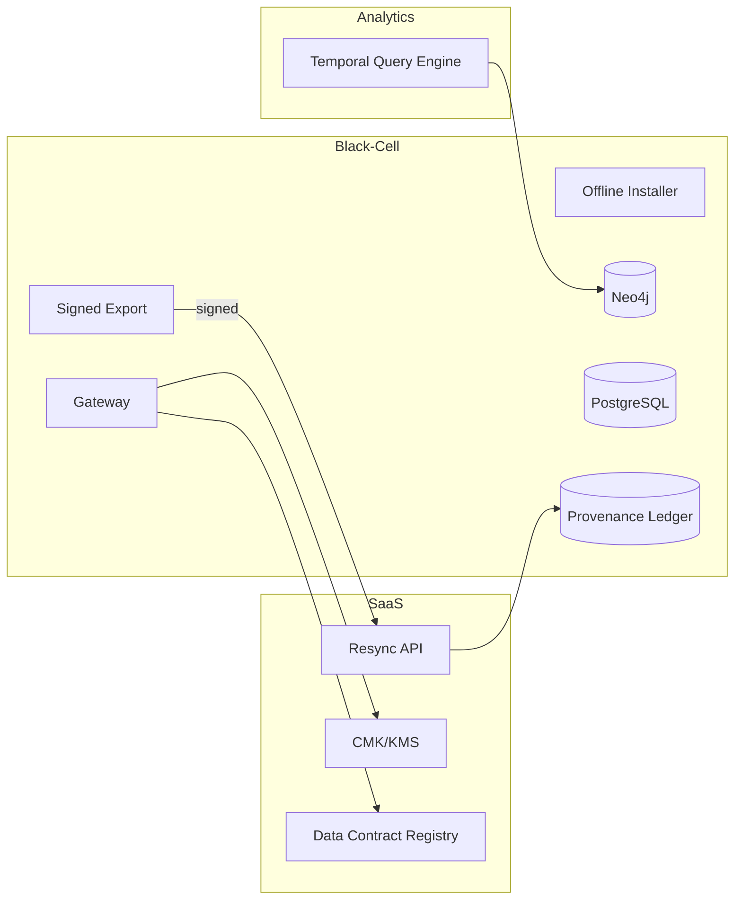

````markdown
---
slug: intelgraph-mc-sprint-2026-01-07
version: v1.0
created: 2025-09-29
sprint_window: 2026-01-07 → 2026-01-20 (2 weeks)
release_cadence: weekly cut → staging; biweekly → prod
owners:
  - product: PM (R), MC (A)
  - delivery: Tech Lead (A), Platform (R), Backend (R), Data Eng (R), DS (R), SRE (R), Sec (R), QA (R), Frontend (R)
status: planned
---

# IntelGraph Maestro Conductor — Sprint Plan (2026‑01‑07 → 2026‑01‑20)

> **Mission (Sprint N+7)**: Graduate **Black‑Cell v1.0**, introduce **Customer‑Managed Keys (CMK)**, operationalize **Data Contracts** for ingest, roll out **Residency by Dataset** enforcement, add **Playbooks-as‑Code** with drift detection, and extend **Analytics** with timeline/temporal queries—while keeping SLOs/cost guardrails green. Evidence bundle v8 included.

## Conductor Summary (Commit)

**Assumptions & Provenance**

- Builds on 2025‑12‑24 sprint (Black‑Cell v0.9, evidence v2, onboarding/billing, supply‑chain hardening, graph perf).
- Summit bundles remain pending import; placeholders _[ATTACH FROM SUMMIT BUNDLE]_ where noted.

**Goals**

1. **Black‑Cell v1.0 GA**: finalize offline installer, upgrades, and signed export workflow; provenance resync hardened.
2. **CMK (KMS/External)**: tenant‑scoped encryption keys (envelope), rotation, break‑glass, and key‑loss runbook.
3. **Data Contracts v1**: schema + quality SLAs for connectors (batch/stream); contract testing gates PRs.
4. **Residency by Dataset**: fine‑grained policy + storage placement; export checks; lineage awareness.
5. **Playbooks‑as‑Code**: declarative incident/runbook packs with drift detection and approvals.
6. **Temporal Analytics v0.9**: time‑windowed paths & change over time endpoints (safe, persisted queries).

**Non‑Goals**

- Multi‑cloud portability (tracked next cycle); full anomaly detection; external billing GA.

**Constraints**

- SLOs unchanged, must be maintained in Black‑Cell and SaaS.
- Cost guardrails unchanged; CMK crypto operations ≤ 5% overhead p95.

**Risks**

- R1: CMK misconfig → data lockout. _Mitigation_: break‑glass escrow + simulation mode, dual‑control approvals.
- R2: Data contract rejections stall ingest. _Mitigation_: quarantine lanes + override with approval + backfill.
- R3: Temporal queries pressure Neo4j. _Mitigation_: pre‑aggregation windows, indices, capped depth.

**Definition of Done**

- Black‑Cell installs/upgrades pass offline tests; exports/resync validated with ≤ 1e‑6 mismatches; CMK per tenant enabled with rotation and break‑glass tested; data contracts enforced with CI gates; residency by dataset prevents policy violations in tests; temporal analytics endpoints live with SLOs.

---

## Swimlanes

- **Lane A — Black‑Cell GA** (Platform + SRE + Security)
- **Lane B — CMK & Crypto** (Security + Backend)
- **Lane C — Data Contracts** (Data Eng + QA)
- **Lane D — Residency & Lineage** (Security + Backend)
- **Lane E — Temporal Analytics** (Graph Eng + Backend)
- **Lane F — Playbooks‑as‑Code & Release** (SRE + MC + QA)

---

## Backlog (Epics → Stories → Tasks) + RACI

Estimates in SP.

### EPIC A: Black‑Cell v1.0 (36 SP)

- **A‑1** Offline installer & upgrade (12 SP) — _Platform (R), SRE (A)_
  - AC: installer idempotent; upgrade preserves data; signed manifest.
- **A‑2** Export channels GA (8 SP) — _Backend (R), Sec (A)_
  - AC: signed exports, policy‑gated; verify tool bundled.
- **A‑3** Provenance resync hardening (8 SP) — _Data Eng (R)_
  - AC: resumable; mismatch proofs; report UX.
- **A‑4** Offline diagnostics bundle (8 SP) — _SRE (R)_
  - AC: redacted logs, metrics snapshots; share via signed tar.

### EPIC B: CMK (Customer‑Managed Keys) v1 (32 SP)

- **B‑1** KMS integration (AWS KMS / HashiCorp Vault) (12 SP) — _Security (R), Backend (C)_
  - AC: envelope encryption; per‑tenant CMK alias; mTLS to KMS.
- **B‑2** Rotation + escrow (10 SP) — _Security (R)_
  - AC: dual‑control; rotation proofs; escrow for break‑glass.
- **B‑3** Key‑loss playbook (10 SP) — _SRE (R), MC (C)_

### EPIC C: Data Contracts v1 (30 SP)

- **C‑1** Contract schema & registry (12 SP) — _Data Eng (R)_
  - AC: versioned JSON schema; SLA fields (latency, completeness, dedupe, purpose, retention, license).
- **C‑2** Contract tests & CI gate (10 SP) — _QA (R)_
- **C‑3** Quarantine & override workflow (8 SP) — _Backend (R)_, Sec (C)

### EPIC D: Residency by Dataset (24 SP)

- **D‑1** Placement tags + storage policy (10 SP) — _Backend (R), Sec (A)_
- **D‑2** Export checks + lineage integration (8 SP) — _Backend (R)_
- **D‑3** CI simulation (6 SP) — _QA (R)_

### EPIC E: Temporal Analytics v0.9 (26 SP)

- **E‑1** Path‑over‑time queries (12 SP) — _Graph Eng (R)_
- **E‑2** Change logs & diffs (8 SP) — _Backend (R)_
- **E‑3** Persisted queries + caching (6 SP) — _Backend (R)_

### EPIC F: Playbooks‑as‑Code & Release (18 SP)

- **F‑1** Playbook DSL + repo (8 SP) — _SRE (R), MC (A)_
- **F‑2** Drift detection & approval gates (6 SP) — _SRE (R)_
- **F‑3** Evidence bundle v8 (4 SP) — _MC (R)_

_Total_: **166 SP** (descope candidates: E‑2 or C‑3 if capacity < 145 SP).

---

## Architecture (Deltas)


````

**ADR‑021**: CMK with envelope encryption per tenant; keys never leave KMS/Vault. _Trade‑off_: added latency; mitigated by cache + batching.

**ADR‑022**: Data contracts enforced at ingest; violations route to quarantine. _Trade‑off_: reduced ingestion speed vs quality/compliance.

**ADR‑023**: Temporal analytics constrained to bounded windows and persisted queries. _Trade‑off_: less flexibility vs predictable SLOs.

---

## Data & Policy

**Contract Schema (JSON)**

```json
{
  "$id": "ig.contract.v1",
  "type": "object",
  "required": [
    "datasetId",
    "version",
    "tenantId",
    "license",
    "purpose",
    "retention",
    "sla"
  ],
  "properties": {
    "datasetId": { "type": "string" },
    "version": { "type": "string" },
    "tenantId": { "type": "string" },
    "license": {
      "enum": [
        "MIT-OK",
        "Open-Data-OK",
        "Restricted-TOS",
        "Proprietary-Client",
        "Embargoed"
      ]
    },
    "purpose": { "type": "array", "items": { "type": "string" } },
    "retention": {
      "enum": [
        "ephemeral-7d",
        "short-30d",
        "standard-365d",
        "long-1825d",
        "legal-hold"
      ]
    },
    "sla": {
      "type": "object",
      "properties": {
        "ingestLatencyMs": { "type": "number" },
        "completenessPct": { "type": "number" },
        "dedupe": { "type": "boolean" }
      }
    }
  }
}
```

**Residency Policy (OPA)**

```rego
package intelgraph.residency.v2

default allow_store = false

allow_store {
  input.dataset.region == input.user.region
}

allow_export {
  input.dataset.region == input.request.region
  not input.dataset.contains_pii
}
```

**Temporal Windows (PG)**

```sql
CREATE TABLE entity_change_log (
  id BIGSERIAL PRIMARY KEY,
  tenant_id UUID NOT NULL,
  entity_id UUID NOT NULL,
  op TEXT CHECK (op IN ('insert','update','delete')),
  ts TIMESTAMPTZ NOT NULL,
  diff JSONB
);
CREATE INDEX ON entity_change_log(tenant_id, entity_id, ts DESC);
```

---

## APIs & Schemas

**GraphQL — Data Contracts & Temporal**

```graphql
type DataContract {
  id: ID!
  datasetId: ID!
  version: String!
  license: String!
  purpose: [String!]!
  retention: String!
  sla: SLA!
}

type SLA {
  ingestLatencyMs: Int
  completenessPct: Float
  dedupe: Boolean
}

type TemporalPath {
  nodes: [ID!]!
  edges: [String!]!
  from: DateTime!
  to: DateTime!
}

type Query {
  contract(datasetId: ID!, version: String!): DataContract
    @auth(abac: "contract.read")
  temporalPath(
    entityId: ID!
    from: DateTime!
    to: DateTime!
    maxHops: Int = 2
  ): TemporalPath @auth(abac: "analytics.read")
}

type Mutation {
  upsertContract(input: DataContractInput!): Boolean
    @auth(abac: "contract.write")
}
```

**Persisted Query Examples**

```json
{
  "id": "temporalPath:v1",
  "hash": "sha256-...",
  "abac": ["analytics.read"],
  "ttl": "1m"
}
```

---

## Security & Privacy

- **Keys**: CMK per tenant; rotation quarterly; escrow sealed; all operations logged with key ids.
- **Contracts**: license/purpose/retention must be valid; CI blocks unknown licenses.
- **Residency**: placement enforced at write; exports re‑checked; lineage records include region.

---

## Observability & SLOs

- New metrics: KMS crypto latency p95; contract violations/day; quarantine queue depth; temporal query p95; resync mismatch rate; offline upgrade duration.
- Alerts: KMS p95 > 20 ms; quarantine backlog > 30 min; temporal p95 > 1,200 ms; resync mismatch > 0; offline upgrade failure.

---

## Testing Strategy

- **Unit**: CMK envelope ops; contract validator; residency guards; temporal diff.
- **Contract**: data contract registry API; CMK key APIs; resync.
- **E2E**: ingest with/without contracts → quarantine/accept; residency flows; Black‑Cell export→resync; key rotation & break‑glass.
- **Load**: temporal queries at 5 RPS, 2‑hop; CMK encrypt/decrypt throughput.
- **Chaos**: KMS unavailability (fallback/queue); contract schema change; offline upgrade mid‑failure.

**Acceptance Packs**

- CMK: rotation success; break‑glass path audited; overhead ≤ 5% p95.
- Contracts: violating batch quarantined with actionable report; approved override ingests with provenance note.
- Residency: cross‑region write denied; export blocked unless compliant.
- Temporal: p95 ≤ 1,200 ms; results consistent with change logs.
- Black‑Cell: upgrade preserves data; diagnostics bundle generated and signed.

---

## CI/CD & IaC

```yaml
name: cmk-contracts
on: [push]
jobs:
  contracts:
    runs-on: ubuntu-latest
    steps:
      - uses: actions/checkout@v4
      - run: npm ci && npm run contracts:validate
  cmk:
    runs-on: ubuntu-latest
    steps:
      - run: npm run cmk:sim && npm run cmk:rotate:dryrun
```

**Terraform (CMK/Vault)**

```hcl
module "cmk" {
  source   = "./modules/cmk"
  provider = "aws_kms" # or vault
  per_tenant_alias = true
  rotation_days    = 90
}
```

---

## Code & Scaffolds

```
repo/
  cmk/
    kms.ts
    vault.ts
    rotation.ts
  contracts/
    schema.json
    registry.ts
    validate.ts
  residency/
    policy.rego
    placement.ts
  analytics/temporal/
    path.ts
    diff.ts
  blackcell/
    installer.sh
    upgrade.sh
    diag-bundle.ts
```

**CMK Envelope (TS excerpt)**

```ts
export async function encryptTenant(tenantId: string, bytes: Buffer) {
  const key = await kms.getKey(tenantId);
  return kms.encrypt({ key, bytes });
}
```

**Contract Validator (TS)**

```ts
export function validateContract(doc: any) {
  // JSON schema validate + license/purpose/retention rules
}
```

**Temporal Path (Cypher excerpt)**

```cypher
MATCH p = (e:Entity {entity_id:$id, tenant_id:$tenant})-[r:RELATED*1..2]->(n)
WHERE all(rel in r WHERE rel.since <= $to) AND any(rel in r WHERE rel.since >= $from)
RETURN nodes(p), relationships(p) LIMIT 200
```

---

## Release Plan & Runbooks

- **Staging cuts**: 2026‑01‑10, 2026‑01‑17.
- **Prod**: 2026‑01‑20 (canary 10→50→100%).

**Backout**

- Disable CMK enforcement (fallback to platform key); relax contract gate to warn; disable temporal endpoints; skip offline upgrade.

**Evidence Bundle v8**

- CMK rotation logs & SHAs; contract gate results; residency simulations; temporal perf; offline upgrade + resync proofs; signed manifest.

---

## RACI (Consolidated)

| Workstream          | R         | A         | C            | I   |
| ------------------- | --------- | --------- | ------------ | --- |
| Black‑Cell GA       | Platform  | SRE TL    | Security, MC | PM  |
| CMK                 | Security  | MC        | Backend, SRE | PM  |
| Data Contracts      | Data Eng  | Tech Lead | QA, Sec      | PM  |
| Residency           | Backend   | Sec TL    | MC           | PM  |
| Temporal Analytics  | Graph Eng | Tech Lead | Backend      | PM  |
| Playbooks & Release | SRE       | MC        | QA           | All |

---

## Open Items

1. Confirm KMS/Vault provider matrix per tenant _[ATTACH FROM SUMMIT BUNDLE]_.
2. Approve initial contract templates with Legal/Compliance.
3. Identify top workloads for temporal analytics pilot.

```

```
