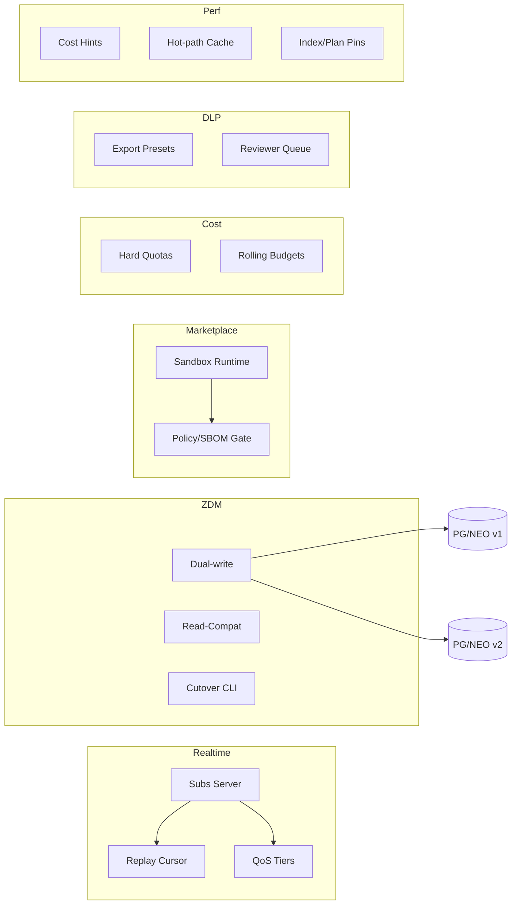

```markdown
---
slug: intelgraph-mc-sprint-2026-02-18
version: v1.0
created: 2025-09-29
sprint_window: 2026-02-18 → 2026-03-03 (2 weeks)
release_cadence: weekly cut → staging; biweekly → prod
owners:
  - product: PM (R), MC (A)
  - delivery: Tech Lead (A), Platform (R), Backend (R), Data Eng (R), DS (R), SRE (R), Sec (R), QA (R), Frontend (R)
status: planned
---

# IntelGraph Maestro Conductor — Sprint Plan (2026‑02‑18 → 2026‑03‑03)

> **Mission (Sprint N+10)**: Graduate **Subscriptions** and **ZDM** patterns to battle‑tested status, push **Marketplace v1.0 (signed & sandboxed)**, roll out **Tenant Cost Controls v2** (budgets, quotas, alerts), deliver **DLP export policies** + **PII rule hardening**, and introduce **Query Optimizer Hints & Caching v1** to reduce read p95—while keeping SLOs/cost guardrails green. Evidence bundle v11 included.

## Conductor Summary (Commit)
**Assumptions & Provenance**
- Builds on 2026‑02‑04 sprint (multi‑cloud GA track, subs, ZDM, marketplace v0.9, embeddings preview, portal).
- Summit bundles remain pending import; placeholders _[ATTACH FROM SUMMIT BUNDLE]_ where noted.

**Goals**
1. **Subscriptions v1.0**: GA for 3 pilot tenants with QoS tiers, replay cursor, and SLA dashboards.
2. **ZDM Playbook GA**: run one real schema change with dual‑write, cutover, rollback rehearsal.
3. **Marketplace v1.0**: signed plugins, sandbox runtime, SBOM attestation, policy class checks.
4. **Tenant Cost Controls v2**: hard quotas + rolling budgets + anomaly alerts; admin UX polish.
5. **DLP/PII Hardening**: export DLP presets (mask, tokenize), reviewer queue SLAs; rule pack v1.2.
6. **Query Optimizer & Caching v1**: persisted‑ID cost hints, hot‑path cache keys, and read p95 improvements ≥ 10%.

**Non‑Goals**
- Embeddings GA (remains preview); cross‑cloud data plane DR; marketplace monetization.

**Constraints**
- SLOs unchanged + Subscriptions p95 ≤ 250 ms.
- Cost guardrails unchanged; quotas enforced per tenant; budget alerts at 80%.

**Risks**
- R1: Cache staleness → inconsistency. _Mitigation_: short TTL + write‑through for mutations.
- R2: Marketplace sandbox breakouts. _Mitigation_: seccomp profiles, fs/network sandbox, allowlist APIs only.
- R3: ZDM mis‑mapping. _Mitigation_: read‑compat tests + automated diff checks + canary.

**Definition of Done**
- Subscriptions GA: 3 tenants enabled with SLOs met for 7 days; ZDM executed on live change with zero downtime & signed report; marketplace installs signed plugin in sandbox; cost controls block overages & alert; PII/DLP policies enforced on exports; read p95 improved ≥ 10% on top 5 persisted queries.

---

## Swimlanes
- **Lane A — Subscriptions GA** (Backend + SRE)
- **Lane B — ZDM GA** (Backend + QA)
- **Lane C — Marketplace v1.0** (Backend + Security + Frontend)
- **Lane D — Cost Controls v2** (SRE FinOps + Frontend)
- **Lane E — DLP/PII Hardening** (Security + Data Eng)
- **Lane F — Optimizer & Caching** (Backend + Graph Eng)
- **Lane G — QA & Evidence** (QA + MC)

---

## Backlog (Epics → Stories → Tasks) + RACI
Estimates in SP.

### EPIC A: Subscriptions v1.0 (28 SP)
- **A‑1** Replay cursor & at‑least‑once delivery (10 SP) — _Backend (R), SRE (A)_
  - AC: cursor token, gap detection, re‑send on demand.
- **A‑2** QoS tiers (gold/silver/bronze) (8 SP) — _Backend (R)_
  - AC: token buckets per tier; metrics exported.
- **A‑3** SLA boards & burn alerts (10 SP) — _SRE (R)_

### EPIC B: ZDM GA (26 SP)
- **B‑1** Schema change candidate prep (6 SP) — _Backend (R)_
- **B‑2** Dual‑write & read‑compat hardening (10 SP) — _Backend (R), QA (C)_
- **B‑3** Cutover/rollback execution (10 SP) — _QA (R)_

### EPIC C: Marketplace v1.0 (26 SP)
- **C‑1** Sandboxed runtime (seccomp, fs/net limits) (10 SP) — _Security (R), Backend (C)_
- **C‑2** SBOM attest + policy class gate (8 SP) — _QA (R), Sec (C)_
- **C‑3** Admin UI polish + audit trails (8 SP) — _Frontend (R)_

### EPIC D: Cost Controls v2 (24 SP)
- **D‑1** Hard quotas per API & ingest (10 SP) — _Backend (R), SRE (C)_
- **D‑2** Rolling budgets & anomaly alerts (8 SP) — _SRE FinOps (R)_
- **D‑3** Admin UX (caps, alerts, statements) (6 SP) — _Frontend (R)_

### EPIC E: DLP/PII Hardening (24 SP)
- **E‑1** Export DLP presets (mask/tokenize) (10 SP) — _Backend (R)_
- **E‑2** Reviewer queue SLAs + escalation (6 SP) — _Frontend (R)_
- **E‑3** Rule pack v1.2 + test corpus (8 SP) — _Security (R)_

### EPIC F: Optimizer & Caching v1 (26 SP)
- **F‑1** Cost hints per persisted ID (10 SP) — _Backend (R)_
- **F‑2** Hot‑path cache (read‑through + TTL) (8 SP) — _Backend (R), SRE (C)_
- **F‑3** Neo4j/PG indexes & plan pins (8 SP) — _Graph Eng (R)_

### EPIC G: QA & Evidence v11 (12 SP)
- **G‑1** ZDM/Subscriptions compat packs (6 SP) — _QA (R)_
- **G‑2** Evidence bundle v11 (6 SP) — _MC (R)_

_Total_: **166 SP** (descope: C‑3 or E‑2 if capacity < 145 SP).

---

## Architecture (Deltas)


**ADR‑031**: Subscriptions add replay/cursors to strengthen delivery guarantees. _Trade‑off_: storage overhead.

**ADR‑032**: Marketplace runs plugins in OS‑level sandbox with minimal APIs. _Trade‑off_: limited plugin capabilities vs safety.

**ADR‑033**: Cost hints bound query planners for top operations to stabilize p95. _Trade‑off_: less adaptive plans vs predictability.

---

## Data & Policy
**Quota Tables (PG)**
```sql
CREATE TABLE api_quotas (
  tenant_id UUID,
  kind TEXT CHECK (kind IN ('graphql','ingest','embeddings','subscriptions')),
  limit_per_day BIGINT,
  PRIMARY KEY (tenant_id, kind)
);
```

**DLP Presets (YAML)**
```yaml
presets:
  mask_basic:
    email: mask
    phone_e164: mask
  tokenize_strict:
    email: tokenize
    ssn_us: block
```

**Policy (Rego) — Export**
```rego
package intelgraph.dlp

default allow = false
allow {
  input.preset == "tokenize_strict"
  not input.contains_high_risk_without_tokenization
}
```

---

## APIs & Schemas
**GraphQL — Cost Controls & DLP**
```graphql
type Quota { kind: String!, limitPerDay: Int!, usedToday: Int! }

type Query { quotas: [Quota!]! @auth(abac: "admin.write") }

type Mutation {
  setQuota(kind: String!, limitPerDay: Int!): Boolean @auth(abac: "admin.write")
  setDlpPreset(preset: String!): Boolean @auth(abac: "admin.write")
}
```

**Subscriptions — Replay Cursor (WS payload)**
```json
{ "op":"subscribe", "topic":"entityChanged", "cursor":"<opaque-token>", "filter":{...} }
```

---

## Security & Privacy
- **Sandbox**: seccomp/apparmor, no outbound net, read‑only fs, short‑lived temp dir.
- **DLP**: tokenize with reversible keys stored in KMS; reviewer actions audited.
- **Cost**: quotas enforced server‑side; admin changes signed/audited.

---

## Observability & SLOs
- New metrics: replay gap count, QoS drops, quota rejections, DLP actions, cache hit %, read p95 deltas.
- Alerts: cache hit < 85% hot ops; quota rejections spike; replay gaps > threshold; unsigned plugin upload attempt; read p95 regression > 10%.

---

## Testing Strategy
- **Unit**: cursor math; quota math; tokenization; cost hints selection.
- **Contract**: DLP export API; marketplace install; quotas.
- **E2E**: subs replay after outage; ZDM live change; plugin enable→use; quotas block; export with presets.
- **Load**: 5k subs, QoS mix; read throughput with cache; export batch with DLP.
- **Chaos**: subs broker partition; cache eviction storm; sandbox escape attempts (simulated).

**Acceptance Packs**
- Subscriptions: p95 ≤ 250 ms, replay works, no data loss on simulated outage.
- ZDM: live change cutover with zero downtime; rollback rehearsed; divergence 0.
- Marketplace: unsigned plugin denied; signed plugin passes SBOM/policy checks.
- Cost: quotas/caps enforce; alerts at 80% budget.
- Perf: top 5 queries p95 improved ≥ 10% vs last sprint.

---

## CI/CD & IaC
```yaml
name: ga-subs-zdm-marketplace
on: [push]
jobs:
  subs:
    runs-on: ubuntu-latest
    steps:
      - uses: actions/checkout@v4
      - run: npm ci && npm run test:subs && npm run slo:check
  zdm:
    runs-on: ubuntu-latest
    steps:
      - run: npm run zdm:simulate && npm run zdm:checks
  marketplace:
    runs-on: ubuntu-latest
    steps:
      - run: npm run plugin:sign && npm run plugin:scan && npm run sandbox:test
```

**Helm — Cache TTLs (excerpt)**
```yaml
cache:
  hotpath:
    ttlSeconds: 30
    writeThrough: true
```

---

## Code & Scaffolds
```
repo/
  subs/replay/
    cursor.ts
  quotas/
    api.ts
    policy.rego
  dlp/
    presets.yaml
    export.ts
  perf/
    hints.ts
    cache.ts
  marketplace/sandbox/
    runner.ts
    seccomp.json
```

**Cursor (TS excerpt)**
```ts
export function nextCursor(last:string){ /* opaque token math */ }
```

**Cache (TS excerpt)**
```ts
export async function readThrough(key:string, fetcher:()=>Promise<any>, ttlMs:number){ /* ... */ }
```

---

## Release Plan & Runbooks
- **Staging cuts**: 2026‑02‑21, 2026‑02‑28.
- **Prod**: 2026‑03‑03 (canary 10→50→100%).

**Backout**
- Disable subs replay; pause quotas enforcement (alert‑only); revert cost hints; lock marketplace to installed‑only; abort ZDM.

**Evidence Bundle v11**
- Subs SLO + replay evidence; ZDM live change logs; marketplace SBOM/signatures; quota blocks/alerts; DLP export logs; cache hit & p95 reports; signed manifest.

---

## RACI (Consolidated)
| Workstream | R | A | C | I |
|---|---|---|---|---|
| Subscriptions GA | Backend | MC | SRE | PM |
| ZDM GA | Backend | MC | QA | PM |
| Marketplace v1 | Backend | Sec TL | Security | PM |
| Cost Controls v2 | SRE FinOps | PM | Frontend | All |
| DLP/PII | Security | MC | Data Eng | PM |
| Optimizer & Cache | Backend | Tech Lead | Graph Eng | PM |
| QA & Evidence | QA | PM | MC | All |

---

## Open Items
1. Select top 5 persisted queries for hinting & caching.
2. Approve DLP v1.2 rule pack with Legal/Privacy.
3. Identify live schema change for ZDM rehearsal.

```
```

