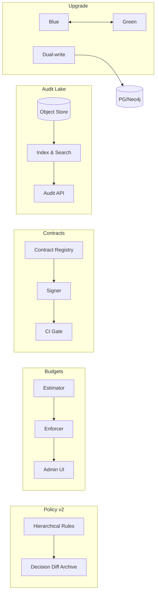

```markdown
---
slug: intelgraph-mc-sprint-2026-04-01
version: v1.0
created: 2025-09-29
sprint_window: 2026-04-01 → 2026-04-14 (2 weeks)
release_cadence: weekly cut → staging; biweekly → prod
owners:
  - product: PM (R), MC (A)
  - delivery: Tech Lead (A), Platform (R), Backend (R), Data Eng (R), DS (R), SRE (R), Sec (R), QA (R), Frontend (R)
status: planned
---

# IntelGraph Maestro Conductor — Sprint Plan (2026‑04‑01 → 2026‑04‑14)

> **Mission (Sprint N+13)**: Roll out **Policy Reasoner v2** platform‑wide, enforce **Query Budgets GA**, launch **Catalog‑backed Data Product Contracts v1.0**, stand up a **Unified Audit & Evidence Lake**, execute **Quarterly Upgrade Cycle** (runtime/db/helm), and complete **PenTest/Red‑Team remediation**—keeping SLOs/cost guardrails green. Evidence bundle v14 included.

## Conductor Summary (Commit)
**Builds on** 2026‑03‑18 sprint (DR GA automation, Governed Exports/Catalog v1.1, Policy v2 shadow, Query Budgets beta, ORR pack).

**Goals**
1. **Policy Reasoner v2 GA**: hierarchical rules live for all tenants; per‑purpose overrides; decision diffs archived.
2. **Query Budgets GA**: enforce on Top‑25 persisted IDs with admin self‑service; shape or reject per policy.
3. **Data Product Contracts v1.0**: dataset registration now requires a **contract** (schema + SLA + license/purpose/retention); CI gates.
4. **Unified Audit & Evidence Lake**: append‑only lake (object storage) for logs, proofs, runbooks, bundles; queryable indexes.
5. **Quarterly Upgrade Cycle**: upgrade gateway/runtime deps, Helm charts, and database minor versions with ZDM guardrails.
6. **PenTest/Red‑Team**: close criticals/highs; verify with attestations; add checks to CI (policy & supply‑chain).

**Non‑Goals**
- Active/active write DR; embeddings GA; marketplace monetization.

**Constraints**
- Platform SLOs unchanged; zero downtime during upgrade windows (use ZDM + canary).
- Cost guardrails: budgets honored even under shape/reject; alerts at 80% burn.

**Risks**
- R1: Policy v2 rollout edge cases. _Mitigation_: tenant‑wise staged enable + automatic fallback to v1 on diff spike.
- R2: Budget false positives blocking work. _Mitigation_: sandbox override tokens with audit + short TTL.
- R3: Upgrade regressions. _Mitigation_: preflight perf, rollback scripts, blue/green for gateway.

**Definition of Done**
- Policy v2 ON for ≥ 80% tenants with 0 breaking diffs; Budgets enforced on Top‑25 ops; contracts mandatory for new datasets; audit lake receiving evidence & searchable; upgrade cycle executed across staging→prod with evidence; PenTest/Red‑Team findings closed (crit/high) with proofs.

---

## Swimlanes
- **Lane A — Policy v2 GA** (Security + Backend + SRE)
- **Lane B — Query Budgets GA** (Backend + SRE FinOps)
- **Lane C — Data Product Contracts** (Data Eng + QA + Backend)
- **Lane D — Audit & Evidence Lake** (SRE + Platform)
- **Lane E — Upgrade Cycle** (Platform + Backend + DB)
- **Lane F — PenTest/RT Remediation** (Security + All)
- **Lane G — QA & Release** (QA + MC)

---

## Backlog (Epics → Stories → Tasks) + RACI
Estimates in SP.

### EPIC A: Policy v2 GA (30 SP)
- **A‑1** Staged enable with guard (10 SP) — _Sec (R), SRE (C)_
  - AC: per‑tenant feature flag; auto‑fallback to v1 if diff rate > threshold.
- **A‑2** Decision diff archive (8 SP) — _Backend (R)_
  - AC: 30‑day retention (`short-30d`) in audit lake; indexed by tenant/op.
- **A‑3** Policy pack v2.1 & tests (12 SP) — _Sec (R), QA (C)_

### EPIC B: Query Budgets GA (26 SP)
- **B‑1** Top‑25 op coverage (10 SP) — _Backend (R)_
- **B‑2** Admin UI for budgets (8 SP) — _Frontend (R)_
- **B‑3** Sandbox overrides + audit (8 SP) — _Backend (R), Sec (C)_

### EPIC C: Data Product Contracts v1.0 (28 SP)
- **C‑1** Contract registry & signer (10 SP) — _Data Eng (R)_
- **C‑2** CI gate & quarantine (10 SP) — _QA (R)_
- **C‑3** Catalog integration badges (8 SP) — _Frontend (R)_

### EPIC D: Unified Audit & Evidence Lake (24 SP)
- **D‑1** Storage layout + indexer (10 SP) — _SRE (R)_
- **D‑2** Search API (8 SP) — _Backend (R)_
- **D‑3** Lifecycle policies (6 SP) — _SRE (R)_

### EPIC E: Quarterly Upgrade Cycle (24 SP)
- **E‑1** Preflight perf & compat (8 SP) — _Backend (R), QA (C)_
- **E‑2** Blue/green & ZDM (8 SP) — _Platform (R)_
- **E‑3** Rollback scripts + runbook (8 SP) — _SRE (R)_

### EPIC F: PenTest/RT Remediation (20 SP)
- **F‑1** Close crit/highs (12 SP) — _Security (R), Owners (C)_
- **F‑2** CI checks (dep review, container scan) (8 SP) — _QA (R)_

### EPIC G: QA & Evidence v14 (12 SP)
- **G‑1** Policy/contract acceptance packs (6 SP) — _QA (R)_
- **G‑2** Evidence bundle v14 (6 SP) — _MC (R)_

_Total_: **164 SP** (descope: C‑3 or E‑3 if capacity < 145 SP).

---

## Architecture (Deltas)


**ADR‑040**: All new datasets require signed contracts; CI blocks if missing. _Trade‑off_: stricter intake vs safety.

**ADR‑041**: Audit lake uses append‑only object storage + compacted indexes. _Trade‑off_: eventual consistency vs durability & cost.

**ADR‑042**: Query budgets enforced at persisted‑ID granularity; admins can sandbox‑override with audit. _Trade‑off_: control vs flexibility.

---

## Data & Policy
**Contract Registry (PG)**
```sql
CREATE TABLE data_contracts (
  contract_id TEXT PRIMARY KEY,
  dataset_id TEXT NOT NULL,
  tenant_id UUID NOT NULL,
  version TEXT NOT NULL,
  license TEXT NOT NULL,
  purpose TEXT[] NOT NULL,
  retention TEXT NOT NULL,
  sla JSONB NOT NULL,
  signature BYTEA NOT NULL,
  created_at TIMESTAMPTZ DEFAULT now()
);
```

**Audit Lake Layout (S3/GCS)**
```
s3://ig-audit/tenants/<tenant>/yyyy/mm/dd/<category>/<artifact>.jsonl.gz
```

**Policy v2 (Rego — precedence)**
```rego
package intelgraph.policy.v2

# dataset rules override tenant defaults; purpose can further restrict
final_decision = out {
  base := tenant_rules[input.tenant]
  ds := merge(base, dataset_rules[input.dataset])
  out := merge(ds, purpose_rules[input.purpose])
}
```

---

## APIs & Schemas
**GraphQL — Contracts & Audit**
```graphql
type DataContract { id: ID!, datasetId: ID!, version: String!, license: String!, purpose: [String!]!, retention: String!, sla: JSON }

type Query {
  contract(datasetId: ID!, version: String!): DataContract @auth(abac: "contract.read")
  auditSearch(q: String!, after: String): [AuditHit!]! @auth(abac: "audit.read")
}

type AuditHit { tenantId: ID!, category: String!, ts: DateTime!, uri: String! }
```

**Budgets Admin (GraphQL)**
```graphql
mutation SetQueryBudget($opId:String!, $cap:Float!, $action:String!){ setQueryBudget(opId:$opId, dailyCostCapUSD:$cap, action:$action) }
```

---

## Security & Privacy
- **Contracts**: signatures verified; license/purpose/retention validated by policy; quarantine on mismatch.
- **Audit**: logs hashed; indexes contain metadata only; access via `audit.read` scope.
- **Upgrades**: supply‑chain checks (SBOM, signature verify) gate deploy; secrets rotated on blue→green flip.

---

## Observability & SLOs
- Metrics: policy v2 enablement %, decision diff rate, budget blocks/shape rate, contract compliance %, audit ingests/min, upgrade RTO, pen test closure rate.
- Alerts: decision diff spike; audit index lag > 10 min; upgrade perf regression; uncontracted dataset detected.

---

## Testing Strategy
- **Unit**: contract signer/verify; budget estimator; policy precedence merge; audit indexer.
- **Contract**: audit API; budget admin; contract registry.
- **E2E**: dataset registration → contract sign → CI gate → catalog badge; policy v2 rollout + fallback; blue/green upgrade with ZDM; pen test fix verification.
- **Load**: audit ingest 5k events/min; budgets under heavy read.
- **Chaos**: object store temporary unavailability; rollback mid‑upgrade; policy rule conflict storm.

**Acceptance Packs**
- Policy v2: 0 breaking diffs post‑enable per tenant; fallback triggers on threshold.
- Budgets: Top‑25 ops enforced; sandbox override works with audit.
- Contracts: new dataset blocked until contract signed; quarantine path visible.
- Audit: search returns artifacts for time window; retention policies applied.
- Upgrade: no downtime observed; rollback scripts validated.
- Security: all crit/high PenTest issues closed with evidence.

---

## CI/CD & IaC
```yaml
name: policy-budgets-contracts-audit-upgrade
on: [push]
jobs:
  policy-v2:
    runs-on: ubuntu-latest
    steps:
      - uses: actions/checkout@v4
      - run: npm run policy:v2:test && npm run policy:v2:shadow
  budgets:
    runs-on: ubuntu-latest
    steps:
      - run: npm run budgets:lint && npm run budgets:test
  contracts:
    runs-on: ubuntu-latest
    steps:
      - run: npm run contracts:sign:test && npm run contracts:gate
  audit:
    runs-on: ubuntu-latest
    steps:
      - run: npm run audit:index:test && npm run audit:search
  upgrade:
    runs-on: ubuntu-latest
    steps:
      - run: npm run upgrade:plan && npm run upgrade:simulate
```

**Terraform (audit lake & lifecycle)**
```hcl
module "audit_lake" {
  source = "./modules/audit-lake"
  storage_class = "standard-ia"
  retention_days = 365
  versioning    = true
}
```

---

## Code & Scaffolds
```
repo/
  policy/v2/
    merge.ts
    enable.ts
  budgets/
    ui/Admin.tsx
  contracts/
    signer.ts
    gate.ts
  audit/
    indexer.ts
    api.ts
  upgrades/
    bluegreen.sh
    rollback.sh
  security/pentest/
    findings.md
    attestations/
```

**Policy v2 merge (TS excerpt)**
```ts
export function mergeDecision(tenant:any, dataset:any, purpose:any){
  return { ...tenant, ...dataset, ...purpose };
}
```

**Audit indexer (TS excerpt)**
```ts
export async function indexObject(uri:string){ /* parse, extract metadata, write to index */ }
```

---

## Release Plan & Runbooks
- **Staging cuts**: 2026‑04‑04, 2026‑04‑11.
- **Prod**: 2026‑04‑14 (canary 10→50→100%).

**Backout**
- Revert to policy v1 for affected tenants; disable budget enforcement (alert‑only); relax contract gate to warn; pause audit indexer; roll back upgrades to previous chart; reopen PenTest items.

**Evidence Bundle v14**
- Policy v2 rollout logs; budget enforcement/overrides; contract signatures & CI gate logs; audit ingest/index snapshots; upgrade reports; PenTest remediation evidence; signed manifest.

---

## RACI (Consolidated)
| Workstream | R | A | C | I |
|---|---|---|---|---|
| Policy v2 GA | Security | MC | Backend, SRE | PM |
| Query Budgets GA | Backend | MC | SRE FinOps | PM |
| Data Product Contracts | Data Eng | Tech Lead | QA, Frontend | PM |
| Audit & Evidence Lake | SRE | Platform TL | Backend | PM |
| Upgrade Cycle | Platform | Tech Lead | QA | PM |
| PenTest Remediation | Security | MC | All | PM |
| QA & Evidence | QA | PM | MC | All |

---

## Open Items
1. Approve default budget caps per top operation (PM/Legal/FinOps).
2. Confirm contract template v1.0 with Legal/Privacy.
3. Size audit lake storage & lifecycle costs vs budget.

```

