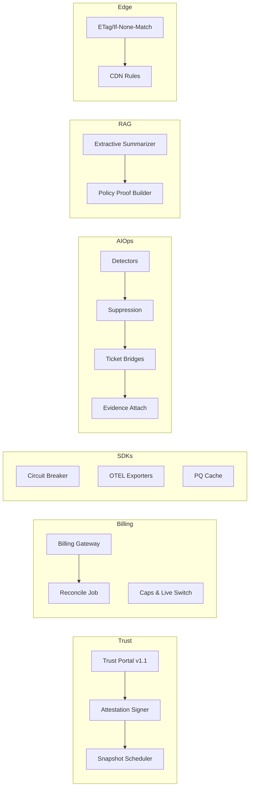

````markdown
---
slug: intelgraph-mc-sprint-2026-04-29
version: v1.0
created: 2025-09-29
sprint_window: 2026-04-29 → 2026-05-12 (2 weeks)
release_cadence: weekly cut → staging; biweekly → prod
owners:
  - product: PM (R), MC (A)
  - delivery: Tech Lead (A), Platform (R), Backend (R), Data Eng (R), DS (R), SRE (R), Sec (R), QA (R), Frontend (R)
status: planned
---

# IntelGraph Maestro Conductor — Sprint Plan (2026‑04‑29 → 2026‑05‑12)

> **Mission (Sprint N+15)**: Take **Trust Portal** to **v1.1** with tenant attestations, progress **Marketplace Billing** toward **limited live** (non‑prod tenants), ship **SDKs v1.2** (telemetry exporters & circuit‑breaker), roll out **AIOps Anomaly v1.0** with auto‑ticketing, introduce **RAG‑Safe Exports & Connectors v0.9** (text summaries + policy proof), and deliver **Gateway Edge Cache** to shave p95 latency—while keeping SLOs/cost guardrails green. Evidence bundle v16 included.

## Conductor Summary (Commit)

**Builds on** 2026‑04‑15 sprint (Billing test mode, Trust Portal v1.0, SDKs v1.1, AIOps preview, Residency audits, A11y/i18n pass).

**Goals**

1. **Trust Portal v1.1**: tenant attestations (SOC 2 controls list, residency & DLP posture), signed snapshots; RBAC hardening.
2. **Marketplace Billing — Limited Live**: enable live charges for **sandbox tenants only** with small caps; refunds/voids; reconciliation job v1.
3. **SDKs v1.2**: circuit‑breaker, OpenTelemetry exporters, first‑class persisted‑query cache, and typed error taxonomy.
4. **AIOps v1.0**: detectors promoted with playbooks; auto‑create incident tickets (Jira/ServiceNow) + attach evidence; noise suppression.
5. **RAG‑Safe Exports & Connectors v0.9**: opt‑in summarization connector (extractive) with license/purpose guard; no raw PII leaves; export manifests include policy proofs.
6. **Gateway Edge Cache**: CDN/edge caching for anonymous/public assets & safelisted read queries (ETag/If‑None‑Match) with tenant‑scope.

**Non‑Goals**

- Broad live billing for production tenants; abstractive LLM summarization; vector embeddings GA.

**Constraints**

- SLOs unchanged; Edge cache must not violate ABAC/tenant boundaries.
- Cost guardrails unchanged; billing live only for sandbox tenants with per‑tenant caps.

**Risks**

- R1: Edge cache leakage across tenants. _Mitigation_: cache key includes tenant, region, opId, vars hash; signed cookies.
- R2: Billing live flow mis‑charges. _Mitigation_: tiny caps + daily reconcile + manual approval for refunds.
- R3: AIOps ticket storms. _Mitigation_: suppression windows, multi‑signal consensus, min‑time‑between incidents.

**Definition of Done**

- Trust Portal v1.1 shows attestations + signed snapshot downloads; Billing live for 2 sandbox tenants with caps and successful reconcile; SDKs v1.2 published with exporters + breaker; AIOps creates actionable tickets with evidence and <2% false‑positive rate on backtests; RAG‑safe export produces summaries with policy proofs; Edge cache reduces read p95 ≥ 8% for safelisted ops.

---

## Swimlanes

- **Lane A — Trust Portal v1.1** (Frontend + Security + SRE)
- **Lane B — Billing Limited Live** (Backend + SRE FinOps + Security)
- **Lane C — SDKs v1.2** (Frontend + Backend)
- **Lane D — AIOps v1.0** (SRE + DS)
- **Lane E — RAG‑Safe Exports/Connectors** (Backend + Security + DS)
- **Lane F — Gateway Edge Cache** (Platform + SRE + Backend)
- **Lane G — QA & Evidence** (QA + MC)

---

## Backlog (Epics → Stories → Tasks) + RACI

Estimates in SP.

### EPIC A: Trust Portal v1.1 (26 SP)

- **A‑1** Attestations UI & signer (10 SP) — _Frontend (R), Sec (A)_
  - AC: per‑tenant SOC/residency/DLP attestation JSON + signed PDF.
- **A‑2** RBAC hardening & audit (8 SP) — _Backend (R)_
- **A‑3** Snapshot scheduler (8 SP) — _Backend (R), SRE (C)_

### EPIC B: Marketplace Billing (Limited Live) (30 SP)

- **B‑1** Live mode switch + caps (10 SP) — _Backend (R), SRE FinOps (C)_
- **B‑2** Refund/Void flows (8 SP) — _Backend (R)_
- **B‑3** Reconciliation v1 (12 SP) — _SRE FinOps (R)_

### EPIC C: SDKs v1.2 (26 SP)

- **C‑1** Circuit breaker (10 SP) — _Frontend (R)_
- **C‑2** OTEL exporters (8 SP) — _Backend (R)_
- **C‑3** PQ cache + error taxonomy (8 SP) — _Frontend (R)_

### EPIC D: AIOps v1.0 (28 SP)

- **D‑1** Noise suppression & consensus (10 SP) — _DS (R)_
- **D‑2** Ticket bridges (Jira/ServiceNow) (8 SP) — _SRE (R)_
- **D‑3** Evidence pack attach (10 SP) — _Backend (R)_

### EPIC E: RAG‑Safe Exports & Connector v0.9 (28 SP)

- **E‑1** Extractive summarizer (no LLM) (10 SP) — _DS (R)_
- **E‑2** Policy proofs in manifest (8 SP) — _Security (R)_
- **E‑3** Export UI & download (10 SP) — _Frontend (R)_

### EPIC F: Gateway Edge Cache (24 SP)

- **F‑1** Cache keying & ETag/If‑None‑Match (10 SP) — _Backend (R)_
- **F‑2** CDN rules & purge hooks (8 SP) — _Platform (R)_
- **F‑3** Safelist expansion & metrics (6 SP) — _SRE (R)_

### EPIC G: QA & Evidence v16 (12 SP)

- **G‑1** Trust/Billing/AIOps acceptance packs (6 SP) — _QA (R)_
- **G‑2** Evidence bundle v16 (6 SP) — _MC (R)_

_Total_: **174 SP** (descope: E‑3 or D‑2 if capacity < 150 SP).

---

## Architecture (Deltas)


````

**ADR‑046**: Edge cache only for safelisted read queries; cache key includes tenant/region/opId/vars‑hash; ETag validation. _Trade‑off_: infra complexity vs latency wins.

**ADR‑047**: RAG‑safe exports use extractive summaries only; license/purpose proof required; no PII leakage. _Trade‑off_: conservative summaries vs safety.

**ADR‑048**: AIOps creates tickets only after suppression/consensus; attach evidence snapshot. _Trade‑off_: fewer but higher‑quality alerts.

---

## Data & Policy

**Attestations (PG)**

```sql
CREATE TABLE attestations (
  tenant_id UUID,
  kind TEXT CHECK (kind IN ('soc2','residency','dlp')),
  payload JSONB NOT NULL,
  signature BYTEA NOT NULL,
  created_at TIMESTAMPTZ DEFAULT now(),
  PRIMARY KEY (tenant_id, kind, created_at)
);
```

**Edge Cache Safelist (JSON)**

```json
{
  "getEntityById:v1": { "ttl": 30 },
  "pagerankTop:v1": { "ttl": 60 }
}
```

**Policy (Rego) — RAG Export Gate**

```rego
package intelgraph.rag

default allow = false
allow {
  input.export.kind == "extractive-summary"
  input.proofs.license_ok
  input.proofs.purpose_ok
  not input.contains_pii
}
```

---

## APIs & Schemas

**GraphQL — Trust & Cache Control**

```graphql
scalar DateTime

type Attestation {
  kind: String!
  createdAt: DateTime!
  uri: String!
}

type Query {
  attestations: [Attestation!]! @auth(abac: "trust.read")
}

type Mutation {
  triggerSnapshot: Boolean @auth(abac: "trust.write")
  purgeCache(opId: String!, varsHash: String!): Boolean
    @auth(abac: "admin.write")
}
```

**SDK Circuit Breaker (config)**

```json
{ "failureRateThreshold": 0.5, "rollingWindowSec": 30, "cooldownSec": 10 }
```

---

## Security & Privacy

- **Trust**: signed attestations; portal RBAC tightened; signed URLs for snapshots.
- **Billing**: live mode guards + caps; webhook signatures verified; invoices signed & stored in audit lake.
- **RAG**: extractive only; PII scrub; purpose/license proof must validate.
- **Edge**: cache key isolation by tenant/region; purge on mutation to affected keys.

---

## Observability & SLOs

- Metrics: cache hit %, p95 deltas for safelisted ops, billing live success rate, reconcile diffs, AIOps alert precision/volume, attestation snapshot counts.
- Alerts: cache leak suspicion (cross‑tenant key miss‑match), reconcile mismatch > 0.5%, AIOps alert storm, snapshot signer failures.

---

## Testing Strategy

- **Unit**: circuit breaker; OTEL exporters; proofs; cache keyer; reconciliation math.
- **Contract**: trust portal APIs; billing live webhooks; purgeCache; RAG export policy.
- **E2E**: sandbox tenant checkout → invoice; trust snapshot → signed download; AIOps alert → ticket; export summary → proof; edge cache hit/miss flows.
- **Load**: 200 RPS on safelisted ops; billing 100 checkouts/day test; detectors on 60‑day windows.
- **Chaos**: stale ETag; webhook drop & replay; ticket bridge outage; cache stampede guard (request coalescing).

**Acceptance Packs**

- Edge cache: ≥ 8% p95 improvement on safelisted ops; no cross‑tenant leakage.
- Billing: live charges within caps; refunds/voids succeed; reconcile zero‑diff day.
- Trust: attestations visible; snapshots signed; RBAC enforced.
- SDKs: breaker opens/closes properly; OTEL spans visible; PQ cache hit > 50% for eligible ops.
- AIOps: alert precision > 98% on backtest; tickets created with evidence.
- RAG: export manifests verify; no PII in summaries.

---

## CI/CD & IaC

```yaml
name: trust-billing-sdks-aiops-edge-rag
on: [push]
jobs:
  trust:
    runs-on: ubuntu-latest
    steps:
      - uses: actions/checkout@v4
      - run: npm run trust:attest:test && npm run trust:snapshot:test
  billing:
    runs-on: ubuntu-latest
    steps:
      - run: npm run billing:live:simulate && npm run billing:reconcile:test
  sdks:
    runs-on: ubuntu-latest
    steps:
      - run: npm run sdk:build && npm run sdk:test && npm run sdk:otel:test
  aiops:
    runs-on: ubuntu-latest
    steps:
      - run: npm run aiops:precision && npm run aiops:ticket:test
  edge:
    runs-on: ubuntu-latest
    steps:
      - run: npm run edge:safelist:test && npm run edge:etag:test
  rag:
    runs-on: ubuntu-latest
    steps:
      - run: npm run rag:proof:test && npm run rag:export:e2e
```

**Terraform (edge & secrets)**

```hcl
module "edge_cache" {
  source = "./modules/edge"
  cdn_provider = "cloudfront" # or cloud-cdn
  purge_webhook = true
}

module "billing_live" {
  source = "./modules/billing"
  mode   = "live-sandbox"
  cap_usd_per_tenant = 50
}
```

---

## Code & Scaffolds

```
repo/
  portal/attest/
    signer.ts
    scheduler.ts
  billing/live/
    caps.ts
    reconcile.ts
  sdks/js/
    src/circuitBreaker.ts
    src/otel.ts
    src/pqCache.ts
  aiops/
    suppress.ts
    bridge/jira.ts
    bridge/snow.ts
  rag/export/
    extractive.ts
    proof.ts
  edge/
    key.ts
    purge.ts
```

**Edge cache keyer (TS excerpt)**

```ts
export function key(tenant: string, region: string, opId: string, vars: any) {
  return `${tenant}:${region}:${opId}:${hash(vars)}`;
}
```

**Circuit breaker (TS excerpt)**

```ts
export function breaker(cfg) {
  /* rolling window & half-open */
}
```

---

## Release Plan & Runbooks

- **Staging cuts**: 2026‑05‑02, 2026‑05‑09.
- **Prod**: 2026‑05‑12 (canary 10→50→100%).

**Backout**

- Disable billing live switch; revert SDK to v1.1; mute AIOps tickets; disable edge safelist; hide RAG export.

**Evidence Bundle v16**

- Attestation snapshots/signatures; billing live logs + reconcile; SDKs v1.2 SHAs & telemetry samples; AIOps tickets & precision report; RAG proofs; edge cache p95 deltas; signed manifest.

---

## RACI (Consolidated)

| Workstream             | R        | A         | C             | I   |
| ---------------------- | -------- | --------- | ------------- | --- |
| Trust v1.1             | Frontend | Tech Lead | Security, SRE | PM  |
| Billing Live (Sandbox) | Backend  | Sec TL    | SRE FinOps    | PM  |
| SDKs v1.2              | Frontend | MC        | Backend       | PM  |
| AIOps v1.0             | SRE      | MC        | DS            | PM  |
| RAG‑Safe Exports       | Backend  | Sec TL    | DS, Frontend  | PM  |
| Edge Cache             | Platform | Tech Lead | Backend, SRE  | PM  |
| QA & Evidence          | QA       | PM        | MC            | All |

---

## Open Items

1. Identify the two sandbox tenants for live billing.
2. Approve initial safelist for edge‑cached operations.
3. Confirm RAG export fields allowed per Legal/Privacy.

```

```
