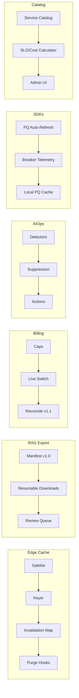

````markdown
---
slug: intelgraph-mc-sprint-2026-05-13
version: v1.0
created: 2025-09-29
sprint_window: 2026-05-13 → 2026-05-26 (2 weeks)
release_cadence: weekly cut → staging; biweekly → prod
owners:
  - product: PM (R), MC (A)
  - delivery: Tech Lead (A), Platform (R), Backend (R), Data Eng (R), DS (R), SRE (R), Sec (R), QA (R), Frontend (R)
status: planned
---

# IntelGraph Maestro Conductor — Sprint Plan (2026‑05‑13 → 2026‑05‑26)

> **Mission (Sprint N+16)**: Graduate **Gateway Edge Cache** to **GA**, take **RAG‑Safe Exports** to **v1.0**, expand **Billing Live** to **pilot prod tenants** (capped), roll out **AIOps v1.1** (SLO‑aware actions), deliver **SDKs v1.3** (auto‑persist/refresh PQs + circuit‑breaker telemetry), and introduce **Service Catalog & SLO Calculator v0.9**—while maintaining SLOs/cost guardrails. Evidence bundle v17 included.

## Conductor Summary (Commit)

**Builds on** 2026‑04‑29 sprint (Trust v1.1, Billing live sandbox, SDKs v1.2, AIOps v1.0, RAG‑safe 0.9, Edge cache preview).

**Goals**

1. **Edge Cache GA**: safelist expanded; invalidation on mutations; p95 delta reports by op & tenant; purge hooks.
2. **RAG‑Safe Exports v1.0**: export manifest v1.0, policy proofs, resumable downloads, and admin review queue.
3. **Billing Live (Pilot Prod)**: enable live billing for ≤ 3 production tenants with strict caps + daily reconcile & approval workflow.
4. **AIOps v1.1**: SLO‑aware throttling/shaping actions with cooldowns; suppression learning; incident templates auto‑filled.
5. **SDKs v1.3**: persisted‑query auto‑refresh (schema drift), circuit‑breaker telemetry, OTEL Resource attributes, PQ local cache adapter.
6. **Service Catalog & SLO Calculator v0.9**: catalog of ops/services with unit costs & SLO targets, ‘what‑if’ p95/p99 and cost estimations.

**Non‑Goals**

- General availability of production billing beyond pilot; abstractive LLM export; embeddings GA.

**Constraints**

- SLOs unchanged; cache/AI actions must not breach ABAC.
- Cost guardrails unchanged; billing caps hard‑enforced with 2‑person approval for overrides.

**Risks**

- R1: Incorrect cache invalidation. _Mitigation_: mutation→cache key map, e2e verification, emergency purge.
- R2: Billing pilot variance. _Mitigation_: tight caps, reconcile alarms, manual approval queue.
- R3: AIOps action misfire. _Mitigation_: dry‑run mode + rollback window + human approval for destructive actions.

**Definition of Done**

- Edge cache GA with ≥ 10% p95 improvement on safelisted ops and 0 leakage incidents; RAG‑safe v1.0 exports with verified proofs; Billing live for up to 3 prod tenants with zero reconcile drift > $0.01; AIOps v1.1 enacts throttling on burn with audit; SDKs v1.3 released; Service Catalog/SLO calculator accessible to admins with accurate ‘what‑if’ estimates.

---

## Swimlanes

- **Lane A — Edge Cache GA** (Platform + Backend + SRE)
- **Lane B — RAG‑Safe Exports v1.0** (Security + Backend + Frontend)
- **Lane C — Billing Live (Pilot Prod)** (Backend + SRE FinOps + Security)
- **Lane D — AIOps v1.1** (SRE + DS)
- **Lane E — SDKs v1.3** (Frontend + Backend)
- **Lane F — Service Catalog & SLO Calculator** (PM + Backend + Frontend)
- **Lane G — QA & Evidence** (QA + MC)

---

## Backlog (Epics → Stories → Tasks) + RACI

Estimates in SP.

### EPIC A: Edge Cache GA (28 SP)

- **A‑1** Safelist expansion + TTL tuning (10 SP) — _SRE (R), Backend (C)_
- **A‑2** Mutation‑driven invalidation map (10 SP) — _Backend (R)_
- **A‑3** p95 delta reports & purge hooks (8 SP) — _SRE (R)_

### EPIC B: RAG‑Safe Exports v1.0 (30 SP)

- **B‑1** Manifest v1.0 + proofs (10 SP) — _Security (R), Backend (C)_
- **B‑2** Resumable downloads + checksum resume (10 SP) — _Backend (R)_
- **B‑3** Review queue UI (10 SP) — _Frontend (R)_

### EPIC C: Billing Live — Pilot Prod (30 SP)

- **C‑1** Tenant caps + approvals (10 SP) — _Backend (R)_
- **C‑2** Reconcile v1.1 (variance windows, retries) (10 SP) — _SRE FinOps (R)_
- **C‑3** Refund/Void approval workflow (10 SP) — _Frontend (R)_

### EPIC D: AIOps v1.1 (26 SP)

- **D‑1** SLO‑aware actions (shape/throttle) (10 SP) — _Backend (R), SRE (C)_
- **D‑2** Suppression learning (8 SP) — _DS (R)_
- **D‑3** Template auto‑fill (8 SP) — _SRE (R)_

### EPIC E: SDKs v1.3 (24 SP)

- **E‑1** PQ auto‑refresh + schema drift detect (10 SP) — _Frontend (R)_
- **E‑2** Breaker telemetry & OTEL Resource attrs (8 SP) — _Backend (R)_
- **E‑3** PQ local cache adapter (6 SP) — _Frontend (R)_

### EPIC F: Service Catalog & SLO Calc v0.9 (24 SP)

- **F‑1** Catalog schema & seeding (8 SP) — _Backend (R)_
- **F‑2** What‑if calculator (p95/p99, cost) (10 SP) — _Frontend (R)_
- **F‑3** Admin UI + export (6 SP) — _Frontend (R)_

### EPIC G: QA & Evidence v17 (12 SP)

- **G‑1** Cache/export/billing acceptance packs (6 SP) — _QA (R)_
- **G‑2** Evidence bundle v17 (6 SP) — _MC (R)_

_Total_: **174 SP** (descope: D‑3 or F‑3 if capacity < 150 SP).

---

## Architecture (Deltas)


````

**ADR‑049**: Invalidation map built from mutation→read key relations; purge executed within 1s. _Trade‑off_: complexity vs correctness.

**ADR‑050**: RAG exports require signed manifest + proofs; resumable by chunk with hash tree. _Trade‑off_: larger manifests vs resumability.

**ADR‑051**: AIOps actions only on SLO burn and with cooldowns; human approval for high‑impact. _Trade‑off_: slower response vs safety.

---

## Data & Policy

**Edge Invalidation Map (PG)**

```sql
CREATE TABLE cache_invalidation (
  mutation_op TEXT,
  affected_op TEXT,
  vars_selector JSONB,
  PRIMARY KEY (mutation_op, affected_op)
);
```

**RAG Manifest v1.0 (JSON)**

```json
{
  "exportId": "...",
  "kind": "extractive-summary",
  "chunks": [{ "sha256": "...", "size": 1048576, "ix": 0 }],
  "proofs": {
    "license": "Restricted-TOS",
    "purpose": ["investigation"],
    "pii": "none"
  },
  "signature": "..."
}
```

**Billing Caps (Policy)**

```rego
package intelgraph.billing

allow_charge {
  input.tenant.cap_remaining_usd >= input.charge_usd
}
```

---

## APIs & Schemas

**GraphQL — Catalog & Cache**

```graphql
type ServiceOp {
  id: ID!
  name: String!
  p95TargetMs: Int!
  unitCostUSD: Float!
}

type Query {
  serviceOps: [ServiceOp!]! @auth(abac: "admin.write")
}

type Mutation {
  upsertServiceOp(op: ServiceOpInput!): Boolean @auth(abac: "admin.write")
  purgeCache(opId: String!, varsHash: String!): Boolean
    @auth(abac: "admin.write")
}
```

**SDK PQ Auto‑Refresh (config)**

```json
{ "refreshOnSchemaChange": true, "maxStaleHours": 24 }
```

---

## Security & Privacy

- **Edge**: cache key includes tenant/region/opId/vars hash; purges gated; audit trails.
- **RAG**: proofs mandatory; chunks hashed; review queue requires high‑clearance role.
- **Billing**: caps enforced server‑side; approvals logged; reconcile stored in audit lake.

---

## Observability & SLOs

- Metrics: cache hit %, invalidations/min, p95 deltas, export success & resume rates, billing variance, AIOps actions count, SDK refreshes, catalog ‘what‑if’ usage.
- Alerts: cache invalidation backlog; export resume failures; reconcile drift; excessive AIOps actions; PQ refresh failures.

---

## Testing Strategy

- **Unit**: keyer; invalidation mapping; manifest hash tree; caps math; AIOps cooldowns; PQ refresh.
- **Contract**: export manifest verify; purge API; billing approvals; catalog schema.
- **E2E**: mutation→invalidation→cache miss; resumable export; live charge within caps; AIOps throttling on burn; SDK PQ refresh; SLO calculator scenario.
- **Load**: 300 RPS safelisted ops; multi‑GB export resume; billing 200 tx/day; AIOps detection windows.
- **Chaos**: lost purge webhook; partial manifest; reconcile API outage; detector drift.

**Acceptance Packs**

- Edge: ≥ 10% p95 improvement; zero cross‑tenant leakage; invalidations within 1s.
- RAG: manifests verify; summaries download/resume; review queue works; no PII.
- Billing: caps honored; reconcile diff ≤ $0.01; approvals required.
- AIOps: actions only under burn; cooldown respected; audit complete.
- SDKs: PQ refresh on schema bump; breaker telemetry emitted; local cache hit > 50% for eligible ops.
- Catalog: what‑if estimates within ±10% of observed for sample.

---

## CI/CD & IaC

```yaml
name: edge-rag-billing-aiops-sdks-catalog
on: [push]
jobs:
  edge:
    runs-on: ubuntu-latest
    steps:
      - uses: actions/checkout@v4
      - run: npm run edge:safelist:test && npm run edge:invalidate:test
  rag:
    runs-on: ubuntu-latest
    steps:
      - run: npm run rag:manifest:verify && npm run rag:download:resume:test
  billing:
    runs-on: ubuntu-latest
    steps:
      - run: npm run billing:caps:test && npm run billing:reconcile:test
  aiops:
    runs-on: ubuntu-latest
    steps:
      - run: npm run aiops:actions:test && npm run aiops:suppress:test
  sdks:
    runs-on: ubuntu-latest
    steps:
      - run: npm run sdk:pq:refresh:test && npm run sdk:otel:test
  catalog:
    runs-on: ubuntu-latest
    steps:
      - run: npm run catalog:seed && npm run catalog:whatif:test
```

**Terraform (edge cache & billing pilot)**

```hcl
module "edge_cache" { source = "./modules/edge" purge_webhook = true ttl_default = 60 }
module "billing_pilot" { source = "./modules/billing" mode = "live-pilot" cap_usd_per_tenant = 200 }
```

---

## Code & Scaffolds

```
repo/
  edge/
    invalidation-map.sql
    delta-report.ts
  rag/export/
    manifest.ts
    resume.ts
  billing/live/
    caps.ts
    approvals.ts
  aiops/actions/
    throttle.ts
    cooldown.ts
  sdks/js/
    src/pqRefresh.ts
    src/otelResource.ts
    src/localCache.ts
  catalog/
    schema.sql
    whatif.ts
```

**Invalidation (TS excerpt)**

```ts
export function affectedKeys(mutationOp: string, vars: any) {
  /* build affected cache keys */
}
```

**Resume (TS excerpt)**

```ts
export async function resumeDownload(manifest, fromChunk) {
  /* verify hash and continue */
}
```

---

## Release Plan & Runbooks

- **Staging cuts**: 2026‑05‑02, 2026‑05‑09 (completed before prod cut).
- **Prod**: 2026‑05‑12 (canary 10→50→100%).

**Backout**

- Disable edge cache safelist; revert billing to sandbox; disable AIOps actions (detect‑only); hide RAG export; freeze SDK PQ refresh.

**Evidence Bundle v17**

- Cache p95 reports & invalidation logs; RAG manifests + verify outputs; billing pilot ledger + reconcile; AIOps actions & approvals; SDK v1.3 SHAs; catalog what‑if validation; signed manifest.

---

## RACI (Consolidated)

| Workstream         | R        | A         | C                 | I   |
| ------------------ | -------- | --------- | ----------------- | --- |
| Edge Cache GA      | Platform | Tech Lead | Backend, SRE      | PM  |
| RAG‑Safe v1.0      | Security | MC        | Backend, Frontend | PM  |
| Billing Pilot Prod | Backend  | Sec TL    | SRE FinOps        | PM  |
| AIOps v1.1         | SRE      | MC        | DS                | PM  |
| SDKs v1.3          | Frontend | MC        | Backend           | PM  |
| Service Catalog    | Backend  | PM        | Frontend          | All |
| QA & Evidence      | QA       | PM        | MC                | All |

---

## Open Items

1. Pick 3 production tenants for billing pilot & obtain approvals.
2. Validate mutation→key map coverage for top 25 operations.
3. Agree on ‘what‑if’ calculator cost coefficients with FinOps.

```

```
