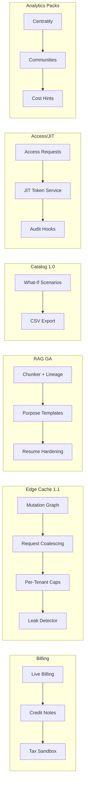

```markdown
---
slug: intelgraph-mc-sprint-2026-05-27
version: v1.0
created: 2025-09-29
sprint_window: 2026-05-27 → 2026-06-09 (2 weeks)
release_cadence: weekly cut → staging; biweekly → prod
owners:
  - product: PM (R), MC (A)
  - delivery: Tech Lead (A), Platform (R), Backend (R), Data Eng (R), DS (R), SRE (R), Sec (R), QA (R), Frontend (R)
status: planned
---

# IntelGraph Maestro Conductor — Sprint Plan (2026‑05‑27 → 2026‑06‑09)

> **Mission (Sprint N+17)**: Scale what we’ve shipped: **Billing GA (phased)**, **Edge Cache Guardrails v1.1**, **RAG‑Safe Connectors GA**, **Service Catalog & SLO Calculator v1.0**, **Access Requests & Just‑in‑Time (JIT) Grants**, and **Graph Analytics Packs v0.9**—all with evidence‑backed compliance and SLO/cost guardrails. Evidence bundle v18 included.

## Conductor Summary (Commit)
**Builds on** 2026‑05‑13 sprint (Edge GA, RAG v1.0, Billing pilot prod, AIOps 1.1, SDKs 1.3, Service Catalog 0.9).

**Goals**
1. **Billing GA (Phased)**: expand beyond pilot to up to 8 prod tenants, add **credit notes**, **tax calc (sandbox)**, cost anomaly guards.
2. **Edge Cache Guardrails v1.1**: mutation graph coverage ≥ 95%, request coalescing, per‑tenant cache caps, leak detector.
3. **RAG‑Safe Connectors GA**: productionize extractive summarizer; add **doc chunk lineage**; per‑purpose templates.
4. **Service Catalog & SLO Calculator v1.0**: finalize UI, CSV export, and **what‑if** scenario save/share; link to budgets.
5. **Access Requests & JIT Grants v1.0**: approver workflow, time‑boxed scoped tokens, auto‑revoke, audit.
6. **Graph Analytics Packs v0.9**: curated persisted queries (centrality, communities, shortest paths) with cost hints & sampling.

**Non‑Goals**
- Active/active writes; abstractive LLM export; production tax remittance.

**Constraints**
- SLOs unchanged; cache guardrails must keep cross‑tenant leak risk **zero**.
- Cost guardrails: billing variance alerts and hard caps; analytics packs must meet read SLOs.

**Risks**
- R1: Cache invalidation miss → stale reads. _Mitigation_: mutation graph tests, emergency purge, TTL fences.
- R2: Billing GA mis‑tax. _Mitigation_: sandbox tax calc + manual review + credit notes.
- R3: Analytics packs heavy queries. _Mitigation_: sampling, capped hops, persisted IDs only.

**Definition of Done**
- Billing live for ≤ 8 tenants with reconcile drift ≤ $0.01/day; credit notes & tax sandbox flow evidenced.
- Edge guardrails: mutation→key coverage ≥ 95%, coalescing live, zero leak incidents.
- RAG‑safe connectors GA with lineage metadata + proof manifests; no PII.
- Service Catalog 1.0 shipped with shareable what‑if and budget link.
- Access/JIT workflow live, tokens auto‑revoke; audits complete.
- Analytics packs deliver < 450 ms p95 (reads) on sample tenancy and pass cost hints checks.

---

## Swimlanes
- **Lane A — Billing GA (Phased)** (Backend + SRE FinOps + Security)
- **Lane B — Edge Cache Guardrails** (Platform + Backend + SRE)
- **Lane C — RAG‑Safe Connectors GA** (Security + Backend + DS + Frontend)
- **Lane D — Service Catalog & SLO Calc v1.0** (Backend + Frontend + PM)
- **Lane E — Access Requests & JIT Grants** (Security + Backend + Frontend)
- **Lane F — Graph Analytics Packs** (Graph Eng + Backend)
- **Lane G — QA & Evidence** (QA + MC)

---

## Backlog (Epics → Stories → Tasks) + RACI
Estimates in SP.

### EPIC A: Billing GA (32 SP)
- **A‑1** Tenant rollout + variance guards (10 SP) — _Backend (R), SRE FinOps (A)_
- **A‑2** Credit notes & refunds API (10 SP) — _Backend (R), Sec (C)_
- **A‑3** Tax calc (sandbox) + invoice fields (12 SP) — _Backend (R)_

### EPIC B: Edge Guardrails v1.1 (28 SP)
- **B‑1** Mutation graph generator & tests (12 SP) — _Backend (R), QA (C)_
- **B‑2** Request coalescing + cache caps (10 SP) — _Platform (R)_
- **B‑3** Leak detector & alarms (6 SP) — _SRE (R)_

### EPIC C: RAG‑Safe Connectors GA (30 SP)
- **C‑1** Chunk lineage & anchors (10 SP) — _Backend (R), DS (C)_
- **C‑2** Purpose templates (6 SP) — _Security (R)_
- **C‑3** GA UI polish & downloads (8 SP) — _Frontend (R)_
- **C‑4** Large file resume hardening (6 SP) — _Backend (R)_

### EPIC D: Service Catalog v1.0 (24 SP)
- **D‑1** Shareable what‑if scenarios (10 SP) — _Frontend (R)_
- **D‑2** CSV export + budgets link (8 SP) — _Backend (R)_
- **D‑3** UX polish & docs (6 SP) — _PM (R), Frontend (C)_

### EPIC E: Access Requests & JIT Grants v1.0 (28 SP)
- **E‑1** Approvals & scopes (12 SP) — _Security (R), Backend (C)_
- **E‑2** Time‑box & auto‑revoke (8 SP) — _Backend (R)_
- **E‑3** Audit & notifications (8 SP) — _SRE (R), Frontend (C)_

### EPIC F: Graph Analytics Packs v0.9 (24 SP)
- **F‑1** Centrality/pagerank/top‑k persisted IDs (10 SP) — _Graph Eng (R)_
- **F‑2** Community detection (sampled) (8 SP) — _Graph Eng (R)_
- **F‑3** Cost hints & sampling guards (6 SP) — _Backend (R)_

### EPIC G: QA & Evidence v18 (12 SP)
- **G‑1** Billing/RAG/Access acceptance (6 SP) — _QA (R)_
- **G‑2** Evidence bundle v18 (6 SP) — _MC (R)_

_Total_: **178 SP** (descope: F‑2 or D‑3 if capacity < 155 SP).

---

## Architecture (Deltas)


**ADR‑052**: Mutation graph drives invalidations & leak detector. _Trade‑off_: build/maintain graph vs strong guarantees.

**ADR‑053**: JIT uses short‑lived scoped JWT with OPA checks; mandatory auto‑revoke. _Trade‑off_: more requests vs least‑privilege.

**ADR‑054**: Analytics packs are persisted, sampled, and hint‑bound; no ad‑hoc heavy queries. _Trade‑off_: less flexibility vs predictable SLOs.

---

## Data & Policy
**Access Requests (PG)**
```sql
CREATE TABLE access_requests (
  id UUID PRIMARY KEY,
  tenant_id UUID NOT NULL,
  requester TEXT NOT NULL,
  scope TEXT[] NOT NULL,
  status TEXT CHECK (status IN ('pending','approved','denied','expired')),
  expires_at TIMESTAMPTZ,
  created_at TIMESTAMPTZ DEFAULT now()
);
```

**JIT Token (JWT claims)**
```json
{ "tenant":"<uuid>", "scopes":["catalog.read"], "exp": 1710000000, "jit": true }
```

**Leak Detector Policy (Rego)**
```rego
package intelgraph.edge

suspicious_leak {
  input.cache_key.tenant != input.request.tenant
}
```

---

## APIs & Schemas
**GraphQL — Access/JIT & Catalog**
```graphql
type AccessRequest { id: ID!, requester: String!, scope: [String!]!, status: String!, expiresAt: DateTime }

type Query { accessRequests: [AccessRequest!]! @auth(abac: "admin.write") }

type Mutation {
  requestAccess(scope: [String!]!, expiresAt: DateTime!): ID!
  approveAccess(id: ID!): Boolean @auth(abac: "admin.write")
  denyAccess(id: ID!): Boolean @auth(abac: "admin.write")
}
```

**Analytics Pack (Persisted spec)**
```json
{ "id":"analytics.pagerankTop:v1", "abac":["analytics.read"], "timeoutMs": 450, "sample":"top_edges:10%" }
```

---

## Security & Privacy
- **Billing**: credit notes signed; tax sandbox only; reconcile daily with approval.
- **Edge**: caps per tenant; leak alarms; coalescing avoids stampedes.
- **RAG**: chunk lineage retained; proof manifests required; no PII in summaries.
- **Access/JIT**: tokens scoped/time‑boxed; all approvals audited.

---

## Observability & SLOs
- Metrics: invalidation coverage %, coalesced requests/min, leak alarms, billing variance, credit notes issued, RAG summary counts, what‑if usage, access grant time, analytics p95.
- Alerts: leak suspicion; reconcile drift > $0.01; low invalidation coverage; analytics p95 > 450 ms; JIT tokens not revoked on time.

---

## Testing Strategy
- **Unit**: mutation graph builder; JIT expiry; chunk lineage; credit note math; analytics samplers.
- **Contract**: access requests API; billing credit/tax; RAG proof manifests.
- **E2E**: request→approve→JIT token→auto‑revoke; cache coalescing under burst; credit note issuance; analytics pack run; what‑if share.
- **Load**: 300 RPS safelisted ops (with coalescing); billing 300 tx/day; analytics 10 RPS.
- **Chaos**: purge hook lost; token revoke delay; tax API sandbox outage.

**Acceptance Packs**
- Billing GA: ≤ $0.01/day drift; credit notes/refunds correct; tax fields present.
- Edge: coverage ≥ 95%; zero leaks; coalescing reduces origin hits ≥ 20% on target ops.
- RAG GA: lineage present; proofs validate; resumable robust.
- Catalog 1.0: shareable scenarios; CSV export; budget link works.
- Access/JIT: approvals logged; tokens revoke at expiry; least‑privilege enforced.
- Analytics: p95 ≤ 450 ms; sampling & hints enforced.

---

## CI/CD & IaC
```yaml
name: billing-edge-rag-access-catalog-analytics
on: [push]
jobs:
  billing:
    runs-on: ubuntu-latest
    steps:
      - uses: actions/checkout@v4
      - run: npm run billing:credit:test && npm run billing:tax:sandbox && npm run billing:reconcile
  edge:
    runs-on: ubuntu-latest
    steps:
      - run: npm run edge:mutgraph:test && npm run edge:coalesce:test && npm run edge:leak:simulate
  rag:
    runs-on: ubuntu-latest
    steps:
      - run: npm run rag:lineage:test && npm run rag:manifest:verify
  access:
    runs-on: ubuntu-latest
    steps:
      - run: npm run access:workflow:test && npm run jit:revoke:test
  catalog:
    runs-on: ubuntu-latest
    steps:
      - run: npm run catalog:whatif:test && npm run catalog:csv:test
  analytics:
    runs-on: ubuntu-latest
    steps:
      - run: npm run analytics:packs:test && npm run analytics:costhints
```

**Terraform (caps & JIT)**
```hcl
module "edge_caps" { source = "./modules/edge-caps" per_tenant_max_mb = 512 }
module "jit_tokens" { source = "./modules/jit" ttl_minutes = 60 approvers = ["sec@intelgraph"] }
```

---

## Code & Scaffolds
```
repo/
  edge/guardrails/
    mutgraph.ts
    coalesce.ts
    leak-detector.ts
  billing/credit/
    api.ts
    signer.ts
  rag/lineage/
    anchors.ts
    manifest.ts
  access/jit/
    workflow.ts
    token.ts
  catalog/whatif/
    model.ts
    share.ts
  analytics/packs/
    pagerank.ts
    community.ts
    hints.ts
```

**Mutation Graph (TS excerpt)**
```ts
export function buildMutationGraph(schema:SDL){ /* derive mutation→read keys */ }
```

**JIT Token (TS excerpt)**
```ts
export function mintJIT(tenant:string, scopes:string[], ttlMin:number){ /* scoped, short‑lived JWT */ }
```

---

## Release Plan & Runbooks
- **Staging cuts**: 2026‑05‑30, 2026‑06‑06.
- **Prod**: 2026‑06‑09 (canary 10→50→100%).

**Backout**
- Freeze billing to pilot tenants; disable coalescing; revert RAG to v1.0; hide what‑if sharing; disable JIT; remove analytics packs.

**Evidence Bundle v18**
- Billing GA rollout logs; credit notes/tax sandbox artifacts; edge coverage/coalescing reports; RAG lineage proofs; catalog v1.0 screenshots; JIT approvals + revocations; analytics p95 & sampling reports; signed manifest.

---

## RACI (Consolidated)
| Workstream | R | A | C | I |
|---|---|---|---|---|
| Billing GA | Backend | Sec TL | SRE FinOps | PM |
| Edge Guardrails | Platform | Tech Lead | Backend, SRE | PM |
| RAG‑Safe GA | Security | MC | Backend, DS, Frontend | PM |
| Catalog v1.0 | Frontend | PM | Backend | All |
| Access/JIT | Security | MC | Backend, Frontend, SRE | PM |
| Analytics Packs | Graph Eng | Tech Lead | Backend | PM |
| QA & Evidence | QA | PM | MC | All |

---

## Open Items
1. Approver list & SLAs for Access/JIT.
2. Final tax field mapping for invoices (sandbox).
3. Select ops for Analytics Packs initial set; confirm sampling ratios.

```

