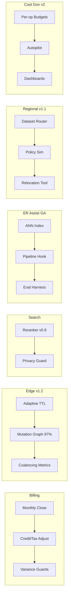

````markdown
---
slug: intelgraph-mc-sprint-2026-06-10
version: v1.0
created: 2025-09-29
sprint_window: 2026-06-10 → 2026-06-23 (2 weeks)
release_cadence: weekly cut → staging; biweekly → prod
owners:
  - product: PM (R), MC (A)
  - delivery: Tech Lead (A), Platform (R), Backend (R), Data Eng (R), DS (R), SRE (R), Sec (R), QA (R), Frontend (R)
status: planned
---

# IntelGraph Maestro Conductor — Sprint Plan (2026‑06‑10 → 2026‑06‑23)

> **Mission (Sprint N+18)**: Close out **Billing GA** (with sandboxed tax calc & credit notes), ship **Adaptive Edge Cache v1.2**, graduate **RAG‑Safe Connectors** with **Search Reranker v0.9**, promote **Embeddings→ER Assist to GA** behind guardrails, deliver **Regional Sharding v1.1** (dataset residency routing + failover drills), and launch **Cost Governance v2** (unit‑cost autopilot + per‑op budgets at scale). Evidence bundle v19 included.

## Conductor Summary (Commit)

**Builds on** 2026‑05‑27 sprint (Billing GA phased, Edge guardrails 1.1, RAG GA, Service Catalog 1.0, Access/JIT, Analytics Packs 0.9).

**Goals**

1. **Billing GA Completion**: enable for all opted prod tenants; credit notes + sandbox tax calc finalized; variance guards & monthly close workflow.
2. **Adaptive Edge Cache v1.2**: request coalescing + adaptive TTL (per‑op, per‑tenant) based on write pressure & SLO burn; full mutation graph coverage ≥ 97%.
3. **Search Reranker v0.9 (RAG‑Safe)**: optional lightweight reranker (BM25+signals) **without LLM**; privacy‑safe features.
4. **Embeddings→ER Assist GA**: vectors only as recall signal; per‑tenant opt‑in; offline eval ≥ +10% candidate recall @ same precision; strict cost caps.
5. **Regional Sharding v1.1**: dataset‑level routing + warm standbys; guided runbook for dataset relocation; simulated failover drill with proofs.
6. **Cost Governance v2**: per‑op budgets generated from Service Catalog; autopilot recommend/shape; dashboards + alerts; evidence of cost/SLO tradeoffs.

**Non‑Goals**

- Production LLM rerankers; active/active multi‑region writes.

**Constraints**

- Platform SLOs unchanged; Cache/reranker must not breach ABAC/PII limits.
- Cost guardrails unchanged; embeddings & reranker costs under tenant caps.

**Risks**

- R1: Adaptive TTL causes stale reads. _Mitigation_: TTL fences on hot datasets + emergency purge + canary TTL ramp.
- R2: ER assist recall improves but harms latency. _Mitigation_: cap ANN depth & batch; cache embeddings; measure p95.
- R3: Regional relocation misroutes datasets. _Mitigation_: dry‑run policy sim + two‑phase cutover + rollback plan.

**Definition of Done**

- Billing GA: live for all opted tenants; reconcile drift ≤ $0.01/day; credit/tax flows evidenced.
- Edge v1.2: ≥ 12% p95 improvement on safelisted ops; coverage ≥ 97%; zero cross‑tenant leak incidents.
- Reranker v0.9: zero‑PII features; fallback < 20%; p95 search ≤ 450 ms.
- ER Assist GA: recall +10% at same precision on labeled set; cost/latency within caps.
- Regional v1.1: dataset routing works; drill completes with signed proofs; RTO ≤ 30m, RPO ≤ 5m (dataset‑scoped).
- Cost Gov v2: per‑op budgets applied for Top‑50 ops; autopilot suggests changes; 80% alerting live.

---

## Swimlanes

- **Lane A — Billing GA Close** (Backend + SRE FinOps + Security)
- **Lane B — Adaptive Edge Cache v1.2** (Platform + Backend + SRE)
- **Lane C — Search Reranker v0.9** (Backend + DS + Security)
- **Lane D — ER Assist GA** (DS + Backend + QA)
- **Lane E — Regional Sharding v1.1** (Platform + Security + SRE)
- **Lane F — Cost Governance v2** (SRE FinOps + Backend + PM)
- **Lane G — QA & Evidence** (QA + MC)

---

## Backlog (Epics → Stories → Tasks) + RACI

Estimates in SP.

### EPIC A: Billing GA Close (28 SP)

- **A‑1** Monthly close workflow + approvals (10 SP) — _SRE FinOps (R), Backend (C)_
- **A‑2** Credit/tax adjustments (8 SP) — _Backend (R), Sec (C)_
- **A‑3** Variance guardrails & alarms (10 SP) — _SRE FinOps (R)_

### EPIC B: Adaptive Edge Cache v1.2 (30 SP)

- **B‑1** Adaptive TTL engine (per‑op/tenant) (12 SP) — _Backend (R)_
- **B‑2** Mutation graph coverage to 97% (10 SP) — _Backend (R), QA (C)_
- **B‑3** Coalescing metrics & safeguards (8 SP) — _SRE (R)_

### EPIC C: Search Reranker v0.9 (26 SP)

- **C‑1** Feature extractors (BM25, recency, degree) (10 SP) — _Backend (R), DS (C)_
- **C‑2** Privacy guard (no PII tokens) (8 SP) — _Security (R)_
- **C‑3** Flag & fallback wiring (8 SP) — _SRE (R)_

### EPIC D: ER Assist GA (26 SP)

- **D‑1** ANN indexer hardening (10 SP) — _DS (R)_
- **D‑2** Pipeline hook gates & caps (8 SP) — _Backend (R)_
- **D‑3** Eval harness & acceptance (8 SP) — _QA (R)_

### EPIC E: Regional Sharding v1.1 (28 SP)

- **E‑1** Dataset‑level router + policy sim (12 SP) — _Backend (R), Sec (C)_
- **E‑2** Relocation runbook & tooling (8 SP) — _SRE (R)_
- **E‑3** Drill: failover/return (8 SP) — _SRE (R)_

### EPIC F: Cost Governance v2 (26 SP)

- **F‑1** Per‑op budgets from catalog (10 SP) — _Backend (R)_
- **F‑2** Autopilot suggest/shape (8 SP) — _SRE FinOps (R)_
- **F‑3** Dashboards & alerts (8 SP) — _SRE (R)_

### EPIC G: QA & Evidence v19 (12 SP)

- **G‑1** ER/Reranker/Regional acceptance packs (6 SP) — _QA (R)_
- **G‑2** Evidence bundle v19 (6 SP) — _MC (R)_

_Total_: **176 SP** (descope: C‑3 or F‑2 if capacity < 155 SP).

---

## Architecture (Deltas)


````

**ADR‑055**: Adaptive TTL tuned by write pressure & SLO burn; bounded with TTL fences. _Trade‑off_: complexity vs latency wins.

**ADR‑056**: Reranker uses non‑PII features; no ML/LLM in v0.9. _Trade‑off_: modest quality gains vs privacy/cost.

**ADR‑057**: ER Assist GA keeps vectors private, opt‑in, and capped. _Trade‑off_: compute/storage vs recall.

**ADR‑058**: Regional routing at dataset granularity; sim required before move. _Trade‑off_: operational overhead vs compliance/resilience.

**ADR‑059**: Cost budgets sourced from Service Catalog; autopilot suggests shape thresholds, never hard‑enforces without admin consent. _Trade‑off_: human‑in‑the‑loop vs speed.

---

## Data & Policy

**Adaptive TTL Policy (YAML)**

```yaml
ops:
  getEntityById:v1:
    baseTTL: 30
    maxTTL: 120
    minTTL: 10
    sloBurnFactor: 0.5
```

**Regional Dataset Map (PG)**

```sql
CREATE TABLE dataset_region_map (
  dataset_id TEXT PRIMARY KEY,
  region TEXT NOT NULL,
  standby_region TEXT
);
```

**Reranker Guard (Rego)**

```rego
package intelgraph.search

allow_feature[f] {
  f := input.feature
  not contains(f, "email")
  not contains(f, "phone")
  not contains(f, "ssn")
}
```

**Cost Budgets (PG)**

```sql
CREATE TABLE op_budgets (
  tenant_id UUID,
  op_id TEXT,
  daily_cap_usd NUMERIC,
  action TEXT CHECK (action IN ('suggest','shape','reject')) DEFAULT 'suggest',
  PRIMARY KEY (tenant_id, op_id)
);
```

---

## APIs & Schemas

**GraphQL — Cost, Regional & Search**

```graphql
type OpBudget {
  opId: String!
  dailyCapUSD: Float!
  action: String!
}

type Mutation {
  setOpBudget(opId: String!, dailyCapUSD: Float!, action: String!): Boolean
    @auth(abac: "admin.write")
  relocateDataset(datasetId: ID!, targetRegion: String!): Boolean
    @auth(abac: "admin.write")
  setReranker(enabled: Boolean!): Boolean @auth(abac: "admin.write")
}
```

**ER Assist Config (JSON)**

```json
{ "enabled": true, "ann": { "k": 50, "ef": 100 }, "costCapUSD": 25 }
```

---

## Security & Privacy

- **Reranker/ER**: no PII features; vectors only; opt‑in with tenant caps; full audit.
- **Regional**: policy sim required; relocation gated; audit trail + hash manifests.
- **Cost**: autopilot suggest only by default; admin approval logged for shape/reject.

---

## Observability & SLOs

- Metrics: TTL adjustments/min, cache coverage %, reranker hit rate & p95, ER recall delta, relocation RTO/RPO, cost budget suggestions vs actions, reconcile drift.
- Alerts: coverage < 97%; reranker p95 > 450 ms or feature guard violations; ER cost over cap; relocation sim mismatch; reconcile variance spikes.

---

## Testing Strategy

- **Unit**: TTL engine; reranker feature allowlist; ANN params; policy sim; budget math.
- **Contract**: relocateDataset API; cost budget API; setReranker toggle; ER config.
- **E2E**: adaptive TTL under write spike; reranker on/off AB test; ER assist recall eval; dataset relocation dry‑run → cutover → rollback; monthly close workflow.
- **Load**: search 15 RPS with reranker; ER batch; regional read during drill; catalog‑driven budgets on Top‑50 ops.
- **Chaos**: TTL miscalc (fence); ANN index corruption (rebuild); relocation mid‑fail; reconcile API outage.

**Acceptance Packs**

- Edge v1.2: ≥ 12% p95 improvement; coverage ≥ 97%; zero leaks.
- Reranker: privacy guard passes; p95 ≤ 450 ms; fallback < 20%.
- ER Assist GA: recall +10% @ same precision; cost within caps; audits complete.
- Regional: drill meets RTO/RPO; relocation succeeds/rollback tested.
- Cost Gov v2: Top‑50 budgets present; suggestions logged; shaped ops audited.
- Billing: monthly close logs; variance guards & credit/tax adjustments.

---

## CI/CD & IaC

```yaml
name: billing-edge-rerank-er-regional-cost
on: [push]
jobs:
  billing:
    runs-on: ubuntu-latest
    steps:
      - uses: actions/checkout@v4
      - run: npm run billing:close:test && npm run billing:variance:test
  edge:
    runs-on: ubuntu-latest
    steps:
      - run: npm run edge:ttl:test && npm run edge:coverage:test
  rerank:
    runs-on: ubuntu-latest
    steps:
      - run: npm run search:rerank:test && npm run privacy:features:test
  er:
    runs-on: ubuntu-latest
    steps:
      - run: npm run er:eval && npm run er:caps:test
  regional:
    runs-on: ubuntu-latest
    steps:
      - run: npm run regional:sim && npm run regional:move:test
  cost:
    runs-on: ubuntu-latest
    steps:
      - run: npm run cost:budgets:seed && npm run cost:autopilot:test
```

**Terraform (regional & budgets)**

```hcl
module "regional_router" { source = "./modules/regional" dataset_map_table = "dataset_region_map" }
module "op_budgets" { source = "./modules/budgets" alert_threshold = 0.8 }
```

---

## Code & Scaffolds

```
repo/
  edge/adaptive/
    ttl.ts
    coverage.test.ts
  search/rerank/
    features.ts
    rerank.ts
  er/assist/
    ann.ts
    config.json
  regional/
    router.ts
    relocate.ts
    sim.ts
  cost/autopilot/
    suggest.ts
    shape.ts
  billing/close/
    workflow.ts
    variance.ts
```

**Adaptive TTL (TS excerpt)**

```ts
export function chooseTTL(
  opId: string,
  tenant: string,
  context: { writeRate: number; sloBurn: number },
) {
  /* bounded adjust */
}
```

**Rerank (TS excerpt)**

```ts
export function rerank(candidates: any[]) {
  /* BM25 + recency + degree, privacy‑safe */
}
```

**Regional Sim (TS excerpt)**

```ts
export function simulateMove(datasetId: string, targetRegion: string) {
  /* policy + capacity check */
}
```

---

## Release Plan & Runbooks

- **Staging cuts**: 2026‑06‑13, 2026‑06‑20.
- **Prod**: 2026‑06‑23 (canary 10→50→100%).

**Backout**

- Freeze budgets to suggest‑only; disable reranker; turn off ER assist hook; lock adaptive TTL to base; abort relocation; pause monthly close.

**Evidence Bundle v19**

- Adaptive cache reports; reranker privacy & p95; ER eval & caps; regional sim & drill logs; budget suggestions/actions; billing close & variance guards; signed manifest.

---

## RACI (Consolidated)

| Workstream       | R          | A           | C             | I   |
| ---------------- | ---------- | ----------- | ------------- | --- |
| Billing GA Close | SRE FinOps | Sec TL      | Backend       | PM  |
| Edge v1.2        | Backend    | Tech Lead   | SRE, Platform | PM  |
| Reranker v0.9    | Backend    | MC          | DS, Security  | PM  |
| ER Assist GA     | DS         | MC          | Backend, QA   | PM  |
| Regional v1.1    | SRE        | Platform TL | Security      | PM  |
| Cost Gov v2      | SRE FinOps | PM          | Backend       | All |
| QA & Evidence    | QA         | PM          | MC            | All |

---

## Open Items

1. Confirm tenant list for ER Assist GA & reranker pilot.
2. Approve adaptive TTL fences per op with SRE.
3. Validate monthly close workflow with Finance.

```

```
