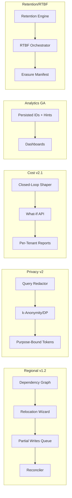

```markdown
---
slug: intelgraph-mc-sprint-2026-06-24
version: v1.0
created: 2025-09-29
sprint_window: 2026-06-24 → 2026-07-07 (2 weeks)
release_cadence: weekly cut → staging; biweekly → prod
owners:
  - product: PM (R), MC (A)
  - delivery: Tech Lead (A), Platform (R), Backend (R), Data Eng (R), DS (R), SRE (R), Sec (R), QA (R), Frontend (R)
status: planned
---

# IntelGraph Maestro Conductor — Sprint Plan (2026‑06‑24 → 2026‑07‑07)

> **Mission (Sprint N+19)**: Cement reliability and privacy at scale: **Regional Sharding v1.2 (guided relocation + partial writes)**, **Privacy Controls v2** (query‑time redaction + k‑anonymity), **Access Reviews & SCIM v1.1**, **Cost Autopilot v2.1** (closed‑loop shaping), **Analytics Packs GA**, and **Retention/RTBF Automation v1.0**—keeping SLOs/cost guardrails green with full evidence. Evidence bundle v20 included.

## Conductor Summary (Commit)
**Builds on** 2026‑06‑10 (Billing close, Edge 1.2, ER Assist GA, Regional 1.1, Cost Gov v2, Reranker 0.9).

**Goals**
1. **Regional v1.2**: guided dataset relocation (two‑phase) with *partial writes* support (queue & reconcile), automated dependency checks.
2. **Privacy Controls v2**: query‑time redaction, k‑anonymity thresholds for analytics, DP sampling for exports (ε presets), and purpose‑binding in tokens.
3. **Access Reviews & SCIM v1.1**: periodic access review workflows, scoped deprovision, and entitlement diffs (Okta/AzureAD).
4. **Cost Autopilot v2.1**: closed‑loop shaping using ‘what‑if’ predictions; human‑approved escalations; per‑tenant optimization reports.
5. **Analytics Packs GA**: finalize centrality/community/paths with sampling, persisted‑ID cost hints, dashboards, and docs.
6. **Retention & RTBF v1.0**: automated retention policies per dataset/field, RTBF at scale with proof‑of‑erasure.

**Non‑Goals**
- Full active/active write topology; abstractive LLM privacy transforms.

**Constraints**
- SLOs unchanged; relocation with partial writes must keep write p95 ≤ +20% over baseline during cutover window.
- Cost guardrails unchanged; DP/anon transformations must not leak PII.

**Risks**
- R1: Partial write queues overflow. _Mitigation_: per‑dataset caps + backpressure + fail‑safe to read‑only.
- R2: Over‑redaction harms utility. _Mitigation_: policy tiers + preview mode + audit.
- R3: RTBF deletes break lineage. _Mitigation_: tombstones + re‑compute lineage deltas.

**Definition of Done**
- Two guided relocations complete with partial writes & proof; privacy v2 passes k‑anon checks on pilots; SCIM v1.1 access review closes stale entitlements; Autopilot v2.1 shapes Top‑50 ops with approved actions; Analytics Packs GA live with p95 ≤ 450 ms; RTBF jobs run and produce signed erasure manifests.

---

## Swimlanes
- **Lane A — Regional v1.2** (Platform + Backend + SRE)
- **Lane B — Privacy Controls v2** (Security + Backend + Data Eng)
- **Lane C — Access Reviews & SCIM v1.1** (Security + Backend)
- **Lane D — Cost Autopilot v2.1** (SRE FinOps + Backend)
- **Lane E — Analytics Packs GA** (Graph Eng + Backend + QA)
- **Lane F — Retention/RTBF v1.0** (Security + Data Eng + SRE)
- **Lane G — QA & Evidence** (QA + MC)

---

## Backlog (Epics → Stories → Tasks) + RACI
Estimates in SP.

### EPIC A: Regional Sharding v1.2 (30 SP)
- **A‑1** Dependency graph & readiness checks (10 SP) — _Backend (R)_, Sec (C)
- **A‑2** Partial writes queue + reconcile (10 SP) — _Platform (R)_, SRE (A)
- **A‑3** Guided relocation wizard & dry‑run (10 SP) — _Frontend (R)_

### EPIC B: Privacy Controls v2 (32 SP)
- **B‑1** Query‑time redaction rules (10 SP) — _Backend (R)_, Sec (A)
- **B‑2** k‑Anonymity & DP presets (ε=1,2,4) (12 SP) — _Data Eng (R)_
- **B‑3** Purpose‑bound tokens (JWT claims) (10 SP) — _Security (R)_

### EPIC C: Access Reviews & SCIM v1.1 (26 SP)
- **C‑1** Entitlement diff & attest (10 SP) — _Security (R)_, Backend (C)
- **C‑2** Scheduled reviews + reminders (8 SP) — _Backend (R)_
- **C‑3** Deprovision SCIM flows (8 SP) — _Backend (R)_

### EPIC D: Cost Autopilot v2.1 (26 SP)
- **D‑1** Closed‑loop shape engine (10 SP) — _SRE FinOps (R)_
- **D‑2** What‑if integration + approval UI (8 SP) — _Frontend (R)_
- **D‑3** Optimization reports per tenant (8 SP) — _Backend (R)_

### EPIC E: Analytics Packs GA (24 SP)
- **E‑1** Finalize persisted IDs + hints (10 SP) — _Graph Eng (R)_
- **E‑2** Dashboards + docs + examples (8 SP) — _PM (R)_, Frontend (C)
- **E‑3** Guarded sampling knobs (6 SP) — _Backend (R)_

### EPIC F: Retention & RTBF v1.0 (26 SP)
- **F‑1** Retention engine + policy compiler (10 SP) — _Data Eng (R)_
- **F‑2** RTBF orchestrator + manifests (10 SP) — _Security (R)_, Backend (C)
- **F‑3** Residency‑aware erasure (6 SP) — _Backend (R)_

### EPIC G: QA & Evidence v20 (12 SP)
- **G‑1** Regional/Privacy/RTBF acceptance packs (6 SP) — _QA (R)_
- **G‑2** Evidence bundle v20 (6 SP) — _MC (R)_

_Total_: **176 SP** (descope: E‑3 or D‑3 if capacity < 155 SP).

---

## Architecture (Deltas)


**ADR‑060**: Partial writes during relocation queued and replayed post‑cutover. _Trade‑off_: temporary latency vs zero data loss.

**ADR‑061**: Query‑time redaction applies policy tier per role; analytics require k‑anon ≥ k=5 unless exempt. _Trade‑off_: privacy vs fidelity.

**ADR‑062**: Cost shaping moves from "suggest" to **approved shape** via closed‑loop; full audit and easy rollback. _Trade‑off_: human latency vs spend control.

---

## Data & Policy
**Partial Writes (PG)**
```sql
CREATE TABLE partial_writes (
  id BIGSERIAL PRIMARY KEY,
  dataset_id TEXT NOT NULL,
  payload JSONB NOT NULL,
  ts TIMESTAMPTZ NOT NULL,
  applied BOOLEAN DEFAULT false
);
```

**Query‑time Redaction (Rego)**
```rego
package intelgraph.redact

# redact fields when sensitivity high and role lacks clearance
redact[field] {
  input.field.sensitivity == "high"
  not input.user.roles[_] == "high-clearance"
  field := input.field.name
}
```

**k‑Anon/DP Presets (YAML)**
```yaml
anon:
  k: 5
  quasi_identifiers: ["city","age_band"]
dp:
  epsilon: 2
  delta: 1e-6
```

**RTBF Manifest (JSON)**
```json
{
  "subjectId":"...",
  "scope":"tenant:...",
  "datasets":["..."],
  "actions":[{"op":"delete","status":"ok","ts":"..."}],
  "signatures":["..."]
}
```

---

## APIs & Schemas
**GraphQL — Privacy, Cost & RTBF**
```graphql
scalar DateTime

input RedactionRuleInput { field:String!, tier:String! }

type Mutation {
  setRedactionRule(rule: RedactionRuleInput!): Boolean @auth(abac: "admin.write")
  approveCostShape(opId: String!, capUSD: Float!): Boolean @auth(abac: "admin.write")
  requestRTBF(subjectId: ID!, scope: String!): ID! @auth(abac: "privacy.write")
}

 type Query {
  accessReviewOpen: Int! @auth(abac: "admin.write")
  analyticsPacks: [String!]! @auth(abac: "analytics.read")
}
```

---

## Security & Privacy
- **Regional**: mTLS; partial writes encrypted at rest; replay idempotent.
- **Privacy v2**: redaction & k‑anon evaluated server‑side; DP noise kept below utility thresholds; tokens carry `purpose` claim.
- **SCIM/Access**: diff‑based revocation; attestations stored in audit lake 30 days.
- **RTBF**: erasures logged with signed manifest; lineage recomputed.

---

## Observability & SLOs
- Metrics: relocation queue depth, replay lag, redacted fields count, k‑anon violations, DP queries/day, access review completion %, shaped ops %, analytics p95, RTBF job durations.
- Alerts: queue depth > threshold; k‑anon < k=5; DP epsilon outside presets; overdue access reviews; RTBF failures.

---

## Testing Strategy
- **Unit**: redaction rules; k‑anon grouping; DP noise; partial write replay idempotence; cost shape approval; RTBF manifest signer.
- **Contract**: SCIM v1.1 diffs; relocation wizard API; privacy APIs; RTBF API.
- **E2E**: guided relocation with partial writes; analytics pack dashboards; cost closed‑loop approve→shape; RTBF end‑to‑end with proof.
- **Load**: replay 10k partial writes; analytics packs at 10 RPS; privacy transforms under export.
- **Chaos**: drop partial write store; redaction misconfig (shadow mode); access review backlog spike.

**Acceptance Packs**
- Regional: two relocations succeed; write p95 within +20% during window; replay = 0 unapplied.
- Privacy: k≥5 enforced; DP ε presets honored; redaction visible per policy tier.
- Access/SCIM: stale entitlements removed; attestations signed.
- Cost: Top‑50 ops shaped where approved; rollback works.
- Analytics GA: p95 ≤ 450 ms; sampling/hints enforced; docs shipped.
- RTBF: manifest verifies; residency‑aware deletes pass.

---

## CI/CD & IaC
```yaml
name: regional-privacy-access-cost-analytics-rtbf
on: [push]
jobs:
  regional:
    runs-on: ubuntu-latest
    steps:
      - uses: actions/checkout@v4
      - run: npm run regional:dryrun && npm run regional:replay:test
  privacy:
    runs-on: ubuntu-latest
    steps:
      - run: npm run privacy:redact:test && npm run privacy:kanon:dp:test
  access:
    runs-on: ubuntu-latest
    steps:
      - run: npm run scim:diff:test && npm run access:review:schedule
  cost:
    runs-on: ubuntu-latest
    steps:
      - run: npm run cost:close:loop && npm run cost:reports
  analytics:
    runs-on: ubuntu-latest
    steps:
      - run: npm run packs:compose && npm run packs:p95
  rtbf:
    runs-on: ubuntu-latest
    steps:
      - run: npm run rtbf:simulate && npm run rtbf:manifest:verify
```

**Terraform (queues & privacy)**
```hcl
module "partial_write_queue" { source = "./modules/queue" retention_hours = 24 encrypted = true }
module "privacy_policies" { source = "./modules/policy" kanon_k = 5 dp_epsilon = 2 }
```

---

## Code & Scaffolds
```
repo/
  regional/relocate/
    wizard.ts
    dependency.ts
    replay.ts
  privacy/v2/
    redact.rego
    kanon.ts
    dp.ts
  scim/review/
    diff.ts
    schedule.ts
  cost/loop/
    shape.ts
    report.ts
  analytics/packs/
    compose.ts
    docs/
  rtbf/
    orchestrator.ts
    manifest.ts
```

**k‑Anon (TS excerpt)**
```ts
export function kanonize(rows:any[], qis:string[], k=5){ /* group + suppress/generalize */ }
```

**Partial Write Replay (TS excerpt)**
```ts
export async function replay(dataset:string){ /* idempotent apply with hash checks */ }
```

---

## Release Plan & Runbooks
- **Staging cuts**: 2026‑06‑27, 2026‑07‑04.
- **Prod**: 2026‑07‑07 (canary 10→50→100%).

**Backout**
- Disable partial writes; redaction shadow‑only; pause DP; freeze cost shaping (suggest‑only); keep packs beta; disable RTBF jobs.

**Evidence Bundle v20**
- Relocation + replay logs; redaction/k‑anon/DP proofs; access review attestations; cost shape approvals; packs dashboards; RTBF manifests; signed manifest.

---

## RACI (Consolidated)
| Workstream | R | A | C | I |
|---|---|---|---|---|
| Regional v1.2 | Platform | Tech Lead | Backend, SRE | PM |
| Privacy v2 | Security | MC | Backend, Data Eng | PM |
| Access/SCIM | Security | MC | Backend | PM |
| Cost v2.1 | SRE FinOps | PM | Backend | All |
| Analytics GA | Graph Eng | Tech Lead | Backend, QA | PM |
| Retention/RTBF | Security | MC | Data Eng, SRE | PM |
| QA & Evidence | QA | PM | MC | All |

---

## Open Items
1. Choose two datasets for relocation pilots.
2. Approve k‑anon/DP presets with Legal/Privacy.
3. Define Top‑50 ops list for shaping in v2.1.

```

