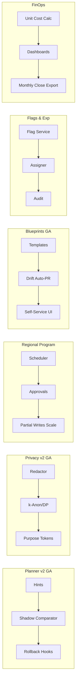

````markdown
---
slug: intelgraph-mc-sprint-2026-07-22
version: v1.0
created: 2025-09-29
sprint_window: 2026-07-22 → 2026-08-04 (2 weeks)
release_cadence: weekly cut → staging; biweekly → prod
owners:
  - product: PM (R), MC (A)
  - delivery: Tech Lead (A), Platform (R), Backend (R), Data Eng (R), DS (R), SRE (R), Sec (R), QA (R), Frontend (R)
status: planned
---

# IntelGraph Maestro Conductor — Sprint Plan (2026‑07‑22 → 2026‑08‑04)

> **Mission (Sprint N+21)**: Take **Planner v2** and **Privacy v2** to GA at scale, finalize **Regional Relocation Program**, launch **Gold Tenant Blueprints GA**, introduce **Feature Flag & Experimentation v1.0**, and ship **FinOps Transparency v1.0** (tenant unit‑cost dashboards)—while holding SLOs/cost guardrails with signed evidence. Evidence bundle v22 included.

## Conductor Summary (Commit)

**Builds on** 2026‑07‑08 (Privacy v2 rollout, batch relocations, SOC2 audit pack, ICS v1.0, Planner v2 shadow, blueprinted tenants).

**Goals**

1. **Query Planner v2 GA**: active for **Top‑50** persisted operations; guardrails + rollback; 10–15% median p95 improvement.
2. **Privacy v2 GA**: query‑time redaction + k‑anon/DP presets on **≥ 90%** tenants; purpose‑bound tokens enforced.
3. **Regional Relocation Program**: scheduler + wizard operated by SRE with approvals; 8 additional datasets migrated with partial writes; playbook finalized.
4. **Gold Tenant Blueprints GA**: one‑click create + drift auto‑PRs; self‑service baseline selection (default‑secure, high‑assurance).
5. **Feature Flags & Experimentation v1.0**: per‑tenant flags, staged rollout, experiment framework (A/B), audit; no PII in assignment.
6. **FinOps Transparency v1.0**: unit cost dashboards (GraphQL, ingest, storage, analytics); variance alerts; monthly close export for tenants.

**Non‑Goals**

- Abstractive LLM processing of tenant data; external SOC2 attestation (prep only).

**Constraints**

- SLOs unchanged; planner regressions > 5% must auto‑rollback.
- Cost guardrails unchanged; experiments capped; dashboards avoid tenant‑identifiable PII.

**Risks**

- R1: Planner v2 edge regressions. _Mitigation_: per‑op kill‑switch, shadow compare, p95 regression alarms.
- R2: Feature flag misuse. _Mitigation_: policy checks, approvals, time‑boxed experiments, audit.
- R3: FinOps metric drift. _Mitigation_: source‑of‑truth contracts + daily reconciliation.

**Definition of Done**

- Planner v2 GA on Top‑50 ops with ≥ 10% p95 improvement and ≤ 5% regressions; Privacy v2 GA on ≥ 90% tenants; 8 datasets relocated successfully; Gold blueprints GA with zero drift for 7 days; flags/experiments live with audit; FinOps dashboards published to 5 pilot tenants.

---

## Swimlanes

- **Lane A — Planner v2 GA** (Backend + Graph Eng + QA)
- **Lane B — Privacy v2 GA** (Security + Backend + Data Eng + SRE)
- **Lane C — Regional Program** (Platform + SRE)
- **Lane D — Gold Blueprints GA** (Platform + Backend + Frontend)
- **Lane E — Flags & Experiments v1.0** (Backend + Frontend + Security)
- **Lane F — FinOps Transparency v1.0** (SRE FinOps + Backend + Frontend)
- **Lane G — QA & Evidence** (QA + MC)

---

## Backlog (Epics → Stories → Tasks) + RACI

Estimates in SP.

### EPIC A: Planner v2 GA (30 SP)

- **A‑1** Guardrails & rollback hooks (10 SP) — _Backend (R)_, QA (C)
- **A‑2** Top‑50 op activation & monitors (10 SP) — _Graph Eng (R)_, SRE (C)
- **A‑3** Shadow/active comparator & reports (10 SP) — _QA (R)_

### EPIC B: Privacy v2 GA (32 SP)

- **B‑1** Tenant rollout 90% + monitors (12 SP) — _Security (R)_, SRE (C)
- **B‑2** k‑anon/DP preset verification (10 SP) — _Data Eng (R)_
- **B‑3** Purpose‑bound token enforcement & tests (10 SP) — _Backend (R)_

### EPIC C: Regional Relocation Program (28 SP)

- **C‑1** Batch scheduler guardrails & approvals (10 SP) — _Platform (R)_, SRE (A)
- **C‑2** Partial write queue scaling (8 SP) — _Backend (R)_
- **C‑3** 8 dataset moves + proofs (10 SP) — _SRE (R)_

### EPIC D: Gold Blueprints GA (24 SP)

- **D‑1** Templates harden + drift auto‑PRs (10 SP) — _Platform (R)_
- **D‑2** Self‑service UI + docs (8 SP) — _Frontend (R)_
- **D‑3** Blueprint audit & export (6 SP) — _Backend (R)_

### EPIC E: Feature Flags & Experimentation v1.0 (26 SP)

- **E‑1** Flag service + policy (10 SP) — _Backend (R)_, Security (A)
- **E‑2** Experiment assigner (hash‑based, no PII) (8 SP) — _Backend (R)_
- **E‑3** UI & audit trails (8 SP) — _Frontend (R)_

### EPIC F: FinOps Transparency v1.0 (26 SP)

- **F‑1** Unit‑cost calculations & contracts (10 SP) — _SRE FinOps (R)_
- **F‑2** Tenant dashboards (8 SP) — _Frontend (R)_
- **F‑3** Monthly close export (8 SP) — _Backend (R)_

### EPIC G: QA & Evidence v22 (12 SP)

- **G‑1** Planner/privacy/flags acceptance (6 SP) — _QA (R)_
- **G‑2** Evidence bundle v22 (6 SP) — _MC (R)_

_Total_: **178 SP** (descope: C‑3 or E‑3 if capacity < 155 SP).

---

## Architecture (Deltas)


````

**ADR‑066**: Experiment assignment via salted hash (tenant, opId) to avoid PII/imbalance. _Trade‑off_: less precise targeting vs privacy.

**ADR‑067**: Planner v2 GA uses per‑op kill‑switch and shadow comparator; activation only where improvement observed. _Trade‑off_: slower rollout vs safety.

**ADR‑068**: Unit costs derived from metering contracts; dashboards present aggregates only. _Trade‑off_: transparency vs minimal exposure.

---

## Data & Policy

**Flags (PG)**

```sql
CREATE TABLE flags (
  key TEXT PRIMARY KEY,
  value JSONB NOT NULL,
  policy JSONB NOT NULL,
  updated_at TIMESTAMPTZ DEFAULT now()
);
```

**Experiments (JSON)**

```json
{
  "id": "planner2-ab-top50",
  "salt": "2026-07",
  "arms": ["control", "variant"],
  "ratio": [0.5, 0.5]
}
```

**Unit Cost Contract (YAML)**

```yaml
unit_costs:
  graphql_call: 0.000002
  ingest_event: 0.0001
  storage_gb_day: 0.02
```

---

## APIs & Schemas

**GraphQL — Flags, Experiments, FinOps**

```graphql
scalar JSON

type Flag {
  key: String!
  value: JSON!
  policy: JSON!
  updatedAt: String!
}

type Query {
  flags: [Flag!]! @auth(abac: "admin.write")
}

type Mutation {
  setFlag(key: String!, value: JSON!, policy: JSON!): Boolean
    @auth(abac: "admin.write")
  createExperiment(id: String!, spec: JSON!): Boolean @auth(abac: "admin.write")
  exportMonthlyClose(month: String!): String! @auth(abac: "billing.read")
}
```

---

## Security & Privacy

- **Flags/Experiments**: policy gates sensitive flags; assignments logged; TTLs for risky toggles.
- **FinOps**: aggregates only; per‑tenant download requires `billing.read` and signed URLs.
- **Blueprints**: templates reviewed; drift PRs signed.

---

## Observability & SLOs

- Metrics: planner v2 adoption %, p95 deltas, privacy enablement %, relocations/day, drift PR count, active flags/experiments, unit‑cost variance, monthly close export success.
- Alerts: p95 regression > 5% on any op; privacy k<5 or DP ε mismatch; relocation queue overflow; unsigned drift PR; unit‑cost variance spike.

---

## Testing Strategy

- **Unit**: flag policy eval; salted hash assigner; unit cost math; planner comparator; purpose token checks.
- **Contract**: flags API; experiments API; monthly close export; blueprint audit.
- **E2E**: enable planner v2 on a cohort; tenant privacy GA; schedule 8 dataset moves; create tenant from blueprint; run experiment; publish FinOps dashboards.
- **Load**: plan previews 15 RPS; flags reads 200 RPS; dashboards 50 RPS.
- **Chaos**: flag store stale; comparator offline; metering lag.

**Acceptance Packs**

- Planner v2 ≥ 10% p95 improvement on Top‑50 ops; zero > 5% regressions after rollback pass.
- Privacy v2 ≥ 90% tenants; k≥5, DP presets observed.
- 8 dataset moves complete; proofs in audit.
- Blueprints GA: 3 tenants, zero drift 7 days.
- Flags/experiments audited; assignments balanced ±2%.
- FinOps: dashboards match contract math ±0.5%; monthly close export validated.

---

## CI/CD & IaC

```yaml
name: planner-privacy-regional-blueprints-flags-finops
on: [push]
jobs:
  planner:
    runs-on: ubuntu-latest
    steps:
      - uses: actions/checkout@v4
      - run: npm run planner:guardrails && npm run planner:compare
  privacy:
    runs-on: ubuntu-latest
    steps:
      - run: npm run privacy:ga && npm run privacy:verify
  regional:
    runs-on: ubuntu-latest
    steps:
      - run: npm run regional:batch:approve && npm run regional:migrate
  blueprints:
    runs-on: ubuntu-latest
    steps:
      - run: npm run blueprint:drift:pr && npm run blueprint:ui:test
  flags:
    runs-on: ubuntu-latest
    steps:
      - run: npm run flags:policy:test && npm run exp:assign:test
  finops:
    runs-on: ubuntu-latest
    steps:
      - run: npm run finops:contract:test && npm run finops:dash:test
```

**Terraform (flags & dashboards)**

```hcl
module "flag_service" { source = "./modules/flags" ttl_seconds = 86400 approvals_required = true }
module "finops_dash" { source = "./modules/dash" retention_days = 365 }
```

---

## Code & Scaffolds

```
repo/
  planner/v2/
    activate.ts
    rollback.ts
  privacy/ga/
    rollout.ts
    verify.ts
  regional/program/
    scheduler.ts
    approvals.ts
  blueprints/ga/
    templates/
      default-secure.yaml
      high-assurance.yaml
    drift-pr.ts
    ui/
      CreateTenant.tsx
  flags/
    api.ts
    assigner.ts
    policy.ts
  finops/
    unitcost.yaml
    dashboards/
      api.ts
      cards.tsx
    monthclose/
      export.ts
```

**Experiment Assigner (TS excerpt)**

```ts
export function assign(salt: string, tenant: string, opId: string) {
  /* salted hash → arm */
}
```

**Planner Rollback (TS excerpt)**

```ts
export function rollback(opId: string) {
  /* disable hints + revert to v1 */
}
```

---

## Release Plan & Runbooks

- **Staging cuts**: 2026‑07‑25, 2026‑08‑01.
- **Prod**: 2026‑08‑04 (canary 10→50→100%).

**Backout**

- Disable planner v2 (shadow only); pause relocations; revert privacy flags; hide blueprints UI; freeze flag service; hide FinOps dashboards.

**Evidence Bundle v22**

- Planner GA reports & regressions; privacy GA rollout logs; regional migration proofs; blueprint drift PRs; flag/experiment audits; FinOps dashboard math & exports; signed manifest.

---

## RACI (Consolidated)

| Workstream          | R          | A           | C                      | I   |
| ------------------- | ---------- | ----------- | ---------------------- | --- |
| Planner v2 GA       | Backend    | Tech Lead   | Graph Eng, QA          | PM  |
| Privacy v2 GA       | Security   | MC          | Backend, Data Eng, SRE | PM  |
| Regional Program    | SRE        | Platform TL | Backend                | PM  |
| Blueprints GA       | Platform   | PM          | Backend, Frontend      | All |
| Flags & Experiments | Backend    | Sec TL      | Frontend, Security     | PM  |
| FinOps Dashboards   | SRE FinOps | PM          | Backend, Frontend      | All |
| QA & Evidence       | QA         | PM          | MC                     | All |

---

## Open Items

1. Final Top‑50 ops list for Planner v2 activation.
2. Tenant cohort for Privacy GA wave‑3.
3. Select 5 pilot tenants for FinOps dashboards.

```

```
