````markdown
---
slug: intelgraph-mc-sprint-2026-08-05
version: v1.0
created: 2025-09-29
sprint_window: 2026-08-05 → 2026-08-18 (2 weeks)
release_cadence: weekly cut → staging; biweekly → prod
owners:
  - product: PM (R), MC (A)
  - delivery: Tech Lead (A), Platform (R), Backend (R), Data Eng (R), DS (R), SRE (R), Sec (R), QA (R), Frontend (R)
status: planned
---

# IntelGraph Maestro Conductor — Sprint Plan (2026‑08‑05 → 2026‑08‑18)

> **Mission (Sprint N+22)**: Finish GA rollouts and level‑up resiliency + governance: **Privacy v2 → 100% tenants**, **Planner v2 scale‑out + guardrails v2**, **Feature Flags/Experiments GA**, **Tenant Lifecycle Automation v1.0** (provision→baseline→deprovision), **Streaming CDC Connectors v0.9** (Postgres→Graph), **Resilience Program v1.0** (synthetic + RUM + chaos drills), **FinOps Showback v1.1**, and **SOC 2 Type I readiness pack**—while protecting SLOs and cost guardrails. Evidence bundle v23 included.

## Conductor Summary (Commit)

**Builds on** 2026‑07‑22 sprint (Planner v2 GA for Top‑50, Privacy v2 ~90%, regional program, blueprints GA, flags/experiments v1.0, FinOps v1.0).

**Goals**

1. **Privacy v2 100%**: enable query‑time redaction + k‑anon/DP on all tenants; purpose‑bound token checks everywhere.
2. **Planner v2 Scale‑out**: extend to **Top‑100** persisted ops, add _guardrails v2_ (per‑shape plan pins + adaptive hints), AB compare reports.
3. **Flags & Experiments GA**: approvals, TTLs, cohort exports (metadata‑only), and experiment results API.
4. **Tenant Lifecycle Automation v1.0**: one‑click tenant create (blueprint) → baseline (budgets, policies) → suspend/deprovision with evidence.
5. **Streaming CDC Connectors v0.9**: PG→Kafka→Neo4j/PG flow, at‑least‑once with dedupe, schema mapping + provenance attach.
6. **Resilience Program v1.0**: RUM (browser SDK) + synthetics (API + flows) + quarterly chaos drill runbook + ICS integration.
7. **FinOps Showback v1.1**: allocate shared costs, unit‑cost deltas vs budget, anomaly explainers, monthly CSV export.
8. **SOC 2 Type I readiness**: consolidated control mapping, evidence index, exception tracking, auditor packet.

**Non‑Goals**

- Active/active write topology; external SOC2 attestation signature; paid marketplace monetization.

**Constraints**

- SLOs unchanged; CDC pipeline must not raise write p95 beyond targets; planner regressions > 5% auto‑rollback.
- Cost guardrails unchanged; experiments capped ≤ 20% traffic unless approved.

**Risks**

- R1: CDC backpressure. _Mitigation_: bounded queues, DLQ, replay tools.
- R2: Planner v2 edge regressions. _Mitigation_: guardrails v2 + shadow compare, per‑op kill switch.
- R3: RUM privacy leakage. _Mitigation_: metrics‑only, no PII; content hashing for URLs; consent gate.

**Definition of Done**

- Privacy v2 fully enabled with no breaking diffs; Planner v2 on Top‑100 ops shows ≥ 10% median p95 improvement, ≤ 5% regressions; Flags/Experiments GA live with audits; Tenant lifecycle flows produce evidence; CDC 0.9 moves 50k rows/min with dedupe; RUM + synthetics dashboards active; Showback v1.1 delivered to 5 pilot tenants; SOC2 Type I readiness packet generated & signed.

---

## Swimlanes

- **Lane A — Privacy v2 (100%)** (Security + Backend + SRE)
- **Lane B — Planner v2 Scale‑out & Guardrails** (Backend + Graph Eng + QA)
- **Lane C — Flags & Experiments GA** (Backend + Frontend + Security)
- **Lane D — Tenant Lifecycle v1.0** (Platform + Backend + Frontend)
- **Lane E — Streaming CDC v0.9** (Data Eng + Backend + SRE)
- **Lane F — Resilience Program v1.0 (RUM+Synthetics+Chaos)** (SRE + Frontend)
- **Lane G — FinOps Showback v1.1** (SRE FinOps + Backend + Frontend)
- **Lane H — SOC2 Type I Readiness** (MC + Security + QA)

---

## Backlog (Epics → Stories → Tasks) + RACI

Estimates in SP.

### EPIC A: Privacy v2 100% (30 SP)

- **A‑1** Final tenant wave + monitors (12 SP) — _Security (R), SRE (C)_
- **A‑2** Purpose token enforcement everywhere (10 SP) — _Backend (R)_
- **A‑3** Redaction/k‑anon/DP acceptance pack (8 SP) — _QA (R)_

### EPIC B: Planner v2 Scale‑out (30 SP)

- **B‑1** Top‑100 op rollout & monitors (12 SP) — _Graph Eng (R)_
- **B‑2** Guardrails v2 (plan pins + adaptive hints) (10 SP) — _Backend (R)_
- **B‑3** Shadow/active AB comparer + reports (8 SP) — _QA (R)_

### EPIC C: Flags & Experiments GA (26 SP)

- **C‑1** Approvals + TTLs + policy (10 SP) — _Security (R), Backend (C)_
- **C‑2** Results API & cohort export (metadata‑only) (8 SP) — _Backend (R)_
- **C‑3** Admin UI polish & audits (8 SP) — _Frontend (R)_

### EPIC D: Tenant Lifecycle v1.0 (28 SP)

- **D‑1** Create → baseline (budgets, policies, dashboards) (10 SP) — _Platform (R)_
- **D‑2** Suspend/deprovision flows (evidence) (10 SP) — _Backend (R)_
- **D‑3** Self‑service portal UX (8 SP) — _Frontend (R)_

### EPIC E: Streaming CDC v0.9 (30 SP)

- **E‑1** PG logical decode → Kafka (10 SP) — _Data Eng (R), SRE (C)_
- **E‑2** Sink to Graph/PG with dedupe + provenance (10 SP) — _Backend (R)_
- **E‑3** Replay/DLQ tools (10 SP) — _Data Eng (R)_

### EPIC F: Resilience Program v1.0 (26 SP)

- **F‑1** RUM SDK (metrics‑only) (10 SP) — _Frontend (R)_
- **F‑2** Synthetics (API + flow) (8 SP) — _SRE (R)_
- **F‑3** Chaos drill runbook + ICS hook (8 SP) — _SRE (R)_

### EPIC G: FinOps Showback v1.1 (24 SP)

- **G‑1** Shared cost allocation (10 SP) — _SRE FinOps (R)_
- **G‑2** Unit‑cost deltas vs budget (8 SP) — _Backend (R)_
- **G‑3** Monthly CSV export & delivery (6 SP) — _Backend (R)_

### EPIC H: SOC2 Type I Readiness (20 SP)

- **H‑1** Control mapping & exception log (8 SP) — _Security (R), MC (A)_
- **H‑2** Evidence index + auditor packet (8 SP) — _Backend (R)_
- **H‑3** Review & sign‑off (4 SP) — _PM (R)_

### EPIC I: QA & Evidence v23 (12 SP)

- **I‑1** Privacy/planner/CDC acceptance (6 SP) — _QA (R)_
- **I‑2** Evidence bundle v23 (6 SP) — _MC (R)_

_Total_: **196 SP** (descope candidates: C‑3 or F‑3 or E‑3 to ≤ 170 SP).

---

## Architecture (Deltas)

```mermaid
flowchart LR
  subgraph Privacy v2
    RED[Redactor]
    KAN[k‑Anon/DP]
    PBT[Purpose Tokens]
  end
  RED --> KAN --> PBT
  subgraph Planner v2
    HINTS[Adaptive Hints]
    PINS[Plan Pins]
    AB[Shadow/Active AB]
  end
  HINTS --> PINS --> AB
  subgraph Flags GA
    FLAG[Flag Service]
    EXP[Experiment Engine]
    RES[Results API]
  end
  FLAG --> EXP --> RES
  subgraph Tenant Lifecycle
    CREATE[Create→Baseline]
    SUSP[Suspend]
    DEPROV[Deprovision]
  end
  CREATE --> SUSP --> DEPROV
  subgraph CDC v0.9
    LDEC[Logical Decode]
    BUS[Kafka Bus]
    SINK[Graph/PG Sink + Dedupe]
    DLQ[Replay/DLQ]
  end
  LDEC --> BUS --> SINK --> DLQ
  subgraph Resilience
    RUM[RUM SDK]
    SYN[Synthetics]
    CHAOS[Chaos Runbook]
  end
  RUM --> SYN --> CHAOS
  subgraph FinOps 1.1
    ALLOC[Shared Cost Allocation]
    DELTA[Budget Deltas]
    CSV[Monthly CSV]
  end
  ALLOC --> DELTA --> CSV
  subgraph SOC2
    MAP[Control Map]
    PKT[Auditor Packet]
  end
  MAP --> PKT
```


````

**ADR‑069**: Planner v2 guardrails pin known‑good plans and adapt hints from selectivity; auto‑rollback on p95 regressions. _Trade‑off_: less adaptability vs predictable latency.

**ADR‑070**: CDC runs at‑least‑once with dedupe keys and provenance stamps. _Trade‑off_: increased storage vs integrity.

**ADR‑071**: RUM collects metrics only; no PII nor payload capture. _Trade‑off_: less debug detail vs privacy.

**ADR‑072**: Tenant lifecycle actions require approvals and produce signed evidence manifests. _Trade‑off_: slower ops vs auditability.

---

## Data & Policy

**CDC Offsets & Dedupe (PG)**

```sql
CREATE TABLE cdc_offsets (
  stream TEXT PRIMARY KEY,
  lsn TEXT NOT NULL,
  updated_at TIMESTAMPTZ DEFAULT now()
);

CREATE TABLE cdc_dedupe (
  pk TEXT PRIMARY KEY,
  ts TIMESTAMPTZ NOT NULL
);
```

**Flag Policy (Rego)**

```rego
package intelgraph.flags

default allow = false
allow {
  input.requester.role == "admin"
  input.flag.ttl_seconds <= 604800
}
```

**Showback Allocation (YAML)**

```yaml
allocations:
  shared_overhead: { method: 'ratio', keys: ['graphql_calls', 'ingest_events'] }
```

**SOC2 Evidence Index (JSON)**

```json
{
  "controls": [
    {
      "id": "CC2.1",
      "artifacts": ["audit/change-mgmt.jsonl.gz", "audit/deploys.jsonl.gz"]
    },
    { "id": "CC6.1", "artifacts": ["audit/access-reviews.jsonl.gz"] }
  ],
  "signatures": ["..."]
}
```

---

## APIs & Schemas

**GraphQL — Experiments, Lifecycle, FinOps**

```graphql
scalar JSON

# Experiments
input ExperimentSpec {
  salt: String!
  arms: [String!]!
  ratio: [Float!]!
}

type Mutation {
  createExperiment(id: String!, spec: ExperimentSpec!): Boolean
    @auth(abac: "admin.write")
  recordExperimentResult(id: String!, arm: String!, metrics: JSON!): Boolean
    @auth(abac: "admin.write")

  # Tenant lifecycle
  createTenant(name: String!, blueprint: String!): ID!
    @auth(abac: "admin.write")
  suspendTenant(id: ID!): Boolean @auth(abac: "admin.write")
  deprovisionTenant(id: ID!): Boolean @auth(abac: "admin.write")

  # FinOps
  exportShowbackCSV(month: String!): String! @auth(abac: "billing.read")
}
```

**CDC Provenance (manifest)**

```json
{ "stream": "pg.orders", "lsn": "16/B374D1C8", "sha256": "...", "count": 50000 }
```

---

## Security & Privacy

- **Privacy v2**: all tenants enabled; k≥5, DP ε presets; purpose tokens enforced; audits retained 30d.
- **CDC**: secure connectors; DLQ encrypted; PII fields masked in transport where configured.
- **Flags/Experiments**: approvals + TTL; assignments logged; no PII in cohorts.
- **RUM**: consent gate; metrics only.
- **Tenant Lifecycle**: two‑person approvals; signed evidence.

---

## Observability & SLOs

- Metrics: planner adoption %, p95 deltas; CDC throughput/lag; RUM web vitals; synthetic pass rate; experiment counts; tenant lifecycle actions; cost deltas vs budgets; SOC2 coverage %.
- Alerts: planner regression > 5%; CDC lag > threshold; RUM web vitals degrade; synthetic failures; experiment TTL expired; lifecycle action without evidence; SOC2 control missing artifact.

---

## Testing Strategy

- **Unit**: adaptive hints; plan pins; flag TTL/policy; CDC dedupe; showback math; lifecycle approvals; RUM sampling.
- **Contract**: experiments API; lifecycle APIs; CDC manifests; showback export.
- **E2E**: Top‑100 op rollout with guardrails; tenant create→baseline→suspend→deprovision; CDC replay; synthetics & chaos drill; SOC2 packet build.
- **Load**: CDC 50k rows/min; plan previews 20 RPS; RUM events 200/min; showback for 5 tenants.
- **Chaos**: broker partition; planner stats stale; DLQ overflow; flag store outage.

**Acceptance Packs**

- Privacy v2: all tenants pass k‑anon/DP checks; purpose claims verified.
- Planner v2: ≥ 10% median p95 improvement over Top‑100 ops; regressions auto‑rolled back.
- Flags GA: approvals & TTLs enforced; results API produces summaries.
- Lifecycle: evidence manifests present; deprovision removes access/scopes.
- CDC 0.9: at‑least‑once with zero duplicates post‑dedupe on sample; provenance manifests verified.
- Resilience: RUM & synthetics dashboards live; chaos drill artifacts in audit lake.
- Showback 1.1: deltas vs budget computed; CSV exports delivered.
- SOC2: readiness packet signed and complete.

---

## CI/CD & IaC

```yaml
name: privacy-planner-flags-lifecycle-cdc-resilience-finops-soc2
on: [push]
jobs:
  planner:
    runs-on: ubuntu-latest
    steps:
      - uses: actions/checkout@v4
      - run: npm run planner:rollout:top100 && npm run planner:guardrails:test
  privacy:
    runs-on: ubuntu-latest
    steps:
      - run: npm run privacy:enable:all && npm run privacy:verify
  flags:
    runs-on: ubuntu-latest
    steps:
      - run: npm run flags:policy:test && npm run exp:results:test
  lifecycle:
    runs-on: ubuntu-latest
    steps:
      - run: npm run tenant:create:test && npm run tenant:deprov:test
  cdc:
    runs-on: ubuntu-latest
    steps:
      - run: npm run cdc:decode:test && npm run cdc:sink:dedupe:test && npm run cdc:replay:test
  resilience:
    runs-on: ubuntu-latest
    steps:
      - run: npm run rum:sdk:test && npm run synthetics:flows:test && npm run chaos:drill:simulate
  finops:
    runs-on: ubuntu-latest
    steps:
      - run: npm run showback:allocate:test && npm run showback:export:test
  soc2:
    runs-on: ubuntu-latest
    steps:
      - run: npm run soc2:map && npm run soc2:packet
```

**Terraform (CDC & RUM/Synthetics)**

```hcl
module "cdc_bus" { source = "./modules/kafka" partitions = 12 retention_hours = 24 }
module "cdc_connect" { source = "./modules/cdc" pg_slot = "ig_slot" secure = true }
module "rum_synthetics" { source = "./modules/rum-synth" rum_sampling = 0.1 synthetic_freq_min = 5 }
```

---

## Code & Scaffolds

```
repo/
  planner/v2/
    pins.ts
    hints.ts
    ab-compare.ts
  flags/ga/
    approvals.ts
    results.ts
  tenants/lifecycle/
    create.ts
    baseline.ts
    suspend.ts
    deprovision.ts
  cdc/
    decode.ts
    sink.ts
    replay.ts
  resilience/
    rum-sdk.ts
    synthetics.ts
    chaos-runbook.md
  finops/showback/
    allocate.ts
    export.ts
  soc2/
    map.json
    packet.ts
```

**CDC Sink Dedupe (TS excerpt)**

```ts
export function dedupe(pk: string, ts: number) {
  /* upsert-if-newer keyed by pk */
}
```

**Planner Guardrail (TS excerpt)**

```ts
export function guard(opId: string, plan: any, p95: number) {
  if (p95 > threshold(opId)) return rollback(opId);
}
```

---

## Release Plan & Runbooks

- **Staging cuts**: 2026‑08‑08, 2026‑08‑15.
- **Prod**: 2026‑08‑18 (canary 10→50→100%).

**Backout**

- Freeze experiments; revert planner to v1 for affected ops; pause CDC sinks; disable RUM collector; step back lifecycle deprovision; hide showback dashboards; mark SOC2 packet draft.

**Evidence Bundle v23**

- Privacy v2 enablement logs; planner AB reports + rollbacks; flag approvals & results; lifecycle manifests; CDC manifests & replay logs; RUM/synthetics & chaos artifacts; showback exports; SOC2 packet + index.

---

## RACI (Consolidated)

| Workstream             | R          | A         | C                  | I   |
| ---------------------- | ---------- | --------- | ------------------ | --- |
| Privacy v2 100%        | Security   | MC        | Backend, SRE       | PM  |
| Planner v2 scale‑out   | Graph Eng  | Tech Lead | Backend, QA        | PM  |
| Flags & Experiments GA | Backend    | Sec TL    | Frontend, Security | PM  |
| Tenant Lifecycle       | Platform   | PM        | Backend, Frontend  | All |
| CDC 0.9                | Data Eng   | MC        | Backend, SRE       | PM  |
| Resilience Program     | SRE        | MC        | Frontend           | PM  |
| FinOps Showback        | SRE FinOps | PM        | Backend, Frontend  | All |
| SOC2 Readiness         | MC         | Sec TL    | Security, QA, SRE  | PM  |

---

## Open Items

1. Approve Top‑100 op list for planner rollout.
2. Confirm CDC topics/partitions and retention.
3. Select 5 pilot tenants for showback 1.1.

```

```
