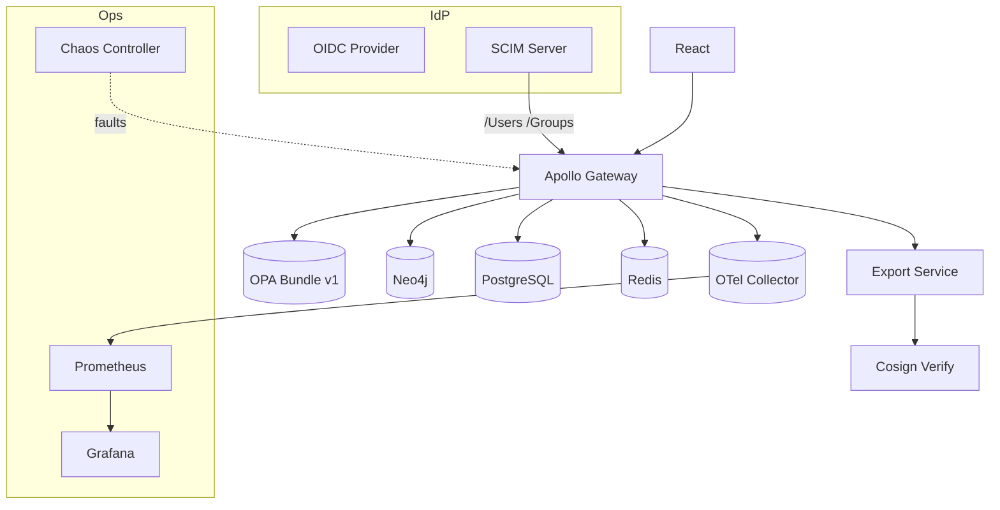

# IntelGraph · Maestro Conductor (MC)

# Workstream: SDLC Orchestration & Evidence

# Sprint: 2025‑10‑15 → 2025‑10‑29 (02)

> Mission: Evolve guardrails‑as‑code from Sprint‑01 into production‑ready controls; harden authz/authn; introduce schema governance, DR/residency overlays, export signing, SCIM/WebAuthn, and chaos/resiliency proof. Ship clean, green increments with evidence.

---

## Conductor Summary (One‑Screen)

**Goal.** Graduate the gateway slice to production‑grade: policy reasoner v1, schema registry + breaking‑change gates, SCIM provisioning, WebAuthn step‑up, export signing/verification, region sharding overlays, chaos tests, and cost/SLO burn dashboards with alerts.

**Assumptions.** Sprint‑01 artifacts merged: CI gates (SLO/cost/policy), k6 baseline, OTel dashboards, provenance ledger hooks.

**Non‑Goals.** Full analytics pipelines or complex multi‑connector ingest (beyond S3/HTTP). No UI polish.

**Constraints.** Same SLOs/cost guardrails; weekly staging, biweekly prod; default SaaS MT with optional ST‑DED.

**Risks.** WebAuthn UX friction; policy false‑positives blocking deploys; chaos tests revealing infra gaps; region data‑residency constraints.

**Definition of Done.**

- Schema registry + diff gates enforced on PRs.
- Policy Reasoner v1 (purpose, retention, license/TOS) rejecting non‑compliant ops.
- SCIM v2 `/Users` & `/Groups` working against OIDC IdP; WebAuthn step‑up enforced on export.
- Export signing + verification flows evidenced; region overlays applied; chaos suite green with backoff/rollback runbooks.

---

## Carryover / Dependencies

- Finalize k6 thresholds per service path (reads/writes/subscriptions).
- Confirm ledger entries appended for release v0.1.

---

## EPICS → Stories → Tasks (MoSCoW)

### EPIC G — Schema Governance & Contract Safety (Must)

**G1. GraphQL Schema Registry & Inspector**

- Stand up schema registry; store SDL per tag.
- Add `graphql-inspector` with breaking‑change checks on PR.  
  **Acceptance:** PR fails on BC; report artifact uploaded.

**G2. Persisted Query Catalog**

- Catalog + hash persisted queries; deny ad‑hoc in prod.  
  **Acceptance:** Gateway enforces allow‑list in prod.

### EPIC H — Policy Reasoner v1 (Must)

**H1. Policy Bundle & Tests**

- Consolidate OPA policies into versioned bundle; add unit tests and decision coverage.  
  **H2. Purpose/Retention Enforcement**
- Middleware annotates requests with purpose/authority; deny and emit decisionId.  
  **Acceptance:** Contract tests show deny on missing/invalid purpose; audit logs contain decisionId.

### EPIC I — Identity & Access (Must)

**I1. SCIM v2 Users/Groups**

- Implement `/scim/v2/Users` + `/Groups` with paging, filter, soft‑delete.  
  **I2. WebAuthn Step‑Up**
- Register/Authenticate flows; enforce for `export:*` and `crossTenant:*` actions.  
  **Acceptance:** E2E tests prove SCIM provisioning; WebAuthn required for exports.

### EPIC J — Export Integrity & Residency (Must)

**J1. Export Signing & Verify**

- Cosign detached sig + hash manifest; `ig-verify` CLI.  
  **J2. Region Sharding Overlays**
- Helm overlays for primary+read replicas and residency routing.  
  **Acceptance:** Signed export verified; region‑tagged tenants pinned to region.

### EPIC K — Resilience & Chaos (Should)

**K1. Fault Injection**

- Introduce pod kill, latency, DNS errors; verify graceful degradation and SLO protection.  
  **K2. Backpressure/Retry Policies**
- Token bucket tuning; exponential backoff; circuit breaker thresholds.  
  **Acceptance:** Chaos suite passes with SLOs preserved; no cross‑tenant leaks.

### EPIC L — Cost & SLO Ops (Should)

**L1. Cost Telemetry v1**

- Derive per‑route unit costs from traces; publish to Grafana.  
  **L2. Burn Alerts**
- Budget alerts wired (80%/90%); auto‑open issues on threat to guardrails.  
  **Acceptance:** Simulated surge triggers alert + issue.

### EPIC M — Runbooks, Evidence & Compliance (Must)

**M1. SOC2/NIST Control Mapping (seed)**

- Map CI gates, policy sim, access reviews to controls; store in `/evidence/controls.md`.  
  **M2. Release Evidence Bundle v0.2**
- Attach SBOM, policy, schema diffs, chaos, k6 stress/soak, Cosign attestations.  
  **Acceptance:** Tag v0.2 contains complete evidence bundle.

---

## Acceptance Criteria & Verification

1. **Schema Gate**: GraphQL diff CI step blocks BC. Artifact `reports/schema-diff.json` attached.
2. **Policy Reasoner**: Decision logs with `decisionId`, `tenantId`, `purpose`, `rule` fields. Coverage ≥ 85% for policy unit tests.
3. **SCIM**: CRUD + filter, pagination, deprovision flow; sync to OIDC claims.
4. **WebAuthn**: Step‑up required for protected mutations; Playwright tests validate challenge/response.
5. **Export**: `ig-verify` validates manifest+sig; audit trail recorded in ledger.
6. **Residency**: Requests from region‑tagged tenants never leave region in tests.
7. **Chaos**: Latency injection ≤ 500ms additional; p95 stays ≤ SLO; circuit breaker trips with graceful degradation.
8. **Cost/SLO**: Dashboards show per‑route cost; alerts fire and auto‑issue created.

---

## Architecture Deltas (Mermaid)



---

## APIs & Contracts (v0.2)

**SCIM (extract)**

```http
GET /scim/v2/Users?filter=userName eq "a@alpha.io"&startIndex=1&count=50
POST /scim/v2/Users
PATCH /scim/v2/Users/{id}
DELETE /scim/v2/Users/{id}  # soft delete + deprovision
```

**SCIM JSON (User extract)**

```json
{
  "schemas": ["urn:ietf:params:scim:schemas:core:2.0:User"],
  "userName": "a@alpha.io",
  "active": true,
  "name": { "givenName": "Ada", "familyName": "Alpha" },
  "urn:ig:tenant": "alpha",
  "groups": [{ "value": "analyst" }]
}
```

**WebAuthn (routes)**

```http
POST /webauthn/registration/options
POST /webauthn/registration/verify
POST /webauthn/authentication/options
POST /webauthn/authentication/verify
```

**Gateway AuthZ Decorator (example)**

```ts
@authz({ purpose: 'export', stepUp: true })
mutation exportAssets($ids:[ID!]!){ exportAssets(ids:$ids){ manifestSha sig } }
```

**Export Manifest (v0.2)**

```json
{
  "version": "0.2",
  "items": [{ "id": "asset-1", "sha256": "..." }],
  "createdBy": "user:alpha:a",
  "tenant": "alpha",
  "purpose": "investigation"
}
```

---

## Policy Reasoner (Rego v1 snippets)

```rego
package ig.purpose

# Require purpose alignment between actor and resource
allow_read { input.actor.purposes[_] == input.resource.purpose }

# Retention enforcement at write time
violation["retention-too-long"] {
  input.resource.pii
  not input.resource.retention in {"short-30d","legal-hold"}
}

# License/TOS compatibility for exports
violation["license-incompatible"] {
  input.action == "export"
  not compatible[input.resource.licenseClass][input.destination.tos]
}
```

---

## CI/CD Enhancements

**GitHub Actions — schema & policy gates**

```yaml
- name: GraphQL Inspector
  run: npx graphql-inspector diff schema.prev.graphql schema.next.graphql --format json > reports/schema-diff.json
- name: Policy Unit Tests
  run: opa test policies -v --format=json > reports/policy-tests.json
```

**Chaos Job (Litmus‑style, example)**

```yaml
apiVersion: litmuschaos.io/v1alpha1
kind: ChaosEngine
metadata: { name: gw-chaos-latency }
spec:
  engineState: active
  experiments:
    - name: pod-network-latency
      spec:
        probes:
          - name: p95-slo
            type: promProbe
            promProbe/totalQueries: 1
            promProbe/endpoint: http://prometheus:9090
            promProbe/query: histogram_quantile(0.95, sum(rate(http_req_duration_bucket[5m])) by (le)) < 0.35
```

**k6 Stress & Soak**

```js
export const options = {
  stages: [
    { duration: '5m', target: 100 },
    { duration: '10m', target: 200 },
    { duration: '15m', target: 0 },
  ],
  thresholds: { http_req_duration: ['p(95)<350', 'p(99)<900'] },
};
```

**Cost Telemetry Script (extract)**

```ts
// scripts/cost-from-traces.ts
// Derive unit cost per route from OTEL spans + infra price map
```

---

## Dashboards & Alerts

- **Dashboards:** Cost per route, policy decisions rate, WebAuthn success/fail, SCIM ops latency, export verify outcomes, residency routing.
- **Alerts:** Budget 80/90%; policy deny spike; WebAuthn failure > 2% for 10m; schema BC attempt on main; chaos probe failure; residency breach (should be zero).

---

## Runbooks (Delta)

- **WebAuthn Breakage:** Fall back to OTP for break‑glass (audited); rotate credentials; notify SecOps.
- **Schema BC:** Revert via `release/*` rollback; hotfix registry with previous SDL; communicate deprecation plan.
- **Residency Incident:** Quarantine tenant; snapshot audit; demonstrate routing proof; patch overlay.
- **Chaos Failure:** Pause rollout; analyze traces; adjust breaker thresholds; re‑run with narrower blast radius.

---

## Evidence Bundle (v0.2) — Contents

- `reports/schema-diff.json`, `reports/policy-tests.json`, `reports/chaos-results.json`, `reports/k6-stress.json`
- `sbom.spdx.json`, Cosign attestations, provenance ledger delta, Grafana dashboard JSON exports.

---

## Backlog & RACI (Sprint‑02)

- **Responsible:** MC, Platform Eng, SRE, SecOps, QA.
- **Accountable:** Head of Platform.
- **Consulted:** Legal/Privacy, FinOps.
- **Informed:** Workstream leads.

Tickets: `MC‑37..MC‑78`; blockers: IdP credentials for SCIM/WebAuthn demo; staging PROM rules for chaos probes.

---

## Next Steps (Kickoff)

- [ ] Enable schema gate on all repos with GraphQL.
- [ ] Integrate IdP sandbox for SCIM + WebAuthn.
- [ ] Wire export service + `ig-verify` CLI; demo signed export.
- [ ] Run first chaos experiment in staging; tune breakers.
- [ ] Cut `release/v0.2` with full evidence bundle.
