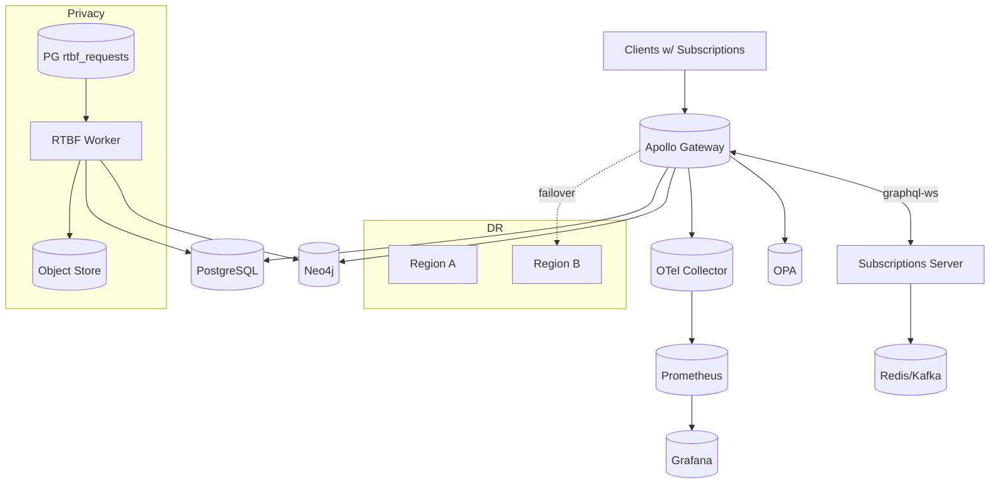

# IntelGraph · Maestro Conductor (MC)

# Workstream: SDLC Orchestration & Evidence

# Sprint: 2025‑10‑30 → 2025‑11‑13 (03)

> Mission: Move from “prod‑ready slice” to **GA‑ready platform controls**: multi‑region DR drills, realtime subscriptions at scale, privacy lifecycle (RTBF), phase‑next connectors, FinOps‑driven autoscaling, and formal GA readiness with deprecation/versioning. Ship clean, green, functional increments with evidence packs.

---

## Conductor Summary (One‑Screen)

**Goal.** Prove resilience and privacy at scale: enable subscriptions fan‑out with SLOs; complete RTBF data lifecycle across Neo4j/PG/objects; expand ingress (GCS/Azure/JDBC); execute DR drill; stand up FinOps/autoscaling with budgets; formalize versioning, deprecations, and GA checklist.

**Assumptions.** Sprint‑02 delivered schema gates, Policy Reasoner v1, SCIM/WebAuthn, export signing, region overlays, chaos suite green.

**Non‑Goals.** Advanced analytics (GDS algorithms beyond demo slice); complex UI polish.

**Constraints.** Org SLOs & cost guardrails; release cadence: weekly→staging, biweekly→prod; MT SaaS default with ST‑DED/air‑gapped variants.

**Risks.** Subscriptions load hot‑spots; RTBF fan‑out failures; connector cost spikes; DR drill downtime risk; versioning friction with clients.

**Definition of Done.**

- Realtime subscriptions deliver p95 server→client ≤ 250 ms under baseline load.
- RTBF (delete/minimize) proven across graph/relational/object stores with signed audit.
- New connectors (GCS/Azure/JDBC) shipped behind flags with cost/SLO gates.
- DR drill: RPO/RTO met; backout/restore documented; evidence attached.
- Versioning/deprecation policy enforced; GA readiness checklist complete.

---

## Carryover / Dependencies

- IdP creds for staged tenants (alpha/beta) with WebAuthn required for exports.
- Access to secondary region cluster for DR rehearsal.

---

## EPICS → Stories → Tasks (MoSCoW)

### EPIC N — Realtime Subscriptions & Fan‑Out (Must)

**N1. Subscriptions Transport**

- Adopt `graphql-ws` + Redis pub/sub (or Kafka) bridge; sticky sessions via cookie/ingress.  
  **Acceptance:** Basic `assetUpdated` works with backpressure.

**N2. Fan‑Out & Rate Controls**

- Token bucket per tenant + per topic; burst caps; server push buffers; queue depth metrics.  
  **Acceptance:** k6/ws tests hold p95 ≤ 250 ms for 95th percentile.

**N3. Observable Subscriptions**

- Emit spans for subscribe/unsubscribe/delivery; dashboards + error budgets.  
  **Acceptance:** Grafana shows fan‑out latency, drops, retries.

### EPIC O — Privacy Lifecycle & RTBF (Must)

**O1. Data Inventory & Tags**

- Expand schema with `dataClass`, `retentionTier`, `redactionPolicy` on entities/edges.  
  **O2. RTBF Pipeline**
- PG queue `rtbf_requests`; workers apply redact/delete across Neo4j/PG/object store; provenance entry per step.  
  **Acceptance:** E2E: submit RTBF; verify deletion/redaction + signed audit package.

**O3. DLP & Export Redaction**

- DLP regex/entity library; export pipeline applies redaction maps; policy verifies before signing.  
  **Acceptance:** Exports for PII default to `short-30d` and contain redacted fields.

### EPIC P — Connectors Phase‑Next (Should)

**P1. GCS/Azure Blobs**

- connector‑sdk enhancements; retention & license tagging at ingest; sampling for cost.  
  **P2. JDBC (Postgres/MySQL)**
- Pull with incremental keys + CDC fallback; dedupe; provenance attach.  
  **Acceptance:** Smoke ingest ≥ 50 MB/s/worker; provenance attached; cost per 1k rows ≤ target.

### EPIC Q — DR & Multi‑Region Ops (Must)

**Q1. DR Drill**

- Simulate region failover; recovery to RPO ≤ 5m, RTO ≤ 30m; reconcile ledger.  
  **Q2. Residency Guard**
- Canary tests assert tenant region stickiness across failover.  
  **Acceptance:** Drill evidence bundle with timings + dashboards.

### EPIC R — FinOps & Autoscaling (Should)

**R1. KEDA/HPA Policies**

- Scale on queue depth/lag and OTEL span rates; protect budgets with max caps.  
  **R2. Unit Cost Surfacing**
- Per‑route and per‑connector costs to dashboards; alerts at 80/90%.  
  **Acceptance:** Load test triggers scale‑out without exceeding budget caps.

### EPIC S — Versioning, Deprecations & GA Readiness (Must)

**S1. API Versioning Policy**

- GraphQL deprecation timeline; persisted query version headers; cypher/sql migration versioning.  
  **S2. GA Checklist & UAT**
- UAT for alpha/beta tenants; exit criteria; rollback and comms templates.  
  **Acceptance:** GA checklist signed; deprecations announced with dates.

---

## Acceptance Criteria & Verification

1. **Subscriptions SLO:** p95 server→client ≤ 250 ms at baseline 1k msgs/s/tenant; drop rate < 0.1%; retries exponential backoff.
2. **RTBF:** E2E test confirms delete/redact across stores in ≤ 24h; audit ledger contains hash chain; export redactions applied.
3. **Connectors:** Throughput/latency/cost targets hit; policy bundles enforce purpose/retention/licensing at ingest.
4. **DR:** Documented RPO/RTO met; provenance ledger reconciled; no residency violations.
5. **FinOps:** Autoscaling limits respected; alerts and auto‑issue creation on budget threat.
6. **Versioning:** Schema diff gates enforce deprecation windows; persisted queries require version tag in prod.

---

## Architecture Deltas (Mermaid)



---

## Schemas & Queues

**Postgres: RTBF queue**

```sql
CREATE TABLE IF NOT EXISTS rtbf_requests (
  id UUID PRIMARY KEY DEFAULT gen_random_uuid(),
  subject_id TEXT NOT NULL,
  tenant_id TEXT NOT NULL,
  scope TEXT NOT NULL, -- delete|minimize
  status TEXT NOT NULL DEFAULT 'queued',
  requested_at TIMESTAMPTZ NOT NULL DEFAULT now(),
  completed_at TIMESTAMPTZ,
  audit JSONB DEFAULT '{}'::jsonb
);
```

**GraphQL: Subscriptions slice**

```graphql
type Subscription {
  assetUpdated(tenantId: ID!, id: ID!): Asset
}
```

**OPA (privacy slice)**

```rego
package ig.privacy

# Block export when DLP hit unless legal-hold
violation["dlp-hit"] { input.action == "export"; input.resource.dlp == true; not input.legal_hold }

# RTBF must be honored within SLA
breach["rtbf-sla"] { now := time.now_ns(); (now - input.rtbf.requested_at) > 24 * 60 * 60 * 1e9 }
```

---

## Implementation Scaffolds

**Subscriptions Server (extract)**

```ts
import { WebSocketServer } from 'ws';
import { useServer } from 'graphql-ws/lib/use/ws';
import { schema } from './schema';
import { pubsub } from './pubsub';

const wss = new WebSocketServer({ noServer: true });
useServer({ schema, onConnect: (ctx) => authz(ctx) }, wss);
export function publishAssetUpdated(
  tenantId: string,
  id: string,
  payload: any,
) {
  pubsub.publish(`asset:${tenantId}:${id}`, payload);
}
```

**Redis/Kafka PubSub (extract)**

```ts
// pubsub.ts
import { Redis } from 'ioredis';
const sub = new Redis(process.env.REDIS_URL);
const pub = new Redis(process.env.REDIS_URL);
export const pubsub = {
  publish: (ch: string, msg: any) => pub.publish(ch, JSON.stringify(msg)),
  subscribe: (ch: string, cb: (m: any) => void) => {
    const r = new Redis(process.env.REDIS_URL);
    r.subscribe(ch);
    r.on('message', (_, m) => cb(JSON.parse(m)));
    return r;
  },
};
```

**RTBF Worker (extract)**

```ts
// workers/rtbf.ts
async function handle(req) {
  await redactNeo4j(req);
  await redactPostgres(req);
  await purgeObjects(req);
  await ledgerAppend({
    action: 'rtbf',
    subject: req.subject_id,
    tenant: req.tenant_id,
  });
}
```

**k6 WebSocket Test (extract)**

```js
import ws from 'k6/ws';
import { check } from 'k6';
export default function () {
  const url = __ENV.WS_URL;
  const res = ws.connect(url, {}, function (socket) {
    socket.on('open', () =>
      socket.send(
        JSON.stringify({
          type: 'subscribe',
          query: 'subscription{ assetUpdated(tenantId:"alpha", id:"1"){ id } }',
        }),
      ),
    );
    socket.on('message', (data) => {
      socket.close();
    });
  });
  check(res, { 'status 101': (r) => r && r.status === 101 });
}
```

**Helm/KEDA (extract)**

```yaml
apiVersion: keda.sh/v1alpha1
kind: ScaledObject
metadata: { name: subs-scaled }
spec:
  scaleTargetRef: { name: subs-server }
  triggers:
    - type: redis
      metadata: { address: REDIS_ADDR, listName: events, listLength: '1000' }
  minReplicaCount: 2
  maxReplicaCount: 20
```

---

## DR Drill Plan & Evidence Template

**Plan:** announce window, warm standby promotion, DNS cutover, data reconciliation, rollback gates, comms.  
**Metrics:** promotion time, replication lag, error rates, SLOs, residency proofs.  
**Evidence Bundle:** `dr/plan.md`, `dr/timings.json`, Grafana exports, ledger reconciliation report.

---

## Cost & Autoscaling

- Price map (env vars) → unit cost computations from traces.
- Caps per namespace; scale‑to‑zero for idle connectors.
- Alerts auto‑open `MC‑COST` issues with span links.

---

## GA Readiness Checklist (extract)

- [ ] SLO/SLA achievements documented for 30 days.
- [ ] Security review sign‑off (OPA bundle v1, WebAuthn, SCIM, export signing).
- [ ] Privacy lifecycle (RTBF) drill passed with evidence.
- [ ] DR drill passed; RPO/RTO met.
- [ ] Deprecation notices published (dates, migration guides).
- [ ] Observability runbooks and on‑call rotations confirmed.

---

## Runbooks (Delta)

- **Subscriptions Hot‑Spot:** throttle publisher; shard topics; raise buffer; observe queue depth.
- **RTBF Backlog:** raise workers; prioritize legal‑hold; notify DPO; extend SLA comms.
- **Connector Cost Spike:** lower parallelism; enable sampling; pause ingestion via feature flag.

---

## Evidence Bundle (v0.3) — Contents

- k6/ws: `reports/subs-latency.json`, drops/retries.
- RTBF: request log, audit chain, before/after proofs (hashes).
- Connectors: throughput & cost reports.
- DR: timings & dashboards.
- Grafana JSON for cost/SLO panels.
- Signed SBOM & provenance deltas.

---

## Backlog & RACI (Sprint‑03)

- **Responsible:** MC, Platform Eng, SRE, SecOps, Data Eng, QA.
- **Accountable:** Head of Platform.
- **Consulted:** Legal/Privacy (RTBF/DLP), FinOps.
- **Informed:** Workstream leads.

Tickets: `MC‑79..MC‑124`; dependencies: Redis/Kafka cluster, secondary region access, DLP patterns.

---

## Next Steps (Kickoff)

- [ ] Stand up subscriptions server behind feature flag.
- [ ] Implement RTBF queue + worker; wire to policy + ledger.
- [ ] Add GCS/Azure/JDBC connectors (feature‑flagged).
- [ ] Schedule DR rehearsal; dry‑run playbook.
- [ ] Enable KEDA autoscaling; link cost dashboards; cut `release/v0.3` with evidence.
