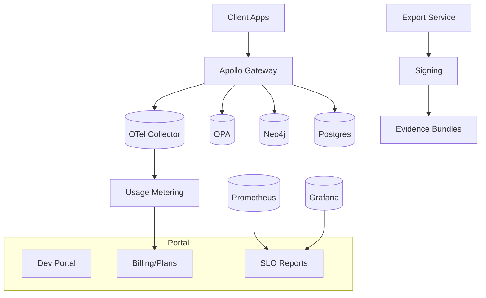

# IntelGraph · Maestro Conductor (MC)
# Workstream: SDLC Orchestration & Evidence
# Sprint: 2025‑11‑14 → 2025‑11‑28 (04)

> Mission: Convert GA‑readiness into **GA launch operations**: finalize 1.0 contracts, close compliance actions, enable tenant‑aware billing & quotas, formalize change management, and run game‑day validation. Ship clean, green, auditable 1.0 with customer onboarding and enablement kits.

---

## Conductor Summary (One‑Screen)
**Goal.** Ship v1.0 with: signed API/DPAs, customer‑visible SLO reports, tenant billing + quotas, stable connectors, RTBF/Residency attestations, DR playbook exercised, developer portal + SDKs, and a hardened release pipeline with promotion evidence.

**Assumptions.** Sprint‑03 delivered subs SLOs, RTBF lifecycle, connectors (flag‑on), DR drill, autoscaling, versioning policy.

**Non‑Goals.** New analytics features; major UI redesign.

**Constraints.** Org SLOs/cost guardrails; two‑week cadence; SaaS MT with ST‑DED/air‑gapped variants.

**Risks.** Billing accuracy; data residency edge cases; connector cost spikes; rollout friction on deprecations.

**Definition of Done.**
- v1.0 tag promoted to prod with full **Evidence Bundle**.
- Billing & quotas enforced per tenant; FinOps dashboards match invoices.
- DPA/Privacy pack + Residency/RTBF attestation bundles published.
- Developer portal live with SDKs, persisted queries catalog, and copy‑paste examples.
- Game‑day executed; incident comms and recovery timings recorded.

---

## Carryover / Dependencies
- Legal sign‑off on DPA/ToS deltas.  
- IdP production tenants configured (alpha/beta).  
- Finance mapping for unit costs → price plan.

---

## EPICS → Stories → Tasks (MoSCoW)

### EPIC T — GA Release & Change Management (Must)
**T1. Release Governance v1**  
- `release/v1.0` branch protections; change request template; CAB sign‑off recorded.  
**Acceptance:** All prod deploys reference approved change tickets.

**T2. Promotion Pipeline**  
- Staging → canary → full; automated rollout checks; rollback gates tied to SLOs/error budgets.  
**Acceptance:** Promotion emits signed provenance; rollback rehearsed.

**T3. Customer‑Visible SLO Reports**  
- Monthly reports: availability, latency, incidents; downloadable from portal.  
**Acceptance:** Report generated from Prom/Grafana APIs and signed.

### EPIC U — Billing, Quotas & Plans (Must)
**U1. Usage Metering**  
- Derive billable metrics from OTEL spans (GraphQL calls, ingest events, storage GB).  
**U2. Plans & Quotas**  
- Plan catalog (Starter/Pro/Enterprise), quota enforcement (QPS, events/s, storage).  
**U3. Invoicing & Reconciliation**  
- Export invoices (CSV/JSON) with hash manifest; FinOps dashboard parity checks.  
**Acceptance:** Tenant hit quota → graceful limit; invoice matches dashboard within 1%.

### EPIC V — Compliance & Privacy Evidence (Must)
**V1. DPA/DPoA Pack**  
- DPIA checklist, RTBF SLA proof, export signing flow, incident response SLAs.  
**V2. Residency Attestations**  
- Signed statements with routing proofs; region logs; DR drill evidence.  
**V3. Access Reviews & SCIM**  
- Quarterly access review job; SCIM deprovision report.  
**Acceptance:** Evidence bundle `compliance/v1.0/` complete and signed.

### EPIC W — Developer Experience & SDKs (Should)
**W1. Developer Portal**  
- Docs site with OpenAPI/GraphQL SDL, quickstarts, persisted query catalog, example apps.  
**W2. SDKs**  
- JS/TS and Python SDKs with auth helpers, retry/backoff, tracing.  
**W3. Samples**  
- Minimal apps: Node/Apollo client; React dashboard; Python ingest notebook.  
**Acceptance:** Hello‑Tenant quickstart completes in <10 minutes.

### EPIC X — Connector Hardening (Should)
**X1. Connector SLA & Retries**  
- Backoff, idempotency keys, poison‑queue handling.  
**X2. Cost Guardrails**  
- Sampling, parallelism caps, budget alerts.  
**Acceptance:** 24h soak without error budget breaches; unit cost within targets.

### EPIC Y — Game‑Day & Incident Mgmt (Must)
**Y1. Scenario Design**  
- Subscriptions surge, connector lag, DB failover, OPA denial spike.  
**Y2. Execute Game‑Day**  
- Pager on‑call, comms templates, status page updates, MTTR metrics.  
**Acceptance:** MTTR ≤ 15m simulated; comms & postmortem published.

---

## Acceptance Criteria & Verification
1) **v1.0 Release:** Cosign‑signed SBOM, provenance, policy bundle, schema diffs, k6/chaos/soak, DR & privacy packs.  
2) **Billing/Quotas:** Accurate metering; enforcement with user‑friendly errors; dashboards align with invoices.  
3) **Compliance:** DPA/DPIA artifacts; residency proofs; SCIM access review logs.  
4) **DevEx:** Portal + SDKs; quickstart success rate ≥ 95% in pilot.  
5) **Operations:** Game‑day runbook followed; MTTR/MTTA captured; alert noise ≤ target.

---

## Architecture Deltas (Mermaid)


---

## Schemas & Models
**Billing Tables (PG)**
```sql
CREATE TABLE IF NOT EXISTS plans (
  id TEXT PRIMARY KEY,
  name TEXT NOT NULL,
  limits JSONB NOT NULL, -- { qps: 50, events_s: 1000, storage_gb: 200 }
  price_map JSONB NOT NULL -- { gql_per_million: 2, ingest_per_k: 0.1 }
);
CREATE TABLE IF NOT EXISTS tenant_plan (
  tenant_id TEXT PRIMARY KEY,
  plan_id TEXT NOT NULL REFERENCES plans(id),
  effective_at TIMESTAMPTZ NOT NULL DEFAULT now()
);
CREATE TABLE IF NOT EXISTS usage_rollup (
  tenant_id TEXT,
  window_start TIMESTAMPTZ,
  metric TEXT, -- gql_calls, ingest_events, storage_gb
  value NUMERIC,
  PRIMARY KEY (tenant_id, window_start, metric)
);
CREATE TABLE IF NOT EXISTS invoices (
  id UUID PRIMARY KEY DEFAULT gen_random_uuid(),
  tenant_id TEXT,
  period_start DATE,
  period_end DATE,
  totals JSONB,
  manifest_sha CHAR(64),
  created_at TIMESTAMPTZ DEFAULT now()
);
```

**Quota Enforcement (config)**
```yaml
quotas:
  default:
    gql_qps: 50
    ingest_eps: 1000
    storage_gb: 200
  enterprise:
    gql_qps: 200
    ingest_eps: 5000
    storage_gb: 2000
```

**SLO Report JSON (public)**
```json
{
  "period":"2025-10",
  "api_availability":99.93,
  "query_p95_ms":320,
  "write_p95_ms":640,
  "subs_p95_ms":210,
  "incidents":[{"id":"INC-123","downtime_min":12,"summary":"Ingress flaps"}]
}
```

---

## Implementation Scaffolds
**Usage Metering Extractor (TS)**
```ts
// scripts/usage-extract.ts
// read OTEL traces -> roll up usage_rollup by tenant & metric
```

**Quota Middleware (Express)**
```ts
import Limiter from 'rate-limiter-flexible';
const perTenant = new Limiter.RateLimiterMemory({ points: 50, duration: 1 });
export async function quota(req,res,next){
  try { await perTenant.consume(req.tenant.id); next(); }
  catch { res.status(429).json({ error: 'quota_exceeded', retryAfter: 1 }); }
}
```

**Invoice Generator (Node)**
```ts
// scripts/invoice-generate.ts -> reads usage_rollup + plan.price_map -> writes invoices row + manifest
```

**Dev Portal (docs structure)**
```
/docs
  /quickstarts
  /api
  /sdks
  /guides
```

**Status Page & Comms**
- Templates for incident updates, RCAs, and maintenance windows under `/comms/`.

---

## CI/CD & Quality Gates (v1.0)
- Schema diff + deprecation window checks.  
- Policy coverage ≥ 90%; failing policies block deploy.  
- k6 stress + soak; chaos nets; subscriptions latency checks.  
- Evidence upload step (SBOM, reports, manifests, attestations) mandatory.

---

## Game‑Day Plan (extract)
- **Scenarios:** API surge, connector backlog, Neo4j leader failover, OPA deny spike, Redis stall.  
- **KPIs:** MTTA, MTTR, error budget spent, comms latency, customer impact.  
- **Artifacts:** timeline.json, dashboards exports, pager transcripts, postmortem.md.

---

## Compliance Pack Contents
- DPIA, DPA addendum, access review logs, RTBF proofs, residency routes, export signatures, changelog of policies, SOC2 mapping.

---

## Evidence Bundle (v1.0)
- `sbom.spdx.json`, Cosign attestations, provenance.json, schema‑diff.json, k6/chaos/soak results, SLO report, DR evidence, privacy pack, invoices & manifest.

---

## Backlog & RACI (Sprint‑04)
- **Responsible:** MC, Platform Eng, SRE, SecOps, QA, FinOps, Legal/Privacy, Docs.  
- **Accountable:** Head of Platform.  
- **Consulted:** Sales/CS (onboarding), Product (plans), Finance.  
- **Informed:** Workstream leads.

Tickets: `MC‑125..MC‑176`; dependencies: price map, IdP prod tenants, status page DNS.

---

## Next Steps (Kickoff)
- [ ] Lock release branch `release/v1.0`; seed CAB record.  
- [ ] Turn on metering/ quotas in staging; validate parity with dashboards.  
- [ ] Publish Dev Portal + SDKs; run quickstart UX test.  
- [ ] Generate October SLO report; sign & publish.  
- [ ] Schedule game‑day; run and publish RCA; promote v1.0 with full evidence.

