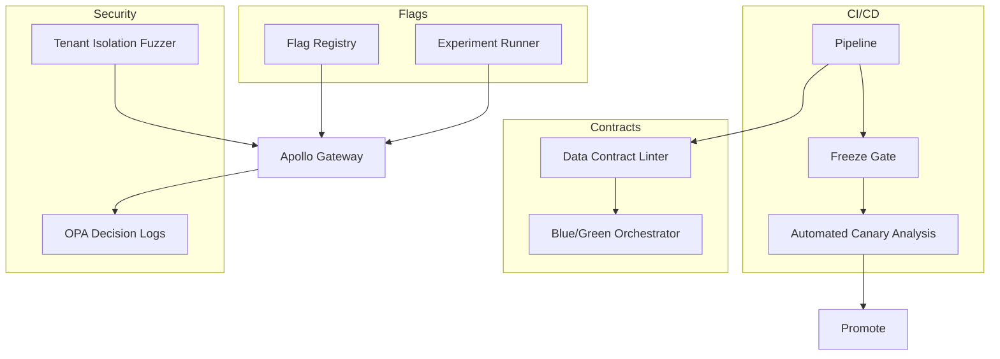

# IntelGraph · Maestro Conductor (MC)

# Workstream: SDLC Orchestration & Evidence

# Sprint: 2025‑12‑14 → 2025‑12‑28 (06)

> Mission: Post‑GA **scale & safety**. Institutionalize change‑freeze discipline, strengthen multi‑tenant isolation via fuzz/chaos, add automated canary analysis, formalize data contracts & blue/green migrations, extend feature‑flag governance, and publish Q1 capacity & roadmap backed by evidence.

---

## Conductor Summary (One‑Screen)

**Goal.** Make production changes safer and cheaper: holiday change‑freeze with carve‑outs; automated canary analysis; schema & data contract enforcement with blue/green; tenant isolation fuzz tests; feature flag governance & experimentation; capacity plan & SLO debt review with remediation backlog.

**Assumptions.** v1.1 stabilization in place (variance ↓, SOC2 pack seeded, onboarding CLI, budget predictor, cache layer).

**Non‑Goals.** New product surfaces; entirely new connectors; deep UI changes.

**Constraints.** Org SLOs & cost guardrails; holiday freeze windows; MT SaaS default + ST‑DED variants.

**Risks.** Freeze carve‑outs misused; canary false negatives; contract tests flakiness; fuzz tests creating noisy alerts.

**Definition of Done.**

- Holiday freeze policy enacted; audit shows compliant deploys.
- Automated Canary Analysis (ACA) gates promotion with statistical confidence.
- Data contracts + blue/green migration framework live and used by 1 change.
- Isolation fuzz tests run nightly; zero cross‑tenant leaks detected.
- Feature flag registry + guardrails live; experiment results auto‑reported.
- Q1 capacity & cost plan approved with error‑budget policy.

---

## Carryover / Dependencies

- Access to staging/prod metrics for ACA.
- Schema owners sign‑off for contract test definitions.
- Legal/Privacy review for experiment metadata.

---

## EPICS → Stories → Tasks (MoSCoW)

### EPIC AF — Change Freeze & Governance (Must)

**AF1. Holiday Freeze Policy**

- Define freeze calendar & carve‑outs (security, P0 fixes).
- GitHub rule: require `FREEZE‑APPROVED` label + CAB ticket to merge to `main`.  
  **Acceptance:** All prod deploys during window have CAB record & label; audit report exported.

**AF2. Release Templates & Comms**

- Templates for freeze notifications, exceptions, and rollback comms.  
  **Acceptance:** Comms artifacts stored in `/comms/freeze/` and referenced by releases.

### EPIC AG — Automated Canary Analysis (Must)

**AG1. Metrics Contract**

- Define ACA key metrics: p50/p95/p99, error rate, CPU/mem, drops, cost/unit.  
  **AG2. ACA Engine**
- Compare canary vs baseline using non‑parametric tests; compute score; block/allow.  
  **Acceptance:** Promotion blocked when ACA score < threshold; artifact stored.

### EPIC AH — Data Contracts & Blue/Green (Must)

**AH1. Contract Spec**

- YAML schema for entities, fields, SLAs, retention, purpose tags, and compatibility rules.  
  **AH2. Blue/Green Migration Framework**
- Dual‑write, shadow‑read, cutover, backout; provenance logged.  
  **Acceptance:** One real change executed via framework with green cutover.

### EPIC AI — Tenant Isolation Fuzzing (Must)

**AI1. Fuzz Inputs**

- Randomized JWT claims, purpose tags, query shapes, cursor abuse, N+1 probes.  
  **AI2. Decision Observability**
- Correlate deny reasons, rule hits, and potential leaks.  
  **Acceptance:** Nightly fuzz run; zero confirmed leak; issues opened for any suspicious patterns.

### EPIC AJ — Feature Flag Governance & Experimentation (Should)

**AJ1. Flag Registry**

- Central manifest: owner, scope, expiry, kill‑switch, audit trail.  
  **AJ2. Experimentation**
- Guardrails: sample caps, SLO guard, PII rules; auto end/cleanup.  
  **Acceptance:** All new flags registered; experiments publish signed reports.

### EPIC AK — Capacity Planning & SLO Debt (Should)

**AK1. Q1 Capacity Plan**

- Forecast per‑service CPU/mem/IO, data growth, message rates; budget mapping.  
  **AK2. SLO Debt Burn‑Down**
- Identify chronic tail regressions, noisy alerts, slow paths; schedule remediation backlog.  
  **Acceptance:** Plan approved; debt backlog prioritized & slotted.

---

## Acceptance Criteria & Verification

1. **Freeze governance**: CI checks prevent non‑approved merges to `main` during freeze; audit JSON lists all exceptions with CAB IDs.
2. **ACA**: Mann‑Whitney U or KS tests detect degradations; score ≥ 0.9 required; gate blocks with rationale artifact.
3. **Contracts**: `contracts/*.yaml` linted; breaking change CI step blocks; blue/green run produces ledger entries & cutover timings.
4. **Isolation fuzzing**: ≥ 10k randomized requests/night; zero cross‑tenant data in responses; OPA deny reasons tracked; alerts on anomaly.
5. **Flags/Experiments**: All flags have owner/expiry; experiments auto‑stop at SLO breach; signed result JSONs.
6. **Capacity/SLO**: Plan doc + dashboards; approval recorded; remediation epics created.

---

## Architecture Deltas (Mermaid)



---

## Specs & Schemas

**Data Contract (YAML) example**

```yaml
entity: Asset
version: 2
compatibility: backward
fields:
  - name: id
    type: string
    required: true
  - name: pii
    type: boolean
    required: false
retention: short-30d
purpose: investigation
sla:
  read_p95_ms: 300
  write_p95_ms: 700
```

**Flag Registry (YAML)**

```yaml
flags:
  - key: subs.optimizedBuffer
    owner: platform-eng
    scope: tenant
    expires: 2026-03-31
    killswitch: true
    risk: low
```

**Freeze Window (config)**

```yaml
freeze:
  start: 2025-12-18T00:00:00Z
  end: 2025-12-27T23:59:59Z
  exceptions: [security, p0-fix]
```

---

## Implementation Scaffolds

**Freeze GitHub Action**

```yaml
- name: Enforce Freeze
  if: github.ref == 'refs/heads/main'
  run: node scripts/freeze-enforce.js --config freeze.yaml --labels "${{ toJson(github.event.pull_request.labels) }}"
```

**ACA Engine (Node, extract)**

```ts
// scripts/aca-score.ts
// compute KS/MWU tests on canary vs baseline metrics; output score & fail reasons
```

**Contract Lint & Breakage Gate**

```yaml
- name: Contract Lint
  run: npx ig-contracts lint contracts/**/*.yaml > reports/contracts.json
- name: Contract Breakage
  run: npx ig-contracts diff contracts/prev contracts/next --fail-on-breaking
```

**Blue/Green Orchestrator (TS extract)**

```ts
// dual write; shadow read; cutover after ACA green; backout on SLO breach
```

**Isolation Fuzzer (k6 + JS)**

```js
// tests/fuzz/isolation.k6.js
// Random JWTs, purposes, queries; assert 403/401 as expected; diff response tenants
```

**Flag Middleware (Express)**

```ts
export function withFlag(key: string) {
  return (req, res, next) => (req.flags[key] ? next() : res.status(404).end());
}
```

**Experiment Result Manifest**

```json
{
  "exp": "subs-buffer",
  "owner": "platform-eng",
  "start": "2025-12-16",
  "end": "2025-12-20",
  "effect": { "p95_ms": -8.3, "error_rate": -0.02 },
  "signed": "sha256:..."
}
```

---

## Dashboards & Alerts

- **Dashboards:** ACA score timelines; canary vs baseline overlays; contract change history; fuzz deny reasons; flag usage; experiment outcomes; freeze compliance.
- **Alerts:** ACA score < 0.9; contract breakage attempts; fuzz anomaly rate > 0.1%; flag past expiry; unauthorized prod deploy during freeze.

---

## Runbooks (Delta)

- **Freeze Exception:** CAB approval → label PR → limited canary → ACA pass → promote; otherwise block.
- **ACA Fail:** Auto‑rollback, open incident, attach ACA report, schedule root‑cause.
- **Contract Breakage:** Initiate deprecation path; communicate timelines; provide migration script.
- **Fuzz Leak Suspect:** Quarantine logs; reproduce; add policy; create hotfix.

---

## Evidence Bundle (v1.2)

- Freeze audit JSON, ACA reports, contract diffs, blue/green cutover timelines, fuzz run logs, flag registry snapshot, experiment manifests, Cosign attestations & SBOM deltas.

---

## Backlog & RACI (Sprint‑06)

- **Responsible:** MC, Platform Eng, SRE, SecOps, QA, Legal/Privacy.
- **Accountable:** Head of Platform.
- **Consulted:** FinOps (capacity), Product (flags/experiments).
- **Informed:** Workstream leads.

Tickets: `MC‑231..MC‑284`; dependencies: metric access, CAB setup, contract owners.

---

## Next Steps (Kickoff)

- [ ] Merge freeze policy + CI enforcement.
- [ ] Land ACA engine & wire to promotion job.
- [ ] Add first data contract; execute one blue/green cutover.
- [ ] Enable nightly isolation fuzz runs; triage findings.
- [ ] Stand up flag registry & experiment guardrails.
- [ ] Publish Q1 capacity plan + SLO debt backlog and get approvals.
