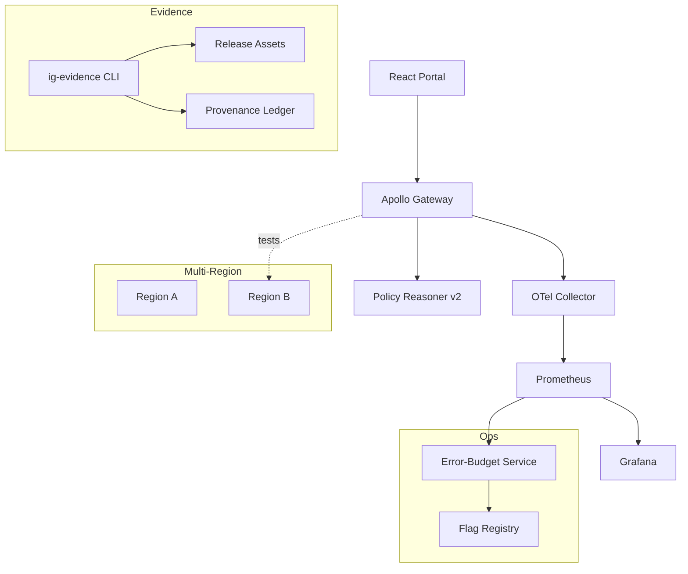

# IntelGraph · Maestro Conductor (MC)
# Workstream: SDLC Orchestration & Evidence
# Sprint: 2025‑12‑29 → 2026‑01‑12 (07)

> Mission: Q1 kickoff — raise assurance and autonomy. Evolve guardrails‑as‑code into **self‑service governance**: policy reasoner v2 with contextual ABAC, automated evidence packs, audit portal, error‑budget automation, blue/green migrations at scale, and multi‑region readiness tests. Ship clean, green, reproducible increments that lower ops toil and audit friction.

---

## Conductor Summary (One‑Screen)
**Goal.** Convert MC controls into productized capabilities: 1) Policy Reasoner v2 (contextual, explainable decisions), 2) Evidence Generator that assembles SOC2/RTBF/DR artifacts per release, 3) Audit Portal MVP, 4) Error‑Budget Automation that throttles risky features, 5) Multi‑region readiness tests baked into CI, 6) Migration Orchestrator v1 for batch blue/green changes.

**Assumptions.** Holiday freeze concluded per Sprint‑06; ACA is wired; data contracts exist; isolation fuzz runs nightly.

**Non‑Goals.** Building a full GRC suite; new customer‑facing UI beyond the Audit Portal MVP.

**Constraints.** Org SLOs & cost guardrails; SaaS MT + ST‑DED + Black‑Cell variants; canary/rollback required.

**Risks.** Policy v2 false‑positives; evidence generation gaps; audit portal scope creep; migration load on databases.

**Definition of Done.**
- Policy Reasoner v2 in prod with decision explanations and coverage ≥ 90%.
- `ig-evidence` tool produces signed evidence bundles on each release.
- Audit Portal MVP read‑only with tenant‑scoped views and download controls.
- Error‑budget automation live (feature throttles when burn > threshold).
- Multi‑region tests in CI pass (failover sim + residency proofs).
- Migration Orchestrator v1 executes one real blue/green batch with backout.

---

## Carryover / Dependencies
- Access to Prom/Grafana APIs and provenance ledger for evidence generation.  
- Legal sign‑off on audit portal artifact exposure.  
- Read replica in secondary region available for readiness tests.

---

## EPICS → Stories → Tasks (MoSCoW)

### EPIC AL — Policy Reasoner v2 (Must)
**AL1. Contextual ABAC**  
- Ingest context (time, network zone, device trust, session risk score).  
- Extend Rego: conditional allowances, step‑up triggers.  
**AL2. Explanations & IDs**  
- Standardize `decisionId`, `ruleId`, `explanation`; emit as trace attrs and response headers (masked).  
**AL3. Coverage & Golden Cases**  
- Unit tests for common scenarios + fuzz corpus; coverage ≥ 90% lines/decisions.  
**Acceptance:** Playwright + contract tests prove allow/deny + explanation correctness.

### EPIC AM — Evidence Generator & Provenance (Must)
**AM1. `ig-evidence` CLI**  
- Aggregate SBOM, cosign attestations, schema diffs, k6/chaos/ACA reports, DR/RTBF logs, residency proofs, SLO report; write manifest.json + signature.  
**AM2. CI Integration**  
- Post‑tag job builds evidence bundle; uploads to release; verifies signature.  
**Acceptance:** v1.2.1 release attaches a complete, signed evidence bundle.

### EPIC AN — Audit Portal MVP (Must)
**AN1. Read‑Only Portal**  
- Tenant‑scoped access via OIDC; RBAC for auditor vs admin.  
**AN2. Artifact Catalog**  
- Browse/download signed artifacts (timeboxed links; watermark).  
**AN3. Access Logs**  
- Every view/download logged to ledger with hash; export as CSV/JSON.  
**Acceptance:** Auditor can retrieve full evidence of the last release without backend access.

### EPIC AO — Error‑Budget Automation (Should)
**AO1. Burn Calculator v2**  
- Compute monthly/weekly burn per SLO; expose as API + dashboard.  
**AO2. Auto‑Throttles**  
- Tie burn to feature flags: rate‑limit subs/connectors; pause experiments automatically.  
**Acceptance:** Simulated burn > 20% triggers throttle; rollback when burn < 10%.

### EPIC AP — Multi‑Region Readiness in CI (Must)
**AP1. Simulated Failover Test**  
- CI job runs read‑replica failover sim via ephemeral env; verify RPO/RTO assertions.  
**AP2. Residency Assertions**  
- Probes ensure region‑tagged tenants do not cross region during test.  
**Acceptance:** CI green with timings & proofs attached to artifacts.

### EPIC AQ — Migration Orchestrator v1 (Should)
**AQ1. Batch Blue/Green**  
- Coordinated dual‑write and shadow‑read for N entities; progress tracking; partial backout.  
**AQ2. Safety Gates**  
- Pre‑flight checks (load, storage, SLO headroom); ACA after cutover.  
**Acceptance:** One production change executed with measured impact and backout plan.

---

## Acceptance Criteria & Verification
1) **Policy v2**: Deny/allow explanations surfaced; decision coverage ≥ 90%; latency overhead ≤ 5ms p95.  
2) **Evidence**: `ig-evidence` output deterministic; cosign verifies; manifests include hash chain to ledger.  
3) **Audit Portal**: OIDC + RBAC; downloads watermarked; access logs present; rate‑limited.  
4) **Error‑Budget**: Burn > threshold triggers automated throttles; dashboards reflect state; incidents auto‑open.  
5) **Multi‑Region**: CI artifacts show RPO/RTO metrics; residency checks pass.  
6) **Migration**: Cutover time, error rate, and ACA score recorded; backout validated.

---

## Architecture (Mermaid)


---

## Specs & Schemas
**Decision Log (JSON)**
```json
{ "decisionId":"dec_abc123","ruleId":"ig.purpose.allow_read","result":"deny","explanation":"tenant or purpose mismatch","tenant":"alpha","purpose":"investigation","ts":"2026-01-03T12:00:00Z" }
```

**Evidence Manifest (JSON)**
```json
{ "release":"v1.2.1","artifacts":[{"name":"sbom.spdx.json","sha256":"..."},{"name":"schema-diff.json","sha256":"..."}],"provenance":"sha256:...","signature":"cosign:..." }
```

**Burn API (OpenAPI fragment)**
```yaml
/get-burn:
  get:
    summary: Current error-budget burn by service
    responses:
      '200': { description: OK }
```

**Migration Plan YAML**
```yaml
change: add-asset-index-v3
scope: assets
strategy: blue-green
checks: [slo-headroom, disk-space, aca]
backout: revert-index-v2
```

---

## Implementation Scaffolds
**Policy v2 — Rego (extract)**
```rego
package ig.ctx

import future.keywords.if

default allow := false

allow if {
  input.actor.tenant == input.resource.tenant
  input.actor.purposes[_] == input.resource.purpose
  not high_risk_device
}

high_risk_device if {
  input.context.device_trust == "low"
  input.action == "export"
}

explanation[msg] {
  not allow
  msg := "tenant or purpose mismatch or high-risk device"
}
```

**Gateway Header for Explanations**
```ts
res.setHeader('X-IG-Decision-Id', decisionId)
res.setHeader('X-IG-Rule-Id', ruleId)
```

**`ig-evidence` CLI (Node skeleton)**
```ts
#!/usr/bin/env node
// Collect artifacts -> hash -> manifest -> cosign sign -> upload
```

**Audit Portal (routes)**
```http
GET /audit/artifacts?release=v1.2.1
GET /audit/download/{artifactId}
GET /audit/access-logs?release=v1.2.1
```

**Burn → Flag hook (pseudo)**
```ts
if (burn.service('gateway').month() > 0.2) flags.set('subs.optimizedBuffer', false)
```

**CI: Multi-Region Test (YAML)**
```yaml
- name: Multi-Region Readiness
  run: node scripts/region-test.js --simulate-failover --assert-rpo 300 --assert-rto 1800
```

**Migration Orchestrator (TS extract)**
```ts
// dual write -> shadow read -> ACA -> cutover -> verify -> backout if needed
```

---

## Dashboards & Alerts
- **Dashboards:** Decision outcomes & explanations, evidence completeness per release, burn over time + throttle states, multi‑region RPO/RTO timings, migration throughput + ACA scores.
- **Alerts:** Evidence missing artifact; burn > 20% (warn)/>30% (throttle); residency probe fail; migration ACA score < 0.9; policy v2 latency > +5ms.

---

## Runbooks (Delta)
- **Evidence Missing:** Block promotion; generate delta evidence; attach and re‑sign.  
- **Burn Exceeded:** Auto‑throttle flags; notify owners; schedule reliability fix.  
- **Failover Test Fail:** Open incident; disable promotion; run DR checklist; fix and re‑test.  
- **Migration Backout:** Trigger backout plan; reconcile ledger; RCA with ACA report.

---

## Evidence Bundle (v1.2.1)
- Decision coverage & latency, evidence manifest + signature, audit portal access logs, burn dashboards export, multi‑region test results, migration timeline + ACA report, SBOM/provenance deltas.

---

## Backlog & RACI (Sprint‑07)
- **Responsible:** MC, Platform Eng, SRE, SecOps, QA, Docs, Legal/Privacy.  
- **Accountable:** Head of Platform.  
- **Consulted:** FinOps (burn/flags), DPO (audit portal exposure).  
- **Informed:** Workstream leads.

Tickets: `MC‑285..MC‑338`; dependencies: read replica access, cosign keys, portal domain.

---

## Next Steps (Kickoff)
- [ ] Land Policy v2 (contextual inputs + explanations) and tests.  
- [ ] Ship `ig-evidence` and wire to release job.  
- [ ] Stand up Audit Portal MVP (read‑only) with OIDC.  
- [ ] Enable error‑budget→flag automation and dashboards.  
- [ ] Add multi‑region readiness job to CI; run once per PR to `main`.  
- [ ] Execute one blue/green batch via Migration Orchestrator; attach evidence.

