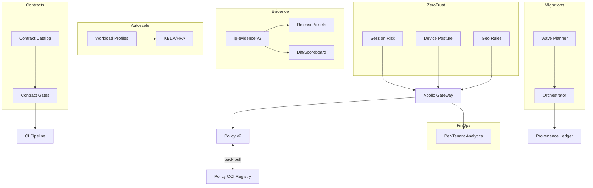

# IntelGraph · Maestro Conductor (MC)
# Workstream: SDLC Orchestration & Evidence
# Sprint: 2026‑01‑13 → 2026‑01‑27 (08)

> Mission: Scale **self‑service governance** from MVP to day‑to‑day practice. Turn policies, evidence, migrations, and residency into push‑button flows with strong guardrails. Reduce toil, accelerate compliant change, and tighten observability around decisions, data contracts, and costs.

---

## Conductor Summary (One‑Screen)
**Goal.** Mature Policy Reasoner v2, Audit Portal, Evidence CLI, and Migration Orchestrator into daily‑use capabilities: add policy pack distribution, evidence diffs, auditor delegation, contract catalogs, and progressive delivery for schema/data changes. Introduce **workload‑aware autoscaling** and tenant analytics for FinOps, plus **zero‑trust hardening** (session risk, device posture, geo). 

**Assumptions.** Sprint‑07 shipped Policy v2 (context/explanations), `ig-evidence` CLI, Audit Portal MVP, burn→flag automation, multi‑region tests, and first batch blue/green.

**Non‑Goals.** New end‑user features; major UI polish beyond portal usability fixes.

**Constraints.** Org SLOs/cost guardrails; MT SaaS + ST‑DED + Black‑Cell variants; evidence required for promotions.

**Risks.** Policy pack rollout drift; auditor scope creep; migration load; autoscaling thrash; geo constraints.

**Definition of Done.**
- Policy **Bundle Manager** ships signed bundles; clients verify & pin.
- Evidence CLI adds **diff mode** and pass/fail scoreboard; portal supports delegated auditor access with least privilege.
- Contract Catalog + linter enforced across repos; progressive delivery for contracts + schema.
- Migration Orchestrator supports **batch waves** with ACA checkpoints + partial backout.
- Workload‑aware autoscaling active; cost/latency targets maintained.
- Zero‑trust signals enforced (risk, device, geo) without SLO breach.

---

## Carryover / Dependencies
- Cosign keys rotation window scheduled.  
- Auditor accounts in IdP; delegated access rules approved.  
- Capacity headroom for migration waves validated.

---

## EPICS → Stories → Tasks (MoSCoW)

### EPIC AR — Policy Bundle Manager (Must)
**AR1. Signed Policy Packs**  
- Build `ig-policy pack` (bundle Rego + metadata); cosign sign; publish to OCI.
**AR2. Pin & Verify**  
- Gateway verifies signature + policy version pin; fallback to last‑good on verify fail.
**AR3. Rollout Channels**  
- `dev`/`staging`/`prod` channels; staged rollout with ACA‑style deny/allow metrics.
**Acceptance:** Tampered bundle rejected; staged rollout metrics visible; automatic revert on failure.

### EPIC AS — Evidence v2 & Audit Portal Roles (Must)
**AS1. Evidence Diff & Scoreboard**  
- `ig-evidence diff` compares releases, flags missing artifacts; compute compliance score.
**AS2. Delegated Auditor**  
- Portal role `auditor:tenant` vs `auditor:org`; least‑privilege download scopes; watermark with tenant + timebox.
**AS3. Access Trails & Alerts**  
- Real‑time alert on unusual download patterns; export CSV of audit activity with hashes.
**Acceptance:** Auditor can retrieve all required artifacts, diffs render, alerts fire on anomalies.

### EPIC AT — Contract Catalog & Progressive Delivery (Must)
**AT1. Central Catalog**  
- Monorepo `contracts/` index + schema; ownership; deprecation windows.
**AT2. Contract Gates**  
- CI gate for incompatible changes across repos; publish deprecation notices.
**AT3. Progressive Delivery**  
- Roll out contract + schema changes via flags/persisted query versions; ACA + backout.
**Acceptance:** One cross‑repo contract change delivered progressively with no SLO breach.

### EPIC AU — Migration Orchestrator v1.1 (Should)
**AU1. Wave Planner**  
- Partition batches by tenant/region/size; schedule waves; pause/resume.
**AU2. Checkpoints & Backout**  
- ACA checks between waves; partial backout supported; ledger records checkpoints.
**Acceptance:** 3‑wave migration executed; checkpoint evidence attached.

### EPIC AV — Workload‑Aware Autoscaling (Should)
**AV1. Profiles**  
- Label traffic as read/write/subs/ingest; scale components by dominant profile; max caps per tenant.
**AV2. Anti‑Thrash**  
- Hysteresis + cooldown; forecast‑based pre‑scaling for events.
**Acceptance:** 20% traffic swing handled without error budget burn; cost/unit stable or lower.

### EPIC AW — Zero‑Trust Hardening (Should)
**AW1. Session Risk & Device Posture**  
- Ingest risk from IdP; require step‑up for medium/high; deny for jailbroken/untrusted.
**AW2. Geo Fencing**  
- Enforce allowed regions per tenant; audit and alert on geo anomalies.
**Acceptance:** Playwright E2E proves step‑up/deny; SLO overhead ≤ 5ms p95.

### EPIC AX — Tenant Analytics for FinOps (Could)
**AX1. Per‑Tenant Dashboards**  
- Calls, events, storage, cost, SLO burn; export as part of monthly report.
**AX2. Anomaly Detection (baseline)**  
- Simple z‑score on usage vs history; alert to CS/FinOps.
**Acceptance:** Dashboards live; anomaly alerts tested.

---

## Acceptance Criteria & Verification
1) **Policy Bundles:** Signature verification required; last‑good fallback; rollout metrics recorded; auto‑revert on failure.  
2) **Evidence v2:** Diff report present; compliance score ≥ 0.95 to promote; portal roles enforced; access logs signed.  
3) **Contracts:** Catalog up‑to‑date; CI blocks incompatible changes; deprecations communicated with dates.  
4) **Migrations:** 3‑wave migration with ACA checkpoints; no SLO or residency breach; backout validated.  
5) **Autoscaling:** 0 thrash alerts; p95/p99 within targets; unit cost unchanged or improved.  
6) **Zero‑Trust:** Risk/device/geo enforced; no cross‑tenant leaks; negligible latency impact.  
7) **Tenant Analytics:** Dashboards usable; anomaly alerts routed.

---

## Architecture (Mermaid)


---

## Specs & Schemas
**Policy Pack Manifest**
```json
{ "version":"2.1.0","policies":[{"path":"ig/purpose.rego","sha256":"..."}],"expires":"2026-04-30","signature":"cosign:..." }
```

**Evidence Diff Result**
```json
{ "from":"v1.2.1","to":"v1.2.2","missing":[],"changed":[{"artifact":"schema-diff.json","delta":"+1 type, -0 fields"}],"score":0.97 }
```

**Contract Index (YAML)**
```yaml
contracts:
  - entity: Asset
    version: 2
    owner: data-platform
    deprecates: [1]
  - entity: Relationship
    version: 1
    owner: data-platform
```

**Autoscale Profile Config**
```yaml
profiles:
  gateway:
    read_qps_per_pod: 600
    write_qps_per_pod: 200
    subs_fanout_per_pod: 2000
```

**Zero‑Trust Rules (Rego extract)**
```rego
package ig.zt

allow { input.session.risk == "low" }
allow { input.session.risk == "medium"; input.stepup == true }
deny  { input.session.risk == "high" }
```

---

## Implementation Scaffolds
**Policy Pack Build**
```bash
ig-policy pack build policies/ --out dist/policy.tgz && cosign sign dist/policy.tgz
```

**Gateway Verify Hook (TS)**
```ts
const ok = await verifySignature(bundle, publicKey); if(!ok) useLastGood();
```

**Evidence Diff CLI (TS)**
```ts
// ig-evidence diff v1.2.1 v1.2.2 -> prints JSON + score; exits non‑zero if below threshold
```

**Contract Gate (CI step)**
```yaml
- name: Contract Gate
  run: npx ig-contracts check --catalog contracts/index.yaml --fail-on-breaking
```

**Wave Planner (pseudo)**
```ts
makeWaves(tenants, { maxWaveQps: 2000, by: 'region' })
```

**Workload Profile Exporter**
```ts
// exports per‑route metrics and dominant profile label to Prometheus
```

**Zero‑Trust Middleware**
```ts
if(risk==='medium' && !stepUp) return res.status(401)
if(risk==='high') return res.status(403)
```

**Tenant Analytics Panels (Grafana JSON export)**
```json
{ "title":"Tenant Analytics","panels":[{"type":"timeseries","targets":[{"expr":"rate(gql_calls_total[5m]) by (tenant)"}]}] }
```

---

## Dashboards & Alerts
- **Dashboards:** Policy rollout status, evidence scoreboard, contract changes, migration waves, workload profiles vs pods, zero‑trust decisions, tenant usage & cost.  
- **Alerts:** Policy verify fail; evidence score < 0.95; contract breakage attempt; migration checkpoint fail; autoscale thrash; high‑risk session access attempt.

---

## Runbooks (Delta)
- **Policy Rollback:** Pin gateway to last‑good bundle; open incident; analyze deny/allow deltas.
- **Evidence Score Fail:** Generate missing artifacts; re‑run; escalate if control gap.
- **Contract Incompatibility:** Initiate deprecation + shim; notify API consumers; track migration.
- **Wave Abort:** Pause remaining waves; backout partial; reconcile ledger; schedule fix.
- **Autoscale Thrash:** Increase cooldown; cap replicas; review profile thresholds.
- **Zero‑Trust Spike:** Verify IdP signals; relax step‑up window; communicate.

---

## Evidence Bundle (v1.2.2)
- Policy pack manifest + signatures, evidence diff + score, contract index & diffs, migration wave reports, autoscale profile metrics, zero‑trust decision logs, tenant analytics exports, SBOM/provenance deltas.

---

## Backlog & RACI (Sprint‑08)
- **Responsible:** MC, Platform Eng, SRE, SecOps, QA, Docs, Legal/Privacy, FinOps.  
- **Accountable:** Head of Platform.  
- **Consulted:** Data Platform (contracts), CS/Onboarding (tenant analytics).  
- **Informed:** Workstream leads.

Tickets: `MC‑339..MC‑396`; dependencies: OCI registry for policy packs, auditor roles in IdP, capacity for waves.

---

## Next Steps (Kickoff)
- [ ] Publish signed policy pack to `dev` channel; verify pin/rollback.  
- [ ] Ship `ig-evidence diff` + CI scoreboard gate.  
- [ ] Stand up contract catalog and enable cross‑repo gate.  
- [ ] Execute 3‑wave migration with ACA checkpoints.  
- [ ] Enable workload‑aware autoscaling + anti‑thrash; review cost.  
- [ ] Enforce zero‑trust signals; validate with E2E; ship tenant a