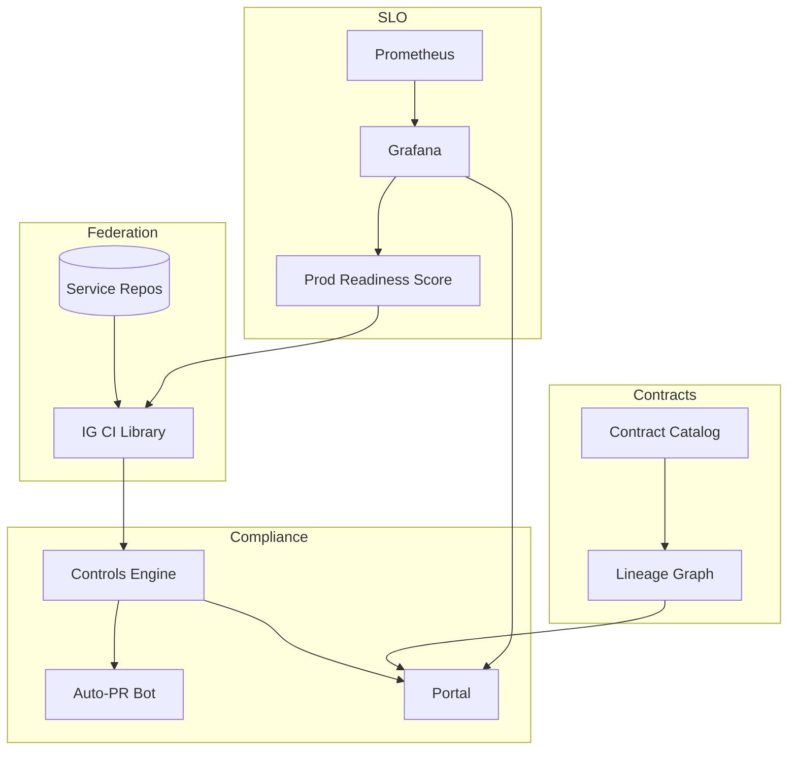

# IntelGraph · Maestro Conductor (MC)
# Workstream: SDLC Orchestration & Evidence
# Sprint: 2026‑01‑28 → 2026‑02‑11 (09)

> Mission: Industrialize the governance toolchain and reduce cycle time. Federate pipelines, formalize **policy/test/data contracts** across teams, enforce golden paths, and introduce **continuous compliance** with auto‑remediation. Drive MTTR and lead‑time down while keeping SLO/cost green.

---

## Conductor Summary (One‑Screen)
**Goal.** Make compliant delivery the fastest path: 1) Pipeline federation with shared gates, 2) Golden paths & project templates, 3) Continuous compliance engine with auto‑remediation PRs, 4) Contract lineage graph (schema/data/policy), 5) Error‑budget SLO boards per team, 6) Production readiness score (PRS) for services.

**Assumptions.** Sprint‑08 shipped signed policy packs, evidence diff/scoreboard, contract catalog, migration waves, workload‑aware autoscaling, zero‑trust enforcement.

**Non‑Goals.** New external connectors; deep UI work beyond portal/boards.

**Constraints.** Org SLOs & cost guardrails; multi‑tenant SaaS; evidence required for promotions.

**Risks.** Federation drift; noisy compliance alerts; PRS gamification; auto‑fixes conflicting with local overrides.

**Definition of Done.**
- Federated CI templates adopted by ≥ 3 repos; gates identical for SLO/cost/policy/contracts.
- Golden path templates published; time‑to‑first green build < 30 min from scaffold.
- Continuous compliance runs nightly and on PR; opens auto‑remediation PRs with passing checks.
- Contract lineage rendered in portal; breaking change blast radius visible.
- Team SLO boards live; promotion blocked when PRS < threshold.

---

## Carryover / Dependencies
- Org buy‑in for federated templates; CODEOWNERS updated.  
- Portal section for lineage graph & PRS.  
- Permissions for bot user to open auto‑PRs.

---

## EPICS → Stories → Tasks (MoSCoW)

### EPIC AY — Pipeline Federation (Must)
**AY1. Reusable CI Library**  
- Publish `ci/ig-ci.yml` (composite actions) for lint/tests/SBOM/policy/schema/k6/chaos/ACA/evidence gates.  
**AY2. Repo Adapters**  
- Minimal `ci.yml` per repo importing shared jobs; env matrix (dev/staging/prod).  
**Acceptance:** 3 repos green using shared CI; versioned releases of CI lib; change log.

### EPIC AZ — Golden Paths & Templates (Must)
**AZ1. Service Template**  
- `create-ig-service` (Node TS + Apollo + OTel + OPA + Helm + dashboards).  
**AZ2. Worker Template**  
- `create-ig-worker` (queue, metrics, retry/backoff, k6 soak).  
**AZ3. Frontend Template**  
- React + persisted queries + auth + error‑budget widgets.  
**Acceptance:** New service scaffold → green pipeline in < 30 min; SLO cost gates present.

### EPIC BA — Continuous Compliance (Must)
**BA1. Controls Engine**  
- Map controls → checks (e.g., MFA on, SBOM ≥ N%, policy coverage ≥ 90%, retention tags present).  
**BA2. Auto‑Remediation PRs**  
- Bot opens PRs to add missing tags, dashboard exports, alerts, CODEOWNERS, etc.  
**BA3. Evidence Sync**  
- Nightly job refreshes portal artifacts; diffs highlighted.  
**Acceptance:** ≥ 10 auto‑PRs merged; compliance score improves without manual toil.

### EPIC BB — Contract Lineage & Blast Radius (Should)
**BB1. Lineage Graph**  
- Build graph linking GraphQL types ↔ data contracts ↔ policies ↔ tests ↔ services.  
**BB2. Blast Radius Report**  
- Given a contract change, show impacted services/queries/tenants; PR decorator comment with checklist.  
**Acceptance:** Contract change PR shows radius & mitigation steps; at least one real usage.

### EPIC BC — Team SLO Boards & PRS (Should)
**BC1. SLO Board**  
- Per‑team dashboard: latency/availability/error‑budget; burn alerts; unit cost.  
**BC2. Production Readiness Score**  
- Scored mix: coverage, SLO adherence, on‑call runbooks, chaos/k6 recency, evidence completeness.  
**Acceptance:** PRS displayed in portal; promotion blocks at PRS < 0.9 (configurable).

### EPIC BD — Migrations & Backfills at Scale (Could)
**BD1. Backfill Runner**  
- Idempotent, rate‑limited backfills with ACA checkpoints; cost guardrails.  
**Acceptance:** One 10M‑row backfill with evidence and zero SLO breach.

---

## Acceptance Criteria & Verification
1) **Federation:** Shared CI version pinned; repos pass with identical gates; rollback to previous CI lib version supported.  
2) **Golden Paths:** `create-ig-*` templates produce runnable services with green pipelines and default SLO/cost/policy gates.  
3) **Compliance:** Nightly run posts score delta; auto‑PRs pass CI; evidence synced.  
4) **Lineage:** Portal renders contract→type→resolver→policy edges; PRs show blast radius and mitigation checklist.  
5) **SLO Boards/PRS:** Boards live; PRS computed and enforced in promotion job.  
6) **Backfill:** Throughput target met; ACA checkpoints green; unit cost ≤ budget.

---

## Architecture (Mermaid)


---

## Specs & Schemas
**Controls Catalog (YAML)**
```yaml
controls:
  - id: SOC2-CC1.4
    check: evidence.sbom_coverage >= 0.95
  - id: PRIV-RET-01
    check: all(resources).retention in [short-30d, standard-365d, legal-hold]
  - id: POL-COV-90
    check: policy.coverage >= 0.90
```

**PRS Weights (JSON)**
```json
{ "coverage":0.25, "slo":0.25, "evidence":0.2, "runbooks":0.1, "chaos_recency":0.1, "k6_recency":0.1 }
```

**Lineage Edge (record)**
```json
{ "from":"Contract:Asset@v2", "to":"GraphQL:Asset", "type":"conformsTo" }
```

---

## Implementation Scaffolds
**Reusable CI Import (GitHub Actions)**
```yaml
jobs:
  ig:
    uses: intelgraph/ig-ci/.github/workflows/ci.yml@v1
    with:
      service: gateway
      env: staging
```

**create‑ig‑service (CLI skeleton)**
```bash
npx create-ig-service my-svc --template node-apollo --sla read=350 write=700
```

**Controls Engine (Node extract)**
```ts
// loads controls.yaml -> queries artifacts/metrics -> computes score -> posts portal update
```

**Auto‑PR Bot (pseudocode)**
```ts
if (!hasRetentionTags()) openPR('Add retention tags', patch)
```

**Blast Radius PR Decorator**
```ts
// on PR: query lineage -> render impacted services/queries -> checklist -> status check
```

**PRS Gate (CI)**
```yaml
- name: PRS Gate
  run: node scripts/prs-check.js --min 0.9
```

**Backfill Runner (config)**
```yaml
backfill:
  batch_size: 5000
  rps: 200
  checkpoints: ["10%","50%","90%","100%"]
```

---

## Dashboards & Alerts
- **Dashboards:** Compliance score trend, auto‑PR rate & merge time, lineage change events, PRS by team, backfill throughput & ACA scores.  
- **Alerts:** Compliance score < target; CI lib mismatch; PRS < threshold on release; backfill cost spike; blast radius > N services without mitigation.

---

## Runbooks (Delta)
- **Federation Rollback:** Pin repos to `ig-ci@vPrev`; re‑run; open incident if gates regress.  
- **Compliance Noise:** Tune controls thresholds; group PRs; silence non‑actionable checks.  
- **Blast Radius High:** Break change into waves; add shims; extend deprecation window.  
- **Backfill Overrun:** Reduce batch/rps; pause; analyze ACA; resume when green.

---

## Evidence Bundle (v1.3)
- CI lib version + changelog, controls score & auto‑PR log, lineage snapshot/graph JSON, PRS exports, backfill evidence, SBOM/provenance deltas.

---

## Backlog & RACI (Sprint‑09)
- **Responsible:** MC, Platform Eng, SRE, SecOps, QA, Docs.  
- **Accountable:** Head of Platform.  
- **Consulted:** Data Platform (contracts), FinOps (cost boards), Compliance (controls).  
- **Informed:** Workstream leads.

Tickets: `MC‑397..MC‑452`; dependencies: Portal updates, bot credentials, CI library repo.

---

## Next Steps (Kickoff)
- [ ] Publish `ig-ci` v1; migrate 3 repos.  
- [ ] Ship `create-ig-*` templates; run golden‑path fire‑drill.  
- [ ] Enable continuous compliance nightly & on PR; merge 10+ auto‑PRs.  
- [ ] Render lineage graph in portal; add PR decorator.  
- [ ] Stand up team SLO boards + PRS gate; target ≥ 0.9 to promote.  
- [ ] Pilot one large backfill via runner; attach evidence.