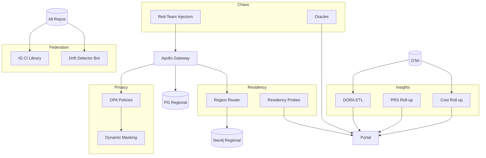

# IntelGraph · Maestro Conductor (MC)

# Workstream: SDLC Orchestration & Evidence

# Sprint: 2026‑02‑12 → 2026‑02‑26 (10)

> Mission: Operationalize **continuous compliance + progressive delivery** at org scale. Extend federation to all repos, automate data‑residency enforcement, ship dynamic data masking, raise assurance with red‑team style chaos, and finalize Q2 roadmap with measurable ROI, SLO, and cost targets. Keep everything auditable and push‑button.

---

## Conductor Summary (One‑Screen)

**Goal.** Move from adopted to **ubiquitous** guardrails: 1) org‑wide CI federation, 2) residency enforcement + proofs, 3) dynamic masking/redaction at query time with policy ties, 4) red‑team chaos & abuse simulations, 5) DORA + PRS roll‑up dashboards, 6) Q2 roadmap + OKRs with error‑budget contracts.

**Assumptions.** Sprint‑09 delivered federated CI (seed), golden paths, continuous compliance w/ auto‑PRs, lineage+blast radius, PRS gate, plus backfill runner.

**Non‑Goals.** End‑user product features; brand‑new data sources beyond approved connectors.

**Constraints.** Org SLOs & cost guardrails; MT SaaS default; evidence required for promotions.

**Risks.** Masking latency; residency misroutes under failover; alert fatigue in red‑team chaos; federation adoption resistance.

**Definition of Done.**

- ≥ 8 repos on federated CI with identical gates pinned by version; drift detector active.
- Residency enforcement in gateway + data plane with continuous proofs.
- Dynamic masking & redaction wired to OPA policy + purpose tags; audited.
- Red‑team chaos suite executed; issues triaged; no cross‑tenant leaks found.
- DORA + PRS + SLO/cost boards live; Q2 roadmap+OKRs approved.

---

## Carryover / Dependencies

- SRE support for residency routing + canary failover.
- Legal/Privacy review of masking/redaction defaults.
- Security team partnership for red‑team chaos scenarios.

---

## EPICS → Stories → Tasks (MoSCoW)

### EPIC BE — CI Federation at Scale (Must)

**BE1. Adoption Drive**

- Migrate 5 additional repos to `ig-ci@v1` templates; pin versions; changelog broadcast.
  **BE2. Drift Detector**
- Bot that flags divergence from shared jobs; auto‑PR to realign.
  **BE3. Golden Evidence**
- Auto‑publish evidence scoreboard badge to repo README.
  **Acceptance:** 8+ repos green on shared CI; 0 drift for 7 days; badges visible.

### EPIC BF — Residency Enforcement & Proofs (Must)

**BF1. Router + Labels**

- Enforce `tenant.region` → route to regional gateway; annotate traces with `region_src/dst`.
  **BF2. Data Plane Guards**
- Neo4j/PG/Obj store clients bound to region; deny on cross‑region unless `warrant`+`authorityBinding`.
  **BF3. Continuous Proofs**
- Residency probes each hour; attach proofs to portal; alert on anomaly.
  **Acceptance:** No cross‑region access outside exceptions; hourly proofs attached; failover scenario still honors residency.

### EPIC BG — Dynamic Masking & Redaction (Must)

**BG1. Policy‑Driven Masking**

- Field‑level masking via policy (OPA) tied to `purpose`, `role`, `risk`; redaction maps for exports.
  **BG2. Query‑Time Filters**
- GraphQL directive `@mask(fields:[...])`; persisted queries updated; tests for leakage.
  **BG3. Audit & Explain**
- Decision logs include `maskSet`, `redactSet`; surface `X‑IG‑Mask` header for admins.
  **Acceptance:** E2E shows masked fields for non‑privileged; zero leakage; overhead ≤ 5ms p95.

### EPIC BH — Red‑Team Chaos & Abuse (Should)

**BH1. Scenarios**

- Token replay, cursor abuse, N+1 storms, over‑broad export, step‑up bypass attempts.
  **BH2. Injectors & Oracles**
- k6 + custom scripts; oracles assert SLOs, policy denials, and no leakage.
  **BH3. Findings Workflow**
- Auto‑file issues with evidence; tag `ABUSE‑FINDING`; remediation SLAs.
  **Acceptance:** Suite executes weekly; ≥ 5 findings triaged/remediated; no cross‑tenant impact.

### EPIC BI — Delivery & Ops Insights (Should)

**BI1. DORA Metrics**

- Change lead time, deploy frequency, MTTR, change failure rate → portal.
  **BI2. PRS Aggregation**
- Service/team roll‑ups with trends; link to gates.
  **BI3. Cost & SLO Roll‑ups**
- Per‑tenant and per‑service roll‑ups; variance alerts.
  **Acceptance:** Dashboards live; used in QBR/Q2 planning.

### EPIC BJ — Q2 Roadmap & OKRs (Must)

**BJ1. OKRs**

- Objectives on reliability, privacy, cost/unit, delivery speed; key results measurable.
  **BJ2. Error‑Budget Contracts**
- Per‑team budget allocations; throttle/feature policy; comms.
  **BJ3. Capacity & Cost Plan**
- Forecast growth, region expansions, connector mixes; budget guardrails.
  **Acceptance:** Signed roadmap+OKRs; budgets wired; alerts configured.

---

## Acceptance Criteria & Verification

1. **Federation:** Repos use pinned CI lib; drift bot opens PR within 24h on divergence; badges reflect evidence score ≥ 0.95.
2. **Residency:** Traces show region adherence; hourly proofs attached; failover drills pass with residency intact.
3. **Masking/Redaction:** Tests verify masked views by role/purpose; export redactions default for PII; audit logs show mask decisions.
4. **Red‑Team Chaos:** All scenarios run; SLOs within targets; findings triaged with SLAs.
5. **Insights:** DORA + PRS + cost/SLO dashboards up‑to‑date; adoption in weekly review.
6. **Q2 Plan:** OKRs, budgets, and capacity model approved; portal page published.

---

## Architecture Deltas (Mermaid)



---

## Schemas & Contracts

**GraphQL Directive**

```graphql
directive @mask(
  fields: [String!]!
  strategy: String = "hash"
) on FIELD_DEFINITION
```

**Residency Proof (JSON)**

```json
{
  "tenant": "alpha",
  "period": "2026-02-17T14:00Z",
  "reads": { "src": "us-east-1", "dst": "us-east-1" },
  "writes": { "src": "us-east-1", "dst": "us-east-1" },
  "signature": "cosign:..."
}
```

**Mask Decision Log**

```json
{
  "decisionId": "dec_xyz",
  "maskSet": ["Asset.email", "Asset.phone"],
  "reason": "role!=admin",
  "tenant": "beta"
}
```

**Drift Report (CI)**

```json
{
  "repo": "gw",
  "status": "drift",
  "missingJobs": ["policy-gate"],
  "pr": "https://.../pull/123"
}
```

**DORA Snapshot**

```json
{
  "lead_time_days": 1.2,
  "deploys_per_day": 3.1,
  "change_failure_rate": 0.06,
  "mttr_min": 22
}
```

---

## Implementation Scaffolds

**Masking Resolver Wrapper (TS)**

```ts
function maskFields(obj, fields) {
  /* hash/null/partial */
}
export const withMask =
  (fields: string[]) => (resolver) => async (p, a, c, i) => {
    const r = await resolver(p, a, c, i);
    return maskFields(r, fields);
  };
```

**Residency Probe (Node)**

```ts
// Hourly: write/read sentinel per tenant; trace region attrs; sign JSON proof
```

**Drift Detector Bot**

```ts
// Diff repo CI vs ig-ci template; open PR with patch and evidence badge wiring
```

**Red‑Team Chaos (k6)**

```js
// token replay, cursor abuse, N+1 storm, export breadth attempts
```

**DORA ETL (TS)**

```ts
// Pull from GitHub + alerts/incidents + deploy logs -> compute 4 metrics
```

---

## Dashboards & Alerts

- **Dashboards:** CI adoption & drift, residency proofs, masking decisions over time, chaos findings & SLA, DORA/PRS/cost roll‑ups, Q2 OKRs progress.
- **Alerts:** Drift detected; residency anomaly; masking failure rate; chaos scenario regression; DORA degradation; OKR risk.

---

## Runbooks (Delta)

- **Residency Breach:** Quarantine tenant; rotate keys; analyze traces; hotfix router; publish RCA + proofs.
- **Masking Failure:** Block export; raise step‑up; roll back policy; add test to corpus.
- **Chaos Finding:** Triage, assign SLA, verify fix with targeted scenario; close with evidence.
- **Drift Alert:** Auto‑merge if trivial; escalate if manual changes required.

---

## Evidence Bundle (v1.3.1)

- CI adoption report + drift logs; residency proofs; masking decision logs; chaos findings + remediations; DORA/PRS/cost exports; OKR doc + sign‑off; SBOM/provenance deltas.

---

## Backlog & RACI (Sprint‑10)

- **Responsible:** MC, Platform Eng, SRE, SecOps, QA, Docs, Legal/Privacy.
- **Accountable:** Head of Platform.
- **Consulted:** Data Platform (masking semantics), FinOps (cost roll‑ups), Compliance (residency proofs).
- **Informed:** Workstream leads.

Tickets: `MC‑453..MC‑516`; dependencies: CI lib v1, region router, policy changes, portal modules.

---

## Next Steps (Kickoff)

- [ ] Migrate remaining repos to federated CI; enable drift bot.
- [ ] Ship residency router + hourly proofs; run failover drill.
- [ ] Enable dynamic masking directive + policy rules; add E2E & export tests.
- [ ] Execute red‑team chaos week; triage findings.
- [ ] Stand up DORA/PRS/cost roll‑up boards; review weekly.
- [ ] Publish Q2 OKRs & capacity/budget plan; wire alerts.
