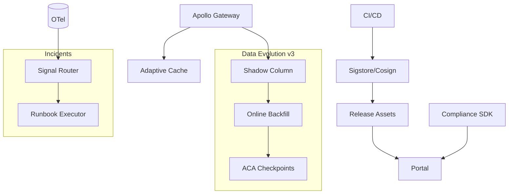

# IntelGraph · Maestro Conductor (MC)
# Workstream: SDLC Orchestration & Evidence
# Sprint: 2026‑04‑13 → 2026‑04‑27 (14)

> Mission: Post‑audit execution and **Q2 kick‑off**. Convert auditor feedback into gates, expand supply‑chain trust (attestations everywhere), make privacy/residency proofs self‑serve, and remove remaining toil from migrations and incident handling. Keep latency tails flat while enabling controlled growth (new tenants/features) with zero surprises.

---

## Conductor Summary (One‑Screen)
**Goal.** Institutionalize trust‑by‑default: 1) Auditor findings → codified controls & CI gates, 2) Attestation coverage to 100% (images, bundles, charts), 3) Self‑serve Compliance SDK for tenants (proof verification, receipts, privacy budget view), 4) Data evolution v3 (online column backfills + shadow writes), 5) Auto‑triage + runbook executor for P1/P2, 6) Read‑path p99 stabilization with adaptive caches.

**Assumptions.** Sprint‑13 delivered External Audit Pack, SLSA/Sigstore integration, dual‑path online indexing, privacy‑budget dashboards, Black‑Cell delta flow, scorecard gate, and anomaly detection.

**Non‑Goals.** New product verticals; ML modeling beyond anomaly heuristics; multi‑cloud expansion.

**Constraints.** Org SLOs/cost guardrails; MT SaaS + ST‑DED + Black‑Cell; evidence packs required for promotion.

**Risks.** Attestation gaps in third‑party images; SDK misuse by tenants; adaptive caching invalidation bugs; online backfill load.

**Definition of Done.**
- All build artifacts (containers, Helm charts, Black‑Cell bundles, export manifests) have verifiable attestations; CI blocks otherwise.
- Compliance SDK (client‑side) published with examples and signed artifacts; tenants can verify exports and receipts offline.
- Data evolution v3 (online column backfill + shadow write) executed on one entity; ACA green with rollback proof.
- Incident Auto‑Triage (runbook executor) reduces MTTA by ≥ 30% on simulations.
- p99 read latency stays within ±5% across week; cache hit ratio ≥ 85% on hot resolvers; no additional error‑budget burn.
- Auditor findings backlog ≥ 80% resolved with evidence linked to controls.

---

## Carryover / Dependencies
- Sigstore Fulcio/Rekor quotas; Helm chart signing keys rotation.
- Tenant council for SDK pilot; security review for SDK trust boundary.
- Capacity window for online backfill.

---

## EPICS → Stories → Tasks (MoSCoW)

### EPIC CD — Auditor Findings → Controls (Must)
**CD1. Control Mapping v2**  
- Convert each finding to a control with measurable check + CI/portal surfacing.
**CD2. Gates & Exceptions**  
- CI gates enforce controls; timeboxed exception workflow with ledger entries.
**Acceptance:** ≥ 80% findings closed with linked evidence; exceptions visible with expiry.

### EPIC CE — Attestations Everywhere (Must)
**CE1. Helm/Chart Signing**  
- Sign Helm charts; verify on deploy; store in release assets.
**CE2. Export Manifest Attestation**  
- Generate attestations for export proofs; verify in portal and SDK.
**CE3. Third‑Party Baselines**  
- Maintain allow‑listed base images with verified provenance; auto‑PR on drift.
**Acceptance:** CI blocks unsigned/invalid artifacts; allow‑list drift fixed by bot PR.

### EPIC CF — Tenant Compliance SDK (Must)
**CF1. SDK (TS/Python)**  
- Verify signatures (Cosign/Sigstore), validate residency/license/ε‑budget proofs, read receipts.
**CF2. Samples & Docs**  
- Node/React sample to verify exports; Python notebook for offline audit.
**CF3. Distribution**  
- Publish packages, signatures; portal page with quickstarts.
**Acceptance:** Tenants verify a sample export end‑to‑end offline; docs pass UX test (<10 min).

### EPIC CG — Data Evolution v3 (Must)
**CG1. Online Column Backfill**  
- Shadow column, dual‑write, background backfill with checkpoints, ACA per checkpoint.
**CG2. Shadow Writes & Validation**  
- Compare shadow vs primary; cutover; fallback plan.
**Acceptance:** One entity migrated; ACA green; cutover + rollback evidence captured.

### EPIC CH — Incident Auto‑Triage & Runbook Executor (Should)
**CH1. Signal Router**  
- Correlate alerts, traces, logs; classify incident type.
**CH2. Executor**  
- Automate first‑steps: cache flush, limiter relax/tighten, feature flag toggles, safe retries.
**Acceptance:** Simulated P1/P2 MTTA reduced ≥ 30%; actions logged + reversible.

### EPIC CI — Adaptive Caching & p99 Guard (Should)
**CI1. Adaptive TTLs**  
- Set TTL per resolver based on variance; promote hot keys to longer TTL.
**CI2. Negative Cache & Prefetch**  
- Cache misses for frequent 404s; prefetch edges for hot queries.
**Acceptance:** p99 within ±5% week‑over‑week; hit ratio ≥ 85%; no stale‑data incidents.

---

## Acceptance Criteria & Verification
1) **Attestations:** `cosign verify`/`verify-attestation` succeed for all artifacts; deploy blocks otherwise; portal displays status.
2) **SDK:** Offline verification of a signed export + proofs succeeds via SDK; packages are signed; checksums published.
3) **Data Evolution:** Backfill rate limited; ACA checkpoints green; rollback rehearsed; ledger captures steps.
4) **Auto‑Triage:** Playbooks executed automatically; MTTA reduced; reversibility proven; audit entries present.
5) **Caching:** Dashboards show stable tails and high hit ratios; no cache‑coherency regressions in E2E.
6) **Findings:** Backlog burndown to ≤ 20% remaining; controls documented in portal.

---

## Architecture (Mermaid)


---

## Schemas & Manifests
**Helm Provenance (prov.yaml)**
```yaml
chart: gateway-1.7.0
provenance: slsa-v1
signature: cosign:...
```

**SDK Verification Config**
```json
{ "sigstore": { "rekorUrl": "https://rekor.sigstore.dev" }, "trustedKeys": ["cosign.pub"] }
```

**Backfill Checkpoint Manifest**
```json
{ "entity":"Asset","checkpoint":"50%","acaScore":0.96,"ts":"2026-04-19T12:00Z","rollbackReady":true }
```

**Auto‑Triage Playbook (YAML)**
```yaml
P1-gateway-5xx-surge:
  - action: increase_rate_limit_burst
  - action: enable_cache_prefetch
  - action: toggle_flag
    key: subs.optimizedBuffer
```

---

## Implementation Scaffolds
**Chart Signing (CI)**
```yaml
- name: Sign Helm Chart
  run: cosign attest --predicate prov.yaml --type slsaprovenance oci://ghcr.io/.../gateway-chart:1.7.0
```

**SDK Verify (TS)**
```ts
// import proofs -> verify signatures -> validate residency/license/epsilon -> return report
```

**Adaptive Cache (TS extract)**
```ts
// adjust TTL based on rolling p95/p99 variance; promote demote keys; emit metrics
```

**Backfill Runner (TS)**
```ts
// dual-write -> background copy -> validate -> checkpoint -> cutover
```

**Runbook Executor (Node)**
```ts
// map incident patterns -> action sequences; idempotent; revertible; ledger entries
```

---

## Dashboards & Alerts
- **Dashboards:** Attestation coverage, SDK verification success, backfill progress & ACA scores, MTTA vs baseline, p99 & cache hit ratio, auditor findings burndown.
- **Alerts:** Missing attestation; SDK verify failure spike; backfill stall; executor failure; p99 regression; findings past SLA.

---

## Runbooks (Delta)
- **Unsigned Artifact:** Block deploy; sign/attest; re‑run CI; document cause.
- **SDK Verify Fail:** Check trust roots; rotate keys; re‑generate proofs; notify tenant.
- **Backfill Regression:** Slow rate; pause; analyze ACA; rollback if needed; RCA.
- **Executor Misfire:** Revert actions; disable scenario; patch matcher; add test.

---

## Evidence Bundle (v1.6)
- Attestation proofs for all artifacts; SDK verification logs; data evolution v3 checkpoints & ACA reports; incident auto‑triage evidence; p99 & cache metrics; findings burndown; SBOM/provenance deltas.

---

## Backlog & RACI (Sprint‑14)
- **Responsible:** MC, Platform Eng, SRE, SecOps, QA, Docs, Legal/Privacy.  
- **Accountable:** Head of Platform.  
- **Consulted:** Data Platform (backfills), Compliance/Audit (controls), Tenants (SDK pilot).  
- **Informed:** Workstream leads.

Tickets: `MC‑701..MC‑760`; dependencies: chart signing, tenant pilot, backfill window.

---

## Next Steps (Kickoff)
- [ ] Turn on chart + export attestation gates.  
- [ ] Publish Compliance SDK + samples; run tenant pilot.  
- [ ] Execute one online column backfill with checkpoints & ACA.  
- [ ] Deploy incident auto‑triage executor; run P1/P2 drills.  
- [ ] Enable adaptive cache; monitor tails; attach evidence to v