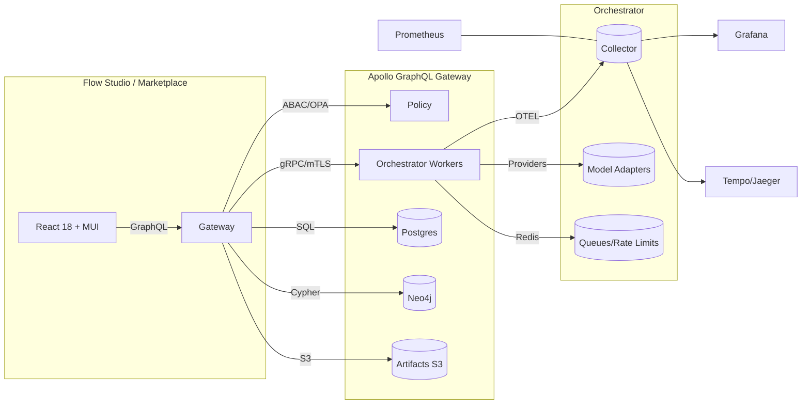

# IntelGraph Maestro Conductor — Competitive Surpass Plan (AI App Builders & Agent Platforms)

**Doc ID:** mc-sprints-competitor-surpass-2025.09.30  
**Owner:** Maestro Conductor (MC)  
**Status:** Draft for review → PRD-ready  
**Scope Window:** Sprints 1–4 (8 weeks)  
**Guardrails:** Use IntelGraph Org Defaults (SLOs, cost, privacy, security, provenance)

---

## 0) Conductor Summary
**Goal:** Exceed the capabilities and enterprise readiness of leading AI-app builders/agent platforms (e.g., AI Box, Langflow, Flowise, OpenAI GPTs/Store, Azure Prompt Flow, Google Vertex AI Agent Builder, AWS Bedrock Agents, Dust, Humanloop) while staying within SLO/cost guardrails.

**Non‑Goals:** Competing in commodity hosting; building hardware edge boxes; re‑implementing cloud providers’ managed AI services.

**Assumptions:** Multi‑model, multimodal, marketplace monetization, and no/low‑code UX are table stakes; enterprise governance, provenance, and ops are our differentiators.

**Definition of Done:** A creator → enterprise pipeline: build in Visual Flow Studio; policy/provenance enforced; deploy to governed marketplace; observe SLOs; bill usage; pass acceptance packs herein.

**Success KPIs:**
- Time‑to‑first app: ≤ **5 minutes** from template to runnable.
- Template depth: **50+** production‑grade templates (with tests, policies, cost notes).
- Model coverage: **20+ adapters** with smart routing/fallback.
- Marketplace: policy scan + rev‑share; enterprise invoices.
- SLOs: Per IntelGraph defaults; burn‑rate alerts wired.
- Cost: Alert at 80% budget; unit cost targets met.

---

## 1) Competitor Landscape & Where We Surpass

### 1.1 Platforms in Scope
- **AI Box (aibox.ai):** no‑code multimodal builder + marketplace.
- **Langflow:** visual/low‑code agent + RAG flows; MCP servers.
- **Flowise:** open‑source drag‑drop agents/workflows.
- **OpenAI GPTs/Store:** custom GPTs + distribution/monetization.
- **Azure Prompt Flow (AI Foundry):** lifecycle tooling for LLM apps.
- **Google Vertex AI Agent Builder:** enterprise multi‑agent orchestration.
- **AWS Bedrock Agents:** managed agents with Guardrails.
- **Dust, Humanloop, HoneyHive, Prompt tools:** evals, prompt mgmt, app scaffolds.

### 1.2 Surpass Criteria (Capability Matrix)
| Capability | MC (target) | AI Box | Langflow | Flowise | GPTs/Store | Azure PF | Vertex Agent | Bedrock Agents |
|---|---|---:|---:|---:|---:|---:|---:|---:|
| Visual flow builder | Studio + test‑as‑you‑build | ✓ | ✓ | ✓ | — | ✓ | ✓ | — |
| Marketplace & monetization | Governed, policy‑scanned, rev‑share | ✓ | — | — | ✓ | — | Agent Garden (samples) | — |
| Multi‑model routing | Cost/latency/quality policies + fallback | — | partial | partial | opaque | partial | partial | managed |
| Provenance ledger (signed claims) | **Default‑ON** | — | — | — | — | — | — | Guardrails only |
| Policy (License/TOS/PII/retention) | **OPA admission + run‑time** | — | — | — | — | partial | partial | Guardrails |
| Observability (OTEL traces + SLO gates) | **First‑class** | — | — | — | — | partial | partial | partial |
| Enterprise identity (OIDC/SCIM/ABAC) | **Built‑in** | — | — | — | — | ✓ | ✓ | ✓ |
| BYO infra/providers; export | **No lock‑in** | — | ✓ | ✓ | — | partial | partial | managed |

**MC Edge:** Governance + provenance + SLO‑driven ops **as features**, not afterthoughts; BYO providers; high‑quality templates with tests & cost notes; exportable flows.

---

## 2) Integrated Roadmap (4 Sprints, 2 weeks each)
Trunk‑based dev; weekly cut to staging; biweekly prod. Sprints align to reuse artifacts across swimlanes.

### Sprint 1 — Visual Flow Studio + Provenance v1 (Weeks 1–2)
**Epics**
1. **Visual Flow Studio (Creator UX)**
   - Node palette: Prompt, Tool, HTTP, File I/O, Branch, Parallel, Rate‑limit, Retry/Timeout.
   - Inline runner with fixtures; schema contracts + validation; import/export (flow.json).
   - Persisted queries; versioned templates.
2. **Provenance & Policy Hooks v1**
   - Signed claims per node: input/output hashes, model/provider, params, latency, cost.
   - OPA admission at deploy; policy decisions embedded in run evidence bundle.

**Key Acceptance (End‑to‑End):** Build **Daily AI Brief** from template in ≤5 min → run → export evidence.zip (manifest + signed claims) → verify hash chain.

**Dependencies:** Auth (OIDC), minimal billing stub for metering, S3 bucket for artifacts, Postgres/Neo4j readiness.

### Sprint 2 — Model Hub + Routing, Observability, Costing (Weeks 3–4)
**Epics**
1. **Model Adapters & Router**: OpenAI‑compat, Claude, Gemini‑style, local vLLM, image‑gen, ASR/TTS, embeddings.
2. **Observability First‑Class**: OTEL traces; Prom metrics; Grafana tenant dashboards; burn‑rate alerts.
3. **Cost Metering & Quotas**: Per‑call estimates/actuals; budgets; throttle at 100% (dev tenants).

**Key Acceptance:** Router satisfies policy *p95 latency ≤700ms & lowest cost* in 1000 trial runs with fallback success ≥99%.

### Sprint 3 — Governed Marketplace + Template Factory + Billing (Weeks 5–6)
**Epics**
1. **Marketplace v1**: Creator listing workflow; policy scan (licenses/PII); SBOM for flows; rev‑share ledger.
2. **Template Factory (50+)**: Curated, tested templates with policy & cost notes; gallery taxonomy.
3. **Billing**: Usage‑based billing (Stripe/InvoiceX), enterprise invoices; creator payouts.

**Key Acceptance:** Publish “Daily AI Brief” to marketplace; purchase; run; invoice; creator payout reconciles.

### Sprint 4 — Enterprise Hardening + Security + Admin (Weeks 7–8)
**Epics**
1. **Identity & Access**: OIDC SSO, SCIM; ABAC/OPA; project‑scoped secrets vault; mTLS.
2. **Privacy & Retention**: Field‑level encryption; retention tiers; RTBF; audit exports.
3. **SLO Gates & Chaos/Load**: CI gates for p95; canary/rollback; provider‑outage drills.

**Key Acceptance:** All SLO dashboards green; chaos drills auto‑rollback; RTBF removes PII while preserving provenance graph.

---

## 3) Detailed Backlog — Stories, Acceptance Criteria, Verification

### 3.1 Flow Studio (Sprint 1)
- **Story:** Implement node schema contracts with JSON Schema + runtime validation.  
  **AC:** Invalid configs blocked with actionable errors; schema versioning supports migration.
- **Story:** Inline runner with fixtures.  
  **AC:** “Run with Fixture” executes graph in‑browser (sandbox) and in runtime worker; results match; evidence emitted.
- **Story:** Import/Export flow.json.  
  **AC:** Exported manifest hashes to same value upon re‑import.

### 3.2 Provenance v1 (Sprint 1)
- **Story:** Signed claim emitter per node.  
  **AC:** Evidence bundle contains hash(input)→hash(output); node params; duration; cost; signature verifies via platform key.
- **Story:** OPA admission policy.  
  **AC:** Deploy blocked when License/TOS mix violates rules; policy decision recorded in evidence.

### 3.3 Model Hub & Routing (Sprint 2)
- **Story:** Adapter interface + drivers (chat, vision, ASR/TTS, embeddings).  
  **AC:** Contract tests: send/receive; error typing; retries/backoff; cost report.
- **Story:** Router policy engine (latency/cost/quality).  
  **AC:** Synthetic eval selects optimal model ≥95% of runs; fallback on 5xx or degenerate outputs.

### 3.4 Observability (Sprint 2)
- **Story:** OTEL tracing across nodes.  
  **AC:** Each node emits child span with attributes (model, tokens, cache‑hit, retries, cost); trace fan‑out visible.
- **Story:** Dashboards + alerts.  
  **AC:** Burn‑rate alerts at 25%/50%/80%; links to playbooks.

### 3.5 Marketplace & Templates (Sprint 3)
- **Story:** Listing workflow + review queue.  
  **AC:** Only policy‑passing flows publish; SBOM produced.
- **Story:** Template taxonomy & quality bar.  
  **AC:** Each template ships tests (unit/e2e), fixtures, cost note, and policy notes.

### 3.6 Security/Privacy/Admin (Sprint 4)
- **Story:** ABAC via OPA + scopes.  
  **AC:** Unit/contract tests show least‑privilege; deny by default.
- **Story:** RTBF.  
  **AC:** RTBF job redacts/deletes PII fields; provenance links preserved via surrogate keys.

---

## 4) Architecture & ADRs

### 4.1 High‑Level Diagram (Mermaid)


### 4.2 ADR‑001: Provenance as First‑Class
**Decision:** Every execution step emits signed claims; evidence bundles are immutable and exportable.  
**Status:** Accepted.  
**Consequences:** Slight overhead; massive auditability, debugging, and compliance wins.

### 4.3 ADR‑002: OPA Everywhere (Admission + Runtime)
**Decision:** Policies as code govern deploy and runtime actions (license/TOS/PII/retention).  
**Status:** Accepted.  
**Consequences:** Clear governance; deterministic decisions; easier certifications.

### 4.4 ADR‑003: Router Policies
**Decision:** Routing driven by cost/latency/quality w/ fallback; pluggable signals (evals, vendor SLIs).  
**Status:** Accepted.

---

## 5) Data & Policy Model

### 5.1 Canonical Entities (subset)
- **Flow, Node, Template, Run, Evidence, PolicyDecision, Listing, Purchase, Invoice, Budget, Alert.**

### 5.2 Retention & Purpose Tags
- **Retention:** ephemeral‑7d, short‑30d, standard‑365d, long‑1825d, legal‑hold.
- **Purpose:** investigation, threat‑intel, fraud‑risk, t&s, benchmarking, training, demo.

### 5.3 OPA Policy (Rego) — License/TOS Gate (snippet)
```rego
package mc.policy.license

# Inputs: flow.manifest, nodes[*].license_class, output.license_class
# Allowed classes: MIT_OK, OPEN_DATA_OK, RESTRICTED_TOS, PROPRIETARY_CLIENT, EMBARGOED

# Block mixing Restricted‑TOS outputs with Open‑Data exports
violation[msg] {
  some i
  node := input.flow.nodes[i]
  node.output.license_class == "RESTRICTED_TOS"
  input.flow.export.target == "OPEN_DATA_OK"
  msg := sprintf("Restricted‑TOS cannot export to Open‑Data: node %s", [node.id])
}

# Enforce PII → short‑30d unless legal‑hold
violation[msg] {
  input.flow.data.contains_pii
  input.flow.retention_tier != "short-30d"
  not input.flow.legal_hold
  msg := "PII must use short-30d retention unless legal-hold"
}
```

---

## 6) APIs & Schemas (Contracts)

### 6.1 GraphQL SDL (excerpt)
```graphql
scalar JSON
scalar DateTime

type Flow { id: ID!, name: String!, version: String!, manifest: JSON!, createdAt: DateTime! }

type Run { id: ID!, flowId: ID!, status: String!, startedAt: DateTime!, finishedAt: DateTime, evidenceUrl: String }

type Listing { id: ID!, flowId: ID!, status: String!, priceCents: Int!, policyReport: JSON! }

type Query {
  flow(id: ID!): Flow
  runs(flowId: ID!, limit: Int = 50): [Run!]!
  listing(id: ID!): Listing
}

type Mutation {
  createFlow(name: String!, manifest: JSON!): Flow!
  runFlow(flowId: ID!, fixture: JSON): Run!
  publishListing(flowId: ID!, priceCents: Int!): Listing!
  purchase(listingId: ID!): Run!
}
```

### 6.2 Cypher — Provenance Write (conceptual)
```cypher
MERGE (r:Run {id:$runId})
WITH r
UNWIND $claims AS c
  MERGE (n:Node {id:c.nodeId})
  MERGE (r)-[:EMITTED]->(e:Evidence {id:c.claimId})
  SET e += {
    inputHash:c.in,
    outputHash:c.out,
    provider:c.provider,
    model:c.model,
    latencyMs:c.latency,
    costUSD:c.cost,
    signature:c.sig
  }
```

### 6.3 SQL — Billing Tables (simplified)
```sql
CREATE TABLE usage_events (
  id UUID PRIMARY KEY,
  tenant_id UUID NOT NULL,
  run_id UUID NOT NULL,
  tokens_in INT,
  tokens_out INT,
  cost_usd NUMERIC(10,4),
  occurred_at TIMESTAMP NOT NULL
);

CREATE TABLE invoices (
  id UUID PRIMARY KEY,
  tenant_id UUID NOT NULL,
  period_start DATE,
  period_end DATE,
  total_cents INT,
  status TEXT
);
```

---

## 7) Testing Strategy & Acceptance Packs

### 7.1 Fixtures (YAML)
```yaml
# fixtures/daily_ai_brief.yaml
inputs:
  topic: "AI policy and research"
  sources:
    - rss: https://example.com/ai.xml
expectations:
  summary_length: 200-400
  contains_keywords:
    - "policy"
    - "research"
policy:
  retention: short-30d
  license: OPEN_DATA_OK
```

### 7.2 Playwright e2e (Creator Flow)
```ts
import { test, expect } from '@playwright/test';

test('build-and-publish-daily-brief', async ({ page }) => {
  await page.goto('/studio');
  await page.getByRole('button', { name: 'Create from Template' }).click();
  await page.getByText('Daily AI Brief').click();
  await page.getByRole('button', { name: 'Run with Fixture' }).click();
  await expect(page.getByText('Run Succeeded')).toBeVisible();
  await page.getByRole('button', { name: 'Export Evidence' }).click();
  await page.getByRole('button', { name: 'Publish' }).click();
  await expect(page.getByText('Policy Scan Passed')).toBeVisible();
});
```

### 7.3 k6 Load (Router Policy)
```js
import http from 'k6/http';
import { check, sleep } from 'k6';

export const options = { vus: 50, duration: '2m' };

export default function () {
  const res = http.post(`${__ENV.API}/run`, JSON.stringify({
    flowId: __ENV.FLOW,
    policy: { latencyP95: 700, minimizeCost: true }
  }), { headers: { 'Content-Type': 'application/json', 'Authorization': `Bearer ${__ENV.TOKEN}` }});
  check(res, { 'status 200': r => r.status === 200 });
  sleep(1);
}
```

### 7.4 Jest Unit (Provenance Signatures)
```ts
import { sign, verify } from '../crypto';

test('evidence signatures verify', () => {
  const claim = { in: 'h1', out: 'h2', model: 'x', cost: 0.001 };
  const sig = sign(claim);
  expect(verify(claim, sig)).toBe(true);
});
```

### 7.5 OPA Policy Tests (Rego)
```rego
package mc.policy.license_test

import data.mc.policy.license as pol

# test: PII must use short-30d
pii_short30d {
  not pol.violation with input as {
    "flow": {"data": {"contains_pii": true}, "retention_tier": "short-30d"}
  }
}
```

### 7.6 Chaos Drill Script (pseudo)
```bash
# Simulate provider outage
kubectl scale deploy model-adapter-openai --replicas=0
# Verify router fallback
./smoke run router-fallback.spec.json
# Expect SLO gates to block new rollout
```

---

## 8) Observability Plan
- **Metrics:** per-node latency, error rate, retries, tokens, cache hit rate, cost USD, queue depth.
- **Logs:** structured JSON, correlation IDs; policy decisions; redaction for PII.
- **Traces:** parent = Run, child = Node spans; attributes (model, params hash, retries, cost).
- **Dashboards:** Team views per tenant; SLO reports; cost burn.
- **Alerts:** Error budget 25/50/80%; cost 80%; queue depth > threshold; provider 5xx bursts.

---

## 9) Security & Privacy
- **Identity:** OIDC SSO, SCIM; WebAuthn for admin; project‑scoped secrets.
- **Access:** ABAC with OPA; least‑privilege; deny by default.
- **Data:** Field‑level encryption for sensitive attrs; retention tiers enforced jobs; RTBF workflow preserving evidence linkage.
- **Compliance:** SBOM for flows; policy reports attached to listings; export manifests signed.

---

## 10) Template Factory (50+) — Buckets & Examples
- **Briefing/Research:** Daily AI Brief; Earnings Digest; Policy Monitor; Paper Summarizer.
- **RAG/Docs:** Contract QA; Support KB Assistant; Oncall Runbook QA; SOC Playbook Assistant.
- **Creative/Media:** Image Caption→Writer; Scriptwriter; Podcast Show Notes; Storyboarder.
- **Voice/Meetings:** Voice Notes→Action Items; Meeting Minutes; Call QA.
- **ETL/Graph:** CSV→Graph Loader; Entity Resolver; Log Anomaly Tagger.
- **Agents/Automation:** Multi‑tool Researcher; Ticket Triage→Auto Reply; Compliance Checker.

Each ships with: fixtures, e2e tests, policy notes, cost estimates, and evidence manifest.

---

## 11) Marketplace (Governed) — Workflow
1. Creator submits listing → auto policy scans (license/PII/retention) → SBOM gen.
2. Reviewer approves → listing staged with price, rev‑share terms.
3. Buyer purchases → entitlement grants run rights; usage metered; invoice end of period.

**Admin Controls:** takedown, version pinning, price caps, regional availability.

---

## 12) Copy & Collateral (snippets)
- **Homepage H1:** “Build governed AI apps in minutes. Ship with provenance.”
- **Subhead:** “No‑code studio, multi‑model routing, enterprise policies, and a governed marketplace.”
- **Studio Empty‑State:** “Drag nodes or start from 50+ production templates.”
- **Marketplace Badge:** “Policy‑Scanned ✓ Provenance‑Backed ✓”

**Sales One‑Pager bullets:**
- Reduce AI risk with signed evidence trails.
- Hit p95 latency SLOs with smart routing.
- Exportable flows; no vendor lock‑in.

---

## 13) Ops & IaC

### 13.1 Helm Values (excerpt)
```yaml
orchestrator:
  replicas: 3
  resources:
    requests: { cpu: "500m", memory: "1Gi" }
    limits: { cpu: "2", memory: "4Gi" }
  env:
    OPA_URL: http://opa:8181
    OTEL_EXPORTER_OTLP_ENDPOINT: http://otel-collector:4317

budget:
  monthly_usd: 18000
  alert_threshold: 0.8
```

### 13.2 Terraform Skeleton (S3 + Postgres)
```hcl
module "artifacts_bucket" {
  source = "./modules/s3-bucket"
  name   = "mc-artifacts"
  versioning = true
}

module "postgres" {
  source = "./modules/pg"
  instance_class = "db.m6g.large"
  multi_az = true
}
```

---

## 14) RACI (abbrev.)
- **Product:** R (roadmap), A (acceptance) — PM
- **Studio FE:** R — FE1/FE2; C — Design
- **Orchestrator/Adapters:** R — BE1/BE2
- **Policy/OPA:** R — SecEng1
- **SRE/Observability:** R — SRE1/SRE2
- **Billing/Finance:** R — FinEng
- **QA:** V&V — QA1
- **Docs/DX:** C — Tech Writer

---

## 15) Risks & Mitigations
- **Feature creep** → Strict acceptance packs; template quality bar.
- **Provider quota/latency variance** → Router fallback; caching; budgets; backpressure.
- **Marketplace compliance** → Policy scans + reviewer workflow; takedown process.
- **Cost overruns** → Alerts at 80%; unit‑cost SLOs; test data caching.

---

## 16) Release Validation Checklist
- [ ] “Daily AI Brief” built and published in ≤5 min.
- [ ] Router meets p95 latency/cost policy with fallbacks.
- [ ] Evidence bundle verifies signatures/hashes.
- [ ] Invoice + creator payout reconcile to cents.
- [ ] SLO dashboards green; chaos rollback successful.
- [ ] RTBF passes; audit export verified.

---

## 17) Appendices

### A) Example Flow Manifest (JSON)
```json
{
  "id": "daily-brief",
  "version": "1.0.0",
  "nodes": [
    { "id": "rss", "type": "http", "config": { "url": "https://example.com/ai.xml" }},
    { "id": "parse", "type": "tool", "config": { "name": "rssParse" }},
    { "id": "summary", "type": "llm", "config": { "policy": { "latencyP95": 700, "minimizeCost": true }}}
  ],
  "edges": [
    { "from": "rss", "to": "parse" },
    { "from": "parse", "to": "summary" }
  ],
  "retention_tier": "short-30d",
  "license_class": "OPEN_DATA_OK"
}
```

### B) Evidence Manifest (YAML)
```yaml
run: 1a2b-3c4d
flow: daily-brief@1.0.0
claims:
  - node: rss
    in: "-"
    out: 1a1a1a
    latency_ms: 120
    sig: abcd...
  - node: summary
    in: 1a1a1a
    out: 2b2b2b
    model: router://policy(latency<=700,minCost)
    cost_usd: 0.0021
    sig: bcde...
policy:
  decisions:
    - id: adm-002
      result: pass
```


---

## 18) Seed Repos & Scaffolds (Drop-in Starters)

> Monorepo layout (pnpm workspaces). Each package is runnable with Docker Compose for dev and Helm for staging/prod.

```
intelgraph-mc/
  package.json
  pnpm-workspace.yaml
  Makefile
  docker-compose.yml
  apps/
    studio-fe/
    api-gateway/
    orchestrator/
    policy-opa/
    billing-service/
  libs/
    model-adapters/
    evidence-ledger/
    policy-client/
    tracing/
  infra/
    helm/
    terraform/
    grafana-dashboards/
    k6/
    playwright/
    opa/
```

### 18.1 Root workspace files
**package.json** (root)
```json
{
  "name": "intelgraph-mc",
  "private": true,
  "scripts": {
    "dev": "docker compose up --build",
    "test": "pnpm -r test",
    "lint": "pnpm -r lint",
    "typecheck": "pnpm -r typecheck",
    "e2e": "pnpm --filter @mc/playwright test",
    "load": "pnpm --filter @mc/k6 run",
    "sbom": "pnpm -r cdxgen -o sbom.json"
  },
  "devDependencies": {"cdxgen": "^10.7.0"},
  "workspaces": ["apps/*", "libs/*", "infra/*"]
}
```

**docker-compose.yml** (dev)
```yaml
version: "3.9"
services:
  postgres:
    image: postgres:16
    environment:
      POSTGRES_PASSWORD: postgres
    ports: ["5432:5432"]
  neo4j:
    image: neo4j:5
    environment:
      NEO4J_AUTH: neo4j/test
    ports: ["7474:7474", "7687:7687"]
  redis:
    image: redis:7
    ports: ["6379:6379"]
  minio:
    image: minio/minio
    command: server /data
    environment:
      MINIO_ROOT_USER: minio
      MINIO_ROOT_PASSWORD: miniominiO
    ports: ["9000:9000", "9001:9001"]
  opa:
    image: openpolicyagent/opa:latest
    command: ["run", "--server", "/policies"]
    volumes: ["./infra/opa/policies:/policies"]
    ports: ["8181:8181"]
  otel-collector:
    image: otel/opentelemetry-collector:latest
    volumes: ["./infra/otel/collector.yaml:/etc/otelcol/config.yaml"]
    command: ["--config", "/etc/otelcol/config.yaml"]
    ports: ["4317:4317"]
  grafana:
    image: grafana/grafana:10
    ports: ["3001:3000"]
  tempo:
    image: grafana/tempo:latest
    ports: ["3200:3200"]
  prometheus:
    image: prom/prometheus:latest
    ports: ["9090:9090"]
  api-gateway:
    build: ./apps/api-gateway
    env_file: ./apps/api-gateway/.env.dev
    depends_on: [postgres, neo4j, redis, opa]
    ports: ["4000:4000"]
  orchestrator:
    build: ./apps/orchestrator
    env_file: ./apps/orchestrator/.env.dev
    depends_on: [redis, opa]
  studio-fe:
    build: ./apps/studio-fe
    ports: ["5173:5173"]
```

### 18.2 API Gateway (Node/Apollo/TypeScript)
**apps/api-gateway/src/index.ts**
```ts
import 'dotenv/config';
import { ApolloServer } from '@apollo/server';
import { startStandaloneServer } from '@apollo/server/standalone';
import { typeDefs } from './schema';
import { resolvers } from './resolvers';
import { policyClient } from '@mc/policy-client';
import { traceMiddleware } from '@mc/tracing';

const server = new ApolloServer({ typeDefs, resolvers });

(async () => {
  const { url } = await startStandaloneServer(server, {
    listen: { port: Number(process.env.PORT || 4000) },
    context: async ({ req }) => {
      const authz = await policyClient.admission({
        subject: req.headers['x-user'] || 'anon',
        action: 'graphql:mutate',
      });
      if (!authz.allow) throw new Error('policy:denied');
      return { trace: traceMiddleware(req), authz };
    }
  });
  console.log(`gateway running at ${url}`);
})();
```

**apps/api-gateway/src/schema.ts** (excerpt aligns with §6.1)
```ts
export const typeDefs = `#graphql
  scalar JSON
  scalar DateTime
  type Flow { id: ID!, name: String!, version: String!, manifest: JSON!, createdAt: DateTime! }
  type Run { id: ID!, flowId: ID!, status: String!, startedAt: DateTime!, finishedAt: DateTime, evidenceUrl: String }
  type Listing { id: ID!, flowId: ID!, status: String!, priceCents: Int!, policyReport: JSON! }
  type Query { flow(id: ID!): Flow, runs(flowId: ID!, limit: Int = 50): [Run!]!, listing(id: ID!): Listing }
  type Mutation {
    createFlow(name: String!, manifest: JSON!): Flow!
    runFlow(flowId: ID!, fixture: JSON): Run!
    publishListing(flowId: ID!, priceCents: Int!): Listing!
    purchase(listingId: ID!): Run!
  }
`;
```

**apps/api-gateway/src/resolvers.ts** (stub)
```ts
import { v4 as uuid } from 'uuid';
export const resolvers = {
  Query: {
    flow: (_:any, { id }:any, { db }:any) => db.flows.get(id),
    runs: (_:any, { flowId, limit }:any, { db }:any) => db.runs.list(flowId, limit),
    listing: (_:any, { id }:any, { db }:any) => db.listings.get(id)
  },
  Mutation: {
    createFlow: (_:any, { name, manifest }:any, { db }:any) => db.flows.create({ id: uuid(), name, version: '1.0.0', manifest }),
    runFlow: async (_:any, { flowId, fixture }:any, { orchestrator }:any) => orchestrator.enqueue({ flowId, fixture }),
    publishListing: async (_:any, { flowId, priceCents }:any, { policy, db }:any) => {
      const report = await policy.scanFlow(flowId);
      if (!report.pass) throw new Error('policy:fail');
      return db.listings.create({ id: uuid(), flowId, status: 'ACTIVE', priceCents, policyReport: report });
    },
    purchase: async (_:any, { listingId }:any, { billing, db, orchestrator }:any) => {
      const listing = await db.listings.get(listingId);
      await billing.entitle(listing);
      return orchestrator.enqueue({ flowId: listing.flowId });
    }
  }
};
```

### 18.3 Orchestrator (worker, routing, evidence)
**apps/orchestrator/src/worker.ts**
```ts
import { router } from '@mc/model-adapters/router';
import { Evidence } from '@mc/evidence-ledger';

export async function runJob(job:any) {
  const start = Date.now();
  const claims:any[] = [];
  // ... load flow manifest, iterate nodes
  const nodeStart = Date.now();
  const llm = await router.choose({ latencyP95: 700, minimizeCost: true });
  const result = await llm.invoke(job.input);
  claims.push(Evidence.claim({ nodeId: 'summary', in: 'h-in', out: 'h-out', provider: llm.provider, model: llm.name, latency: Date.now()-nodeStart, cost: llm.chargeEstimate(result) }));
  await Evidence.persist(job.runId, claims);
  return { status: 'SUCCEEDED', duration: Date.now()-start };
}
```

### 18.4 Policy Client (libs)
**libs/policy-client/index.ts**
```ts
import fetch from 'node-fetch';
export const policyClient = {
  async admission(input:any){
    const r = await fetch(process.env.OPA_URL+"/v1/data/mc/policy/license", { method: 'POST', body: JSON.stringify({ input }), headers: { 'content-type': 'application/json' }});
    const data = await r.json();
    return { allow: !data.result?.violation?.length, report: data.result };
  },
  async scanFlow(flowId:string){ /* ...call OPA bundles + static analyzers... */ return { pass: true, details: [] }; }
};
```

### 18.5 Evidence Ledger (libs)
**libs/evidence-ledger/index.ts**
```ts
import crypto from 'crypto';
export const Evidence = {
  claim({ nodeId, in: _in, out, provider, model, latency, cost }:{ nodeId:string, in:string, out:string, provider:string, model:string, latency:number, cost:number }){
    const payload = { nodeId, in: _in, out, provider, model, latency, cost };
    const sig = crypto.createHash('sha256').update(JSON.stringify(payload)).digest('hex');
    return { ...payload, sig };
  },
  async persist(runId:string, claims:any[]){ /* write to Neo4j + S3 */ }
};
```

---

## 19) CI/CD Pipelines (GitHub Actions)
**.github/workflows/ci.yml**
```yaml
name: ci
on: [push, pull_request]
jobs:
  build-test:
    runs-on: ubuntu-latest
    steps:
      - uses: actions/checkout@v4
      - uses: pnpm/action-setup@v3
        with: { version: 9 }
      - run: pnpm i
      - run: pnpm lint && pnpm typecheck && pnpm test
      - run: pnpm sbom
  policy-sim:
    runs-on: ubuntu-latest
    steps:
      - uses: actions/checkout@v4
      - run: docker run --rm -v "$PWD/infra/opa/policies:/policies" openpolicyagent/opa test -v /policies
  e2e:
    runs-on: ubuntu-latest
    services:
      redis: { image: redis:7, ports: ['6379:6379'] }
    steps:
      - uses: actions/checkout@v4
      - run: docker compose up -d --build
      - run: pnpm --filter @mc/playwright test
```

**.github/workflows/release.yml**
```yaml
name: release
on:
  push:
    tags:
      - 'v*.*.*'
jobs:
  cut-release:
    runs-on: ubuntu-latest
    steps:
      - uses: actions/checkout@v4
      - run: ./scripts/generate-release-notes.sh > RELEASE_NOTES.md
      - uses: softprops/action-gh-release@v2
        with: { files: 'evidence/*.zip' }
```

---

## 20) Observability Artifacts
**infra/otel/collector.yaml** (OTLP → Tempo/Prom)
```yaml
receivers:
  otlp:
    protocols: { grpc: {}, http: {} }
exporters:
  otlp:
    endpoint: tempo:4317
  prometheus:
    endpoint: 0.0.0.0:8889
processors: { batch: {} }
extensions: { }
service:
  pipelines:
    traces: { receivers: [otlp], processors: [batch], exporters: [otlp] }
    metrics: { receivers: [otlp], processors: [batch], exporters: [prometheus] }
```

**infra/grafana-dashboards/mc-slo.json** (excerpt)
```json
{
  "title": "MC SLOs",
  "panels": [
    {"type":"timeseries","title":"API p95 (ms)","targets":[{"expr":"histogram_quantile(0.95, sum(rate(http_server_duration_seconds_bucket[5m])) by (le))"}]},
    {"type":"timeseries","title":"Router Success %","targets":[{"expr":"sum(rate(mc_router_success_total[5m])) / sum(rate(mc_router_requests_total[5m]))"}]},
    {"type":"timeseries","title":"Error Budget Burn %","targets":[{"expr":"mc_error_budget_burn_percent"}]}
  ]
}
```

---

## 21) Load & E2E Suites (Expanded)
**infra/k6/router-policy.js** (adds checks for p95)
```js
import http from 'k6/http';
import { Trend } from 'k6/metrics';
const lat = new Trend('latency');
export const options = { vus: 100, duration: '5m' };
export default function(){
  const r = http.post(`${__ENV.API}/run`, JSON.stringify({ flowId: __ENV.FLOW, policy:{ latencyP95:700, minimizeCost:true }}), { headers: { 'content-type':'application/json', authorization:`Bearer ${__ENV.TOKEN}` }});
  lat.add(r.timings.duration);
}
```

**infra/playwright/build-publish.spec.ts** (aligns with §7.2, expanded)
```ts
import { test, expect } from '@playwright/test';

test.setTimeout(180000);

test('creator can publish governed app in < 5 minutes', async ({ page }) => {
  const start = Date.now();
  await page.goto('http://localhost:5173/studio');
  await page.getByRole('button', { name: 'Create from Template' }).click();
  await page.getByText('Daily AI Brief').click();
  await page.getByRole('button', { name: 'Run with Fixture' }).click();
  await expect(page.getByText('Run Succeeded')).toBeVisible();
  await page.getByRole('button', { name: 'Export Evidence' }).click();
  await page.getByRole('button', { name: 'Publish' }).click();
  await expect(page.getByText('Policy Scan Passed')).toBeVisible();
  expect(Date.now() - start).toBeLessThan(5 * 60 * 1000);
});
```

---

## 22) Helm Charts (stubs)
**infra/helm/values.yaml**
```yaml
image: { tag: v1.0.0 }
gateway: { replicas: 2 }
orchestrator: { replicas: 3 }
opa: { policiesRef: mc-policies:latest }
resources:
  requests: { cpu: 500m, memory: 1Gi }
  limits: { cpu: 2, memory: 4Gi }
slos:
  api_p95_ms: 350
  write_p95_ms: 700
```

**infra/helm/templates/deploy.yaml**
```yaml
apiVersion: apps/v1
kind: Deployment
metadata: { name: mc-gateway }
spec:
  replicas: {{ .Values.gateway.replicas }}
  selector: { matchLabels: { app: mc-gateway }}
  template:
    metadata: { labels: { app: mc-gateway }}
    spec:
      containers:
        - name: gateway
          image: ghcr.io/intelgraph/mc-gateway:{{ .Values.image.tag }}
          env:
            - name: OPA_URL
              value: http://opa:8181
            - name: OTEL_EXPORTER_OTLP_ENDPOINT
              value: http://otel-collector:4317
```

---

## 23) Policy Bundles & Tests
**infra/opa/policies/license.rego** (aligns with §5.3)
```rego
package mc.policy.license
# rules as in main doc
```

**infra/opa/tests/license_test.rego**
```rego
package mc.policy
import data.mc.policy.license as pol

pii_requires_short30d { not pol.violation with input as {"flow": {"data": {"contains_pii": true}, "retention_tier": "short-30d"}} }
restricted_blocked_export { pol.violation with input as {"flow": {"nodes": [{"id":"n1","output":{"license_class":"RESTRICTED_TOS"}}], "export": {"target": "OPEN_DATA_OK"}}} }
```

---

## 24) Marketplace Collateral & Copy (Expanded)
- **Badges:** `Policy‑Scanned`, `Provenance‑Backed`, `SLO‑Ready`, `Exportable`.
- **Listing Template (MDX):** title, summary, inputs/outputs, policies, retention, cost band, latency band, changelog.
- **Creator Guide:** how to pass scans; pricing guidance; evidence expectations.

---

## 25) Runbooks (Ops)
- **On‑Call: GraphQL 5xx burst** → check router/adapters; enable fallback policy; inspect traces; if burn >50% pause deploys.
- **Ingest backlog** → scale orchestrator; check Redis queue depth; shed non‑critical workloads.
- **Provider failover** → toggle adapter weights; warm cache; re‑run impacted jobs.
- **Provenance integrity** → verify evidence ZIP signatures; compare hash chain; trigger re‑emit if mismatch.

---

## 26) Release Notes Template & Evidence Bundle
**scripts/generate-release-notes.sh**
```bash
#!/usr/bin/env bash
set -euo pipefail
TAG=${GITHUB_REF_NAME:-dev}
DATE=$(date -u +%F)
cat << EOF
# Release $TAG ($DATE)

## Features
- Flow Studio: ...
- Router: ...

## Governance
- OPA policies updated: ...

## SLO Report
- API p95: ...
- Error budget burn: ...

## Evidence
- Hash manifest: $(sha256sum evidence/*.zip || true)
EOF
```

**evidence/README.md**
```
Each production deploy attaches evidence.zip containing:
- signed-claims.jsonl
- policy-decisions.json
- sbom.json
- slos.json
- cost-report.json
- manifest-hash.txt
```

---

## 27) Competitor Swimlane Alignment (Traceability)
- **AI Box / GPT Store:** Marketplace & templates (Sprint 3) reuse Flow Studio artifacts (Sprint 1) + policy bundles (Sprint 1–2).
- **Langflow/Flowise:** Visual builder parity (Sprint 1) plus provenance/OPA (1–2) → surpass on governance.
- **Azure/Vertex/Bedrock:** Enterprise identity, RBAC/ABAC, SLO gates (Sprint 4) → surpass on openness/export + evidence by default.

---

## 28) Next Actions (Executable)
- [ ] Initialize monorepo from scaffolds above and push to `main`.
- [ ] Stand up `docker compose` dev stack and run Playwright e2e.
- [ ] Configure Grafana dashboard import and alert rules.
- [ ] Seed Template Factory with 10 starters; expand to 50 over Sprint 3.


---

## 29) Acceptance Packs — Deep Cuts per Epic

### 29.1 Visual Flow Studio (Sprint 1) — Acceptance Matrix
| ID | Scenario | Steps | Expected | Evidence |
|---|---|---|---|---|
| FS-01 | Create-from-template | Open Studio → Template Gallery → "Daily AI Brief" → Create | Flow appears with 3 nodes, valid schema | screenshot, flow.json hash |
| FS-02 | Inline Runner parity | Click "Run with Fixture" (browser) and "Run on Runtime" | Outputs equal (±non-deterministic tokens masked) | evidence.zip contains both runs, diff report |
| FS-03 | Schema guardrails | Break required field (URL empty) | Save blocked with actionable error | toast msg + schema error path |
| FS-04 | Import/Export determinism | Export → Re-import | Manifest hash matches | manifest-hash.txt |
| FS-05 | Versioning | Edit → Save as 1.0.1 | Two versions listed; 1.0.0 untouched | audit log entry |

**Verification Artifacts**: Playwright specs `fs-create.spec.ts`, `fs-run-parity.spec.ts`; Jest unit tests for schema; diff utility to normalize LLM outputs (mask numbers/dates).

### 29.2 Provenance & Policy (Sprint 1) — Acceptance Matrix
| ID | Scenario | Steps | Expected | Evidence |
|---|---|---|---|---|
| PV-01 | Signed claim per node | Run flow | evidence/claims.jsonl has one line per node, sha256 signatures verify | `verify-claims.ts` pass |
| PV-02 | OPA admission deny | Set flow export=OPEN_DATA_OK + node output=RESTRICTED_TOS | publish blocked | policy-decision.json shows violation |
| PV-03 | Retention enforce | Set contains_pii=true & retention=standard-365d | deploy denied, suggestion short-30d | OPA test logs |

### 29.3 Model Hub & Router (Sprint 2)
| ID | Scenario | Steps | Expected | Evidence |
|---|---|---|---|---|
| RT-01 | Cost/latency policy | 1k trial runs across 3 providers | p95 ≤700ms, cost within 5% of theoretical min | k6 summary + router-report.json |
| RT-02 | Fallback on 5xx | Induce adapter failure | Success ≥99%, latency p95 ≤ +15% | chaos log + traces |
| RT-03 | Degenerate output guard | Force empty/low-score completions | Auto-retry with alt provider | eval score ≥ threshold |

### 29.4 Observability (Sprint 2)
| ID | Scenario | Steps | Expected | Evidence |
|---|---|---|---|---|
| OB-01 | Trace fan-out | Run parallel branch flow | Parent trace with 2+ child spans | Jaeger screenshot |
| OB-02 | Burn-rate alerting | Inject errors to consume 25/50/80% budget | Alerts trigger, links to runbook | Alertmanager log |

### 29.5 Marketplace & Templates (Sprint 3)
| ID | Scenario | Steps | Expected | Evidence |
|---|---|---|---|---|
| MP-01 | Policy scan pass | Submit listing meeting rules | Approved → ACTIVE | policy-report.json |
| MP-02 | Block on license mix | Submit violating listing | REJECTED with reasons | reviewer UI screenshot |
| MP-03 | Purchase & billing | Buyer purchases & runs 10x | Invoice shows correct usage & taxes | invoice.pdf + usage.csv |

### 29.6 Enterprise & Security (Sprint 4)
| ID | Scenario | Steps | Expected | Evidence |
|---|---|---|---|---|
| SEC-01 | SCIM user deprovision | Disable user → attempt run | denied; audit log shows subject blocked | audit log + policy trace |
| SEC-02 | RTBF job | Mark subject for RTBF | PII fields removed; evidence links intact | before/after DB snapshots |
| SEC-03 | mTLS between services | Disable cert | calls fail closed; alert raised | envoy logs |

---

## 30) Quality & Evals Harness

### 30.1 Eval Metrics
- **Latency:** p50/p95/p99 per node & run.
- **Cost:** estimated vs. actual variance ≤ 10%.
- **Output Quality:** task-specific heuristics (keyword coverage; factual consistency via retrieval checks); LLM-as-judge optional.
- **Safety/Policy:** policy-violation rate = 0 in green paths; red-team scenarios tracked.

### 30.2 Eval Config (YAML)
```yaml
tasks:
  - id: news-summarization
    dataset: datasets/news_50.jsonl
    metrics:
      - latency_p95
      - cost_delta
      - keyword_recall: ["policy","research","funding"]
      - hallucination_score
router_policies:
  - name: low_cost_under_latency
    constraints: { latency_p95: 700 }
    optimize: cost
```

### 30.3 Hallucination Check (pseudo)
- Retrieve top-5 facts from provided sources; confirm summary sentences are supported (entailment ≥ threshold). Produce `hallucination_score ∈ [0,1]`.

---

## 31) Model Adapter Interface (TypeScript)
```ts
export interface Adapter {
  name: string; provider: string;
  invoke(input: { messages: any[]; params?: Record<string,any> }): Promise<{ output: string; tokensIn: number; tokensOut: number; raw?: any }>
  estimate(input: any): { costUSD: number; latencyMs?: number }
  health(): Promise<{ ok: boolean; latencyMs: number }>
}

export interface RouterPolicy {
  latencyP95?: number; minimizeCost?: boolean; minQuality?: number;
}
```

**Routing Score (example):**
```
score = w_cost * normalized(cost) + w_lat * normalized(p95_latency) - w_fail * fail_rate + w_q * quality
```

---

## 32) Data Schemas (Expanded)

### 32.1 Postgres
```sql
CREATE TABLE flows (
  id UUID PRIMARY KEY, name TEXT, version TEXT, manifest JSONB, created_at TIMESTAMPTZ DEFAULT now(), owner UUID
);
CREATE TABLE runs (
  id UUID PRIMARY KEY, flow_id UUID REFERENCES flows(id), status TEXT, started_at TIMESTAMPTZ, finished_at TIMESTAMPTZ, evidence_url TEXT
);
CREATE TABLE listings (
  id UUID PRIMARY KEY, flow_id UUID REFERENCES flows(id), status TEXT, price_cents INT, policy_report JSONB, created_at TIMESTAMPTZ DEFAULT now()
);
CREATE TABLE budgets (
  tenant UUID, month DATE, limit_usd NUMERIC(10,2), consumed_usd NUMERIC(10,2), PRIMARY KEY(tenant, month)
);
```

### 32.2 Neo4j (labels/rel)
- **Labels:** `Run`, `Node`, `Evidence`, `PolicyDecision`  
- **Rels:** `(Run)-[:EMITTED]->(Evidence)`, `(Evidence)-[:ABOUT]->(Node)`, `(Run)-[:DECIDED]->(PolicyDecision)`

---

## 33) Persisted Queries (GraphQL)
```graphql
# save as pq.getRuns
query GetRuns($flowId: ID!, $limit: Int = 50) { runs(flowId: $flowId, limit: $limit) { id status startedAt finishedAt evidenceUrl } }

# save as pq.publish
mutation Publish($flowId: ID!, $priceCents: Int!) { publishListing(flowId: $flowId, priceCents: $priceCents) { id status } }
```

---

## 34) Rate Limits & Backpressure
- **Gateway:** token bucket per-tenant (burst 100, refill 10/s); 429 with `Retry-After`.
- **Orchestrator:** queue depth caps per tenant; slow-start when error rate > 2%.
- **Adapters:** circuit breaker (open after 5 consecutive 5xx within 30s).

---

## 35) Abuse/Misuse Cases (Red Team)
- **Prompt injection through marketplace template** → policy scan checks for dynamic tool calls + sandbox permissions.
- **Data exfil via HTTP node** → deny egress to unknown domains; allowlist per tenant.
- **License laundering** → disallow combining Restricted-TOS outputs with Open-Data exports; attach lineage proof.

**Red-Team Scripts:** `redteam/prompt-injection.spec.ts`, `redteam/egress-block.spec.ts`.

---

## 36) Legal & Compliance Collateral
- **DPA/Privacy Addendum template** — includes retention tiers, RTBF SLA (≤30 days), subcontractor list.
- **Security Questionnaire (CAIQ-lite)** — mapped to OPA policies and evidence bundles.
- **SOC2 mapping** — Control → Artifact:
  - CC1.3 Change Mgmt → CI gates + release notes.
  - CC6.1 Access Control → OIDC/SCIM + ABAC tests.
  - CC7.2 Monitoring → OTEL/Prom dashboards and alerts.

---

## 37) Enablement: Docs, Walkthroughs, and Demos
- **5-min Demo Script:** Template → Run → Evidence export → Publish → Purchase → Invoice.
- **Workshop:** “Governed LLM Apps 101” — labs using docker-compose stack.
- **DX Docs:** How to write adapters; how to author OPA policy; how to contribute a template.

---

## 38) Website & In‑App Copy (Expanded)
- **Value Props:** “Provenance-first”, “Policy as code”, “SLOs that ship”, “Exportable by design”.
- **Pricing Page Bands:** Dev (free cap), Team, Enterprise; note unit-cost guarantees.
- **Empty States:** Showcase Template Factory; float a search with tags.

---

## 39) Cost Guardrails & Unit Economics
- **Targets:** ≤ $0.10 / 1k ingested events; ≤ $2 / 1M GraphQL calls.
- **Automated Checks:** monthly job computes unit costs vs targets; opens issue if >80% threshold crossed.
- **Budget Controls:** hard stop for dev tenants at 100% of budget; soft warnings for prod with override.

---

## 40) Extended Sprints (Optional 5–6) — Competitive Finishers

### Sprint 5 — Agents++ (Tools, Memory, MCP & Function Ecosystem)
- **Deliver:** Tool registry with permissions; vector & KV memory; MCP server/client support; evaluation harness for tool correctness.
- **AC:** Tool sandboxing prevents FS/network writes unless allowed; memory retention tied to purpose tags; MCP roundtrip latency p95 ≤ 250ms.

### Sprint 6 — Enterprise Programs & App Storefront
- **Deliver:** Curated enterprise catalog; private listings; procurement workflows (POs); regional data residency controls.
- **AC:** Private catalog deploys to ST‑DED topology; residency pinning verified via region tags; PO purchase logged and invoiced.

---

## 41) Traceability Matrix — Competitor ↔ Epic ↔ Acceptance
| Competitor | Differentiator We Ship | Epic | Acceptance IDs |
|---|---|---|---|
| AI Box | Governed marketplace + provenance | S3 | MP-01/02/03, PV-01 |
| Langflow | Governance + SLOs | S1/S2 | FS-01..05, PV-01..03, RT-01..03 |
| Flowise | Marketplace + billing + exports | S3 | MP-01..03 |
| GPTs/Store | Exportable flows + policy scans | S1/S3 | FS-01..05, MP-01..02 |
| Azure PF | Evidence by default | S1/S2/S4 | PV-01..03, OB-01..02, SEC-01..03 |
| Vertex Agent | BYO providers & export | S2/S3 | RT-01..03, MP-01 |
| Bedrock Agents | Cross-provider routing | S2 | RT-01..03 |

---

## 42) Final Readiness Gate (Go/No-Go)
- **Green** if ≥95% of Acceptance IDs pass; SLO dashboards green; error-budget ≥50% remaining; cost <80% of budget; security tests pass; DPIA completed.
- **Rollback** if router success <98% under load, or marketplace policy leaks detected.


---

## 43) Template Factory — Detailed Specs (10 Starters)

Each template includes: **flow.json**, **fixtures/**, **tests/** (unit + e2e), **policy-notes.md**, **cost-notes.md**, **evidence-snapshot/**.

### T1: Daily AI Brief (News Summarizer)
- **Inputs:** topic, sources (RSS/URLs), date range
- **Nodes:** http→parse→rank→summarize (LLM router)→format→export
- **Policies:** retention short-30d, OPEN_DATA_OK only
- **Cost band:** $0.001–$0.01/run; **Latency band:** p95 ≤ 700ms
- **Fixtures:** `fixtures/news_small.json`
- **Tests:** Playwright `build-publish.spec.ts`, Jest `ranker.test.ts`

### T2: Contract QA
- **Inputs:** PDF doc, question set
- **Nodes:** ingest→chunk→embed→retrieve→answer→citations
- **Policies:** PROPRIETARY_CLIENT; retention long-1825d
- **Cost:** $0.02–$0.10; **Latency:** p95 ≤ 1200ms

### T3: Support KB Assistant
- **Inputs:** KB corpus, chat session
- **Nodes:** vector index→grounded chat w/ tools→feedback log
- **Policies:** PII detected ⇒ short-30d

### T4: Voice Notes → Action Items
- **Inputs:** audio (wav), meeting metadata
- **Nodes:** ASR→speaker diarize→summarize→todo export
- **Policies:** PII present; RTBF supported

### T5: Image Caption → Writer
- **Inputs:** image URL
- **Nodes:** vision caption→expand to story→style selector
- **Policies:** License must permit derivative; block otherwise

### T6: SOC Runbook Assistant
- **Inputs:** alert JSON
- **Nodes:** parse→playbook retrieval→step generator→approval gate
- **Policies:** investigation purpose tag; audit trail required

### T7: Multi‑Tool Researcher
- **Inputs:** research question
- **Nodes:** search→scrape sandbox→note synthesis→sources export
- **Policies:** egress allowlist enforced; license checks on content

### T8: CSV→Graph Loader
- **Inputs:** CSV file(s), mapping schema
- **Nodes:** validate→dedupe→neo4j loader→evidence emit
- **Policies:** dataset license required; provenance mandatory

### T9: Ticket Triage → Auto Reply
- **Inputs:** ticket text, history
- **Nodes:** classify→template reply→approval or auto-send
- **Policies:** allow auto only under confidence ≥ threshold

### T10: Earnings Digest
- **Inputs:** ticker(s), period
- **Nodes:** fetch filings→extract metrics→summarize→chart
- **Policies:** OPEN_DATA_OK; disclaimers included

---

## 44) Policy Library — Catalog & Rego Bundles

### 44.1 License/TOS Matrix
- **MIT_OK, OPEN_DATA_OK, RESTRICTED_TOS, PROPRIETARY_CLIENT, EMBARGOED**
- **Combiner rules:**
  - RESTRICTED_TOS → cannot export to OPEN_DATA_OK
  - PROPRIETARY_CLIENT → only tenant‑scoped exports; no marketplace listing

### 44.2 PII Detection Classes
- **Identifiers:** name, email, phone, gov_id
- **Financial:** card, bank
- **Health:** diagnosis, treatment
- **Geo:** exact location < 5 households → k‑anonymity required

**Rego:** `infra/opa/policies/pii.rego`
```rego
package mc.policy.pii

violation[msg] {
  input.contains_pii
  input.retention_tier != "short-30d"
  msg := "PII requires short-30d retention"
}
```

### 44.3 Egress Allowlist
```rego
package mc.policy.egress

violation[msg] {
  not input.url_matches_allowlist
  msg := sprintf("Egress blocked: %s", [input.url])
}
```

---

## 45) Supply Chain Security & SBOM
- **SBOM:** `cdxgen` in CI, attach to evidence.zip
- **Dependency Scans:** `npm audit`, `osv-scanner`
- **Container Signing:** cosign sign/verify
- **Provenance:** SLSA provenance attestation stored with release

**CI Step (snippet):**
```yaml
- name: SBOM
  run: pnpm sbom && jq '.' sbom.json > evidence/sbom.json
- name: Sign Image
  run: cosign sign ghcr.io/intelgraph/mc-gateway:${{ github.sha }}
```

---

## 46) Accessibility (a11y) QA
- **Tooling:** axe-core + Playwright audit step
- **AC:** No critical violations on Studio & Marketplace

```ts
import { AxeBuilder } from '@axe-core/playwright';
const results = await new AxeBuilder({ page }).analyze();
expect(results.violations.length).toBe(0);
```

---

## 47) Internationalization (i18n)
- **Locales:** en, es, de, fr, ja
- **Strategy:** ICU message format; separate MDX for marketplace listings per locale
- **File:** `apps/studio-fe/src/locales/en.json`
```json
{ "studio.empty": "Drag nodes or start from 50+ production templates" }
```

---

## 48) Feature Flags & Rollouts
- **Flags:** `router.v2`, `marketplace.revshare`, `egress.allowlist`
- **Governance:** flags stored per tenant; changes logged; require 2‑person review for security flags

---

## 49) Billing & Pricing Flows
- **Create customer → attach payment → usage metering → invoice → payout creators**
- **Webhooks:** `invoice.finalized`, `charge.failed`, `transfer.paid`
- **AC:** Retry on webhook failure; idempotency keys on billing ops

---

## 50) Data Residency & Region Sharding
- **Regions:** us‑west (primary), eu‑west (read replica)
- **Tenant tag:** `region: us|eu`
- **Helm overlay:** route GraphQL to nearest; writes pinned to primary with async replicate

```yaml
regionRouting:
  primary: us-west
  readReplicas:
    - eu-west
```

---

## 51) SRE Dashboards (Extended JSON)
- **Panels:** API p95, Router success %, Queue depth, Adapter health, Cost burn, Policy denies per day
- **Alert rules:**
  - Router success < 98% for 10m → page
  - Policy denies spike > 5x baseline → investigate templates

---

## 52) CLI — `mcctl`

**Commands:**
- `mcctl flow create -f flow.json`
- `mcctl run start --flow <id> --fixture fixtures/x.json`
- `mcctl evidence verify evidence.zip`
- `mcctl marketplace publish --flow <id> --price 299`

**Example:**
```bash
mcctl run start --flow daily-brief --fixture fixtures/news_small.json \
  | tee run.json && mcctl evidence verify evidence.zip
```

---

## 53) Export/Import Format — JSON Schema
```json
{
  "$id": "https://intelgraph.dev/schemas/flow.json",
  "type": "object",
  "required": ["id", "version", "nodes", "edges"],
  "properties": {
    "id": {"type": "string"},
    "version": {"type": "string"},
    "nodes": {"type": "array"},
    "edges": {"type": "array"},
    "retention_tier": {"enum": ["ephemeral-7d","short-30d","standard-365d","long-1825d","legal-hold"]}
  }
}
```

---

## 54) Marketplace Listing — MDX Example
```mdx
---
title: "Daily AI Brief"
price: 299
badges: ["Policy‑Scanned","Provenance‑Backed","SLO‑Ready"]
locales: ["en","es"]
---

A concise daily summary of AI policy and research, with citations and exportable evidence.

**Inputs**: topic, sources  
**Latency**: p95 ≤ 700ms  
**Cost band**: $0.001–$0.01/run
```

---

## 55) Risk Register (Expanded)
| ID | Risk | Likelihood | Impact | Owner | Mitigation |
|---|---|---:|---:|---|---|
| R1 | Provider outage | M | H | SRE | Router fallback + cache |
| R2 | Policy false positive blocks | M | M | SecEng | human review queue + explain |
| R3 | Cost overrun | L | H | FinEng | 80% alerts + throttles |
| R4 | Template quality variance | M | M | PM | Quality bar + tests |
| R5 | Data residency breach | L | H | Platform | Region tags + CI tests |

---

## 56) Milestones & Timeline
- **W2:** Sprint 1 acceptance green; first 10 templates
- **W4:** Router + Observability; 25 templates
- **W6:** Marketplace GA + Billing; 50 templates
- **W8:** Enterprise hardening complete; Go/No‑Go gate

---

## 57) Training & Enablement
- **Slide deck outline:** problem→approach→studio demo→policy→evidence→marketplace→SLOs
- **Hands‑on lab:** build Daily AI Brief; verify evidence; publish; simulate billing

---

## 58) API Usage — cURL & Postman
```bash
curl -X POST :4000/graphql -H 'content-type: application/json' \
  -d '{"query":"mutation($n:String!,$m:JSON!){createFlow(name:$n,manifest:$m){id}}","variables":{"n":"Daily","m":{}}}'
```

**Postman:** collection `infra/postman/mc.postman_collection.json` with envs per stage

---

## 59) SLO Gates in CI (Thresholds)
```yaml
- name: k6
  run: k6 run infra/k6/router-policy.js --out json=results.json
- name: gate
  run: node scripts/assert-slo.js results.json 700 0.98
```

**scripts/assert-slo.js** (pseudo): fail if p95 > 700 ms or success < 98%

---

## 60) Golden Datasets & Fixtures
- **Structure:** `datasets/<domain>/<name>.jsonl`
- **Examples:** `datasets/news/news_50.jsonl`, `datasets/contracts/clauses_20.jsonl`
- **License:** OPEN_DATA_OK or synthetic; tracked in dataset SBOM

