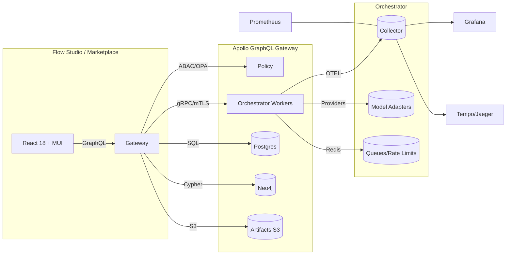

# IntelGraph Maestro Conductor — Competitive Surpass Plan (AI App Builders & Agent Platforms)

**Doc ID:** mc-sprints-competitor-surpass-2025.09.30  
**Owner:** Maestro Conductor (MC)  
**Status:** Draft for review → PRD-ready  
**Scope Window:** Sprints 1–4 (8 weeks)  
**Guardrails:** Use IntelGraph Org Defaults (SLOs, cost, privacy, security, provenance)

---

## 0) Conductor Summary
**Goal:** Exceed the capabilities and enterprise readiness of leading AI-app builders/agent platforms (e.g., AI Box, Langflow, Flowise, OpenAI GPTs/Store, Azure Prompt Flow, Google Vertex AI Agent Builder, AWS Bedrock Agents, Dust, Humanloop) while staying within SLO/cost guardrails. 

**Non‑Goals:** Competing in commodity hosting; building hardware edge boxes; re‑implementing cloud providers’ managed AI services. 

**Assumptions:** Multi‑model, multimodal, marketplace monetization, and no/low‑code UX are table stakes; enterprise governance, provenance, and ops are our differentiators.

**Definition of Done:** A creator → enterprise pipeline: build in Visual Flow Studio; policy/provenance enforced; deploy to governed marketplace; observe SLOs; bill usage; pass acceptance packs herein.

**Success KPIs:**
- Time‑to‑first app: ≤ **5 minutes** from template to runnable.
- Template depth: **50+** production‑grade templates (with tests, policies, cost notes).
- Model coverage: **20+ adapters** with smart routing/fallback.
- Marketplace: policy scan + rev‑share; enterprise invoices.
- SLOs: Per IntelGraph defaults; burn‑rate alerts wired.
- Cost: Alert at 80% budget; unit cost targets met.

---

## 1) Competitor Landscape & Where We Surpass

### 1.1 Platforms in Scope
- **AI Box (aibox.ai):** no‑code multimodal builder + marketplace.
- **Langflow:** visual/low‑code agent + RAG flows; MCP servers.
- **Flowise:** open‑source drag‑drop agents/workflows.
- **OpenAI GPTs/Store:** custom GPTs + distribution/monetization.
- **Azure Prompt Flow (AI Foundry):** lifecycle tooling for LLM apps.
- **Google Vertex AI Agent Builder:** enterprise multi‑agent orchestration.
- **AWS Bedrock Agents:** managed agents with Guardrails.
- **Dust, Humanloop, HoneyHive, Prompt tools:** evals, prompt mgmt, app scaffolds.

### 1.2 Surpass Criteria (Capability Matrix)
| Capability | MC (target) | AI Box | Langflow | Flowise | GPTs/Store | Azure PF | Vertex Agent | Bedrock Agents |
|---|---|---:|---:|---:|---:|---:|---:|---:|
| Visual flow builder | Studio + test‑as‑you‑build | ✓ | ✓ | ✓ | — | ✓ | ✓ | — |
| Marketplace & monetization | Governed, policy‑scanned, rev‑share | ✓ | — | — | ✓ | — | Agent Garden (samples) | — |
| Multi‑model routing | Cost/latency/quality policies + fallback | — | partial | partial | opaque | partial | partial | managed |
| Provenance ledger (signed claims) | **Default‑ON** | — | — | — | — | — | — | Guardrails only |
| Policy (License/TOS/PII/retention) | **OPA admission + run‑time** | — | — | — | — | partial | partial | Guardrails |
| Observability (OTEL traces + SLO gates) | **First‑class** | — | — | — | — | partial | partial | partial |
| Enterprise identity (OIDC/SCIM/ABAC) | **Built‑in** | — | — | — | — | ✓ | ✓ | ✓ |
| BYO infra/providers; export | **No lock‑in** | — | ✓ | ✓ | — | partial | partial | managed |

**MC Edge:** Governance + provenance + SLO‑driven ops **as features**, not afterthoughts; BYO providers; high‑quality templates with tests & cost notes; exportable flows.

---

## 2) Integrated Roadmap (4 Sprints, 2 weeks each)
Trunk‑based dev; weekly cut to staging; biweekly prod. Sprints align to reuse artifacts across swimlanes.

### Sprint 1 — Visual Flow Studio + Provenance v1 (Weeks 1–2)
**Epics**
1. **Visual Flow Studio (Creator UX)**
   - Node palette: Prompt, Tool, HTTP, File I/O, Branch, Parallel, Rate‑limit, Retry/Timeout.
   - Inline runner with fixtures; schema contracts + validation; import/export (flow.json). 
   - Persisted queries; versioned templates.
2. **Provenance & Policy Hooks v1**
   - Signed claims per node: input/output hashes, model/provider, params, latency, cost.
   - OPA admission at deploy; policy decisions embedded in run evidence bundle.

**Key Acceptance (End‑to‑End):** Build **Daily AI Brief** from template in ≤5 min → run → export evidence.zip (manifest + signed claims) → verify hash chain.

**Dependencies:** Auth (OIDC), minimal billing stub for metering, S3 bucket for artifacts, Postgres/Neo4j readiness.

### Sprint 2 — Model Hub + Routing, Observability, Costing (Weeks 3–4)
**Epics**
1. **Model Adapters & Router**: OpenAI‑compat, Claude, Gemini‑style, local vLLM, image‑gen, ASR/TTS, embeddings.
2. **Observability First‑Class**: OTEL traces; Prom metrics; Grafana tenant dashboards; burn‑rate alerts.
3. **Cost Metering & Quotas**: Per‑call estimates/actuals; budgets; throttle at 100% (dev tenants).

**Key Acceptance:** Router satisfies policy *p95 latency ≤700ms & lowest cost* in 1000 trial runs with fallback success ≥99%.

### Sprint 3 — Governed Marketplace + Template Factory + Billing (Weeks 5–6)
**Epics**
1. **Marketplace v1**: Creator listing workflow; policy scan (licenses/PII); SBOM for flows; rev‑share ledger.
2. **Template Factory (50+)**: Curated, tested templates with policy & cost notes; gallery taxonomy.
3. **Billing**: Usage‑based billing (Stripe/InvoiceX), enterprise invoices; creator payouts.

**Key Acceptance:** Publish “Daily AI Brief” to marketplace; purchase; run; invoice; creator payout reconciles.

### Sprint 4 — Enterprise Hardening + Security + Admin (Weeks 7–8)
**Epics**
1. **Identity & Access**: OIDC SSO, SCIM; ABAC/OPA; project‑scoped secrets vault; mTLS.
2. **Privacy & Retention**: Field‑level encryption; retention tiers; RTBF; audit exports.
3. **SLO Gates & Chaos/Load**: CI gates for p95; canary/rollback; provider‑outage drills.

**Key Acceptance:** All SLO dashboards green; chaos drills auto‑rollback; RTBF removes PII while preserving provenance graph.

---

## 3) Detailed Backlog — Stories, Acceptance Criteria, Verification

### 3.1 Flow Studio (Sprint 1)
- **Story:** Implement node schema contracts with JSON Schema + runtime validation.  
  **AC:** Invalid configs blocked with actionable errors; schema versioning supports migration.
- **Story:** Inline runner with fixtures.  
  **AC:** “Run with Fixture” executes graph in‑browser (sandbox) and in runtime worker; results match; evidence emitted.
- **Story:** Import/Export flow.json.  
  **AC:** Exported manifest hashes to same value upon re‑import.

### 3.2 Provenance v1 (Sprint 1)
- **Story:** Signed claim emitter per node.  
  **AC:** Evidence bundle contains hash(input)→hash(output); node params; duration; cost; signature verifies via platform key.
- **Story:** OPA admission policy.  
  **AC:** Deploy blocked when License/TOS mix violates rules; policy decision recorded in evidence.

### 3.3 Model Hub & Routing (Sprint 2)
- **Story:** Adapter interface + drivers (chat, vision, ASR/TTS, embeddings).  
  **AC:** Contract tests: send/receive; error typing; retries/backoff; cost report.
- **Story:** Router policy engine (latency/cost/quality).  
  **AC:** Synthetic eval selects optimal model ≥95% of runs; fallback on 5xx or degenerate outputs.

### 3.4 Observability (Sprint 2)
- **Story:** OTEL tracing across nodes.  
  **AC:** Each node emits child span with attributes (model, tokens, cache‑hit, retries, cost); trace fan‑out visible.
- **Story:** Dashboards + alerts.  
  **AC:** Burn‑rate alerts at 25%/50%/80%; links to playbooks.

### 3.5 Marketplace & Templates (Sprint 3)
- **Story:** Listing workflow + review queue.  
  **AC:** Only policy‑passing flows publish; SBOM produced.
- **Story:** Template taxonomy & quality bar.  
  **AC:** Each template ships tests (unit/e2e), fixtures, cost note, and policy notes.

### 3.6 Security/Privacy/Admin (Sprint 4)
- **Story:** ABAC via OPA + scopes.  
  **AC:** Unit/contract tests show least‑privilege; deny by default.
- **Story:** RTBF.  
  **AC:** RTBF job redacts/deletes PII fields; provenance links preserved via surrogate keys.

---

## 4) Architecture & ADRs

### 4.1 High‑Level Diagram (Mermaid)


### 4.2 ADR‑001: Provenance as First‑Class
**Decision:** Every execution step emits signed claims; evidence bundles are immutable and exportable.  
**Status:** Accepted.  
**Consequences:** Slight overhead; massive auditability, debugging, and compliance wins.

### 4.3 ADR‑002: OPA Everywhere (Admission + Runtime)
**Decision:** Policies as code govern deploy and runtime actions (license/TOS/PII/retention).  
**Status:** Accepted.  
**Consequences:** Clear governance; deterministic decisions; easier certifications.

### 4.4 ADR‑003: Router Policies
**Decision:** Routing driven by cost/latency/quality w/ fallback; pluggable signals (evals, vendor SLIs).  
**Status:** Accepted.

---

## 5) Data & Policy Model

### 5.1 Canonical Entities (subset)
- **Flow, Node, Template, Run, Evidence, PolicyDecision, Listing, Purchase, Invoice, Budget, Alert.**

### 5.2 Retention & Purpose Tags
- **Retention:** ephemeral‑7d, short‑30d, standard‑365d, long‑1825d, legal‑hold.
- **Purpose:** investigation, threat‑intel, fraud‑risk, t&s, benchmarking, training, demo.

### 5.3 OPA Policy (Rego) — License/TOS Gate (snippet)
```rego
package mc.policy.license

# Inputs: flow.manifest, nodes[*].license_class, output.license_class
# Allowed classes: MIT_OK, OPEN_DATA_OK, RESTRICTED_TOS, PROPRIETARY_CLIENT, EMBARGOED

# Block mixing Restricted‑TOS outputs with Open‑Data exports
violation[msg] {
  some i
  node := input.flow.nodes[i]
  node.output.license_class == "RESTRICTED_TOS"
  input.flow.export.target == "OPEN_DATA_OK"
  msg := sprintf("Restricted‑TOS cannot export to Open‑Data: node %s", [node.id])
}

# Enforce PII → short‑30d unless legal‑hold
violation[msg] {
  input.flow.data.contains_pii
  input.flow.retention_tier != "short-30d"
  not input.flow.legal_hold
  msg := "PII must use short-30d retention unless legal-hold"
}
```

---

## 6) APIs & Schemas (Contracts)

### 6.1 GraphQL SDL (excerpt)
```graphql
scalar JSON
scalar DateTime

type Flow { id: ID!, name: String!, version: String!, manifest: JSON!, createdAt: DateTime! }

type Run { id: ID!, flowId: ID!, status: String!, startedAt: DateTime!, finishedAt: DateTime, evidenceUrl: String }

type Listing { id: ID!, flowId: ID!, status: String!, priceCents: Int!, policyReport: JSON! }

type Query {
  flow(id: ID!): Flow
  runs(flowId: ID!, limit: Int = 50): [Run!]!
  listing(id: ID!): Listing
}

type Mutation {
  createFlow(name: String!, manifest: JSON!): Flow!
  runFlow(flowId: ID!, fixture: JSON): Run!
  publishListing(flowId: ID!, priceCents: Int!): Listing!
  purchase(listingId: ID!): Run!
}
```

### 6.2 Cypher — Provenance Write (conceptual)
```cypher
MERGE (r:Run {id:$runId})
WITH r
UNWIND $claims AS c
  MERGE (n:Node {id:c.nodeId})
  MERGE (r)-[:EMITTED]->(e:Evidence {id:c.claimId})
  SET e += {
    inputHash:c.in,
    outputHash:c.out,
    provider:c.provider,
    model:c.model,
    latencyMs:c.latency,
    costUSD:c.cost,
    signature:c.sig
  }
```

### 6.3 SQL — Billing Tables (simplified)
```sql
CREATE TABLE usage_events (
  id UUID PRIMARY KEY,
  tenant_id UUID NOT NULL,
  run_id UUID NOT NULL,
  tokens_in INT,
  tokens_out INT,
  cost_usd NUMERIC(10,4),
  occurred_at TIMESTAMP NOT NULL
);

CREATE TABLE invoices (
  id UUID PRIMARY KEY,
  tenant_id UUID NOT NULL,
  period_start DATE,
  period_end DATE,
  total_cents INT,
  status TEXT
);
```

---

## 7) Testing Strategy & Acceptance Packs

### 7.1 Fixtures (YAML)
```yaml
# fixtures/daily_ai_brief.yaml
inputs:
  topic: "AI policy and research"
  sources:
    - rss: https://example.com/ai.xml
expectations:
  summary_length: 200-400
  contains_keywords:
    - "policy"
    - "research"
policy:
  retention: short-30d
  license: OPEN_DATA_OK
```

### 7.2 Playwright e2e (Creator Flow)
```ts
import { test, expect } from '@playwright/test';

test('build-and-publish-daily-brief', async ({ page }) => {
  await page.goto('/studio');
  await page.getByRole('button', { name: 'Create from Template' }).click();
  await page.getByText('Daily AI Brief').click();
  await page.getByRole('button', { name: 'Run with Fixture' }).click();
  await expect(page.getByText('Run Succeeded')).toBeVisible();
  await page.getByRole('button', { name: 'Export Evidence' }).click();
  await page.getByRole('button', { name: 'Publish' }).click();
  await expect(page.getByText('Policy Scan Passed')).toBeVisible();
});
```

### 7.3 k6 Load (Router Policy)
```js
import http from 'k6/http';
import { check, sleep } from 'k6';

export const options = { vus: 50, duration: '2m' };

export default function () {
  const res = http.post(`${__ENV.API}/run`, JSON.stringify({
    flowId: __ENV.FLOW,
    policy: { latencyP95: 700, minimizeCost: true }
  }), { headers: { 'Content-Type': 'application/json', 'Authorization': `Bearer ${__ENV.TOKEN}` }});
  check(res, { 'status 200': r => r.status === 200 });
  sleep(1);
}
```

### 7.4 Jest Unit (Provenance Signatures)
```ts
import { sign, verify } from '../crypto';

test('evidence signatures verify', () => {
  const claim = { in: 'h1', out: 'h2', model: 'x', cost: 0.001 };
  const sig = sign(claim);
  expect(verify(claim, sig)).toBe(true);
});
```

### 7.5 OPA Policy Tests (Rego)
```rego
package mc.policy.license_test

import data.mc.policy.license as pol

# test: PII must use short-30d
pii_short30d {
  not pol.violation with input as {
    "flow": {"data": {"contains_pii": true}, "retention_tier": "short-30d"}
  }
}
```

### 7.6 Chaos Drill Script (pseudo)
```bash
# Simulate provider outage
kubectl scale deploy model-adapter-openai --replicas=0
# Verify router fallback
./smoke run router-fallback.spec.json
# Expect SLO gates to block new rollout
```

---

## 8) Observability Plan
- **Metrics:** per-node latency, error rate, retries, tokens, cache hit rate, cost USD, queue depth.
- **Logs:** structured JSON, correlation IDs; policy decisions; redaction for PII.
- **Traces:** parent = Run, child = Node spans; attributes (model, params hash, retries, cost).
- **Dashboards:** Team views per tenant; SLO reports; cost burn.
- **Alerts:** Error budget 25/50/80%; cost 80%; queue depth > threshold; provider 5xx bursts.

---

## 9) Security & Privacy
- **Identity:** OIDC SSO, SCIM; WebAuthn for admin; project‑scoped secrets.
- **Access:** ABAC with OPA; least‑privilege; deny by default.
- **Data:** Field‑level encryption for sensitive attrs; retention tiers enforced jobs; RTBF workflow preserving evidence linkage.
- **Compliance:** SBOM for flows; policy reports attached to listings; export manifests signed.

---

## 10) Template Factory (50+) — Buckets & Examples
- **Briefing/Research:** Daily AI Brief; Earnings Digest; Policy Monitor; Paper Summarizer.
- **RAG/Docs:** Contract QA; Support KB Assistant; Oncall Runbook QA; SOC Playbook Assistant.
- **Creative/Media:** Image Caption→Writer; Scriptwriter; Podcast Show Notes; Storyboarder.
- **Voice/Meetings:** Voice Notes→Action Items; Meeting Minutes; Call QA.
- **ETL/Graph:** CSV→Graph Loader; Entity Resolver; Log Anomaly Tagger.
- **Agents/Automation:** Multi‑tool Researcher; Ticket Triage→Auto Reply; Compliance Checker.

Each ships with: fixtures, e2e tests, policy notes, cost estimates, and evidence manifest.

---

## 11) Marketplace (Governed) — Workflow
1. Creator submits listing → auto policy scans (license/PII/retention) → SBOM gen. 
2. Reviewer approves → listing staged with price, rev‑share terms. 
3. Buyer purchases → entitlement grants run rights; usage metered; invoice end of period.

**Admin Controls:** takedown, version pinning, price caps, regional availability.

---

## 12) Copy & Collateral (snippets)
- **Homepage H1:** “Build governed AI apps in minutes. Ship with provenance.”
- **Subhead:** “No‑code studio, multi‑model routing, enterprise policies, and a governed marketplace.”
- **Studio Empty‑State:** “Drag nodes or start from 50+ production templates.”
- **Marketplace Badge:** “Policy‑Scanned ✓ Provenance‑Backed ✓”

**Sales One‑Pager bullets:**
- Reduce AI risk with signed evidence trails.
- Hit p95 latency SLOs with smart routing.
- Exportable flows; no vendor lock‑in.

---

## 13) Ops & IaC

### 13.1 Helm Values (excerpt)
```yaml
orchestrator:
  replicas: 3
  resources:
    requests: { cpu: "500m", memory: "1Gi" }
    limits: { cpu: "2", memory: "4Gi" }
  env:
    OPA_URL: http://opa:8181
    OTEL_EXPORTER_OTLP_ENDPOINT: http://otel-collector:4317

budget:
  monthly_usd: 18000
  alert_threshold: 0.8
```

### 13.2 Terraform Skeleton (S3 + Postgres)
```hcl
module "artifacts_bucket" {
  source = "./modules/s3-bucket"
  name   = "mc-artifacts"
  versioning = true
}

module "postgres" {
  source = "./modules/pg"
  instance_class = "db.m6g.large"
  multi_az = true
}
```

---

## 14) RACI (abbrev.)
- **Product:** R (roadmap), A (acceptance) — PM
- **Studio FE:** R — FE1/FE2; C — Design
- **Orchestrator/Adapters:** R — BE1/BE2
- **Policy/OPA:** R — SecEng1
- **SRE/Observability:** R — SRE1/SRE2
- **Billing/Finance:** R — FinEng
- **QA:** V&V — QA1
- **Docs/DX:** C — Tech Writer

---

## 15) Risks & Mitigations
- **Feature creep** → Strict acceptance packs; template quality bar.
- **Provider quota/latency variance** → Router fallback; caching; budgets; backpressure.
- **Marketplace compliance** → Policy scans + reviewer workflow; takedown process.
- **Cost overruns** → Alerts at 80%; unit‑cost SLOs; test data caching.

---

## 16) Release Validation Checklist
- [ ] “Daily AI Brief” built and published in ≤5 min.
- [ ] Router meets p95 latency/cost policy with fallbacks.
- [ ] Evidence bundle verifies signatures/hashes.
- [ ] Invoice + creator payout reconcile to cents.
- [ ] SLO dashboards green; chaos rollback successful.
- [ ] RTBF passes; audit export verified.

---

## 17) Appendices

### A) Example Flow Manifest (JSON)
```json
{
  "id": "daily-brief",
  "version": "1.0.0",
  "nodes": [
    { "id": "rss", "type": "http", "config": { "url": "https://example.com/ai.xml" }},
    { "id": "parse", "type": "tool", "config": { "name": "rssParse" }},
    { "id": "summary", "type": "llm", "config": { "policy": { "latencyP95": 700, "minimizeCost": true }}}
  ],
  "edges": [
    { "from": "rss", "to": "parse" },
    { "from": "parse", "to": "summary" }
  ],
  "retention_tier": "short-30d",
  "license_class": "OPEN_DATA_OK"
}
```

### B) Evidence Manifest (YAML)
```yaml
run: 1a2b-3c4d
flow: daily-brief@1.0.0
claims:
  - node: rss
    in: "-"
    out: 1a1a1a
    latency_ms: 120
    sig: abcd...
  - node: summary
    in: 1a1a1a
    out: 2b2b2b
    model: router://policy(latency<=700,minCost)
    cost_usd: 0.0021
    sig: bcde...
policy:
  decisions: