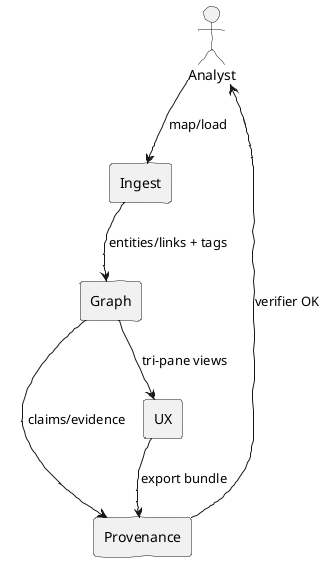

# Summit Status, Gaps, and PRD for MVP‑2 → GA | IntelGraph Advisory Report | GitHub Branch: feature/mvp2-prd

> As Chair, I present the findings of the IntelGraph Advisory Committee on the **Summit** repo’s current state, gaps, and the product specification for **MVP‑2** and **GA**. Consensus is noted where unanimous; dissents are highlighted.

---

## Consensus Summary

**Unanimous View:** Summit is ready to consolidate into a coherent **IntelGraph Core**: ingestion → graph core → provenance → analyst UX → ops. We should ship **MVP‑2** as a hardening + coherence release (tri‑pane UX + ingest wizard + ER + provenance export + 10 connectors + SSO/ABAC), then lock **GA** around verifiable analytics, cost guardrails, and runbook proofs. **Dissents:** **🛰 Starkey** cautions on federated trust exchange without robust ZK tests. **🛡 Foster** flags privacy/authority binding as release blockers if proofs are not surfaced in UX.

---

## Where We Are (Now)

**Architecture inventory (high‑level):**

- **Connectors & Pipelines:** `connectors/`, `data-pipelines/`, `airflow/`, early enrichers (OCR/STT/object‑det/EXIF scrub stubs). Streaming ETL patterns exist; need schema‑aware mapping and DPIA/redaction presets.
- **Graph & Reasoning:** Canonical entity/relationship model foundations; utilities for paths/centrality/anomaly baselines; hypothesis/narrative helpers in progress.
- **AI Copilot & GraphRAG:** NL → query generation stubs; citations & provenance hooks planned; guardrails TBD.
- **Provenance & Claim Ledger:** Service boundary drafted for evidence/claim registration and export manifests.
- **UI:** Web app shells (`apps/`, `conductor-ui/`, `dashboard/`) with tri‑pane aspirations; needs synchronized time‑brushing + provenance/XAI overlays.
- **Security/Governance:** OIDC/SSO hooks, policy tags, audit rails scaffolding; ABAC via OPA planned; step‑up auth not yet wired end‑to‑end.
- **Ops:** Helm/Charts/Terraform skeletons, Prom/OTEL instrumentation, chaos/DR stubs, cost guard beginnings.

> Chair note: The above stacks align with Council Wishbooks (Final, Expanded, Summit, Ascent Beyond). We scope MVP‑2 to deliver a crisp, verifiable slice through these layers.

---

## Where We Need to Be

- **MVP‑2 (Next Release):** a fully analyst‑usable slice delivering **ingest → resolve → analyze → report** with verifiable provenance and policy‑bound access. Hardening, coherence, and demo‑quality.
- **GA (Core Platform 1.0):** proof‑carrying analytics, zero‑copy trust exchange (limited), cost/energy guard, and agent/runbook provers with replayable logs.

---

## Product Requirements Document (PRD)

### 1) Product Overview

**Problem:** Analysts lack a single, verifiable system to ingest diverse signals, resolve entities, analyze over time/space, and publish briefs with auditable provenance, privacy, and authority compliance.

**Vision:** IntelGraph Core — a secure, multi‑tenant intelligence graph with **provenance‑first**, **compartmentation by default**, and **auditable AI** that shortens **Ingest → Resolve → Analyze → Decide → Report** to hours with trust‑grade outputs.

**Primary Users:**

- Intelligence & CTI analysts; DFIR and fraud teams; humanitarian/rights verifiers; investigative journalists (ethical & licensed use only).  
  **Secondary Users:** Platform admins, privacy/ombuds officers, legal/compliance.

**Personas & Jobs:**

- _Analyst:_ load evidence, resolve entities, find patterns/paths, build COAs, export brief with proofs.
- _Lead:_ triage risk/anomalies, assign tasks, review dissent, sign off.
- _Ombuds:_ ensure lawful authority/purpose, review proofs, block unsafe exports.
- _Admin:_ manage tenants, policies, keys, SLOs, and cost guardrails.

---

### 2) Goals & Non‑Goals

**MVP‑2 Goals**

1. **Ingest Wizard + Schema‑Aware ETL:** map CSV/JSON to canonical entities in ≤10 minutes; PII detection, DPIA checklist, redaction presets, license/TOS enforcement.
2. **Entity Resolution (ER) v1:** deterministic + probabilistic merge, explainable scorecards; manual reconcile queue.
3. **Tri‑Pane Analyst UX:** synchronized **timeline ↔ map ↔ graph**, pinboard, filters, time‑brushing; “Explain this view” panel.
4. **Provenance Export v1:** evidence/claims registered in provenance ledger; one‑click **Disclosure Bundle** (hash manifest + chain‑of‑custody).
5. **Security & Governance v1:** multi‑tenant isolation; OIDC SSO; ABAC/RBAC via OPA; immutable audit; reason‑for‑access prompts.
6. **Connectors (10+):** CSV/Parquet, RSS/HTTP, STIX/TAXII, MISP, sanctions lists (OFAC/EU/UK), DNS/WHOIS, Slack/Jira (meta), SIEM adaptor stub.
7. **Ops & SLOs:** OTEL traces, Prom metrics, p95 query < 1.5s (3 hops, 50k nodes), ingestion E2E < 5m for 10k docs; cost guard v1 (slow‑query killer/budgeter).

**GA Goals**

1. **Proof‑Carrying Analytics (PCA):** signed lineage + model cards + checksum trees; external verifier CLI.
2. **GraphRAG with Citations:** path rationales and snippet provenance; redaction‑aware publishing.
3. **Runbook Provers:** machine‑checkable pre/post‑conditions (authority/license/DP, KPIs met, citations present). Block export on failure.
4. **ZK Trust Exchange (limited):** cross‑tenant deconfliction over hashed features with zero leakage; revocable escrow.
5. **Cost/Energy Guard:** $/insight budgeting; batch scheduling to green/low‑cost windows.
6. **Resilience:** Offline/edge kit with CRDT merges; cross‑region replicas; monthly chaos drills; RTO ≤ 1h / RPO ≤ 5m.
7. **Admin Studio:** schema registry; connector health; job retries/backfills; feature flags.

**Non‑Goals (both phases)**

- No unlawful surveillance, targeted violence enablement, or mass repression tooling.
- No biometric identification without explicit lawful authority and minimization.

---

### 3) Detailed Requirements

**Functional (MVP‑2)**

- **Ingest Wizard:** field mapping AI suggestions; schema validation; DPIA checklist; PII tags; license registry checks; lineage recording.
- **ER:** configurable matchers (email, phone, name+geo+time, selector patterns); scorecards; manual review; reversible merges.
- **Analytics:** pathfinding (shortest/K), community (Louvain/Leiden), centrality (betweenness/eigenvector); anomaly baselines; pattern templates (co‑presence, rendezvous).
- **UX:** tri‑pane sync; command palette; diff/undo/redo; provenance tooltips; confidence opacity.
- **Provenance:** claim graph model; export bundles with manifests; external hash check.
- **Security:** tenant isolation; ABAC on policy tags (origin/sensitivity/legal basis/purpose/retention); audit search.
- **Integrations:** STIX/TAXII ± MISP bidirectional; productivity (Slack/Jira meta); SIEM stubs (Splunk/Elastic).

**Functional (GA additions)**

- **PCA:** verifier CLI + replay DAG on fixtures; tamper alarms.
- **GraphRAG:** natural‑language to Cypher/SQL preview; sandbox execution; citations & redaction awareness.
- **Runbook Provers:** proofs emitted/stored; ombuds queues; “Explain‑this‑decision” reveals evidence/dissent/policy bindings.
- **ZK‑TX:** overlap proofs; revocation timers; selective disclosure packages.
- **Cost/Energy:** query budget planner; archived tiering to S3/Glacier; energy usage reports.

**Non‑Functional**

- **Performance:** p95 < 1.5s (typical queries), ingestion benchmarks published; autoscaling policies.
- **Security/Privacy:** STRIDE coverage; WebAuthn/FIDO2; k‑anonymity/redaction presets; purpose limitation; jurisdictional routing.
- **Reliability:** SLO dashboards; DR drills; offline kits; PITR.
- **Explainability:** model cards & XAI overlays; reproducible runs with seeds/configs.
- **Compliance:** warrant/authority registry; license/TOS compiler; immutable audit.

**Acceptance Criteria (samples)**

- CSV→entities mapping in ≤10 min on golden sample; PII flagged; redaction preview; blocked fields show license reasons.
- ER decisions show features/scores/overrides; rollback supported.
- Tri‑pane sync verified with scripted interaction tests; “Explain this view” cites sources; no uncited assertions in reports.
- Export bundle validates externally; any mutation triggers mismatch alert.
- ZK‑TX demo: true/false overlap proofs with zero leakage logs.

---

### 4) Release Metrics

- **Time‑to‑hypothesis (seeded case):** < 30 minutes (MVP‑2); < 15 minutes (GA).
- **Precision/Recall (pattern templates):** ≥ 0.7/0.7 on labeled set (MVP‑2); ≥ 0.8/0.75 (GA).
- **Provenance coverage:** 100% of published claims carry manifests.
- **Guardrail efficacy:** 100% of blocked actions show reason + appeal path.
- **Cost/energy:** 20–40% reduction vs. baseline by GA.

---

### 5) Rollout Plan

- **Environments:** dev → stage → prod; ephemeral preview envs per PR.
- **Canary:** feature flags for Ingest Wizard, ER, PCA verifier; gradual tenant rollout.
- **Docs & Training:** playbooks, model cards, privacy/ethics guides; sample datasets; demo mode with synthetic data.
- **Validation:** unit/contract/Cypher tests; k6 load; chaos drills; security scans; red‑team prompts logged.

---

### 6) Risks & Mitigations

| Risk                         | Phase | Severity | Mitigation                                                                                 |
| ---------------------------- | ----- | -------: | ------------------------------------------------------------------------------------------ |
| ZK deconfliction immaturity  | GA    |     High | Limit scope to hashed‑selector overlap; publish leakage proofs; stage‑only partners first. |
| ER false merges              | MVP‑2 |     High | Human‑in‑loop queues; reversible merges; score explainers; golden tests.                   |
| Policy compiler gaps         | Both  |     High | Externalize OPA; unit tests for policy hits; diff simulator for changes.                   |
| Cost spikes on graph queries | Both  |      Med | Query budgeter; slow‑query killer; caching; archived tiers.                                |
| UX complexity                | MVP‑2 |      Med | Command palette; presets; A11y; training lab.                                              |
| Data license violations      | Both  |     High | License registry; query‑time enforcement; export blockers with owner clauses.              |

---

## Engineering Plan (by epic)

### E1. Ingest & ETL (MVP‑2)

- **Deliverables:** Connectors (CSV/Parquet, RSS, STIX/TAXII, MISP, sanctions, DNS/WHOIS), Ingest Wizard, ETL assistant, enrichers (GeoIP/lang/hash/EXIF/OCR/STT), license registry.
- **Tech:** Kafka/Kinesis optional; workers; schema registry; PII classifiers; OpenAPI for connectors; golden IO tests.
- **Done When:** Mapping ≤10 min; DPIA + redaction presets; lineage persisted.

### E2. Graph Core & ER (MVP‑2)

- **Deliverables:** Canonical ontology; ER engine + queues; temporal/bitemporal primitives; geo‑temporal motifs.
- **Tech:** Neo4j/JanusGraph option; Cypher/Gremlin; path/community/centrality libs.
- **Done When:** ER explainers pass tests; snapshot‑at‑time queries consistent; convoy/rendezvous detection demo.

### E3. Provenance & Export (MVP‑2 → GA)

- **Deliverables:** Claim/Evidence registry; manifest exporter; external verifier CLI (GA).
- **Tech:** Hash trees; signatures; JSON‑LD; portable “Provenance Wallet” format; verifier in Go/TS.
- **Done When:** External verification passes; revocation propagates on reopen.

### E4. Analyst UX (MVP‑2)

- **Deliverables:** Tri‑pane; pinboards; diff/undo/redo; “Explain this view”; XAI overlays.
- **Tech:** React/Tailwind; Mapbox; graph canvas; timeline sync; keyboard‑first.
- **Done When:** Task time reductions measured; user tests pass; screenshot diffs stable.

### E5. Security/Governance (MVP‑2 → GA)

- **Deliverables:** OIDC/SSO; ABAC/RBAC with OPA; audit trail; reason‑for‑access prompts; WebAuthn/FIDO2; warrant/authority binding.
- **Tech:** Key mgmt (per‑tenant envelopes); policy tags; audit search with anomaly alerts.
- **Done When:** STRIDE controls mapped; zero criticals before release.

### E6. Ops, Cost & DR (MVP‑2 → GA)

- **Deliverables:** OTEL/Prom dashboards; cost guard; autoscaling policies; PITR; cross‑region replicas; chaos drills; offline kit.
- **Done When:** SLOs green 30 days; chaos passes; budget adherence proven.

### E7. GraphRAG & Agents (GA)

- **Deliverables:** NL→Cypher preview; sandbox exec; citation‑first RAG; runbook provers; replay logs.
- **Done When:** 95% syntactic validity; all briefs carry citations; failing provers block export.

---

## Individual Commentaries

### 🪄 Elara Voss

- _“By the runes of Scrum, MVP‑2 is a convergence sprint: **Ingest Wizard, ER v1, Tri‑Pane UX**, and **Provenance Export**. No more scope‑creep familiars.”_
- _“Backlog hygiene: acceptance tests for mapping/ER/tri‑pane first; demo data kit; burndown charms on cost guard.”_

### 🛰 Starkey

- _“Reality check: federation is a minefield. **ZK exchange stays limited** until leakage proofs and revocation timers are battle‑tested.”_
- _“Edge autonomy without CRDT proofing invites divergence. Offline kit must ship with conflict‑resolution receipts.”_

### 🛡 Foster

- _“Operational vectors indicate privacy/authority proofs must be **visible in the UX**. Ombuds workflows are not optional; export without proofs is a blocker.”_
- _“[RESTRICTED] Selector minimization and purpose limitation must tie into query execution, not just policy docs.”_

### ⚔ Oppie (11‑persona consensus)

- _“We decree unanimously: ship **Proof‑Carrying Analytics** and **Runbook Provers** at GA; purge any opaque agent flows.”_
- _“Beria demands liquidation of premature federation. Alliance without leakage or not at all.”_

### 📊 Magruder

- _“For executive traction: lead with **Provenance Wallets** and **cost guard**. They sell in courtrooms and CFO rooms.”_
- _“Positioning: ‘**Evidence‑first Graph**’ beats hype. Publish verifier and win trust.”_

### 🧬 Stribol

- _“Cross‑source analysis reveals we can land **pattern miner** templates fast (co‑presence, rendezvous, structuring) and get immediate analyst wins.”_
- _“Propose emergent: **license compiler** as a bytecode pass before query execution.”_

---

## Chair Synthesis (Actionable)

### A) 90‑Day Action Plan (MVP‑2)

1. **Shipping epics:** E1–E6 above, with weekly demo gates and golden tests.
2. **UX polish:** tri‑pane sync; “Explain this view”; provenance tooltips; command palette; A11y AAA.
3. **Compliance rails:** license registry + export blockers; reason‑for‑access prompts; warrant registry stub.
4. **Ops maturity:** SLO dashboards; chaos drill (pod kill, broker loss); cost guard v1; offline kit v1.

### B) Risk Matrix

| Threat             |  Likelihood | Impact | Owner    | Mitigation                              |
| ------------------ | ----------: | -----: | -------- | --------------------------------------- |
| ER mis‑merges      |         Med |   High | Graph    | Scorecards; manual queues; rollback.    |
| Federation leakage | Low (MVP‑2) |   High | Security | Limit scope; proofs; revocation escrow. |
| Cost blowouts      |         Med |    Med | Ops      | Budgeter; slow‑query killer; caching.   |
| Export w/o proofs  |         Low |   High | Prov     | Blockers; ombuds queue.                 |
| UX overload        |         Med |    Med | Frontend | Command palette; presets; onboarding.   |

### C) Reference Code (Guy IG)

```ts
// License/Authority guard (query gate) — MVP‑2
export async function guardQuery(ctx, queryPlan) {
  const { purpose, legalBasis, licenseTags } = ctx;
  if (!purpose || !legalBasis)
    throw new Error('Blocked: missing purpose/legal basis');
  for (const step of queryPlan.steps) {
    if (step.usesDisallowedSelector(licenseTags)) {
      throw new Error(`Blocked: license ${step.blockedBy} at ${step.path}`);
    }
  }
  return queryPlan; // proceed; audit trail records purpose & tags
}
```

```cypher
// Geo‑temporal rendezvous detection — MVP‑2 template
MATCH (a:Person)-[:LOCATED_AT]->(la:LocationEvent),
      (b:Person)-[:LOCATED_AT]->(lb:LocationEvent)
WHERE la.geoCell = lb.geoCell
  AND abs(duration.inMinutes(la.at, lb.at).minutes) < 15
WITH a,b, collect({where: la.geoCell, when: la.at}) AS meets
WHERE size(meets) >= 2
RETURN a,b,meets
```

```bash
# Provenance bundle verify — GA CLI sketch
intelgraph-prov verify ./bundle.igprov \
  --expect-signature org=IntelGraph --check-hash-tree --fail-on-diff
```

### D) OKRs

- **O1:** Ship MVP‑2 within 90 days with 4 public demos and green SLOs.
- **O2:** Reduce time‑to‑hypothesis by 50% vs. baseline case.
- **O3:** 100% of exports carry verifiable manifests.
- **O4:** Cut infra cost per investigation by 25%.

---

## Attachments



**MVP‑2 OKR Table**
| Objective | Key Results | Owner |
|---|---|---|
| Ship coherent analyst slice | Ingest wizard; ER v1; tri‑pane; provenance export | PM/Eng |
| Trust by default | 100% exports with manifests; guardrails in UX | Prov/UX |
| Operate reliably | p95 <1.5s; DR drill pass; budgeter catching 95% slow queries | Ops |

---

## Closing

The Committee stands ready to advise further. **End transmission.**
