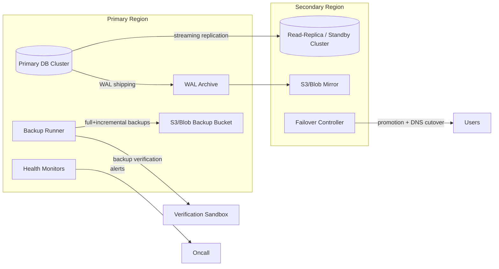

# Disaster Recovery Architecture

## Objectives
- Continuous automated backups with point-in-time recovery (PITR).
- Cross-region redundancy with deterministic failover automation.
- Verified restorability through scheduled backup validation tests.
- Runbooks that enable fast, predictable recovery for incidents and game-days.

## Logical Topology

## Data Protection Strategy
- **Backups**: Daily full base backup and 15-minute incremental WAL segments with retention tiering (hot: 14 days, warm: 30 days, cold: 6 months).
- **PITR**: WAL archiving enabled; restore window covers the full retention period.
- **Cross-Region Replication**: Streaming replication to a warm standby plus object storage replication for backup archives.
- **Failover Automation**: Health checks feed a controller that can promote the standby and update the traffic layer (DNS/GLB) after quorum approval.
- **Backup Verification**: Nightly restore into an isolated sandbox, integrity checks, and application smoke tests.
- **Observability**: Metrics (backup duration, lag, RPO/RTO), logs (per job), and alerts (SLO breaches, failed verifications, lag > threshold).

## Component Responsibilities
- **Backup Runner**: Drives scheduled backups, WAL uploads, retention pruning, and exports metrics.
- **Verification Sandbox**: Ephemeral environment restored from the latest successful backup to prove recoverability.
- **Failover Controller**: Performs health validation, initiates promotion, and orchestrates DNS/GLB updates with runbook-aligned steps.
- **Storage**: Versioned, encrypted buckets with lifecycle rules; cross-region replication enabled and integrity checks via checksums.

## RPO/RTO Targets
- **RPO**: ≤ 15 minutes (bounded by WAL upload frequency and replica lag).
- **RTO**: ≤ 30 minutes (automated promotion + DNS cutover; validated by runbooks and drills).

## Security & Compliance
- Backups encrypted at rest (KMS-managed keys) and in transit (TLS).
- Access controlled by least privilege IAM roles; audit logs retained.
- Secrets injected via environment variables or secret managers; never written to disk.
- Checksums (SHA-256) stored alongside archives to validate integrity pre-restore.

## Testing & Drills
- **Nightly**: Automated restore and integrity check in sandbox + smoke tests.
- **Weekly**: Planned failover drill using standby promotion, followed by controlled fallback.
- **Quarterly**: Full regional evacuation exercise with cross-region restore of backups and post-mortem.

## State-of-the-Art Enhancement
Adopt **immutable, content-addressed backup objects** with deduplication (e.g., `pgbackrest`/`wal-g` style) to shrink storage, accelerate incremental transfers, and enable parallel restore while preserving cryptographic integrity.
