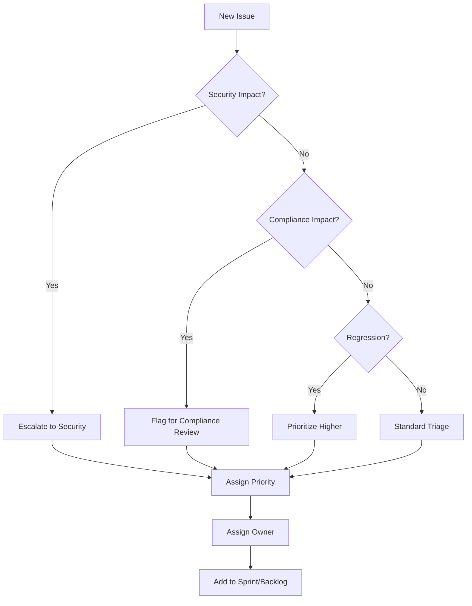

# Summit MVP-3 Bug Triage Process

## Overview

This document defines the bug triage workflow for Summit MVP-3 post-GA operations. All bugs are triaged within 24 hours of report and prioritized based on impact and severity.

## Bug Priority Matrix

| Priority      | SLA      | Criteria                                   |
| ------------- | -------- | ------------------------------------------ |
| P0 - Blocking | 4 hours  | Service outage, data loss, security breach |
| P1 - Critical | 24 hours | Major feature broken, compliance impact    |
| P2 - High     | 72 hours | Feature degraded, workaround exists        |
| P3 - Medium   | 1 week   | Minor functionality issues                 |
| P4 - Low      | 2 weeks  | Cosmetic, documentation, nice-to-have      |

## Labels

### Priority Labels

- `priority/p0-blocking` - Immediate action required
- `priority/p1-critical` - High priority
- `priority/p2-high` - Normal priority
- `priority/p3-medium` - Low priority
- `priority/p4-low` - Backlog

### Category Labels

- `bug/governance` - Governance verdict issues
- `bug/compliance` - Compliance framework issues
- `bug/security` - Security vulnerabilities
- `bug/performance` - Performance regressions
- `bug/api` - API behavior issues
- `bug/ui` - UI/UX issues
- `bug/plugin` - Plugin framework issues
- `bug/integration` - Integration issues

### Status Labels

- `status/needs-triage` - Awaiting triage
- `status/investigating` - Under investigation
- `status/confirmed` - Bug confirmed
- `status/in-progress` - Fix in development
- `status/needs-review` - PR ready for review
- `status/blocked` - Blocked by dependency

### Special Labels

- `regression` - Previously working feature
- `customer-reported` - Reported by customer
- `compliance-impact` - Affects compliance posture
- `security-impact` - Security implications

## Triage Workflow

### 1. Initial Triage (< 24 hours)



### 2. Triage Meeting Agenda

**Daily standup (15 min)**

- Review P0/P1 issues
- Update status on in-progress items
- Identify blockers

**Weekly triage (30 min)**

- Review all `status/needs-triage` issues
- Assign priorities and owners
- Plan for next sprint

### 3. Escalation Path

| Condition                      | Escalation              |
| ------------------------------ | ----------------------- |
| P0 not acknowledged in 1 hour  | Page on-call manager    |
| P1 not acknowledged in 4 hours | Notify team lead        |
| Customer-reported P0/P1        | Notify customer success |
| Security/Compliance impact     | Notify security team    |

## Bug Report Template

```markdown
## Bug Report

### Description

[Clear, concise description of the bug]

### Steps to Reproduce

1. [Step 1]
2. [Step 2]
3. [Step 3]

### Expected Behavior

[What should happen]

### Actual Behavior

[What actually happens]

### Environment

- Version: v3.0.x
- Environment: [production/staging/local]
- Tenant ID: [if applicable]
- Browser/Client: [if applicable]

### Logs/Screenshots

[Attach relevant logs or screenshots]

### Impact Assessment

- [ ] Affects governance verdicts
- [ ] Affects provenance chain
- [ ] Affects compliance posture
- [ ] Affects multiple tenants
- [ ] Customer facing
- [ ] Data integrity risk

### Workaround

[If any workaround exists]
```

## Hotfix Process

### P0/P1 Hotfix Workflow

1. **Create hotfix branch**

   ```bash
   git checkout -b hotfix/v3.0.x-issue-NNN main
   ```

2. **Implement minimal fix**
   - Fix only the immediate issue
   - No refactoring or unrelated changes
   - Add regression test

3. **Verify governance compliance**
   - Ensure GovernanceVerdict still enforced
   - Verify provenance metadata intact
   - Check audit logging works

4. **Fast-track review**
   - Require 1 reviewer for P1
   - Security team review for security bugs
   - Compliance team review for compliance bugs

5. **Deploy**

   ```bash
   # Tag the release
   git tag v3.0.x

   # Deploy to staging first
   ./deploy.sh staging

   # Verify fix
   ./smoke-test.sh staging

   # Deploy to production
   ./deploy.sh production
   ```

6. **Post-fix**
   - Update CHANGELOG.md
   - Close related issues
   - Notify stakeholders
   - Create post-mortem if P0

## Regression Test Requirements

All bug fixes MUST include:

1. **Unit test** reproducing the bug
2. **Integration test** if multi-component
3. **Governance test** if affects verdicts
4. **Compliance test** if affects framework

Example regression test:

```typescript
describe("BUG-123: Fix governance verdict timeout", () => {
  it("should return verdict within SLA even under load", async () => {
    // Arrange: Create load condition that triggered the bug
    const requests = Array(100)
      .fill(null)
      .map(() => governanceService.evaluate(mockRequest));

    // Act: Execute concurrent requests
    const start = Date.now();
    const results = await Promise.all(requests);
    const duration = Date.now() - start;

    // Assert: All verdicts returned within SLA
    expect(results.every((r) => r.verdict)).toBe(true);
    expect(duration).toBeLessThan(5000);
  });
});
```

## Metrics

Track these bug metrics weekly:

- **MTTR** (Mean Time to Resolve) by priority
- **Bug escape rate** (bugs found in production)
- **Regression rate** (bugs that recur)
- **Customer-reported bug ratio**
- **Compliance-impacting bug count**
