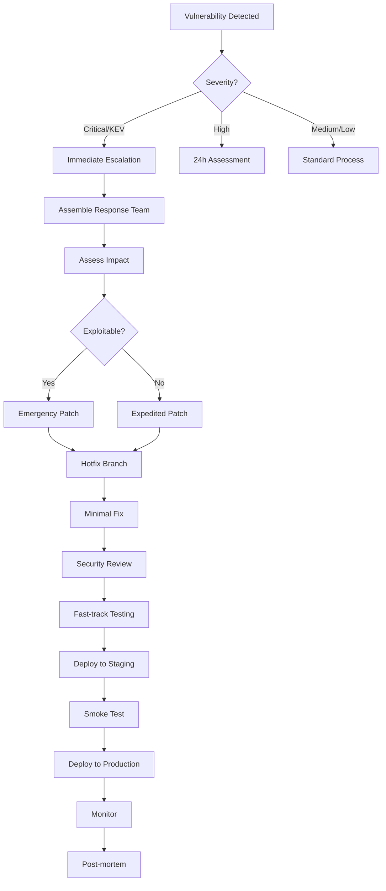

# Security Update and Dependency Monitoring

## Overview

This document defines the process for monitoring security advisories, managing dependency updates, and maintaining the security posture of Summit MVP-3.

## Vulnerability Advisory Sources

### Primary Sources

| Source            | Type             | Frequency | Action                  |
| ----------------- | ---------------- | --------- | ----------------------- |
| GitHub Dependabot | Automated PRs    | Real-time | Review within 24h       |
| npm audit         | Dependency scan  | Daily CI  | Fix critical within 48h |
| Snyk              | Vulnerability DB | Real-time | Integrate alerts        |
| NVD (NIST)        | CVE database     | Daily     | Monitor relevant        |
| CISA KEV          | Known exploited  | Real-time | Immediate for KEV       |

### Subscription Alerts

- GitHub Security Advisories (enabled)
- Node.js Security mailing list
- PostgreSQL security announcements
- Neo4j security updates
- Redis security advisories

## Automated Scanning

### Daily Dependency Audit

```yaml
# .github/workflows/security-audit.yml
name: Daily Security Audit

on:
  schedule:
    - cron: "0 6 * * *" # 6 AM UTC daily
  workflow_dispatch:

jobs:
  audit:
    runs-on: ubuntu-latest
    steps:
      - uses: actions/checkout@v4

      - name: Setup Node.js
        uses: actions/setup-node@v4
        with:
          node-version: "20"

      - name: Setup pnpm
        uses: pnpm/action-setup@v4
        with:
          version: "9"

      - name: Install dependencies
        run: pnpm install --frozen-lockfile

      - name: Run npm audit
        id: audit
        run: |
          pnpm audit --json > audit-results.json || true
          CRITICAL=$(jq '.metadata.vulnerabilities.critical // 0' audit-results.json)
          HIGH=$(jq '.metadata.vulnerabilities.high // 0' audit-results.json)
          echo "critical=$CRITICAL" >> $GITHUB_OUTPUT
          echo "high=$HIGH" >> $GITHUB_OUTPUT

      - name: Run Trivy scan
        uses: aquasecurity/trivy-action@master
        with:
          scan-type: "fs"
          scan-ref: "."
          format: "json"
          output: "trivy-results.json"
          severity: "CRITICAL,HIGH"

      - name: Check SBOM for known vulnerabilities
        run: |
          npx @cyclonedx/cyclonedx-npm --output-file sbom.json
          # Upload to vulnerability tracking system

      - name: Create issue for critical vulnerabilities
        if: steps.audit.outputs.critical > 0
        uses: actions/github-script@v7
        with:
          script: |
            const fs = require('fs');
            const audit = JSON.parse(fs.readFileSync('audit-results.json', 'utf8'));

            const criticalVulns = Object.entries(audit.advisories || {})
              .filter(([_, v]) => v.severity === 'critical')
              .map(([id, v]) => `- **${v.module_name}**: ${v.title} (${v.url})`)
              .join('\n');

            await github.rest.issues.create({
              owner: context.repo.owner,
              repo: context.repo.repo,
              title: `🚨 Critical Security Vulnerabilities Detected - ${new Date().toISOString().split('T')[0]}`,
              body: `## Critical Vulnerabilities Found\n\n${criticalVulns}\n\n**Action Required**: Review and patch within 48 hours.`,
              labels: ['security', 'priority/p0-blocking', 'automated']
            });

      - name: Notify security team
        if: steps.audit.outputs.critical > 0 || steps.audit.outputs.high > 0
        run: |
          curl -X POST ${{ secrets.SECURITY_SLACK_WEBHOOK }} \
            -H 'Content-Type: application/json' \
            -d '{
              "text": "⚠️ Security vulnerabilities detected",
              "blocks": [
                {
                  "type": "section",
                  "text": {
                    "type": "mrkdwn",
                    "text": "*Security Audit Alert*\nCritical: ${{ steps.audit.outputs.critical }}\nHigh: ${{ steps.audit.outputs.high }}"
                  }
                }
              ]
            }'

      - name: Upload audit artifacts
        uses: actions/upload-artifact@v4
        with:
          name: security-audit-${{ github.run_id }}
          path: |
            audit-results.json
            trivy-results.json
            sbom.json
          retention-days: 90
```

## Vulnerability Response SLAs

| Severity     | Detection | Assessment | Remediation | Deployment   |
| ------------ | --------- | ---------- | ----------- | ------------ |
| Critical/KEV | Immediate | 4 hours    | 24 hours    | 48 hours     |
| High         | 24 hours  | 48 hours   | 1 week      | 2 weeks      |
| Medium       | 1 week    | 2 weeks    | 1 month     | Next release |
| Low          | 2 weeks   | 1 month    | 3 months    | Quarterly    |

## Dependency Update Process

### 1. Automated Updates (Dependabot)

```yaml
# .github/dependabot.yml
version: 2
updates:
  - package-ecosystem: "npm"
    directory: "/"
    schedule:
      interval: "weekly"
      day: "monday"
      time: "06:00"
      timezone: "UTC"
    open-pull-requests-limit: 10
    labels:
      - "dependencies"
      - "automated"
    groups:
      production-deps:
        patterns:
          - "*"
        exclude-patterns:
          - "@types/*"
          - "eslint*"
          - "*jest*"
      dev-deps:
        patterns:
          - "@types/*"
          - "eslint*"
          - "*jest*"
    ignore:
      # Major version updates require manual review
      - dependency-name: "*"
        update-types: ["version-update:semver-major"]
    commit-message:
      prefix: "deps"
      include: "scope"

  - package-ecosystem: "github-actions"
    directory: "/"
    schedule:
      interval: "weekly"
    labels:
      - "ci"
      - "dependencies"
```

### 2. Manual Update Checklist

For major updates or security patches:

- [ ] Review changelog for breaking changes
- [ ] Check compatibility with Node.js 20
- [ ] Verify no governance/compliance impact
- [ ] Run full test suite
- [ ] Verify audit logging still works
- [ ] Check provenance tracking intact
- [ ] Performance regression test
- [ ] Security scan post-update
- [ ] Update lock file
- [ ] Document in CHANGELOG.md

### 3. Update Verification Script

```bash
#!/bin/bash
# scripts/verify-dependency-update.sh

set -euo pipefail

PACKAGE="${1:?Package name required}"
VERSION="${2:?Version required}"

echo "=== Verifying Update: $PACKAGE@$VERSION ==="

# 1. Install update
pnpm update "$PACKAGE@$VERSION"

# 2. Build verification
echo "Building..."
pnpm build || { echo "Build failed"; exit 1; }

# 3. Type check
echo "Type checking..."
pnpm typecheck || { echo "Type check failed"; exit 1; }

# 4. Run tests
echo "Running tests..."
pnpm test || { echo "Tests failed"; exit 1; }

# 5. Security audit
echo "Running security audit..."
pnpm audit || echo "Audit warnings present"

# 6. Governance tests
echo "Running governance tests..."
pnpm jest --testPathPattern="governance" || { echo "Governance tests failed"; exit 1; }

# 7. Check bundle size impact
echo "Checking bundle size..."
BEFORE_SIZE=$(du -sb dist | cut -f1)
pnpm build
AFTER_SIZE=$(du -sb dist | cut -f1)
SIZE_DIFF=$((AFTER_SIZE - BEFORE_SIZE))
echo "Bundle size change: ${SIZE_DIFF} bytes"

if [ $SIZE_DIFF -gt 1048576 ]; then
  echo "WARNING: Bundle size increased by more than 1MB"
fi

echo "=== Update Verification Complete ==="
```

## Security Patch Process

### Critical Vulnerability Response



### Emergency Patch Template

```markdown
# Security Patch: [CVE-YYYY-NNNN]

## Vulnerability Summary

- **CVE**: CVE-YYYY-NNNN
- **Severity**: Critical/High/Medium
- **CVSS Score**: X.X
- **Affected Component**: [package/module]
- **Affected Versions**: v3.0.0 - v3.0.x

## Impact Assessment

- **Exploitability**: [description]
- **Affected Data**: [what data is at risk]
- **Governance Impact**: [none/verdict bypass/etc.]
- **Compliance Impact**: [SOC 2/FedRAMP implications]

## Remediation

- **Patch Version**: v3.0.x
- **Fix Description**: [what the fix does]
- **Breaking Changes**: [none/list]

## Verification

- [ ] Vulnerability scanner confirms fix
- [ ] Regression tests pass
- [ ] Governance tests pass
- [ ] Compliance controls verified

## Deployment

- **Staging**: [timestamp]
- **Production**: [timestamp]
- **Rollback Plan**: [description]

## Communication

- [ ] Security team notified
- [ ] Customers notified (if required)
- [ ] Public disclosure (if applicable)
```

## Metrics and Reporting

### Security Metrics Dashboard

| Metric                        | Target              | Current |
| ----------------------------- | ------------------- | ------- |
| Mean Time to Patch (Critical) | <48h                | -       |
| Mean Time to Patch (High)     | <2 weeks            | -       |
| Open Vulnerabilities          | 0 Critical, <5 High | -       |
| Dependency Currency           | <30 days behind     | -       |
| Failed Security Scans         | 0                   | -       |

### Weekly Security Report

```markdown
# Weekly Security Report - Week of [Date]

## Vulnerability Summary

- New Critical: N
- New High: N
- Resolved: N
- Open: N

## Dependency Updates

- Auto-merged: N
- Pending Review: N
- Blocked: N

## Security Events

- Failed Auth Attempts: N
- Suspicious Activity: N
- Incidents: N

## Action Items

- [ ] [Action 1]
- [ ] [Action 2]

## Upcoming

- [Scheduled patches]
- [Pending assessments]
```
