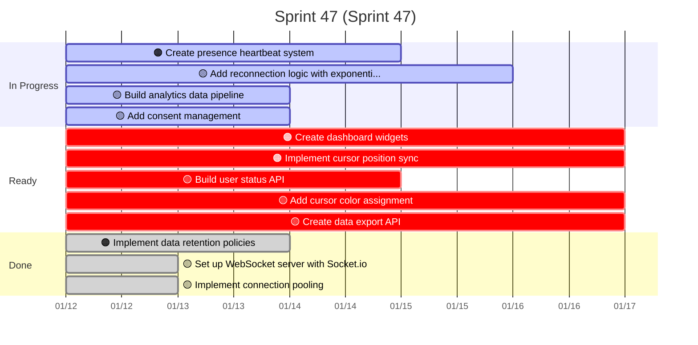
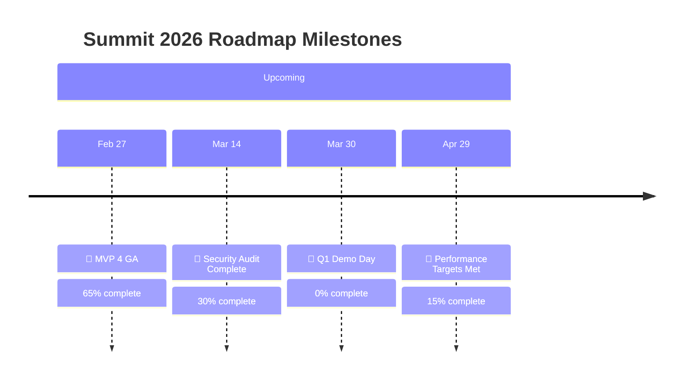
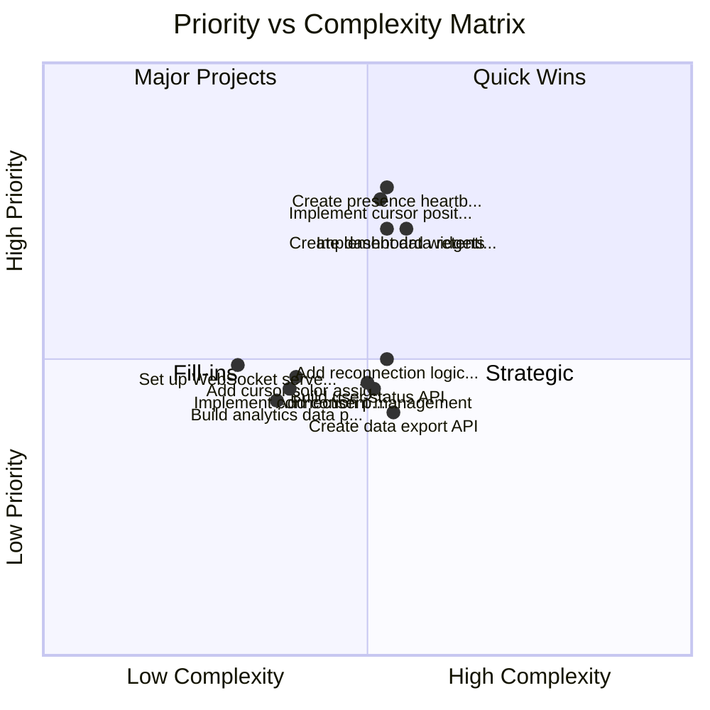
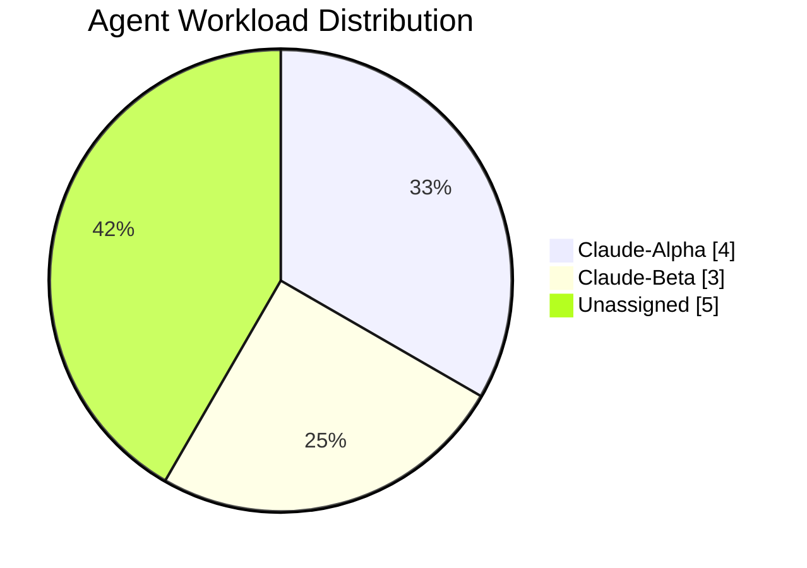

> @summit/work-graph@4.2.3 cli /Users/brianlong/Developer/summit/packages/work-graph
> tsx src/cli.ts "viz" "all"

# Summit Work Graph Visualizations

Generated at: 2026-01-19T07:06:35.570Z

## Roadmap Overview

Generating Roadmap Gantt Chart...

```mermaid
gantt
    title Summit 2026 Roadmap
    dateFormat YYYY-MM-DD
    axisFormat %m/%d

    section Milestones
    🚀 MVP 4 GA :milestone, m_c20bf603, 2026-02-28
    🏁 Security Audit Complete :milestone, m_636e3ca6, 2026-03-15
    📅 Q1 Demo Day :milestone, m_9cfcdc24, 2026-03-31
    🏁 Performance Targets Met :milestone, m_56e14add, 2026-04-30

    section Planned
    Presence System :crit, e_ab0e9e93, 2025-12-26, 7d
    Collaborative Cursors :crit, e_ac77645d, 2026-01-10, 7d

```

---

## Sprint Progress

Generating Sprint Gantt Chart...



---

## Milestone Timeline

Generating Milestone Timeline...



---

## Kanban Board

Generating Kanban Board...

```mermaid
flowchart LR
    subgraph Icebox["Icebox (0)"]
        direction TB
        empty_Icebox[" "]
        style empty_Icebox fill:none,stroke:none
    end

    subgraph Backlog["Backlog (3)"]
        direction TB
        t_2062ad8a("🟠 Implement cursor position sync")
        style t_2062ad8a fill:#ffedd5,stroke:#f97316
        t_2e627b3f("🟡 Add cursor color assignment")
        style t_2e627b3f fill:#fef9c3,stroke:#eab308
        t_0fa3d613("🟡 Create data export API")
        style t_0fa3d613 fill:#fef9c3,stroke:#eab308
    end

    subgraph Ready["Ready (2)"]
        direction TB
        t_50d97079("🟡 Build user status API")
        style t_50d97079 fill:#fef9c3,stroke:#eab308
        t_0c655d63("🟠 Create dashboard widgets")
        style t_0c655d63 fill:#ffedd5,stroke:#f97316
    end

    subgraph In_Progress["In Progress (4)"]
        direction TB
        t_573f3c42("🟡 Add reconnection logic with...<br/><small>@Claude-Alpha</small>")
        style t_573f3c42 fill:#fef9c3,stroke:#eab308
        t_d2fce70d("🟠 Create presence heartbeat s...<br/><small>@Claude-Beta</small>")
        style t_d2fce70d fill:#ffedd5,stroke:#f97316
        t_70c92f9b("🟡 Build analytics data pipeline<br/><small>@Claude-Beta</small>")
        style t_70c92f9b fill:#fef9c3,stroke:#eab308
        t_66dbaa42("🟡 Add consent management<br/><small>@Claude-Beta</small>")
        style t_66dbaa42 fill:#fef9c3,stroke:#eab308
    end

    subgraph Review["Review (0)"]
        direction TB
        empty_Review[" "]
        style empty_Review fill:none,stroke:none
    end

    subgraph Done["Done (3)"]
        direction TB
        t_da4c850f("🟡 Set up WebSocket server wit...<br/><small>@Claude-Alpha</small>")
        style t_da4c850f fill:#fef9c3,stroke:#eab308
        t_16a0f6bf("🟡 Implement connection pooling<br/><small>@Claude-Alpha</small>")
        style t_16a0f6bf fill:#fef9c3,stroke:#eab308
        t_b4c98bf9("🟠 Implement data retention po...<br/><small>@Claude-Alpha</small>")
        style t_b4c98bf9 fill:#ffedd5,stroke:#f97316
    end

    Icebox ~~~ Backlog
    Backlog ~~~ Ready
    Ready ~~~ In_Progress
    In_Progress ~~~ Review
    Review ~~~ Done

    style Icebox fill:#f8fafc,stroke:#94a3b8
    style Backlog fill:#f1f5f9,stroke:#64748b
    style Ready fill:#f3e8ff,stroke:#a855f7
    style In_Progress fill:#dbeafe,stroke:#3b82f6
    style Review fill:#fef3c7,stroke:#f59e0b
    style Done fill:#dcfce7,stroke:#22c55e
```



---

## Priority Matrix

Generating Priority Quadrant...



---

## Agent Workload

Generating Agent Workload...



---

## Dependency Graph

Generating Dependency Graph...

```mermaid
flowchart TB
    da4c850f("🟡 Set up WebSocket server with Socket.iobr/smalldone/small")
    style da4c850f fill:#dcfce7,stroke:#22c55e
    69c540dd[["WebSocket Infrastructurebr/smallin_progress/small"]]
    style 69c540dd fill:#dbeafe,stroke:#3b82f6
    16a0f6bf("🟡 Implement connection poolingbr/smalldone/small")
    style 16a0f6bf fill:#dcfce7,stroke:#22c55e
    573f3c42("🟡 Add reconnection logic with exponential backoffbr/smallin_progress/small")
    style 573f3c42 fill:#dbeafe,stroke:#3b82f6
    d2fce70d("🟠 Create presence heartbeat systembr/smallin_progress/small")
    style d2fce70d fill:#dbeafe,stroke:#3b82f6
    ab0e9e93[["Presence Systembr/smallplanned/small"]]
    50d97079("🟡 Build user status APIbr/smallready/small")
    style 50d97079 fill:#f3e8ff,stroke:#a855f7
    2062ad8a("🟠 Implement cursor position syncbr/smallbacklog/small")
    style 2062ad8a fill:#f1f5f9,stroke:#64748b
    ac77645d[["Collaborative Cursorsbr/smallplanned/small"]]
    2e627b3f("🟡 Add cursor color assignmentbr/smallbacklog/small")
    style 2e627b3f fill:#f1f5f9,stroke:#64748b
    70c92f9b("🟡 Build analytics data pipelinebr/smallin_progress/small")
    style 70c92f9b fill:#dbeafe,stroke:#3b82f6
    e3f4405b[["Analytics Backendbr/smallin_progress/small"]]
    style e3f4405b fill:#dbeafe,stroke:#3b82f6
    0c655d63("🟠 Create dashboard widgetsbr/smallready/small")
    style 0c655d63 fill:#f3e8ff,stroke:#a855f7
    b4c98bf9("🟠 Implement data retention policiesbr/smalldone/small")
    style b4c98bf9 fill:#dcfce7,stroke:#22c55e
    10501628[["Data Privacy Controlsbr/smallin_progress/small"]]
    style 10501628 fill:#dbeafe,stroke:#3b82f6
    66dbaa42("🟡 Add consent managementbr/smallin_progress/small")
    style 66dbaa42 fill:#dbeafe,stroke:#3b82f6
    0fa3d613("🟡 Create data export APIbr/smallbacklog/small")
    style 0fa3d613 fill:#f1f5f9,stroke:#64748b

    da4c850f ==>|implements| 69c540dd
    16a0f6bf ==>|implements| 69c540dd
    573f3c42 ==>|implements| 69c540dd
    d2fce70d ==>|implements| ab0e9e93
    50d97079 ==>|implements| ab0e9e93
    2062ad8a ==>|implements| ac77645d
    2e627b3f ==>|implements| ac77645d
    70c92f9b ==>|implements| e3f4405b
    0c655d63 ==>|implements| e3f4405b
    b4c98bf9 ==>|implements| 10501628
    66dbaa42 ==>|implements| 10501628
    0fa3d613 ==>|implements| 10501628
```



---

## Epic Breakdown

Generating Epic Breakdown...

```mermaid
flowchart TB
    epic_69c540dd[["🔴 WebSocket Infrastructure"]]
    style epic_69c540dd fill:#6366f1,stroke:#4f46e5,color:#fff

    subgraph done["Done (3)"]
        t_da4c850f("🟡 Set up WebSocket server with Soc...")
        t_16a0f6bf("🟡 Implement connection pooling")
        t_b4c98bf9("🟠 Implement data retention policies")
    end

    subgraph in_progress["In progress (4)"]
        t_573f3c42("🟡 Add reconnection logic with expo...")
        t_d2fce70d("🟠 Create presence heartbeat system")
        t_70c92f9b("🟡 Build analytics data pipeline")
        t_66dbaa42("🟡 Add consent management")
    end

    subgraph ready["Ready (2)"]
        t_50d97079("🟡 Build user status API")
        t_0c655d63("🟠 Create dashboard widgets")
    end

    subgraph backlog["Backlog (3)"]
        t_2062ad8a("🟠 Implement cursor position sync")
        t_2e627b3f("🟡 Add cursor color assignment")
        t_0fa3d613("🟡 Create data export API")
    end

    epic_69c540dd --> t_da4c850f
    epic_69c540dd --> t_573f3c42
    epic_69c540dd --> t_50d97079
    epic_69c540dd --> t_2062ad8a

    style done fill:#dcfce7,stroke:#22c55e
    style in_progress fill:#dbeafe,stroke:#3b82f6
    style review fill:#fef3c7,stroke:#f59e0b
    style ready fill:#f3e8ff,stroke:#a855f7
    style backlog fill:#f1f5f9,stroke:#64748b
    style blocked fill:#fee2e2,stroke:#ef4444
```



---

## Intent Flow

Generating Intent Flow...

```mermaid
flowchart TB
    intent_5b583b45{{"🟠 Real-time Collaboration"}}
    style intent_5b583b45 fill:#8b5cf6,stroke:#7c3aed,color:#fff

    subgraph epics["Epics"]
        epic_69c540dd[["WebSocket Infrastructure"]]
        style epic_69c540dd fill:#dbeafe,stroke:#3b82f6
        epic_ab0e9e93[["Presence System"]]
        style epic_ab0e9e93
        epic_ac77645d[["Collaborative Cursors"]]
        style epic_ac77645d
        epic_e3f4405b[["Analytics Backend"]]
        style epic_e3f4405b fill:#dbeafe,stroke:#3b82f6
        epic_10501628[["Data Privacy Controls"]]
        style epic_10501628 fill:#dbeafe,stroke:#3b82f6
    end

    intent_5b583b45 --> epic_69c540dd
    intent_5b583b45 --> epic_ab0e9e93
    intent_5b583b45 --> epic_ac77645d
    intent_5b583b45 --> epic_e3f4405b
    intent_5b583b45 --> epic_10501628

    subgraph tickets["Tickets"]
        ticket_da4c850f("🟡 Set up WebSocket server wit...")
        ticket_16a0f6bf("🟡 Implement connection pooling")
        ticket_573f3c42("🟡 Add reconnection logic with...")
        ticket_d2fce70d("🟠 Create presence heartbeat s...")
        ticket_50d97079("🟡 Build user status API")
        ticket_2062ad8a("🟠 Implement cursor position sync")
        ticket_2e627b3f("🟡 Add cursor color assignment")
        ticket_70c92f9b("🟡 Build analytics data pipeline")
        ticket_0c655d63("🟠 Create dashboard widgets")
        ticket_b4c98bf9("🟠 Implement data retention po...")
    end
    epic_69c540dd --> ticket_da4c850f
    epic_69c540dd --> ticket_16a0f6bf
    epic_69c540dd --> ticket_573f3c42
    epic_ab0e9e93 --> ticket_d2fce70d
    epic_ab0e9e93 --> ticket_50d97079
    epic_ac77645d --> ticket_2062ad8a
    epic_ac77645d --> ticket_2e627b3f
    epic_e3f4405b --> ticket_70c92f9b
    epic_e3f4405b --> ticket_0c655d63
    epic_10501628 --> ticket_b4c98bf9
```
