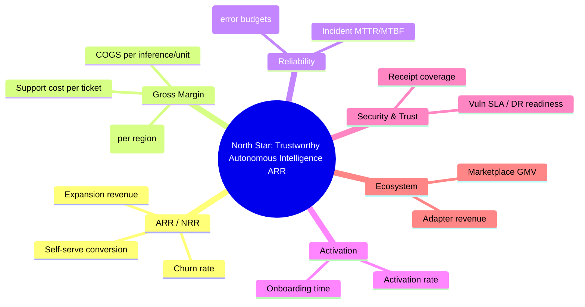

# 2027 North Star & KPI Tree (v1)

## North Star

Deliver verifiable intelligence automation that compounds ARR while maintaining trust-by-default and autonomous reliability.

## KPI Tree Overview

## Company-Level KPIs

- **ARR / NRR**: Net revenue retention with explicit expansion and churn targets.
- **Gross Margin / COGS per unit**: Compute, storage, and licensing costs normalized per autonomous investigation and per inference.
- **Uptime & Error Budgets**: SLOs per critical service; error budgets measured monthly with burn alerts.
- **Onboarding Time / Activation Rate**: Time from contract to first autonomous result; activation measured as percentage of new tenants with ≥3 orchestrations in first 14 days.
- **Security Posture**: Vulnerability SLA adherence, SBOM freshness, DR readiness (RPO/RTO tested), attestation coverage.
- **Ecosystem Revenue**: Adapter/add-on revenue and marketplace gross merchandise value (GMV).

## Drivers by Subsystem

### Policy Engine

- **Policy decision latency (p99)**
- **Policy coverage**: % of controls with policy-as-code + receipt
- **False-positive rate** on enforcement

### Receipts

- **Receipt emission coverage**: % of user-facing actions with receipts
- **Verification success rate** for signed receipts
- **Receipt generation latency**

### Metering

- **Event completeness**: % of required events vs. KPI contract
- **Invoicable unit accuracy**: variance between metered units and invoiced units
- **Real-time cost visibility latency** (lag < 5 minutes)

### Onboarding

- **Time-to-first autonomous workflow**
- **Sandbox-to-prod promotion rate**
- **Blocked-by-compliance time** (requires trust packet readiness)

### Marketplace

- **Adapter attach rate** per customer
- **Certified publisher count**
- **Marketplace GMV** and **revenue share realization**

### Autonomy

- **Autonomous run success rate** (no human intervention)
- **Auto-remediation coverage**
- **Margin lift from autonomy** (support hours avoided)

### Enterprise Add-ons

- **Residency adoption** (% tenants on regional/sovereign footprints)
- **BYOK usage**
- **Private networking uptake**

## Metric Definitions & Owners

| KPI               | Definition                                             | Owner         | Evidence Source                  | Cadence |
| ----------------- | ------------------------------------------------------ | ------------- | -------------------------------- | ------- |
| ARR / NRR         | Net revenue retention with gross expansion minus churn | VP Finance    | Billing ledger + CRM             | Monthly |
| Gross Margin      | (Revenue - COGS) / Revenue per tier                    | FinOps Lead   | Cloud cost + revenue cube        | Monthly |
| Uptime            | 30d availability per critical SLO                      | SRE Lead      | Prometheus / SLO exporter        | Weekly  |
| Error Budget      | Burn rate vs. monthly budget                           | SRE Lead      | SLO exporter                     | Weekly  |
| Activation Rate   | % of new tenants with ≥3 workflows in 14d              | Growth PM     | Product analytics                | Weekly  |
| Onboarding Time   | Contract to first autonomous workflow                  | CS Lead       | Provisioning + orchestrator logs | Weekly  |
| Security Posture  | Vuln SLA adherence; RPO/RTO tested                     | Security Lead | Scanner + DR drills              | Monthly |
| Ecosystem Revenue | Adapter/marketplace revenue share                      | Ecosystem PM  | Marketplace ledger               | Monthly |

## Data Contracts & Instrumentation Gaps

- **Metering events**: Ensure policy decisions, receipt issuance, and marketplace transactions emit signed events to the provenance ledger.
- **Telemetry exports**: Create weekly exports for Board Pack Lite covering ARR, margin, reliability, security posture, and ecosystem GMV.
- **Trust artifacts**: DR tests, SBOMs, and attestation bundles linked to Decision Receipts.
- **Coverage checklist**: All top-level KPIs must have dashboards and backfill jobs; gaps tracked in Epic 1.

## Governance Hooks

- KPI definitions versioned in-repo with Decision Receipts for approvals.
- Each KPI maps to stage gates (Spec→Build→Prove→Operate→Package) with evidence requirements.
- Changes to metric logic require impact analysis on downstream dashboards and contracts.
