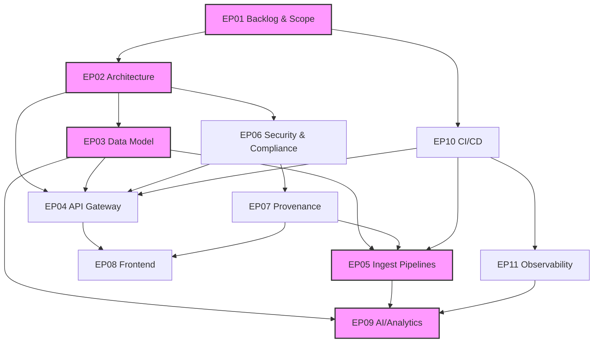

# EP01-T10 Dependency Graph

## Critical Path Analysis

The critical path for the Day-0 release involves:
1.  **EP01**: Defining scope and requirements.
2.  **EP02**: Establishing the architecture and key decisions (ADRs).
3.  **EP03**: Designing the data model and schema.
4.  **EP05**: Building ingestion pipelines to populate the graph.
5.  **EP09**: Implementing AI/Analytics on top of the ingested data.

Delays in any of these epics will directly impact the release timeline. Parallel execution is possible for EP04 (API), EP06 (Security), EP07 (Provenance), EP08 (Frontend), EP10 (CI/CD), and EP11 (Observability), but they all rely on the foundational work in the critical path.
