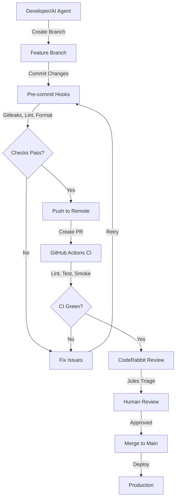

# AI Agent Collaboration Guidelines

Summit embraces AI-augmented development through multi-agent collaboration. This section provides guidelines for AI agents (Claude, Jules, Codex, GitHub Copilot) and their human partners.

## AI Agent Workflow

## Guidelines for AI Agents

### DO ✅

- **Always run golden path:** `pnpm run ci` (lint, typecheck, test) before claiming success.
- **Follow existing patterns:** Read `planning/enablement-pack/` docs for conventions.
- **Write tests:** Include unit and integration tests for new features.
- **Document changes:** Update relevant docs (README, ONBOARDING, API docs).
- **Use TypeScript types:** Avoid `any`, prefer interfaces and types.
- **Handle errors gracefully:** Use try/catch, return error objects.
- **Reference file paths:** Use `file_path:line_number` pattern in responses.
- **Verify incrementally:** Test each change before moving to the next.
- **Use conventional commits:** Follow commit message standards.

### DON'T ❌

- **Skip verification:** Never claim completion without running `pnpm run ci` or `pnpm run test`.
- **Commit secrets:** Never commit credentials, API keys, or sensitive data.
- **Break golden path:** Ensure Investigation → Entities → Relationships → Copilot → Results workflow.
- **Use production defaults:** Never use default passwords or localhost in production config.
- **Bypass security:** Don't disable security checks or skip validation.
- **Ignore test failures:** Fix all failing tests before committing.
- **Batch too much:** Keep PRs focused and reviewable (< 500 lines preferred).
- **Commit debug code:** Remove console.log, debugger statements, and .only() tests.

## Multi-Agent Coordination

When multiple AI agents work on the same codebase:

1.  **Branch isolation:** Each agent works on a dedicated branch (`claude/<session-id>`, etc.).
2.  **Merge strategy:** Rebase on main frequently to avoid conflicts.
3.  **Communication:** Document decisions in PR descriptions and commit messages.
4.  **Handoff protocol:** Leave clear TODO comments for next agent or human.
5.  **State preservation:** Use git commits to checkpoint progress frequently.
6.  **Context sharing:** Reference related PRs, issues, and documentation.
