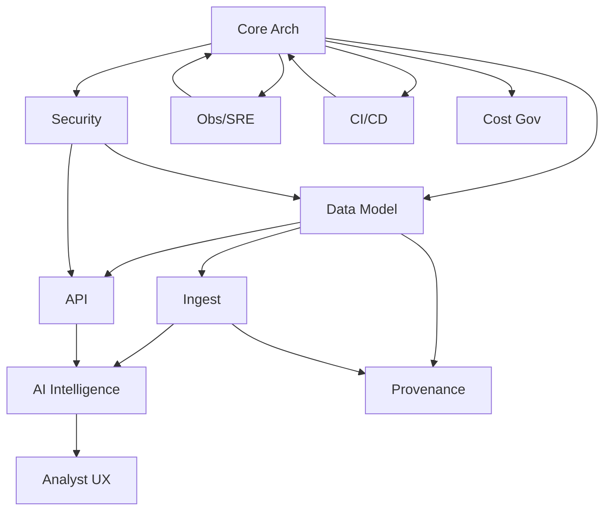

# IntelGraph Master Orchestration Roadmap v1.0

## Overview

This roadmap defines 11 parallel epics for the IntelGraph SDLC expansion.

## Epics Index

- [EPIC 1 — Core Platform Architecture & Guardrails](./epics/EPIC_01.md)
- [EPIC 2 — Graph & Data Modeling](./epics/EPIC_02.md)
- [EPIC 3 — Ingestion & Connector Framework](./epics/EPIC_03.md)
- [EPIC 4 — API & GraphQL Gateway](./epics/EPIC_04.md)
- [EPIC 5 — AI / Analytics / Graph Intelligence](./epics/EPIC_05.md)
- [EPIC 6 — Frontend & Analyst Experience](./epics/EPIC_06.md)
- [EPIC 7 — Security, Privacy & Compliance](./epics/EPIC_07.md)
- [EPIC 8 — Observability, SLOs & SRE](./epics/EPIC_08.md)
- [EPIC 9 — CI/CD & Infrastructure as Code](./epics/EPIC_09.md)
- [EPIC 10 — Provenance, Audit & Evidence Exports](./epics/EPIC_10.md)
- [EPIC 11 — Cost Governance & Unit Economics](./epics/EPIC_11.md)
