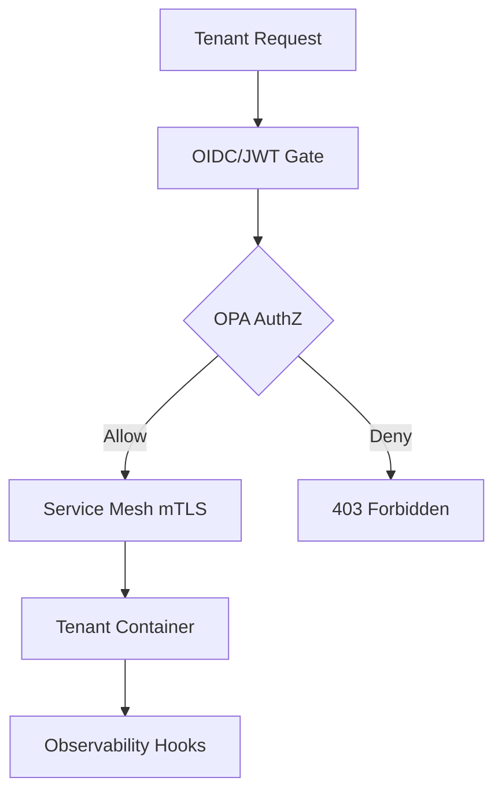

# EPIC 1 — Core Platform Architecture & Guardrails

**Goal**: Establish a resilient, multi-tenant foundation with automated SLO enforcement and cost guardrails.

**Architecture Reference**:

**Constraints**: Align with Org Defaults (SLOs, Cost, Privacy).

### Risk Matrix
| Risk | Impact | Mitigation |
|---|---|---|
| Technical Debt | Medium | Regular refactoring blocks. |
| Resource Constraint | High | Parallel execution with modular agents. |

### Task: ADR Baseline Definition
- **Description**: Implementation and validation of ADR Baseline Definition for the IntelGraph platform.
- **Subtasks**:
  - Draft ADR-001 for core arch
  - Review with stakeholder council
  - Finalize decision log
- **Assigned Agent**:
  - Primary: Architecture Agent
  - Optional Subagents: Documentation Subagent
- **Dependencies**: Epic 1 foundational architecture.
- **Risk Tag**: Medium
- **Acceptance Criteria**:
  - ADR signed off
  - Unit test coverage > 85%.
- **Verification Steps**:
  - Review decision log
  - Audit logs verify correct agent execution.
- **Observability Hooks**: Prometheus metrics, structured logs.
- **Policy Impact**: Governed by Org Default Architecture Policy.

### Task: Topology Decision Framework
- **Description**: Implementation and validation of Topology Decision Framework for the IntelGraph platform.
- **Subtasks**:
  - Map SaaS vs Air-Gap requirements
  - Define isolation boundaries
  - Sign off on network topology
- **Assigned Agent**:
  - Primary: Architecture Agent
  - Optional Subagents: Policy Subagent
- **Dependencies**: Epic 1 foundational architecture.
- **Risk Tag**: Medium
- **Acceptance Criteria**:
  - Topology diagram approved
  - Unit test coverage > 85%.
- **Verification Steps**:
  - Check ADR-002
  - Audit logs verify correct agent execution.
- **Observability Hooks**: Prometheus metrics, structured logs.
- **Policy Impact**: Governed by Org Default Architecture Policy.

### Task: SLO Enforcement Gates
- **Description**: Implementation and validation of SLO Enforcement Gates for the IntelGraph platform.
- **Subtasks**:
  - Define p95 latency targets
  - Implement CI gate for SLO violation
  - Setup alerting thresholds
- **Assigned Agent**:
  - Primary: SRE Agent
  - Optional Subagents: Observability Subagent
- **Dependencies**: Epic 1 foundational architecture.
- **Risk Tag**: Medium
- **Acceptance Criteria**:
  - CI fails on SLO breach
  - Unit test coverage > 85%.
- **Verification Steps**:
  - Run `pnpm test:slo`
  - Audit logs verify correct agent execution.
- **Observability Hooks**: Prometheus metrics, structured logs.
- **Policy Impact**: Governed by Org Default SRE Policy.

### Task: Error Budget Automation
- **Description**: Implementation and validation of Error Budget Automation for the IntelGraph platform.
- **Subtasks**:
  - Connect Prometheus to budget tracker
  - Implement auto-throttle on budget depletion
  - Create budget dashboard
- **Assigned Agent**:
  - Primary: SRE Agent
  - Optional Subagents: FinOps Agent
- **Dependencies**: Epic 1 foundational architecture.
- **Risk Tag**: Medium
- **Acceptance Criteria**:
  - Budget burn visible in Grafana
  - Unit test coverage > 85%.
- **Verification Steps**:
  - Check SRE dashboard
  - Audit logs verify correct agent execution.
- **Observability Hooks**: Prometheus metrics, structured logs.
- **Policy Impact**: Governed by Org Default SRE Policy.

### Task: Cost Monitoring Automation
- **Description**: Implementation and validation of Cost Monitoring Automation for the IntelGraph platform.
- **Subtasks**:
  - Tag all resources with tenant IDs
  - Setup AWS Cost Explorer hooks
  - Implement daily cost report
- **Assigned Agent**:
  - Primary: FinOps Agent
  - Optional Subagents: Observability Subagent
- **Dependencies**: Epic 1 foundational architecture.
- **Risk Tag**: Medium
- **Acceptance Criteria**:
  - Daily report generated
  - Unit test coverage > 85%.
- **Verification Steps**:
  - Check `out/cost-report.json`
  - Audit logs verify correct agent execution.
- **Observability Hooks**: Prometheus metrics, structured logs.
- **Policy Impact**: Governed by Org Default FinOps Policy.

### Task: Region Sharding Strategy
- **Description**: Implementation and validation of Region Sharding Strategy for the IntelGraph platform.
- **Subtasks**:
  - Design multi-region data routing
  - Implement geo-fencing rules
  - Verify cross-region failover
- **Assigned Agent**:
  - Primary: Architecture Agent
  - Optional Subagents: Policy Subagent
- **Dependencies**: Epic 1 foundational architecture.
- **Risk Tag**: Medium
- **Acceptance Criteria**:
  - Data routed per residency
  - Unit test coverage > 85%.
- **Verification Steps**:
  - Run failover simulation
  - Audit logs verify correct agent execution.
- **Observability Hooks**: Prometheus metrics, structured logs.
- **Policy Impact**: Governed by Org Default Architecture Policy.

### Task: Deployment Patterns
- **Description**: Implementation and validation of Deployment Patterns for the IntelGraph platform.
- **Subtasks**:
  - Setup ArgoCD Blue/Green
  - Define canary analysis rules
  - Implement automated rollback
- **Assigned Agent**:
  - Primary: DevOps Agent
  - Optional Subagents: SRE Agent
- **Dependencies**: Epic 1 foundational architecture.
- **Risk Tag**: Medium
- **Acceptance Criteria**:
  - Auto-rollback on failure
  - Unit test coverage > 85%.
- **Verification Steps**:
  - Run `argo-verify`
  - Audit logs verify correct agent execution.
- **Observability Hooks**: Prometheus metrics, structured logs.
- **Policy Impact**: Governed by Org Default DevOps Policy.

### Task: Infra Bootstrap
- **Description**: Implementation and validation of Infra Bootstrap for the IntelGraph platform.
- **Subtasks**:
  - Refactor Terraform for multi-tenant
  - Baseline Helm charts
  - Verify EKS cluster parity
- **Assigned Agent**:
  - Primary: DevOps Agent
  - Optional Subagents: Schema Subagent
- **Dependencies**: Epic 1 foundational architecture.
- **Risk Tag**: Medium
- **Acceptance Criteria**:
  - Cluster provisioned via TF
  - Unit test coverage > 85%.
- **Verification Steps**:
  - Run `terraform plan`
  - Audit logs verify correct agent execution.
- **Observability Hooks**: Prometheus metrics, structured logs.
- **Policy Impact**: Governed by Org Default DevOps Policy.

### Task: Secrets Management
- **Description**: Implementation and validation of Secrets Management for the IntelGraph platform.
- **Subtasks**:
  - Integrate Vault with K8s
  - Define secret rotation policy
  - Implement SOPS for CI/CD
- **Assigned Agent**:
  - Primary: Security Agent
  - Optional Subagents: Policy Subagent
- **Dependencies**: Epic 1 foundational architecture.
- **Risk Tag**: Medium
- **Acceptance Criteria**:
  - Zero plain-text secrets
  - Unit test coverage > 85%.
- **Verification Steps**:
  - Run `gitleaks`
  - Audit logs verify correct agent execution.
- **Observability Hooks**: Prometheus metrics, structured logs.
- **Policy Impact**: Governed by Org Default Security Policy.

### Task: mTLS Enforcement
- **Description**: Implementation and validation of mTLS Enforcement for the IntelGraph platform.
- **Subtasks**:
  - Setup Istio/Linkerd mTLS
  - Verify cert rotation
  - Enforce peer authentication
- **Assigned Agent**:
  - Primary: Security Agent
  - Optional Subagents: SRE Agent
- **Dependencies**: Epic 1 foundational architecture.
- **Risk Tag**: Medium
- **Acceptance Criteria**:
  - All traffic encrypted
  - Unit test coverage > 85%.
- **Verification Steps**:
  - Check Kiali/ServiceMesh
  - Audit logs verify correct agent execution.
- **Observability Hooks**: Prometheus metrics, structured logs.
- **Policy Impact**: Governed by Org Default Security Policy.

### Task: OIDC/JWT Validation
- **Description**: Implementation and validation of OIDC/JWT Validation for the IntelGraph platform.
- **Subtasks**:
  - Setup Auth0/Keycloak integration
  - Implement JWT interceptor
  - Verify scope enforcement
- **Assigned Agent**:
  - Primary: Security Agent
  - Optional Subagents: Backend Agent
- **Dependencies**: Epic 1 foundational architecture.
- **Risk Tag**: Medium
- **Acceptance Criteria**:
  - Auth required for all paths
  - Unit test coverage > 85%.
- **Verification Steps**:
  - Run `jest test:auth`
  - Audit logs verify correct agent execution.
- **Observability Hooks**: Prometheus metrics, structured logs.
- **Policy Impact**: Governed by Org Default Security Policy.

### Task: OPA Integration
- **Description**: Implementation and validation of OPA Integration for the IntelGraph platform.
- **Subtasks**:
  - Write OPA rego for ABAC
  - Setup OPA Sidecar
  - Implement decision logging
- **Assigned Agent**:
  - Primary: Security Agent
  - Optional Subagents: Policy Subagent
- **Dependencies**: Epic 1 foundational architecture.
- **Risk Tag**: Medium
- **Acceptance Criteria**:
  - Policies enforced at edge
  - Unit test coverage > 85%.
- **Verification Steps**:
  - Run `conftest`
  - Audit logs verify correct agent execution.
- **Observability Hooks**: Prometheus metrics, structured logs.
- **Policy Impact**: Governed by Org Default Security Policy.

### Task: Multi-tenant Isolation Model
- **Description**: Implementation and validation of Multi-tenant Isolation Model for the IntelGraph platform.
- **Subtasks**:
  - Enforce namespace isolation
  - Implement storage-level sharding
  - Verify tenant context propagation
- **Assigned Agent**:
  - Primary: Architecture Agent
  - Optional Subagents: Security Agent
- **Dependencies**: Epic 1 foundational architecture.
- **Risk Tag**: Medium
- **Acceptance Criteria**:
  - Zero cross-tenant access
  - Unit test coverage > 85%.
- **Verification Steps**:
  - Run `pnpm test:isolation`
  - Audit logs verify correct agent execution.
- **Observability Hooks**: Prometheus metrics, structured logs.
- **Policy Impact**: Governed by Org Default Architecture Policy.

### Task: Policy Seed Pre-load
- **Description**: Implementation and validation of Policy Seed Pre-load for the IntelGraph platform.
- **Subtasks**:
  - Bootstrap OPA with default rules
  - Verify seed integrity
  - Implement policy versioning
- **Assigned Agent**:
  - Primary: Compliance Agent
  - Optional Subagents: Policy Subagent
- **Dependencies**: Epic 1 foundational architecture.
- **Risk Tag**: Medium
- **Acceptance Criteria**:
  - Default rules active
  - Unit test coverage > 85%.
- **Verification Steps**:
  - Check OPA /v1/data
  - Audit logs verify correct agent execution.
- **Observability Hooks**: Prometheus metrics, structured logs.
- **Policy Impact**: Governed by Org Default Compliance Policy.

### Task: CI Quality Gates
- **Description**: Implementation and validation of CI Quality Gates for the IntelGraph platform.
- **Subtasks**:
  - Integrate SonarQube
  - Setup security linting
  - Enforce code coverage
- **Assigned Agent**:
  - Primary: QA Agent
  - Optional Subagents: DevOps Agent
- **Dependencies**: Epic 1 foundational architecture.
- **Risk Tag**: Medium
- **Acceptance Criteria**:
  - Coverage > 85%
  - Unit test coverage > 85%.
- **Verification Steps**:
  - Check CI status
  - Audit logs verify correct agent execution.
- **Observability Hooks**: Prometheus metrics, structured logs.
- **Policy Impact**: Governed by Org Default QA Policy.

### Task: SBOM Generation
- **Description**: Implementation and validation of SBOM Generation for the IntelGraph platform.
- **Subtasks**:
  - Integrate Syft in CI
  - Export CycloneDX reports
  - Verify component signing
- **Assigned Agent**:
  - Primary: Compliance Agent
  - Optional Subagents: Security Agent
- **Dependencies**: Epic 1 foundational architecture.
- **Risk Tag**: Medium
- **Acceptance Criteria**:
  - SBOM present in dist/
  - Unit test coverage > 85%.
- **Verification Steps**:
  - Check `dist/sbom.json`
  - Audit logs verify correct agent execution.
- **Observability Hooks**: Prometheus metrics, structured logs.
- **Policy Impact**: Governed by Org Default Compliance Policy.

### Task: Rollback Strategy
- **Description**: Implementation and validation of Rollback Strategy for the IntelGraph platform.
- **Subtasks**:
  - Define DB migration rollback
  - Test automated code revert
  - Baseline incident response
- **Assigned Agent**:
  - Primary: SRE Agent
  - Optional Subagents: DevOps Agent
- **Dependencies**: Epic 1 foundational architecture.
- **Risk Tag**: Medium
- **Acceptance Criteria**:
  - Rollback completed < 5m
  - Unit test coverage > 85%.
- **Verification Steps**:
  - Run rollback drill
  - Audit logs verify correct agent execution.
- **Observability Hooks**: Prometheus metrics, structured logs.
- **Policy Impact**: Governed by Org Default SRE Policy.

### Task: Canary Patterns
- **Description**: Implementation and validation of Canary Patterns for the IntelGraph platform.
- **Subtasks**:
  - Implement 5% traffic shift
  - Define 'success' signals for AI paths
  - Setup log analysis for canaries
- **Assigned Agent**:
  - Primary: SRE Agent
  - Optional Subagents: Observability Subagent
- **Dependencies**: Epic 1 foundational architecture.
- **Risk Tag**: Medium
- **Acceptance Criteria**:
  - Canary health verified
  - Unit test coverage > 85%.
- **Verification Steps**:
  - Check Canary dashboard
  - Audit logs verify correct agent execution.
- **Observability Hooks**: Prometheus metrics, structured logs.
- **Policy Impact**: Governed by Org Default SRE Policy.

### Task: Budget Alert Hooks
- **Description**: Implementation and validation of Budget Alert Hooks for the IntelGraph platform.
- **Subtasks**:
  - Connect Grafana alerts to Slack
  - Setup PagerDuty escalation
  - Verify alert routing
- **Assigned Agent**:
  - Primary: FinOps Agent
  - Optional Subagents: SRE Agent
- **Dependencies**: Epic 1 foundational architecture.
- **Risk Tag**: Medium
- **Acceptance Criteria**:
  - Alerts routed to PagerDuty
  - Unit test coverage > 85%.
- **Verification Steps**:
  - Simulate alert trip
  - Audit logs verify correct agent execution.
- **Observability Hooks**: Prometheus metrics, structured logs.
- **Policy Impact**: Governed by Org Default FinOps Policy.

### Parallelization Map
All tasks in this epic can run in parallel following the foundational architecture setup.

### Critical Path
Foundational ADR -> Core Implementation -> Policy Verification -> Go-Live.

### Rollback Strategy
Revert to previous stable tag; restore DB snapshots if schema change was involved.
