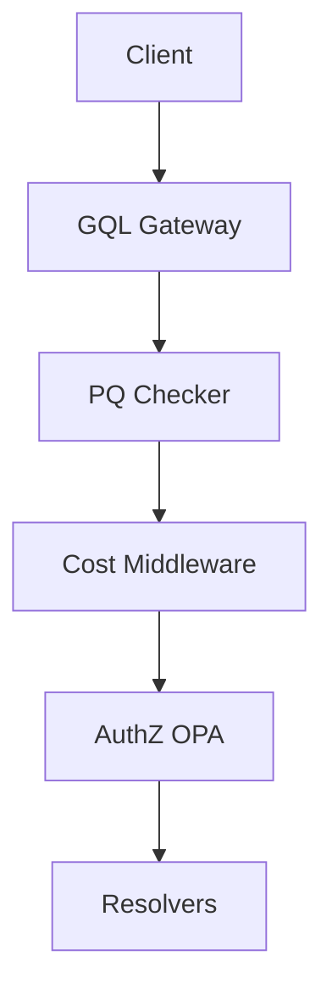

# EPIC 4 — API & GraphQL Gateway

**Goal**: Deliver a performant, cost-aware API gateway with strict authZ and pagination.

**Architecture Reference**:

**Constraints**: Align with Org Defaults (SLOs, Cost, Privacy).

### Risk Matrix
| Risk | Impact | Mitigation |
|---|---|---|
| Technical Debt | Medium | Regular refactoring blocks. |
| Resource Constraint | High | Parallel execution with modular agents. |

### Task: GraphQL SDL Baseline
- **Description**: Implementation and validation of GraphQL SDL Baseline for the IntelGraph platform.
- **Subtasks**:
  - Define core types and mutations
  - Review with API council
  - Publish documentation
- **Assigned Agent**:
  - Primary: Backend Agent
  - Optional Subagents: Architecture Agent
- **Dependencies**: Epic 4 foundational architecture.
- **Risk Tag**: Medium
- **Acceptance Criteria**:
  - SDL is valid and complete
  - Unit test coverage > 85%.
- **Verification Steps**:
  - Run `npx graphql-schema-linter`
  - Audit logs verify correct agent execution.
- **Observability Hooks**: Prometheus metrics, structured logs.
- **Policy Impact**: Governed by Org Default Backend Policy.

### Task: Persisted Query Enforcement
- **Description**: Implementation and validation of Persisted Query Enforcement for the IntelGraph platform.
- **Subtasks**:
  - Setup Redis for PQ storage
  - Implement hash validation
  - Verify query rejection
- **Assigned Agent**:
  - Primary: Backend Agent
  - Optional Subagents: Security Agent
- **Dependencies**: Epic 4 foundational architecture.
- **Risk Tag**: Medium
- **Acceptance Criteria**:
  - Only hashed queries allowed
  - Unit test coverage > 85%.
- **Verification Steps**:
  - Run `test:pq`
  - Audit logs verify correct agent execution.
- **Observability Hooks**: Prometheus metrics, structured logs.
- **Policy Impact**: Governed by Org Default Backend Policy.

### Task: Query Depth Limiting
- **Description**: Implementation and validation of Query Depth Limiting for the IntelGraph platform.
- **Subtasks**:
  - Implement complexity analyzer
  - Setup depth thresholds
  - Verify rejection
- **Assigned Agent**:
  - Primary: Backend Agent
  - Optional Subagents: Security Agent
- **Dependencies**: Epic 4 foundational architecture.
- **Risk Tag**: Medium
- **Acceptance Criteria**:
  - Deep queries blocked
  - Unit test coverage > 85%.
- **Verification Steps**:
  - Run complexity test
  - Audit logs verify correct agent execution.
- **Observability Hooks**: Prometheus metrics, structured logs.
- **Policy Impact**: Governed by Org Default Backend Policy.

### Task: Cost Analysis Middleware
- **Description**: Implementation and validation of Cost Analysis Middleware for the IntelGraph platform.
- **Subtasks**:
  - Implement per-resolver cost
  - Setup cost-based limiting
  - Verify budget check
- **Assigned Agent**:
  - Primary: FinOps Agent
  - Optional Subagents: Backend Agent
- **Dependencies**: Epic 4 foundational architecture.
- **Risk Tag**: Medium
- **Acceptance Criteria**:
  - Cost limits enforced
  - Unit test coverage > 85%.
- **Verification Steps**:
  - Check cost headers
  - Audit logs verify correct agent execution.
- **Observability Hooks**: Prometheus metrics, structured logs.
- **Policy Impact**: Governed by Org Default FinOps Policy.

### Task: JWT Validation
- **Description**: Implementation and validation of JWT Validation for the IntelGraph platform.
- **Subtasks**:
  - Implement RS256 validation
  - Setup audience/issuer checks
  - Verify token expiry
- **Assigned Agent**:
  - Primary: Security Agent
  - Optional Subagents: Backend Agent
- **Dependencies**: Epic 4 foundational architecture.
- **Risk Tag**: Medium
- **Acceptance Criteria**:
  - Invalid JWTs rejected
  - Unit test coverage > 85%.
- **Verification Steps**:
  - Run `test:jwt`
  - Audit logs verify correct agent execution.
- **Observability Hooks**: Prometheus metrics, structured logs.
- **Policy Impact**: Governed by Org Default Security Policy.

### Task: ABAC Enforcement
- **Description**: Implementation and validation of ABAC Enforcement for the IntelGraph platform.
- **Subtasks**:
  - Integrate OPA with GQL
  - Implement per-field authZ
  - Verify policy rules
- **Assigned Agent**:
  - Primary: Security Agent
  - Optional Subagents: Policy Subagent
- **Dependencies**: Epic 4 foundational architecture.
- **Risk Tag**: Medium
- **Acceptance Criteria**:
  - Access strictly controlled
  - Unit test coverage > 85%.
- **Verification Steps**:
  - Run `test:abac`
  - Audit logs verify correct agent execution.
- **Observability Hooks**: Prometheus metrics, structured logs.
- **Policy Impact**: Governed by Org Default Security Policy.

### Task: Tenant Scoping
- **Description**: Implementation and validation of Tenant Scoping for the IntelGraph platform.
- **Subtasks**:
  - Inject tenant ID into context
  - Implement auto-filtering in resolvers
  - Verify isolation
- **Assigned Agent**:
  - Primary: Backend Agent
  - Optional Subagents: Security Agent
- **Dependencies**: Epic 4 foundational architecture.
- **Risk Tag**: Medium
- **Acceptance Criteria**:
  - Zero cross-tenant data
  - Unit test coverage > 85%.
- **Verification Steps**:
  - Run `test:multi-tenant`
  - Audit logs verify correct agent execution.
- **Observability Hooks**: Prometheus metrics, structured logs.
- **Policy Impact**: Governed by Org Default Backend Policy.

### Task: Pagination Standard
- **Description**: Implementation and validation of Pagination Standard for the IntelGraph platform.
- **Subtasks**:
  - Implement relay cursor spec
  - Setup max page size
  - Verify scroll behavior
- **Assigned Agent**:
  - Primary: Backend Agent
  - Optional Subagents: Frontend Agent
- **Dependencies**: Epic 4 foundational architecture.
- **Risk Tag**: Medium
- **Acceptance Criteria**:
  - Stable, fast pagination
  - Unit test coverage > 85%.
- **Verification Steps**:
  - Run `test:pagination`
  - Audit logs verify correct agent execution.
- **Observability Hooks**: Prometheus metrics, structured logs.
- **Policy Impact**: Governed by Org Default Backend Policy.

### Task: Mutation Idempotency
- **Description**: Implementation and validation of Mutation Idempotency for the IntelGraph platform.
- **Subtasks**:
  - Implement idempotency keys
  - Setup Redis cache for results
  - Verify duplication avoidance
- **Assigned Agent**:
  - Primary: Backend Agent
  - Optional Subagents: Data Agent
- **Dependencies**: Epic 4 foundational architecture.
- **Risk Tag**: Medium
- **Acceptance Criteria**:
  - Duplicate mutations ignored
  - Unit test coverage > 85%.
- **Verification Steps**:
  - Run `test:idempotency`
  - Audit logs verify correct agent execution.
- **Observability Hooks**: Prometheus metrics, structured logs.
- **Policy Impact**: Governed by Org Default Backend Policy.

### Task: Subscription Fan-out
- **Description**: Implementation and validation of Subscription Fan-out for the IntelGraph platform.
- **Subtasks**:
  - Setup Redis PubSub
  - Implement WebSocket scaling
  - Verify message delivery
- **Assigned Agent**:
  - Primary: Backend Agent
  - Optional Subagents: DevOps Agent
- **Dependencies**: Epic 4 foundational architecture.
- **Risk Tag**: Medium
- **Acceptance Criteria**:
  - Scales to 10k connections
  - Unit test coverage > 85%.
- **Verification Steps**:
  - Run load test
  - Audit logs verify correct agent execution.
- **Observability Hooks**: Prometheus metrics, structured logs.
- **Policy Impact**: Governed by Org Default Backend Policy.

### Task: Caching Strategy
- **Description**: Implementation and validation of Caching Strategy for the IntelGraph platform.
- **Subtasks**:
  - Implement per-field TTL
  - Setup Redis cache layer
  - Verify cache invalidation
- **Assigned Agent**:
  - Primary: Backend Agent
  - Optional Subagents: SRE Agent
- **Dependencies**: Epic 4 foundational architecture.
- **Risk Tag**: Medium
- **Acceptance Criteria**:
  - Cache hit rate > 60%
  - Unit test coverage > 85%.
- **Verification Steps**:
  - Check Redis metrics
  - Audit logs verify correct agent execution.
- **Observability Hooks**: Prometheus metrics, structured logs.
- **Policy Impact**: Governed by Org Default Backend Policy.

### Task: Redis Integration
- **Description**: Implementation and validation of Redis Integration for the IntelGraph platform.
- **Subtasks**:
  - Setup HA Redis cluster
  - Configure TLS and auth
  - Verify connectivity
- **Assigned Agent**:
  - Primary: DevOps Agent
  - Optional Subagents: Security Agent
- **Dependencies**: Epic 4 foundational architecture.
- **Risk Tag**: Medium
- **Acceptance Criteria**:
  - Secure, reliable Redis
  - Unit test coverage > 85%.
- **Verification Steps**:
  - Check Redis logs
  - Audit logs verify correct agent execution.
- **Observability Hooks**: Prometheus metrics, structured logs.
- **Policy Impact**: Governed by Org Default DevOps Policy.

### Task: Circuit Breaker Pattern
- **Description**: Implementation and validation of Circuit Breaker Pattern for the IntelGraph platform.
- **Subtasks**:
  - Implement Hystrix/Opossum
  - Setup fallback responses
  - Verify failure isolation
- **Assigned Agent**:
  - Primary: SRE Agent
  - Optional Subagents: Backend Agent
- **Dependencies**: Epic 4 foundational architecture.
- **Risk Tag**: Medium
- **Acceptance Criteria**:
  - Cascading failures blocked
  - Unit test coverage > 85%.
- **Verification Steps**:
  - Run chaos test
  - Audit logs verify correct agent execution.
- **Observability Hooks**: Prometheus metrics, structured logs.
- **Policy Impact**: Governed by Org Default SRE Policy.

### Task: Rate Limiting
- **Description**: Implementation and validation of Rate Limiting for the IntelGraph platform.
- **Subtasks**:
  - Implement Sliding Window rate limit
  - Setup per-IP/User limits
  - Verify blocking
- **Assigned Agent**:
  - Primary: Backend Agent
  - Optional Subagents: Security Agent
- **Dependencies**: Epic 4 foundational architecture.
- **Risk Tag**: Medium
- **Acceptance Criteria**:
  - Rate limits enforced
  - Unit test coverage > 85%.
- **Verification Steps**:
  - Run `k6`
  - Audit logs verify correct agent execution.
- **Observability Hooks**: Prometheus metrics, structured logs.
- **Policy Impact**: Governed by Org Default Backend Policy.

### Task: Error Envelope Standard
- **Description**: Implementation and validation of Error Envelope Standard for the IntelGraph platform.
- **Subtasks**:
  - Define standard error format
  - Implement error code mapping
  - Verify client response
- **Assigned Agent**:
  - Primary: Backend Agent
  - Optional Subagents: Frontend Agent
- **Dependencies**: Epic 4 foundational architecture.
- **Risk Tag**: Medium
- **Acceptance Criteria**:
  - Consistent error messages
  - Unit test coverage > 85%.
- **Verification Steps**:
  - Run `test:errors`
  - Audit logs verify correct agent execution.
- **Observability Hooks**: Prometheus metrics, structured logs.
- **Policy Impact**: Governed by Org Default Backend Policy.

### Task: Schema Federation Readiness
- **Description**: Implementation and validation of Schema Federation Readiness for the IntelGraph platform.
- **Subtasks**:
  - Implement Apollo Federation spec
  - Setup subgraph isolation
  - Verify composition
- **Assigned Agent**:
  - Primary: Architecture Agent
  - Optional Subagents: Backend Agent
- **Dependencies**: Epic 4 foundational architecture.
- **Risk Tag**: Medium
- **Acceptance Criteria**:
  - Subgraphs merge correctly
  - Unit test coverage > 85%.
- **Verification Steps**:
  - Run `rover fed check`
  - Audit logs verify correct agent execution.
- **Observability Hooks**: Prometheus metrics, structured logs.
- **Policy Impact**: Governed by Org Default Architecture Policy.

### Task: API Versioning
- **Description**: Implementation and validation of API Versioning for the IntelGraph platform.
- **Subtasks**:
  - Implement Accept header versioning
  - Setup deprecation logic
  - Verify backward compatibility
- **Assigned Agent**:
  - Primary: Backend Agent
  - Optional Subagents: Architecture Agent
- **Dependencies**: Epic 4 foundational architecture.
- **Risk Tag**: Medium
- **Acceptance Criteria**:
  - Stable API lifecycle
  - Unit test coverage > 85%.
- **Verification Steps**:
  - Run versioning test
  - Audit logs verify correct agent execution.
- **Observability Hooks**: Prometheus metrics, structured logs.
- **Policy Impact**: Governed by Org Default Backend Policy.

### Task: Load Test Plan
- **Description**: Implementation and validation of Load Test Plan for the IntelGraph platform.
- **Subtasks**:
  - Define K6 test scenarios
  - Setup CI load test gate
  - Verify performance
- **Assigned Agent**:
  - Primary: QA Agent
  - Optional Subagents: SRE Agent
- **Dependencies**: Epic 4 foundational architecture.
- **Risk Tag**: Medium
- **Acceptance Criteria**:
  - p95 < 200ms at 2x load
  - Unit test coverage > 85%.
- **Verification Steps**:
  - Check K6 report
  - Audit logs verify correct agent execution.
- **Observability Hooks**: Prometheus metrics, structured logs.
- **Policy Impact**: Governed by Org Default QA Policy.

### Task: OpenTelemetry Integration
- **Description**: Implementation and validation of OpenTelemetry Integration for the IntelGraph platform.
- **Subtasks**:
  - Instrument GQL resolvers
  - Export traces to Jaeger
  - Verify span propagation
- **Assigned Agent**:
  - Primary: SRE Agent
  - Optional Subagents: Observability Subagent
- **Dependencies**: Epic 4 foundational architecture.
- **Risk Tag**: Medium
- **Acceptance Criteria**:
  - Full request visibility
  - Unit test coverage > 85%.
- **Verification Steps**:
  - Check Jaeger UI
  - Audit logs verify correct agent execution.
- **Observability Hooks**: Prometheus metrics, structured logs.
- **Policy Impact**: Governed by Org Default SRE Policy.

### Parallelization Map
All tasks in this epic can run in parallel following the foundational architecture setup.

### Critical Path
Foundational ADR -> Core Implementation -> Policy Verification -> Go-Live.

### Rollback Strategy
Revert to previous stable tag; restore DB snapshots if schema change was involved.
