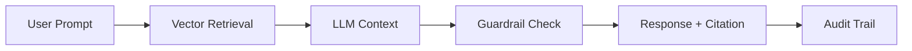

# EPIC 5 — AI / Analytics / Graph Intelligence

**Goal**: Enable explainable, auditable intelligence with RAG pipelines and citation enforcement.

**Architecture Reference**:

**Constraints**: Align with Org Defaults (SLOs, Cost, Privacy).

### Risk Matrix
| Risk | Impact | Mitigation |
|---|---|---|
| Technical Debt | Medium | Regular refactoring blocks. |
| Resource Constraint | High | Parallel execution with modular agents. |

### Task: RAG Pipeline Scaffold
- **Description**: Implementation and validation of RAG Pipeline Scaffold for the IntelGraph platform.
- **Subtasks**:
  - Setup vector store integration
  - Implement document chunking
  - Verify retrieval accuracy
- **Assigned Agent**:
  - Primary: AI Agent
  - Optional Subagents: Data Agent
- **Dependencies**: Epic 5 foundational architecture.
- **Risk Tag**: Medium
- **Acceptance Criteria**:
  - High retrieval precision
  - Unit test coverage > 85%.
- **Verification Steps**:
  - Run `pnpm eval:rag`
  - Audit logs verify correct agent execution.
- **Observability Hooks**: Prometheus metrics, structured logs.
- **Policy Impact**: Governed by Org Default AI Policy.

### Task: Citation Enforcement
- **Description**: Implementation and validation of Citation Enforcement for the IntelGraph platform.
- **Subtasks**:
  - Implement citation tracking in LLM
  - Setup verification logic
  - Verify UI display
- **Assigned Agent**:
  - Primary: AI Agent
  - Optional Subagents: Frontend Agent
- **Dependencies**: Epic 5 foundational architecture.
- **Risk Tag**: Medium
- **Acceptance Criteria**:
  - 100% cited outputs
  - Unit test coverage > 85%.
- **Verification Steps**:
  - Check citation logs
  - Audit logs verify correct agent execution.
- **Observability Hooks**: Prometheus metrics, structured logs.
- **Policy Impact**: Governed by Org Default AI Policy.

### Task: Explainability Surface
- **Description**: Implementation and validation of Explainability Surface for the IntelGraph platform.
- **Subtasks**:
  - Implement chain-of-thought logs
  - Setup reasoning visualization
  - Verify user trust
- **Assigned Agent**:
  - Primary: AI Agent
  - Optional Subagents: Frontend Agent
- **Dependencies**: Epic 5 foundational architecture.
- **Risk Tag**: Medium
- **Acceptance Criteria**:
  - Reasoning is transparent
  - Unit test coverage > 85%.
- **Verification Steps**:
  - Check explain panel
  - Audit logs verify correct agent execution.
- **Observability Hooks**: Prometheus metrics, structured logs.
- **Policy Impact**: Governed by Org Default AI Policy.

### Task: Feature Extraction Engine
- **Description**: Implementation and validation of Feature Extraction Engine for the IntelGraph platform.
- **Subtasks**:
  - Implement entity/link extraction
  - Setup NLP pipeline
  - Verify extraction accuracy
- **Assigned Agent**:
  - Primary: AI Agent
  - Optional Subagents: Data Agent
- **Dependencies**: Epic 5 foundational architecture.
- **Risk Tag**: Medium
- **Acceptance Criteria**:
  - Precision > 90%
  - Unit test coverage > 85%.
- **Verification Steps**:
  - Run `benchmark:nlp`
  - Audit logs verify correct agent execution.
- **Observability Hooks**: Prometheus metrics, structured logs.
- **Policy Impact**: Governed by Org Default AI Policy.

### Task: Neo4j GDS Integration
- **Description**: Implementation and validation of Neo4j GDS Integration for the IntelGraph platform.
- **Subtasks**:
  - Setup GDS plugin
  - Implement centrality/community algos
  - Verify graph metrics
- **Assigned Agent**:
  - Primary: Data Agent
  - Optional Subagents: AI Agent
- **Dependencies**: Epic 5 foundational architecture.
- **Risk Tag**: Medium
- **Acceptance Criteria**:
  - Advanced metrics computed
  - Unit test coverage > 85%.
- **Verification Steps**:
  - Run GDS tests
  - Audit logs verify correct agent execution.
- **Observability Hooks**: Prometheus metrics, structured logs.
- **Policy Impact**: Governed by Org Default Data Policy.

### Task: Network Centrality Scoring
- **Description**: Implementation and validation of Network Centrality Scoring for the IntelGraph platform.
- **Subtasks**:
  - Implement PageRank/Betweenness
  - Setup node weighting
  - Verify influence score
- **Assigned Agent**:
  - Primary: Data Agent
  - Optional Subagents: AI Agent
- **Dependencies**: Epic 5 foundational architecture.
- **Risk Tag**: Medium
- **Acceptance Criteria**:
  - Centrality scores accurate
  - Unit test coverage > 85%.
- **Verification Steps**:
  - Check graph explorer
  - Audit logs verify correct agent execution.
- **Observability Hooks**: Prometheus metrics, structured logs.
- **Policy Impact**: Governed by Org Default Data Policy.

### Task: Risk Scoring Model
- **Description**: Implementation and validation of Risk Scoring Model for the IntelGraph platform.
- **Subtasks**:
  - Implement heuristic risk engine
  - Setup weighted risk scores
  - Verify alerting
- **Assigned Agent**:
  - Primary: AI Agent
  - Optional Subagents: SRE Agent
- **Dependencies**: Epic 5 foundational architecture.
- **Risk Tag**: Medium
- **Acceptance Criteria**:
  - Risk detected in real-time
  - Unit test coverage > 85%.
- **Verification Steps**:
  - Run risk simulation
  - Audit logs verify correct agent execution.
- **Observability Hooks**: Prometheus metrics, structured logs.
- **Policy Impact**: Governed by Org Default AI Policy.

### Task: Model Version Registry
- **Description**: Implementation and validation of Model Version Registry for the IntelGraph platform.
- **Subtasks**:
  - Implement MLflow/DVC integration
  - Setup version tracking
  - Verify reproducible builds
- **Assigned Agent**:
  - Primary: AI Agent
  - Optional Subagents: DevOps Agent
- **Dependencies**: Epic 5 foundational architecture.
- **Risk Tag**: Medium
- **Acceptance Criteria**:
  - Models are versioned
  - Unit test coverage > 85%.
- **Verification Steps**:
  - Check model registry
  - Audit logs verify correct agent execution.
- **Observability Hooks**: Prometheus metrics, structured logs.
- **Policy Impact**: Governed by Org Default AI Policy.

### Task: Training Data Tagging
- **Description**: Implementation and validation of Training Data Tagging for the IntelGraph platform.
- **Subtasks**:
  - Implement provenance tagging for sets
  - Setup bias checking
  - Verify data lineage
- **Assigned Agent**:
  - Primary: AI Agent
  - Optional Subagents: Compliance Agent
- **Dependencies**: Epic 5 foundational architecture.
- **Risk Tag**: Medium
- **Acceptance Criteria**:
  - Data provenance clear
  - Unit test coverage > 85%.
- **Verification Steps**:
  - Check training logs
  - Audit logs verify correct agent execution.
- **Observability Hooks**: Prometheus metrics, structured logs.
- **Policy Impact**: Governed by Org Default AI Policy.

### Task: Bias Detection Hooks
- **Description**: Implementation and validation of Bias Detection Hooks for the IntelGraph platform.
- **Subtasks**:
  - Implement fairness metrics
  - Setup automated bias alerts
  - Verify mitigation
- **Assigned Agent**:
  - Primary: AI Agent
  - Optional Subagents: Compliance Agent
- **Dependencies**: Epic 5 foundational architecture.
- **Risk Tag**: Medium
- **Acceptance Criteria**:
  - Bias scores < threshold
  - Unit test coverage > 85%.
- **Verification Steps**:
  - Run bias report
  - Audit logs verify correct agent execution.
- **Observability Hooks**: Prometheus metrics, structured logs.
- **Policy Impact**: Governed by Org Default AI Policy.

### Task: Evaluation Harness
- **Description**: Implementation and validation of Evaluation Harness for the IntelGraph platform.
- **Subtasks**:
  - Setup RAGAS/TrueLens
  - Implement automated eval CI
  - Verify score metrics
- **Assigned Agent**:
  - Primary: QA Agent
  - Optional Subagents: AI Agent
- **Dependencies**: Epic 5 foundational architecture.
- **Risk Tag**: Medium
- **Acceptance Criteria**:
  - Automated evals passing
  - Unit test coverage > 85%.
- **Verification Steps**:
  - Check CI report
  - Audit logs verify correct agent execution.
- **Observability Hooks**: Prometheus metrics, structured logs.
- **Policy Impact**: Governed by Org Default QA Policy.

### Task: Embedding Pipeline
- **Description**: Implementation and validation of Embedding Pipeline for the IntelGraph platform.
- **Subtasks**:
  - Setup offline embedding worker
  - Implement batch vectorization
  - Verify vector consistency
- **Assigned Agent**:
  - Primary: AI Agent
  - Optional Subagents: DevOps Agent
- **Dependencies**: Epic 5 foundational architecture.
- **Risk Tag**: Medium
- **Acceptance Criteria**:
  - Stable vector space
  - Unit test coverage > 85%.
- **Verification Steps**:
  - Run embedding test
  - Audit logs verify correct agent execution.
- **Observability Hooks**: Prometheus metrics, structured logs.
- **Policy Impact**: Governed by Org Default AI Policy.

### Task: Model Fallback Strategy
- **Description**: Implementation and validation of Model Fallback Strategy for the IntelGraph platform.
- **Subtasks**:
  - Implement secondary LLM hook
  - Setup health checks
  - Verify failover
- **Assigned Agent**:
  - Primary: AI Agent
  - Optional Subagents: SRE Agent
- **Dependencies**: Epic 5 foundational architecture.
- **Risk Tag**: Medium
- **Acceptance Criteria**:
  - Zero downtime on LLM fail
  - Unit test coverage > 85%.
- **Verification Steps**:
  - Simulate LLM outage
  - Audit logs verify correct agent execution.
- **Observability Hooks**: Prometheus metrics, structured logs.
- **Policy Impact**: Governed by Org Default AI Policy.

### Task: Cost Monitoring for LLM
- **Description**: Implementation and validation of Cost Monitoring for LLM for the IntelGraph platform.
- **Subtasks**:
  - Implement per-token metering
  - Setup budget caps
  - Verify usage alerts
- **Assigned Agent**:
  - Primary: FinOps Agent
  - Optional Subagents: AI Agent
- **Dependencies**: Epic 5 foundational architecture.
- **Risk Tag**: Medium
- **Acceptance Criteria**:
  - LLM costs controlled
  - Unit test coverage > 85%.
- **Verification Steps**:
  - Check usage dashboard
  - Audit logs verify correct agent execution.
- **Observability Hooks**: Prometheus metrics, structured logs.
- **Policy Impact**: Governed by Org Default FinOps Policy.

### Task: Prompt Template Governance
- **Description**: Implementation and validation of Prompt Template Governance for the IntelGraph platform.
- **Subtasks**:
  - Implement versioned prompt store
  - Setup OPA check for prompts
  - Verify injection safety
- **Assigned Agent**:
  - Primary: AI Agent
  - Optional Subagents: Security Agent
- **Dependencies**: Epic 5 foundational architecture.
- **Risk Tag**: Medium
- **Acceptance Criteria**:
  - Prompts are governed
  - Unit test coverage > 85%.
- **Verification Steps**:
  - Check prompt repo
  - Audit logs verify correct agent execution.
- **Observability Hooks**: Prometheus metrics, structured logs.
- **Policy Impact**: Governed by Org Default AI Policy.

### Task: Audit Trail for AI Output
- **Description**: Implementation and validation of Audit Trail for AI Output for the IntelGraph platform.
- **Subtasks**:
  - Implement record of all LLM I/O
  - Setup hash-based verification
  - Verify audit logs
- **Assigned Agent**:
  - Primary: Security Agent
  - Optional Subagents: AI Agent
- **Dependencies**: Epic 5 foundational architecture.
- **Risk Tag**: Medium
- **Acceptance Criteria**:
  - AI output is auditable
  - Unit test coverage > 85%.
- **Verification Steps**:
  - Run audit query
  - Audit logs verify correct agent execution.
- **Observability Hooks**: Prometheus metrics, structured logs.
- **Policy Impact**: Governed by Org Default Security Policy.

### Task: Guardrail Injection Layer
- **Description**: Implementation and validation of Guardrail Injection Layer for the IntelGraph platform.
- **Subtasks**:
  - Implement NeMo/LlamaGuard
  - Setup policy enforcement
  - Verify safety
- **Assigned Agent**:
  - Primary: Security Agent
  - Optional Subagents: AI Agent
- **Dependencies**: Epic 5 foundational architecture.
- **Risk Tag**: Medium
- **Acceptance Criteria**:
  - Unsafe content blocked
  - Unit test coverage > 85%.
- **Verification Steps**:
  - Run safety test
  - Audit logs verify correct agent execution.
- **Observability Hooks**: Prometheus metrics, structured logs.
- **Policy Impact**: Governed by Org Default Security Policy.

### Task: Offline Mode Model Support
- **Description**: Implementation and validation of Offline Mode Model Support for the IntelGraph platform.
- **Subtasks**:
  - Setup local LLM (Ollama)
  - Implement hybrid routing
  - Verify air-gap support
- **Assigned Agent**:
  - Primary: Architecture Agent
  - Optional Subagents: AI Agent
- **Dependencies**: Epic 5 foundational architecture.
- **Risk Tag**: Medium
- **Acceptance Criteria**:
  - Runs without external API
  - Unit test coverage > 85%.
- **Verification Steps**:
  - Run offline test
  - Audit logs verify correct agent execution.
- **Observability Hooks**: Prometheus metrics, structured logs.
- **Policy Impact**: Governed by Org Default Architecture Policy.

### Task: Human-in-the-loop (HITL) Review
- **Description**: Implementation and validation of Human-in-the-loop (HITL) Review for the IntelGraph platform.
- **Subtasks**:
  - Implement review queue
  - Setup operator feedback loop
  - Verify model update
- **Assigned Agent**:
  - Primary: AI Agent
  - Optional Subagents: Frontend Agent
- **Dependencies**: Epic 5 foundational architecture.
- **Risk Tag**: Medium
- **Acceptance Criteria**:
  - Feedback improves model
  - Unit test coverage > 85%.
- **Verification Steps**:
  - Check HITL metrics
  - Audit logs verify correct agent execution.
- **Observability Hooks**: Prometheus metrics, structured logs.
- **Policy Impact**: Governed by Org Default AI Policy.

### Parallelization Map
All tasks in this epic can run in parallel following the foundational architecture setup.

### Critical Path
Foundational ADR -> Core Implementation -> Policy Verification -> Go-Live.

### Rollback Strategy
Revert to previous stable tag; restore DB snapshots if schema change was involved.
