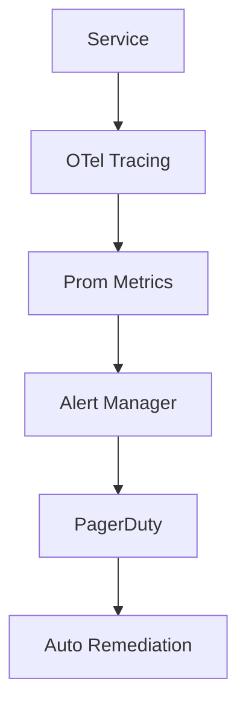

# EPIC 8 — Observability, SLOs & SRE

**Goal**: Implement comprehensive monitoring, alerting, and automated incident response.

**Architecture Reference**:

**Constraints**: Align with Org Defaults (SLOs, Cost, Privacy).

### Risk Matrix
| Risk | Impact | Mitigation |
|---|---|---|
| Technical Debt | Medium | Regular refactoring blocks. |
| Resource Constraint | High | Parallel execution with modular agents. |

### Task: Metrics Taxonomy
- **Description**: Implementation and validation of Metrics Taxonomy for the IntelGraph platform.
- **Subtasks**:
  - Define standard label sets
  - Setup metric naming convention
  - Verify scraping
- **Assigned Agent**:
  - Primary: SRE Agent
  - Optional Subagents: Observability Subagent
- **Dependencies**: Epic 8 foundational architecture.
- **Risk Tag**: Medium
- **Acceptance Criteria**:
  - Consistent metrics across app
  - Unit test coverage > 85%.
- **Verification Steps**:
  - Check Prom targets
  - Audit logs verify correct agent execution.
- **Observability Hooks**: Prometheus metrics, structured logs.
- **Policy Impact**: Governed by Org Default SRE Policy.

### Task: Tracing Standard (OTel)
- **Description**: Implementation and validation of Tracing Standard (OTel) for the IntelGraph platform.
- **Subtasks**:
  - Setup OTel collector
  - Implement span tags
  - Verify trace propagation
- **Assigned Agent**:
  - Primary: SRE Agent
  - Optional Subagents: Observability Subagent
- **Dependencies**: Epic 8 foundational architecture.
- **Risk Tag**: Medium
- **Acceptance Criteria**:
  - End-to-end visibility
  - Unit test coverage > 85%.
- **Verification Steps**:
  - Check Tempo/Jaeger
  - Audit logs verify correct agent execution.
- **Observability Hooks**: Prometheus metrics, structured logs.
- **Policy Impact**: Governed by Org Default SRE Policy.

### Task: Log Correlation
- **Description**: Implementation and validation of Log Correlation for the IntelGraph platform.
- **Subtasks**:
  - Inject trace ID into logs
  - Setup Loki/Elasticsearch
  - Verify search functionality
- **Assigned Agent**:
  - Primary: SRE Agent
  - Optional Subagents: Observability Subagent
- **Dependencies**: Epic 8 foundational architecture.
- **Risk Tag**: Medium
- **Acceptance Criteria**:
  - Logs link to traces
  - Unit test coverage > 85%.
- **Verification Steps**:
  - Run query in Grafana
  - Audit logs verify correct agent execution.
- **Observability Hooks**: Prometheus metrics, structured logs.
- **Policy Impact**: Governed by Org Default SRE Policy.

### Task: p95 Enforcement Alerts
- **Description**: Implementation and validation of p95 Enforcement Alerts for the IntelGraph platform.
- **Subtasks**:
  - Define latency SLOs
  - Setup PromQL alerts
  - Verify alert firing
- **Assigned Agent**:
  - Primary: SRE Agent
  - Optional Subagents: Observability Subagent
- **Dependencies**: Epic 8 foundational architecture.
- **Risk Tag**: Medium
- **Acceptance Criteria**:
  - Slow requests detected
  - Unit test coverage > 85%.
- **Verification Steps**:
  - Check alert manager
  - Audit logs verify correct agent execution.
- **Observability Hooks**: Prometheus metrics, structured logs.
- **Policy Impact**: Governed by Org Default SRE Policy.

### Task: Error Budget Burn Alerts
- **Description**: Implementation and validation of Error Budget Burn Alerts for the IntelGraph platform.
- **Subtasks**:
  - Implement budget burn calculation
  - Setup multi-window alerts
  - Verify prediction
- **Assigned Agent**:
  - Primary: SRE Agent
  - Optional Subagents: FinOps Agent
- **Dependencies**: Epic 8 foundational architecture.
- **Risk Tag**: Medium
- **Acceptance Criteria**:
  - High burn rate detected
  - Unit test coverage > 85%.
- **Verification Steps**:
  - Check burn dashboard
  - Audit logs verify correct agent execution.
- **Observability Hooks**: Prometheus metrics, structured logs.
- **Policy Impact**: Governed by Org Default SRE Policy.

### Task: Dashboard Definitions
- **Description**: Implementation and validation of Dashboard Definitions for the IntelGraph platform.
- **Subtasks**:
  - Create standard Grafana templates
  - Setup dashboard-as-code
  - Verify visibility
- **Assigned Agent**:
  - Primary: SRE Agent
  - Optional Subagents: Observability Subagent
- **Dependencies**: Epic 8 foundational architecture.
- **Risk Tag**: Medium
- **Acceptance Criteria**:
  - One dashboard per service
  - Unit test coverage > 85%.
- **Verification Steps**:
  - Check Grafana folders
  - Audit logs verify correct agent execution.
- **Observability Hooks**: Prometheus metrics, structured logs.
- **Policy Impact**: Governed by Org Default SRE Policy.

### Task: Synthetic Monitoring
- **Description**: Implementation and validation of Synthetic Monitoring for the IntelGraph platform.
- **Subtasks**:
  - Setup K6/Playwright probes
  - Implement global uptime checks
  - Verify alerting
- **Assigned Agent**:
  - Primary: SRE Agent
  - Optional Subagents: QA Agent
- **Dependencies**: Epic 8 foundational architecture.
- **Risk Tag**: Medium
- **Acceptance Criteria**:
  - Uptime monitored from 5 regions
  - Unit test coverage > 85%.
- **Verification Steps**:
  - Check K6 Cloud
  - Audit logs verify correct agent execution.
- **Observability Hooks**: Prometheus metrics, structured logs.
- **Policy Impact**: Governed by Org Default SRE Policy.

### Task: Chaos Testing Framework
- **Description**: Implementation and validation of Chaos Testing Framework for the IntelGraph platform.
- **Subtasks**:
  - Integrate Chaos Mesh/Gremlin
  - Setup steady-state hypothesis
  - Verify resilience
- **Assigned Agent**:
  - Primary: SRE Agent
  - Optional Subagents: DevOps Agent
- **Dependencies**: Epic 8 foundational architecture.
- **Risk Tag**: Medium
- **Acceptance Criteria**:
  - System survives node failure
  - Unit test coverage > 85%.
- **Verification Steps**:
  - Run chaos experiment
  - Audit logs verify correct agent execution.
- **Observability Hooks**: Prometheus metrics, structured logs.
- **Policy Impact**: Governed by Org Default SRE Policy.

### Task: Memory/GC Monitoring
- **Description**: Implementation and validation of Memory/GC Monitoring for the IntelGraph platform.
- **Subtasks**:
  - Setup node/python GC metrics
  - Implement heap dump automation
  - Verify leak detection
- **Assigned Agent**:
  - Primary: SRE Agent
  - Optional Subagents: Backend Agent
- **Dependencies**: Epic 8 foundational architecture.
- **Risk Tag**: Medium
- **Acceptance Criteria**:
  - Leaks detected < 1h
  - Unit test coverage > 85%.
- **Verification Steps**:
  - Check memory metrics
  - Audit logs verify correct agent execution.
- **Observability Hooks**: Prometheus metrics, structured logs.
- **Policy Impact**: Governed by Org Default SRE Policy.

### Task: Neo4j Health Check
- **Description**: Implementation and validation of Neo4j Health Check for the IntelGraph platform.
- **Subtasks**:
  - Implement deep health checks
  - Setup connection pool monitoring
  - Verify graph health
- **Assigned Agent**:
  - Primary: SRE Agent
  - Optional Subagents: Data Agent
- **Dependencies**: Epic 8 foundational architecture.
- **Risk Tag**: Medium
- **Acceptance Criteria**:
  - Graph issues detected early
  - Unit test coverage > 85%.
- **Verification Steps**:
  - Check health endpoint
  - Audit logs verify correct agent execution.
- **Observability Hooks**: Prometheus metrics, structured logs.
- **Policy Impact**: Governed by Org Default SRE Policy.

### Task: Postgres Replica Lag
- **Description**: Implementation and validation of Postgres Replica Lag for the IntelGraph platform.
- **Subtasks**:
  - Implement lag monitoring
  - Setup replication alerts
  - Verify data freshness
- **Assigned Agent**:
  - Primary: SRE Agent
  - Optional Subagents: Data Agent
- **Dependencies**: Epic 8 foundational architecture.
- **Risk Tag**: Medium
- **Acceptance Criteria**:
  - Lag < 100ms
  - Unit test coverage > 85%.
- **Verification Steps**:
  - Check lag metrics
  - Audit logs verify correct agent execution.
- **Observability Hooks**: Prometheus metrics, structured logs.
- **Policy Impact**: Governed by Org Default SRE Policy.

### Task: LLM Fallback Detection
- **Description**: Implementation and validation of LLM Fallback Detection for the IntelGraph platform.
- **Subtasks**:
  - Implement fallback logging
  - Setup quality shift alerts
  - Verify user impact
- **Assigned Agent**:
  - Primary: AI Agent
  - Optional Subagents: SRE Agent
- **Dependencies**: Epic 8 foundational architecture.
- **Risk Tag**: Medium
- **Acceptance Criteria**:
  - Fallback events tracked
  - Unit test coverage > 85%.
- **Verification Steps**:
  - Check LLM dashboard
  - Audit logs verify correct agent execution.
- **Observability Hooks**: Prometheus metrics, structured logs.
- **Policy Impact**: Governed by Org Default AI Policy.

### Task: Cost Anomaly Detection
- **Description**: Implementation and validation of Cost Anomaly Detection for the IntelGraph platform.
- **Subtasks**:
  - Implement daily cost delta alerts
  - Setup resource waste detection
  - Verify budget guard
- **Assigned Agent**:
  - Primary: FinOps Agent
  - Optional Subagents: SRE Agent
- **Dependencies**: Epic 8 foundational architecture.
- **Risk Tag**: Medium
- **Acceptance Criteria**:
  - Spikes detected < 4h
  - Unit test coverage > 85%.
- **Verification Steps**:
  - Check cost alerts
  - Audit logs verify correct agent execution.
- **Observability Hooks**: Prometheus metrics, structured logs.
- **Policy Impact**: Governed by Org Default FinOps Policy.

### Task: Capacity Modeling
- **Description**: Implementation and validation of Capacity Modeling for the IntelGraph platform.
- **Subtasks**:
  - Setup load vs resource trends
  - Implement forecasting
  - Verify right-sizing
- **Assigned Agent**:
  - Primary: SRE Agent
  - Optional Subagents: DevOps Agent
- **Dependencies**: Epic 8 foundational architecture.
- **Risk Tag**: Medium
- **Acceptance Criteria**:
  - Scaling predicted correctly
  - Unit test coverage > 85%.
- **Verification Steps**:
  - Check capacity plan
  - Audit logs verify correct agent execution.
- **Observability Hooks**: Prometheus metrics, structured logs.
- **Policy Impact**: Governed by Org Default SRE Policy.

### Task: On-call Runbooks
- **Description**: Implementation and validation of On-call Runbooks for the IntelGraph platform.
- **Subtasks**:
  - Write specific remediation steps
  - Setup runbook-link in alerts
  - Verify actionable docs
- **Assigned Agent**:
  - Primary: SRE Agent
  - Optional Subagents: Documentation Subagent
- **Dependencies**: Epic 8 foundational architecture.
- **Risk Tag**: Medium
- **Acceptance Criteria**:
  - Zero vague alerts
  - Unit test coverage > 85%.
- **Verification Steps**:
  - Check alert annotations
  - Audit logs verify correct agent execution.
- **Observability Hooks**: Prometheus metrics, structured logs.
- **Policy Impact**: Governed by Org Default SRE Policy.

### Task: Incident Response Automation
- **Description**: Implementation and validation of Incident Response Automation for the IntelGraph platform.
- **Subtasks**:
  - Implement auto-remediation (K8s)
  - Setup incident channel creation
  - Verify automation
- **Assigned Agent**:
  - Primary: SRE Agent
  - Optional Subagents: DevOps Agent
- **Dependencies**: Epic 8 foundational architecture.
- **Risk Tag**: Medium
- **Acceptance Criteria**:
  - Incident setup automated
  - Unit test coverage > 85%.
- **Verification Steps**:
  - Run IR drill
  - Audit logs verify correct agent execution.
- **Observability Hooks**: Prometheus metrics, structured logs.
- **Policy Impact**: Governed by Org Default SRE Policy.

### Task: Rollback Verification
- **Description**: Implementation and validation of Rollback Verification for the IntelGraph platform.
- **Subtasks**:
  - Implement post-rollback health check
  - Setup auto-verify scripts
  - Verify system state
- **Assigned Agent**:
  - Primary: SRE Agent
  - Optional Subagents: QA Agent
- **Dependencies**: Epic 8 foundational architecture.
- **Risk Tag**: Medium
- **Acceptance Criteria**:
  - Rollback verified instantly
  - Unit test coverage > 85%.
- **Verification Steps**:
  - Run rollback test
  - Audit logs verify correct agent execution.
- **Observability Hooks**: Prometheus metrics, structured logs.
- **Policy Impact**: Governed by Org Default SRE Policy.

### Task: DR Drill Automation
- **Description**: Implementation and validation of DR Drill Automation for the IntelGraph platform.
- **Subtasks**:
  - Setup quarterly DR scripts
  - Implement region failover
  - Verify data integrity
- **Assigned Agent**:
  - Primary: SRE Agent
  - Optional Subagents: Architecture Agent
- **Dependencies**: Epic 8 foundational architecture.
- **Risk Tag**: Medium
- **Acceptance Criteria**:
  - DR completed < 2h
  - Unit test coverage > 85%.
- **Verification Steps**:
  - Run DR drill
  - Audit logs verify correct agent execution.
- **Observability Hooks**: Prometheus metrics, structured logs.
- **Policy Impact**: Governed by Org Default SRE Policy.

### Task: Evidence Bundle (Signed)
- **Description**: Implementation and validation of Evidence Bundle (Signed) for the IntelGraph platform.
- **Subtasks**:
  - Implement automated bundle creation
  - Setup SHA-256 signing
  - Verify artifact integrity
- **Assigned Agent**:
  - Primary: Compliance Agent
  - Optional Subagents: Security Agent
- **Dependencies**: Epic 8 foundational architecture.
- **Risk Tag**: Medium
- **Acceptance Criteria**:
  - Evidence is tamper-proof
  - Unit test coverage > 85%.
- **Verification Steps**:
  - Run `verify-evidence`
  - Audit logs verify correct agent execution.
- **Observability Hooks**: Prometheus metrics, structured logs.
- **Policy Impact**: Governed by Org Default Compliance Policy.

### Parallelization Map
All tasks in this epic can run in parallel following the foundational architecture setup.

### Critical Path
Foundational ADR -> Core Implementation -> Policy Verification -> Go-Live.

### Rollback Strategy
Revert to previous stable tag; restore DB snapshots if schema change was involved.
