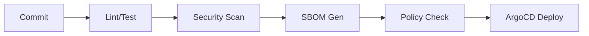

# EPIC 9 — CI/CD & Infrastructure as Code

**Goal**: Establish reproducible, secure, and policy-governed deployment pipelines.

**Architecture Reference**:

**Constraints**: Align with Org Defaults (SLOs, Cost, Privacy).

### Risk Matrix
| Risk | Impact | Mitigation |
|---|---|---|
| Technical Debt | Medium | Regular refactoring blocks. |
| Resource Constraint | High | Parallel execution with modular agents. |

### Task: Trunk Strategy
- **Description**: Implementation and validation of Trunk Strategy for the IntelGraph platform.
- **Subtasks**:
  - Enforce short-lived branches
  - Setup linear history policy
  - Verify PR merge rules
- **Assigned Agent**:
  - Primary: DevOps Agent
  - Optional Subagents: Architecture Agent
- **Dependencies**: Epic 9 foundational architecture.
- **Risk Tag**: Medium
- **Acceptance Criteria**:
  - Clean, fast git history
  - Unit test coverage > 85%.
- **Verification Steps**:
  - Check branch settings
  - Audit logs verify correct agent execution.
- **Observability Hooks**: Prometheus metrics, structured logs.
- **Policy Impact**: Governed by Org Default DevOps Policy.

### Task: PR Gate Config
- **Description**: Implementation and validation of PR Gate Config for the IntelGraph platform.
- **Subtasks**:
  - Setup required checks
  - Implement status check aggregation
  - Verify blocking
- **Assigned Agent**:
  - Primary: DevOps Agent
  - Optional Subagents: QA Agent
- **Dependencies**: Epic 9 foundational architecture.
- **Risk Tag**: Medium
- **Acceptance Criteria**:
  - No failing code merged
  - Unit test coverage > 85%.
- **Verification Steps**:
  - Check PR settings
  - Audit logs verify correct agent execution.
- **Observability Hooks**: Prometheus metrics, structured logs.
- **Policy Impact**: Governed by Org Default DevOps Policy.

### Task: Type/Lint Enforcement
- **Description**: Implementation and validation of Type/Lint Enforcement for the IntelGraph platform.
- **Subtasks**:
  - Setup TS/Python strict linting
  - Implement format check in CI
  - Verify zero violations
- **Assigned Agent**:
  - Primary: QA Agent
  - Optional Subagents: Backend Agent
- **Dependencies**: Epic 9 foundational architecture.
- **Risk Tag**: Medium
- **Acceptance Criteria**:
  - 100% clean code
  - Unit test coverage > 85%.
- **Verification Steps**:
  - Run `pnpm ci:lint`
  - Audit logs verify correct agent execution.
- **Observability Hooks**: Prometheus metrics, structured logs.
- **Policy Impact**: Governed by Org Default QA Policy.

### Task: Unit Test Coverage
- **Description**: Implementation and validation of Unit Test Coverage for the IntelGraph platform.
- **Subtasks**:
  - Setup Vitest/Pytest coverage
  - Implement 85% threshold gate
  - Verify report export
- **Assigned Agent**:
  - Primary: QA Agent
  - Optional Subagents: Backend Agent
- **Dependencies**: Epic 9 foundational architecture.
- **Risk Tag**: Medium
- **Acceptance Criteria**:
  - Coverage > 85%
  - Unit test coverage > 85%.
- **Verification Steps**:
  - Check coverage report
  - Audit logs verify correct agent execution.
- **Observability Hooks**: Prometheus metrics, structured logs.
- **Policy Impact**: Governed by Org Default QA Policy.

### Task: SBOM Pipeline
- **Description**: Implementation and validation of SBOM Pipeline for the IntelGraph platform.
- **Subtasks**:
  - Integrate Syft/Grype
  - Setup vulnerability threshold
  - Verify artifact mapping
- **Assigned Agent**:
  - Primary: Security Agent
  - Optional Subagents: Compliance Agent
- **Dependencies**: Epic 9 foundational architecture.
- **Risk Tag**: Medium
- **Acceptance Criteria**:
  - Zero critical vulns
  - Unit test coverage > 85%.
- **Verification Steps**:
  - Check SBOM logs
  - Audit logs verify correct agent execution.
- **Observability Hooks**: Prometheus metrics, structured logs.
- **Policy Impact**: Governed by Org Default Security Policy.

### Task: Policy Simulation in CI
- **Description**: Implementation and validation of Policy Simulation in CI for the IntelGraph platform.
- **Subtasks**:
  - Run conftest against TF/Helm
  - Implement OPA dry-run
  - Verify compliance
- **Assigned Agent**:
  - Primary: Security Agent
  - Optional Subagents: Policy Subagent
- **Dependencies**: Epic 9 foundational architecture.
- **Risk Tag**: Medium
- **Acceptance Criteria**:
  - Zero policy violations
  - Unit test coverage > 85%.
- **Verification Steps**:
  - Check CI logs
  - Audit logs verify correct agent execution.
- **Observability Hooks**: Prometheus metrics, structured logs.
- **Policy Impact**: Governed by Org Default Security Policy.

### Task: Helm Chart Baseline
- **Description**: Implementation and validation of Helm Chart Baseline for the IntelGraph platform.
- **Subtasks**:
  - Implement modular templates
  - Setup chart testing (ct)
  - Verify packaging
- **Assigned Agent**:
  - Primary: DevOps Agent
  - Optional Subagents: Architecture Agent
- **Dependencies**: Epic 9 foundational architecture.
- **Risk Tag**: Medium
- **Acceptance Criteria**:
  - Charts are reusable
  - Unit test coverage > 85%.
- **Verification Steps**:
  - Run `helm test`
  - Audit logs verify correct agent execution.
- **Observability Hooks**: Prometheus metrics, structured logs.
- **Policy Impact**: Governed by Org Default DevOps Policy.

### Task: Terraform Modules
- **Description**: Implementation and validation of Terraform Modules for the IntelGraph platform.
- **Subtasks**:
  - Refactor TF into versioned modules
  - Setup remote state locking
  - Verify plan accuracy
- **Assigned Agent**:
  - Primary: DevOps Agent
  - Optional Subagents: Architecture Agent
- **Dependencies**: Epic 9 foundational architecture.
- **Risk Tag**: Medium
- **Acceptance Criteria**:
  - Infra is modular
  - Unit test coverage > 85%.
- **Verification Steps**:
  - Run `tf-test`
  - Audit logs verify correct agent execution.
- **Observability Hooks**: Prometheus metrics, structured logs.
- **Policy Impact**: Governed by Org Default DevOps Policy.

### Task: Namespace Isolation
- **Description**: Implementation and validation of Namespace Isolation for the IntelGraph platform.
- **Subtasks**:
  - Enforce K8s network policies
  - Implement resource quotas
  - Verify cross-ns block
- **Assigned Agent**:
  - Primary: Security Agent
  - Optional Subagents: DevOps Agent
- **Dependencies**: Epic 9 foundational architecture.
- **Risk Tag**: Medium
- **Acceptance Criteria**:
  - Zero cross-ns traffic
  - Unit test coverage > 85%.
- **Verification Steps**:
  - Run `test:ns`
  - Audit logs verify correct agent execution.
- **Observability Hooks**: Prometheus metrics, structured logs.
- **Policy Impact**: Governed by Org Default Security Policy.

### Task: Canary Deployment (Argo)
- **Description**: Implementation and validation of Canary Deployment (Argo) for the IntelGraph platform.
- **Subtasks**:
  - Setup Argo Rollouts
  - Implement metric-based analysis
  - Verify auto-promote
- **Assigned Agent**:
  - Primary: DevOps Agent
  - Optional Subagents: SRE Agent
- **Dependencies**: Epic 9 foundational architecture.
- **Risk Tag**: Medium
- **Acceptance Criteria**:
  - Safe canary rollout
  - Unit test coverage > 85%.
- **Verification Steps**:
  - Check Argo dashboard
  - Audit logs verify correct agent execution.
- **Observability Hooks**: Prometheus metrics, structured logs.
- **Policy Impact**: Governed by Org Default DevOps Policy.

### Task: Rollback Automation
- **Description**: Implementation and validation of Rollback Automation for the IntelGraph platform.
- **Subtasks**:
  - Implement one-click rollback
  - Setup post-rollback validation
  - Verify speed
- **Assigned Agent**:
  - Primary: DevOps Agent
  - Optional Subagents: SRE Agent
- **Dependencies**: Epic 9 foundational architecture.
- **Risk Tag**: Medium
- **Acceptance Criteria**:
  - Rollback < 1m
  - Unit test coverage > 85%.
- **Verification Steps**:
  - Run rollback test
  - Audit logs verify correct agent execution.
- **Observability Hooks**: Prometheus metrics, structured logs.
- **Policy Impact**: Governed by Org Default DevOps Policy.

### Task: Release Tagging
- **Description**: Implementation and validation of Release Tagging for the IntelGraph platform.
- **Subtasks**:
  - Automate semver calculation
  - Setup changelog generation
  - Verify git tags
- **Assigned Agent**:
  - Primary: DevOps Agent
  - Optional Subagents: Documentation Subagent
- **Dependencies**: Epic 9 foundational architecture.
- **Risk Tag**: Medium
- **Acceptance Criteria**:
  - Releases are versioned
  - Unit test coverage > 85%.
- **Verification Steps**:
  - Check release notes
  - Audit logs verify correct agent execution.
- **Observability Hooks**: Prometheus metrics, structured logs.
- **Policy Impact**: Governed by Org Default DevOps Policy.

### Task: Evidence Bundle (CI)
- **Description**: Implementation and validation of Evidence Bundle (CI) for the IntelGraph platform.
- **Subtasks**:
  - Export all CI signals to evidence
  - Setup provenance link
  - Verify build audit
- **Assigned Agent**:
  - Primary: Compliance Agent
  - Optional Subagents: DevOps Agent
- **Dependencies**: Epic 9 foundational architecture.
- **Risk Tag**: Medium
- **Acceptance Criteria**:
  - Build is fully auditable
  - Unit test coverage > 85%.
- **Verification Steps**:
  - Check `dist/evidence.json`
  - Audit logs verify correct agent execution.
- **Observability Hooks**: Prometheus metrics, structured logs.
- **Policy Impact**: Governed by Org Default Compliance Policy.

### Task: Artifact Signing
- **Description**: Implementation and validation of Artifact Signing for the IntelGraph platform.
- **Subtasks**:
  - Integrate Sigstore/Cosign
  - Setup keyless signing
  - Verify image integrity
- **Assigned Agent**:
  - Primary: Security Agent
  - Optional Subagents: DevOps Agent
- **Dependencies**: Epic 9 foundational architecture.
- **Risk Tag**: Medium
- **Acceptance Criteria**:
  - Only signed images run
  - Unit test coverage > 85%.
- **Verification Steps**:
  - Run `cosign verify`
  - Audit logs verify correct agent execution.
- **Observability Hooks**: Prometheus metrics, structured logs.
- **Policy Impact**: Governed by Org Default Security Policy.

### Task: Secret Scanning
- **Description**: Implementation and validation of Secret Scanning for the IntelGraph platform.
- **Subtasks**:
  - Integrate Gitleaks/Trufflehog
  - Setup CI blocking gate
  - Verify zero leaks
- **Assigned Agent**:
  - Primary: Security Agent
  - Optional Subagents: DevOps Agent
- **Dependencies**: Epic 9 foundational architecture.
- **Risk Tag**: Medium
- **Acceptance Criteria**:
  - Zero secrets in git
  - Unit test coverage > 85%.
- **Verification Steps**:
  - Check gitleaks report
  - Audit logs verify correct agent execution.
- **Observability Hooks**: Prometheus metrics, structured logs.
- **Policy Impact**: Governed by Org Default Security Policy.

### Task: Dependency Scanning
- **Description**: Implementation and validation of Dependency Scanning for the IntelGraph platform.
- **Subtasks**:
  - Integrate Renovate/Snyk
  - Setup auto-remediation
  - Verify security delta
- **Assigned Agent**:
  - Primary: Security Agent
  - Optional Subagents: DevOps Agent
- **Dependencies**: Epic 9 foundational architecture.
- **Risk Tag**: Medium
- **Acceptance Criteria**:
  - Zero vulnerable deps
  - Unit test coverage > 85%.
- **Verification Steps**:
  - Check Snyk dashboard
  - Audit logs verify correct agent execution.
- **Observability Hooks**: Prometheus metrics, structured logs.
- **Policy Impact**: Governed by Org Default Security Policy.

### Task: Container Hardening
- **Description**: Implementation and validation of Container Hardening for the IntelGraph platform.
- **Subtasks**:
  - Use distroless/alpine base
  - Implement non-root policy
  - Verify scan score
- **Assigned Agent**:
  - Primary: Security Agent
  - Optional Subagents: DevOps Agent
- **Dependencies**: Epic 9 foundational architecture.
- **Risk Tag**: Medium
- **Acceptance Criteria**:
  - Secure container score
  - Unit test coverage > 85%.
- **Verification Steps**:
  - Run `trivy`
  - Audit logs verify correct agent execution.
- **Observability Hooks**: Prometheus metrics, structured logs.
- **Policy Impact**: Governed by Org Default Security Policy.

### Task: Drift Detection
- **Description**: Implementation and validation of Drift Detection for the IntelGraph platform.
- **Subtasks**:
  - Setup recurring TF drift check
  - Implement auto-reconciliation
  - Verify infra parity
- **Assigned Agent**:
  - Primary: DevOps Agent
  - Optional Subagents: SRE Agent
- **Dependencies**: Epic 9 foundational architecture.
- **Risk Tag**: Medium
- **Acceptance Criteria**:
  - Zero infra drift
  - Unit test coverage > 85%.
- **Verification Steps**:
  - Check drift report
  - Audit logs verify correct agent execution.
- **Observability Hooks**: Prometheus metrics, structured logs.
- **Policy Impact**: Governed by Org Default DevOps Policy.

### Task: Multi-region Overlays
- **Description**: Implementation and validation of Multi-region Overlays for the IntelGraph platform.
- **Subtasks**:
  - Implement kustomize overlays
  - Setup region-specific configs
  - Verify parity
- **Assigned Agent**:
  - Primary: DevOps Agent
  - Optional Subagents: Architecture Agent
- **Dependencies**: Epic 9 foundational architecture.
- **Risk Tag**: Medium
- **Acceptance Criteria**:
  - Multi-region ready
  - Unit test coverage > 85%.
- **Verification Steps**:
  - Check overlays
  - Audit logs verify correct agent execution.
- **Observability Hooks**: Prometheus metrics, structured logs.
- **Policy Impact**: Governed by Org Default DevOps Policy.

### Parallelization Map
All tasks in this epic can run in parallel following the foundational architecture setup.

### Critical Path
Foundational ADR -> Core Implementation -> Policy Verification -> Go-Live.

### Rollback Strategy
Revert to previous stable tag; restore DB snapshots if schema change was involved.
