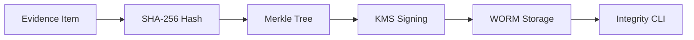

# EPIC 10 — Provenance, Audit & Evidence Exports

**Goal**: Ensure cryptographically verifiable integrity for all claims and evidence.

**Architecture Reference**:

**Constraints**: Align with Org Defaults (SLOs, Cost, Privacy).

### Risk Matrix
| Risk | Impact | Mitigation |
|---|---|---|
| Technical Debt | Medium | Regular refactoring blocks. |
| Resource Constraint | High | Parallel execution with modular agents. |

### Task: Provenance Claim Model
- **Description**: Implementation and validation of Provenance Claim Model for the IntelGraph platform.
- **Subtasks**:
  - Define W3C Verifiable Claims
  - Implement claim signing API
  - Verify metadata
- **Assigned Agent**:
  - Primary: Security Agent
  - Optional Subagents: Crypto Subagent
- **Dependencies**: Epic 10 foundational architecture.
- **Risk Tag**: Medium
- **Acceptance Criteria**:
  - Claims are verifiable
  - Unit test coverage > 85%.
- **Verification Steps**:
  - Run `test:claims`
  - Audit logs verify correct agent execution.
- **Observability Hooks**: Prometheus metrics, structured logs.
- **Policy Impact**: Governed by Org Default Security Policy.

### Task: Evidence Edge Schema
- **Description**: Implementation and validation of Evidence Edge Schema for the IntelGraph platform.
- **Subtasks**:
  - Define link between claim and evidence
  - Implement graph edge types
  - Verify query
- **Assigned Agent**:
  - Primary: Data Agent
  - Optional Subagents: Schema Subagent
- **Dependencies**: Epic 10 foundational architecture.
- **Risk Tag**: Medium
- **Acceptance Criteria**:
  - Evidence linked to claims
  - Unit test coverage > 85%.
- **Verification Steps**:
  - Query `EVIDENCE_OF`
  - Audit logs verify correct agent execution.
- **Observability Hooks**: Prometheus metrics, structured logs.
- **Policy Impact**: Governed by Org Default Data Policy.

### Task: Hash Manifest Format
- **Description**: Implementation and validation of Hash Manifest Format for the IntelGraph platform.
- **Subtasks**:
  - Implement Merkle tree for evidence
  - Setup manifest generation
  - Verify root hash
- **Assigned Agent**:
  - Primary: Security Agent
  - Optional Subagents: Crypto Subagent
- **Dependencies**: Epic 10 foundational architecture.
- **Risk Tag**: Medium
- **Acceptance Criteria**:
  - Manifest is integrity-locked
  - Unit test coverage > 85%.
- **Verification Steps**:
  - Run Merkle test
  - Audit logs verify correct agent execution.
- **Observability Hooks**: Prometheus metrics, structured logs.
- **Policy Impact**: Governed by Org Default Security Policy.

### Task: Export Signing
- **Description**: Implementation and validation of Export Signing for the IntelGraph platform.
- **Subtasks**:
  - Implement CMS/JWS signing
  - Setup HSM/KMS integration
  - Verify signature
- **Assigned Agent**:
  - Primary: Security Agent
  - Optional Subagents: Crypto Subagent
- **Dependencies**: Epic 10 foundational architecture.
- **Risk Tag**: Medium
- **Acceptance Criteria**:
  - Exports are signed
  - Unit test coverage > 85%.
- **Verification Steps**:
  - Run `openssl verify`
  - Audit logs verify correct agent execution.
- **Observability Hooks**: Prometheus metrics, structured logs.
- **Policy Impact**: Governed by Org Default Security Policy.

### Task: Immutable Ledger
- **Description**: Implementation and validation of Immutable Ledger for the IntelGraph platform.
- **Subtasks**:
  - Setup QLDB/Hyperledger or WORM S3
  - Implement append-only logic
  - Verify non-mutability
- **Assigned Agent**:
  - Primary: Security Agent
  - Optional Subagents: Compliance Agent
- **Dependencies**: Epic 10 foundational architecture.
- **Risk Tag**: Medium
- **Acceptance Criteria**:
  - Data cannot be edited
  - Unit test coverage > 85%.
- **Verification Steps**:
  - Run mutability test
  - Audit logs verify correct agent execution.
- **Observability Hooks**: Prometheus metrics, structured logs.
- **Policy Impact**: Governed by Org Default Security Policy.

### Task: Audit Query API
- **Description**: Implementation and validation of Audit Query API for the IntelGraph platform.
- **Subtasks**:
  - Implement high-perf audit search
  - Setup filtering by actor/time
  - Verify results
- **Assigned Agent**:
  - Primary: Backend Agent
  - Optional Subagents: Data Agent
- **Dependencies**: Epic 10 foundational architecture.
- **Risk Tag**: Medium
- **Acceptance Criteria**:
  - Audits searched < 1s
  - Unit test coverage > 85%.
- **Verification Steps**:
  - Run `test:audit-api`
  - Audit logs verify correct agent execution.
- **Observability Hooks**: Prometheus metrics, structured logs.
- **Policy Impact**: Governed by Org Default Backend Policy.

### Task: Tamper Detection
- **Description**: Implementation and validation of Tamper Detection for the IntelGraph platform.
- **Subtasks**:
  - Implement daily integrity scan
  - Setup discrepancy alerts
  - Verify detection
- **Assigned Agent**:
  - Primary: Security Agent
  - Optional Subagents: SRE Agent
- **Dependencies**: Epic 10 foundational architecture.
- **Risk Tag**: Medium
- **Acceptance Criteria**:
  - Tampering detected < 1h
  - Unit test coverage > 85%.
- **Verification Steps**:
  - Run tamper simulation
  - Audit logs verify correct agent execution.
- **Observability Hooks**: Prometheus metrics, structured logs.
- **Policy Impact**: Governed by Org Default Security Policy.

### Task: Resync Protocol
- **Description**: Implementation and validation of Resync Protocol for the IntelGraph platform.
- **Subtasks**:
  - Implement offline-to-online sync
  - Setup conflict resolution
  - Verify hash parity
- **Assigned Agent**:
  - Primary: Architecture Agent
  - Optional Subagents: Backend Agent
- **Dependencies**: Epic 10 foundational architecture.
- **Risk Tag**: Medium
- **Acceptance Criteria**:
  - Data syncs correctly
  - Unit test coverage > 85%.
- **Verification Steps**:
  - Run resync test
  - Audit logs verify correct agent execution.
- **Observability Hooks**: Prometheus metrics, structured logs.
- **Policy Impact**: Governed by Org Default Architecture Policy.

### Task: Chain-of-custody
- **Description**: Implementation and validation of Chain-of-custody for the IntelGraph platform.
- **Subtasks**:
  - Implement custodial handoff logs
  - Setup digital signatures
  - Verify path integrity
- **Assigned Agent**:
  - Primary: Security Agent
  - Optional Subagents: Compliance Agent
- **Dependencies**: Epic 10 foundational architecture.
- **Risk Tag**: Medium
- **Acceptance Criteria**:
  - Custody is transparent
  - Unit test coverage > 85%.
- **Verification Steps**:
  - Check custody logs
  - Audit logs verify correct agent execution.
- **Observability Hooks**: Prometheus metrics, structured logs.
- **Policy Impact**: Governed by Org Default Security Policy.

### Task: Evidence Redaction
- **Description**: Implementation and validation of Evidence Redaction for the IntelGraph platform.
- **Subtasks**:
  - Implement selective disclosure
  - Setup Zero-Knowledge Proofs
  - Verify privacy
- **Assigned Agent**:
  - Primary: Security Agent
  - Optional Subagents: Crypto Subagent
- **Dependencies**: Epic 10 foundational architecture.
- **Risk Tag**: Medium
- **Acceptance Criteria**:
  - Data redacted but valid
  - Unit test coverage > 85%.
- **Verification Steps**:
  - Run ZKP test
  - Audit logs verify correct agent execution.
- **Observability Hooks**: Prometheus metrics, structured logs.
- **Policy Impact**: Governed by Org Default Security Policy.

### Task: Integrity CLI
- **Description**: Implementation and validation of Integrity CLI for the IntelGraph platform.
- **Subtasks**:
  - Build `summit-verify` tool
  - Implement local hash validation
  - Verify user UX
- **Assigned Agent**:
  - Primary: QA Agent
  - Optional Subagents: Security Agent
- **Dependencies**: Epic 10 foundational architecture.
- **Risk Tag**: Medium
- **Acceptance Criteria**:
  - CLI verifies data 100%
  - Unit test coverage > 85%.
- **Verification Steps**:
  - Run `summit-verify`
  - Audit logs verify correct agent execution.
- **Observability Hooks**: Prometheus metrics, structured logs.
- **Policy Impact**: Governed by Org Default QA Policy.

### Task: Snapshotting Strategy
- **Description**: Implementation and validation of Snapshotting Strategy for the IntelGraph platform.
- **Subtasks**:
  - Implement point-in-time recovery
  - Setup periodic snapshots
  - Verify restore
- **Assigned Agent**:
  - Primary: Data Agent
  - Optional Subagents: SRE Agent
- **Dependencies**: Epic 10 foundational architecture.
- **Risk Tag**: Medium
- **Acceptance Criteria**:
  - Restore successful
  - Unit test coverage > 85%.
- **Verification Steps**:
  - Run restore drill
  - Audit logs verify correct agent execution.
- **Observability Hooks**: Prometheus metrics, structured logs.
- **Policy Impact**: Governed by Org Default Data Policy.

### Task: WORM Storage Policy
- **Description**: Implementation and validation of WORM Storage Policy for the IntelGraph platform.
- **Subtasks**:
  - Setup S3 Object Lock (Compliance)
  - Implement retention rules
  - Verify lock
- **Assigned Agent**:
  - Primary: Compliance Agent
  - Optional Subagents: DevOps Agent
- **Dependencies**: Epic 10 foundational architecture.
- **Risk Tag**: Medium
- **Acceptance Criteria**:
  - Locked for 10 years
  - Unit test coverage > 85%.
- **Verification Steps**:
  - Check S3 policy
  - Audit logs verify correct agent execution.
- **Observability Hooks**: Prometheus metrics, structured logs.
- **Policy Impact**: Governed by Org Default Compliance Policy.

### Task: Audit Replay Harness
- **Description**: Implementation and validation of Audit Replay Harness for the IntelGraph platform.
- **Subtasks**:
  - Implement event replay tool
  - Setup state reconstruction
  - Verify accuracy
- **Assigned Agent**:
  - Primary: Backend Agent
  - Optional Subagents: Data Agent
- **Dependencies**: Epic 10 foundational architecture.
- **Risk Tag**: Medium
- **Acceptance Criteria**:
  - State matches audit
  - Unit test coverage > 85%.
- **Verification Steps**:
  - Run replay drill
  - Audit logs verify correct agent execution.
- **Observability Hooks**: Prometheus metrics, structured logs.
- **Policy Impact**: Governed by Org Default Backend Policy.

### Task: Legal Export Packaging
- **Description**: Implementation and validation of Legal Export Packaging for the IntelGraph platform.
- **Subtasks**:
  - Implement zip/tar with manifest
  - Setup automated delivery
  - Verify completeness
- **Assigned Agent**:
  - Primary: Compliance Agent
  - Optional Subagents: Data Agent
- **Dependencies**: Epic 10 foundational architecture.
- **Risk Tag**: Medium
- **Acceptance Criteria**:
  - Export is legally ready
  - Unit test coverage > 85%.
- **Verification Steps**:
  - Check legal bundle
  - Audit logs verify correct agent execution.
- **Observability Hooks**: Prometheus metrics, structured logs.
- **Policy Impact**: Governed by Org Default Compliance Policy.

### Task: Metadata Retention
- **Description**: Implementation and validation of Metadata Retention for the IntelGraph platform.
- **Subtasks**:
  - Implement granular retention per tag
  - Setup automated cleanup
  - Verify alignment
- **Assigned Agent**:
  - Primary: Compliance Agent
  - Optional Subagents: Data Agent
- **Dependencies**: Epic 10 foundational architecture.
- **Risk Tag**: Medium
- **Acceptance Criteria**:
  - Retention aligned with law
  - Unit test coverage > 85%.
- **Verification Steps**:
  - Check cleanup logs
  - Audit logs verify correct agent execution.
- **Observability Hooks**: Prometheus metrics, structured logs.
- **Policy Impact**: Governed by Org Default Compliance Policy.

### Task: Timestamp Authority
- **Description**: Implementation and validation of Timestamp Authority for the IntelGraph platform.
- **Subtasks**:
  - Integrate RFC 3161 TSA
  - Implement trusted timestamping
  - Verify time sync
- **Assigned Agent**:
  - Primary: Security Agent
  - Optional Subagents: Crypto Subagent
- **Dependencies**: Epic 10 foundational architecture.
- **Risk Tag**: Medium
- **Acceptance Criteria**:
  - Timestamps are trusted
  - Unit test coverage > 85%.
- **Verification Steps**:
  - Run TSA verify
  - Audit logs verify correct agent execution.
- **Observability Hooks**: Prometheus metrics, structured logs.
- **Policy Impact**: Governed by Org Default Security Policy.

### Task: Multi-party Verification
- **Description**: Implementation and validation of Multi-party Verification for the IntelGraph platform.
- **Subtasks**:
  - Implement m-of-n signing
  - Setup approval workflow
  - Verify collective trust
- **Assigned Agent**:
  - Primary: Security Agent
  - Optional Subagents: Policy Subagent
- **Dependencies**: Epic 10 foundational architecture.
- **Risk Tag**: Medium
- **Acceptance Criteria**:
  - Threshold signing works
  - Unit test coverage > 85%.
- **Verification Steps**:
  - Run multi-sig test
  - Audit logs verify correct agent execution.
- **Observability Hooks**: Prometheus metrics, structured logs.
- **Policy Impact**: Governed by Org Default Security Policy.

### Parallelization Map
All tasks in this epic can run in parallel following the foundational architecture setup.

### Critical Path
Foundational ADR -> Core Implementation -> Policy Verification -> Go-Live.

### Rollback Strategy
Revert to previous stable tag; restore DB snapshots if schema change was involved.
