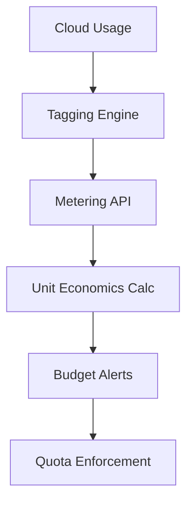

# EPIC 11 — Cost Governance & Unit Economics

**Goal**: Enforce financial guardrails and per-tenant unit economics tracking.

**Architecture Reference**:

**Constraints**: Align with Org Defaults (SLOs, Cost, Privacy).

### Risk Matrix
| Risk | Impact | Mitigation |
|---|---|---|
| Technical Debt | Medium | Regular refactoring blocks. |
| Resource Constraint | High | Parallel execution with modular agents. |

### Task: Cost Allocation Tags
- **Description**: Implementation and validation of Cost Allocation Tags for the IntelGraph platform.
- **Subtasks**:
  - Define mandatory tag set
  - Implement tagging policy in TF
  - Verify billing
- **Assigned Agent**:
  - Primary: FinOps Agent
  - Optional Subagents: DevOps Agent
- **Dependencies**: Epic 11 foundational architecture.
- **Risk Tag**: Medium
- **Acceptance Criteria**:
  - 100% resources tagged
  - Unit test coverage > 85%.
- **Verification Steps**:
  - Check AWS billing
  - Audit logs verify correct agent execution.
- **Observability Hooks**: Prometheus metrics, structured logs.
- **Policy Impact**: Governed by Org Default FinOps Policy.

### Task: Per-tenant Metering
- **Description**: Implementation and validation of Per-tenant Metering for the IntelGraph platform.
- **Subtasks**:
  - Implement event-based cost tracking
  - Setup metering API
  - Verify accuracy
- **Assigned Agent**:
  - Primary: FinOps Agent
  - Optional Subagents: Backend Agent
- **Dependencies**: Epic 11 foundational architecture.
- **Risk Tag**: Medium
- **Acceptance Criteria**:
  - Metering accurate < 1%
  - Unit test coverage > 85%.
- **Verification Steps**:
  - Run metering audit
  - Audit logs verify correct agent execution.
- **Observability Hooks**: Prometheus metrics, structured logs.
- **Policy Impact**: Governed by Org Default FinOps Policy.

### Task: LLM Usage Metering
- **Description**: Implementation and validation of LLM Usage Metering for the IntelGraph platform.
- **Subtasks**:
  - Implement token counter for all LLMs
  - Setup usage dashboard
  - Verify per-user metrics
- **Assigned Agent**:
  - Primary: FinOps Agent
  - Optional Subagents: AI Agent
- **Dependencies**: Epic 11 foundational architecture.
- **Risk Tag**: Medium
- **Acceptance Criteria**:
  - Token usage tracked
  - Unit test coverage > 85%.
- **Verification Steps**:
  - Check LLM dashboard
  - Audit logs verify correct agent execution.
- **Observability Hooks**: Prometheus metrics, structured logs.
- **Policy Impact**: Governed by Org Default FinOps Policy.

### Task: GraphQL Cost Tracking
- **Description**: Implementation and validation of GraphQL Cost Tracking for the IntelGraph platform.
- **Subtasks**:
  - Implement query complexity meter
  - Setup cost-per-query tracking
  - Verify economics
- **Assigned Agent**:
  - Primary: FinOps Agent
  - Optional Subagents: Backend Agent
- **Dependencies**: Epic 11 foundational architecture.
- **Risk Tag**: Medium
- **Acceptance Criteria**:
  - Query cost identified
  - Unit test coverage > 85%.
- **Verification Steps**:
  - Check GQL logs
  - Audit logs verify correct agent execution.
- **Observability Hooks**: Prometheus metrics, structured logs.
- **Policy Impact**: Governed by Org Default FinOps Policy.

### Task: Ingest Cost Tracking
- **Description**: Implementation and validation of Ingest Cost Tracking for the IntelGraph platform.
- **Subtasks**:
  - Implement per-byte ingest cost
  - Setup storage cost attribution
  - Verify per-tenant total
- **Assigned Agent**:
  - Primary: FinOps Agent
  - Optional Subagents: Data Agent
- **Dependencies**: Epic 11 foundational architecture.
- **Risk Tag**: Medium
- **Acceptance Criteria**:
  - Ingest cost attributed
  - Unit test coverage > 85%.
- **Verification Steps**:
  - Check ingest logs
  - Audit logs verify correct agent execution.
- **Observability Hooks**: Prometheus metrics, structured logs.
- **Policy Impact**: Governed by Org Default FinOps Policy.

### Task: Alert at 80% Budget
- **Description**: Implementation and validation of Alert at 80% Budget for the IntelGraph platform.
- **Subtasks**:
  - Implement real-time budget tracking
  - Setup multi-channel alerts
  - Verify notifications
- **Assigned Agent**:
  - Primary: FinOps Agent
  - Optional Subagents: SRE Agent
- **Dependencies**: Epic 11 foundational architecture.
- **Risk Tag**: Medium
- **Acceptance Criteria**:
  - Alerts fire at threshold
  - Unit test coverage > 85%.
- **Verification Steps**:
  - Simulate budget hit
  - Audit logs verify correct agent execution.
- **Observability Hooks**: Prometheus metrics, structured logs.
- **Policy Impact**: Governed by Org Default FinOps Policy.

### Task: Budget Burn Simulation
- **Description**: Implementation and validation of Budget Burn Simulation for the IntelGraph platform.
- **Subtasks**:
  - Implement 'what-if' cost predictor
  - Setup scenario planning
  - Verify accuracy
- **Assigned Agent**:
  - Primary: FinOps Agent
  - Optional Subagents: AI Agent
- **Dependencies**: Epic 11 foundational architecture.
- **Risk Tag**: Medium
- **Acceptance Criteria**:
  - Costs predicted accurately
  - Unit test coverage > 85%.
- **Verification Steps**:
  - Run cost simulation
  - Audit logs verify correct agent execution.
- **Observability Hooks**: Prometheus metrics, structured logs.
- **Policy Impact**: Governed by Org Default FinOps Policy.

### Task: Autoscaling Guardrails
- **Description**: Implementation and validation of Autoscaling Guardrails for the IntelGraph platform.
- **Subtasks**:
  - Set max scale limits per tenant
  - Implement cost-aware scaling
  - Verify safety
- **Assigned Agent**:
  - Primary: SRE Agent
  - Optional Subagents: FinOps Agent
- **Dependencies**: Epic 11 foundational architecture.
- **Risk Tag**: Medium
- **Acceptance Criteria**:
  - Scale limited by budget
  - Unit test coverage > 85%.
- **Verification Steps**:
  - Run scaling test
  - Audit logs verify correct agent execution.
- **Observability Hooks**: Prometheus metrics, structured logs.
- **Policy Impact**: Governed by Org Default SRE Policy.

### Task: Idle Resource Detection
- **Description**: Implementation and validation of Idle Resource Detection for the IntelGraph platform.
- **Subtasks**:
  - Implement tool to find unused EBS/EIP
  - Setup auto-cleanup
  - Verify savings
- **Assigned Agent**:
  - Primary: FinOps Agent
  - Optional Subagents: SRE Agent
- **Dependencies**: Epic 11 foundational architecture.
- **Risk Tag**: Medium
- **Acceptance Criteria**:
  - Waste detected and removed
  - Unit test coverage > 85%.
- **Verification Steps**:
  - Check waste report
  - Audit logs verify correct agent execution.
- **Observability Hooks**: Prometheus metrics, structured logs.
- **Policy Impact**: Governed by Org Default FinOps Policy.

### Task: Resource Right-sizing
- **Description**: Implementation and validation of Resource Right-sizing for the IntelGraph platform.
- **Subtasks**:
  - Analyze CPU/Mem utilization
  - Implement instance type changes
  - Verify performance
- **Assigned Agent**:
  - Primary: SRE Agent
  - Optional Subagents: FinOps Agent
- **Dependencies**: Epic 11 foundational architecture.
- **Risk Tag**: Medium
- **Acceptance Criteria**:
  - Utilization > 60%
  - Unit test coverage > 85%.
- **Verification Steps**:
  - Check metrics
  - Audit logs verify correct agent execution.
- **Observability Hooks**: Prometheus metrics, structured logs.
- **Policy Impact**: Governed by Org Default SRE Policy.

### Task: Storage Tier Optimization
- **Description**: Implementation and validation of Storage Tier Optimization for the IntelGraph platform.
- **Subtasks**:
  - Setup S3 Intelligent-Tiering
  - Implement lifecycle transitions
  - Verify cost reduction
- **Assigned Agent**:
  - Primary: FinOps Agent
  - Optional Subagents: Data Agent
- **Dependencies**: Epic 11 foundational architecture.
- **Risk Tag**: Medium
- **Acceptance Criteria**:
  - Storage costs reduced
  - Unit test coverage > 85%.
- **Verification Steps**:
  - Check S3 bill
  - Audit logs verify correct agent execution.
- **Observability Hooks**: Prometheus metrics, structured logs.
- **Policy Impact**: Governed by Org Default FinOps Policy.

### Task: Long-term Archive
- **Description**: Implementation and validation of Long-term Archive for the IntelGraph platform.
- **Subtasks**:
  - Implement Glacier Deep Archive policy
  - Setup retrieval cost model
  - Verify data safety
- **Assigned Agent**:
  - Primary: FinOps Agent
  - Optional Subagents: Compliance Agent
- **Dependencies**: Epic 11 foundational architecture.
- **Risk Tag**: Medium
- **Acceptance Criteria**:
  - Archive costs optimized
  - Unit test coverage > 85%.
- **Verification Steps**:
  - Check archive bill
  - Audit logs verify correct agent execution.
- **Observability Hooks**: Prometheus metrics, structured logs.
- **Policy Impact**: Governed by Org Default FinOps Policy.

### Task: Forecasting Dashboard
- **Description**: Implementation and validation of Forecasting Dashboard for the IntelGraph platform.
- **Subtasks**:
  - Implement ML-based cost forecast
  - Setup executive summary
  - Verify trend visibility
- **Assigned Agent**:
  - Primary: FinOps Agent
  - Optional Subagents: AI Agent
- **Dependencies**: Epic 11 foundational architecture.
- **Risk Tag**: Medium
- **Acceptance Criteria**:
  - Trends predicted 90 days
  - Unit test coverage > 85%.
- **Verification Steps**:
  - Check executive dash
  - Audit logs verify correct agent execution.
- **Observability Hooks**: Prometheus metrics, structured logs.
- **Policy Impact**: Governed by Org Default FinOps Policy.

### Task: Tenant Quota System
- **Description**: Implementation and validation of Tenant Quota System for the IntelGraph platform.
- **Subtasks**:
  - Implement hard limits on resources
  - Setup quota management UI
  - Verify enforcement
- **Assigned Agent**:
  - Primary: FinOps Agent
  - Optional Subagents: Backend Agent
- **Dependencies**: Epic 11 foundational architecture.
- **Risk Tag**: Medium
- **Acceptance Criteria**:
  - Tenants cannot exceed quotas
  - Unit test coverage > 85%.
- **Verification Steps**:
  - Run quota test
  - Audit logs verify correct agent execution.
- **Observability Hooks**: Prometheus metrics, structured logs.
- **Policy Impact**: Governed by Org Default FinOps Policy.

### Task: Cost Anomaly Detection
- **Description**: Implementation and validation of Cost Anomaly Detection for the IntelGraph platform.
- **Subtasks**:
  - Implement Z-score spike alerts
  - Setup resource attribution
  - Verify detection
- **Assigned Agent**:
  - Primary: FinOps Agent
  - Optional Subagents: SRE Agent
- **Dependencies**: Epic 11 foundational architecture.
- **Risk Tag**: Medium
- **Acceptance Criteria**:
  - Spikes detected < 1h
  - Unit test coverage > 85%.
- **Verification Steps**:
  - Check anomaly logs
  - Audit logs verify correct agent execution.
- **Observability Hooks**: Prometheus metrics, structured logs.
- **Policy Impact**: Governed by Org Default FinOps Policy.

### Task: Unit Economics Reporting
- **Description**: Implementation and validation of Unit Economics Reporting for the IntelGraph platform.
- **Subtasks**:
  - Calculate CAC/LTV vs Infra cost
  - Setup profitability dash
  - Verify reporting
- **Assigned Agent**:
  - Primary: FinOps Agent
  - Optional Subagents: Architecture Agent
- **Dependencies**: Epic 11 foundational architecture.
- **Risk Tag**: Medium
- **Acceptance Criteria**:
  - Profitability visible
  - Unit test coverage > 85%.
- **Verification Steps**:
  - Check unit economics
  - Audit logs verify correct agent execution.
- **Observability Hooks**: Prometheus metrics, structured logs.
- **Policy Impact**: Governed by Org Default FinOps Policy.

### Task: Infra Waste Audit
- **Description**: Implementation and validation of Infra Waste Audit for the IntelGraph platform.
- **Subtasks**:
  - Setup monthly cleanup drill
  - Implement cost reduction goals
  - Verify actual savings
- **Assigned Agent**:
  - Primary: FinOps Agent
  - Optional Subagents: DevOps Agent
- **Dependencies**: Epic 11 foundational architecture.
- **Risk Tag**: Medium
- **Acceptance Criteria**:
  - Waste reduced by 20%
  - Unit test coverage > 85%.
- **Verification Steps**:
  - Check audit report
  - Audit logs verify correct agent execution.
- **Observability Hooks**: Prometheus metrics, structured logs.
- **Policy Impact**: Governed by Org Default FinOps Policy.

### Task: Vendor Fallback
- **Description**: Implementation and validation of Vendor Fallback for the IntelGraph platform.
- **Subtasks**:
  - Assess cost of secondary providers
  - Implement vendor-neutral infra
  - Verify pricing leverage
- **Assigned Agent**:
  - Primary: FinOps Agent
  - Optional Subagents: Architecture Agent
- **Dependencies**: Epic 11 foundational architecture.
- **Risk Tag**: Medium
- **Acceptance Criteria**:
  - Multi-vendor ready
  - Unit test coverage > 85%.
- **Verification Steps**:
  - Check pricing plan
  - Audit logs verify correct agent execution.
- **Observability Hooks**: Prometheus metrics, structured logs.
- **Policy Impact**: Governed by Org Default FinOps Policy.

### Task: SLA Cost Impact
- **Description**: Implementation and validation of SLA Cost Impact for the IntelGraph platform.
- **Subtasks**:
  - Calculate cost of SLA breaches
  - Setup financial risk model
  - Verify reserve fund
- **Assigned Agent**:
  - Primary: FinOps Agent
  - Optional Subagents: Compliance Agent
- **Dependencies**: Epic 11 foundational architecture.
- **Risk Tag**: Medium
- **Acceptance Criteria**:
  - Risk is quantified
  - Unit test coverage > 85%.
- **Verification Steps**:
  - Check SLA report
  - Audit logs verify correct agent execution.
- **Observability Hooks**: Prometheus metrics, structured logs.
- **Policy Impact**: Governed by Org Default FinOps Policy.

### Parallelization Map
All tasks in this epic can run in parallel following the foundational architecture setup.

### Critical Path
Foundational ADR -> Core Implementation -> Policy Verification -> Go-Live.

### Rollback Strategy
Revert to previous stable tag; restore DB snapshots if schema change was involved.
