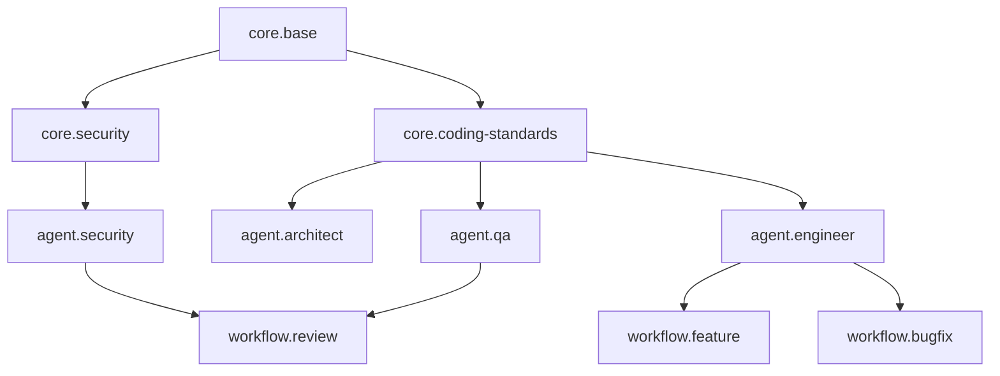

# PROMPTS_MASTER - Unified Prompt Architecture

This document defines the canonical architecture for the IntelGraph Agent Ecosystem. It supersedes all previous prompt documentation.

## 1. System Philosophy

The IntelGraph Agent Ecosystem is designed as a **Recursive-Extrapolative System**. Agents do not just execute tasks; they:
1.  **Infer** context and intent.
2.  **Extrapolate** future requirements.
3.  **Refine** their own instructions.
4.  **Execute** with precision.
5.  **Verify** their work.

## 2. Taxonomy

Prompts are organized into three distinct tiers:

### Tier 1: Core (`prompts/core/`)
Universal primitives that apply to *all* agents. These are the DNA of the system.
*   `core.base`: The fundamental operating system for an agent (identity, mode, output format).
*   `core.security`: Non-negotiable security guardrails (OWASP, PII, Auth).
*   `core.coding-standards`: Strict coding conventions (TypeScript, Python, Testing).
*   `core.communication`: Protocols for talking to the user and other agents.

### Tier 2: Agents (`prompts/agents/`)
Specialized personas with domain-specific knowledge and tools.
*   `agent.architect` (Guy): High-level design, system cohesion, trade-offs.
*   `agent.security` (Aegis): Governance, compliance, vulnerability assessment.
*   `agent.engineer` (Codex/Elara): Implementation, refactoring, optimization.
*   `agent.qa` (Orion/Hermes): Testing, validation, edge-case hunting.

### Tier 3: Workflows (`prompts/workflows/`)
Specific, repeatable tasks that agents execute.
*   `workflow.feature`: End-to-end feature implementation.
*   `workflow.bugfix`: Diagnosis and resolution.
*   `workflow.refactor`: Code improvement without behavioral change.
*   `workflow.review`: Code review and critique.

## 3. Dependency Graph

All agents *must* inherit from `core.base`.
Most coding agents inherit from `core.coding-standards` and `core.security`.



## 4. Prompt Structure (Schema)

All prompts must adhere to the `PromptConfig` interface:

```typescript
interface PromptConfig {
  meta: {
    id: string;        // e.g., 'agent.architect@v1'
    owner: string;     // e.g., 'system'
    purpose: string;   // Brief description
    tags: string[];    // e.g., ['design', 'core']
  };
  modelConfig: {
    model: string;     // e.g., 'gpt-4-turbo'
    temperature: number;
  };
  inputs: Record<string, string>; // Required input variables
  template: string;    // The actual prompt text (Handlebars-style)
}
```

## 5. Standard Inputs

*   `context`: The current state of the world (files, previous conversation).
*   `goal`: The specific objective to achieve.
*   `constraints`: Limitations (time, performance, allowed tools).
*   `related_files`: List of files involved in the task.

## 6. Forward Development Roadmap

1.  **Meta-Cognition**: Agents will start generating their own specialized sub-prompts for complex tasks.
2.  **Swarm Protocol**: Formalized multi-agent protocol for "Council of Solvers" debates.
3.  **Self-Healing**: Automated detection of prompt drift and regression.
