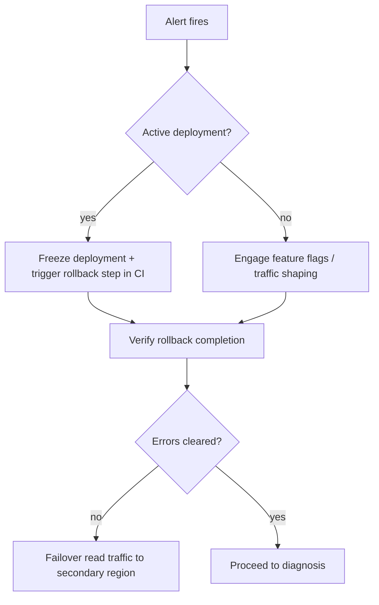

# API 5xx Burst Triage

**Primary Pager:** Platform SRE (L1)
**Escalation:** Backend on-call (L2) → Infrastructure (L3)

## 1. Detect & Confirm
- Check Alertmanager page: `APIAvailabilityFastBurn` or `APIHighLatencyP99`.
- Open Grafana dashboard → "Summit Platform Operations" panels for API latency & error ratio.
- Validate synthetic probes in Statuspage (if down, escalate to Infra immediately).

## 2. Stabilize Traffic

## 3. Diagnose Root Cause
1. **Release diff**: Review latest tag in GitHub; use `npx lerna changed` for impacted packages.
2. **Backend services**: Check `kubectl logs deployment/api-gateway -c app --since=10m` for exception bursts.
3. **Dependencies**:
   - DB saturation? See "Database Filesystem Headroom" & CPU panels.
   - Downstream provider failures? Inspect `llm-adapter` panel if GraphQL uses LLM flows.
4. **Error budget impact**: Compare `slo:api:error_ratio:5m` vs SLO target (0.1% monthly budget).

## 4. Mitigation Options
- Roll back to previous image (`kubectl rollout undo deployment/api-gateway`).
- Toggle feature flags via LaunchDarkly: `ld toggle summit.api.experimental false`.
- Increase API pods: `kubectl scale deployment/api-gateway --replicas=<current+2>` while monitoring saturation.

## 5. Communications
- Post status in `#summit-incident` with timeline + hypothesis.
- If error budget burn persists >30m, start customer comms via Statuspage template "API Partial Outage".

## 6. Post-Incident
- Capture Grafana snapshot.
- File incident report in Linear (`ops-incident` template) within 24h.
- Schedule action item review in weekly SRE sync.
