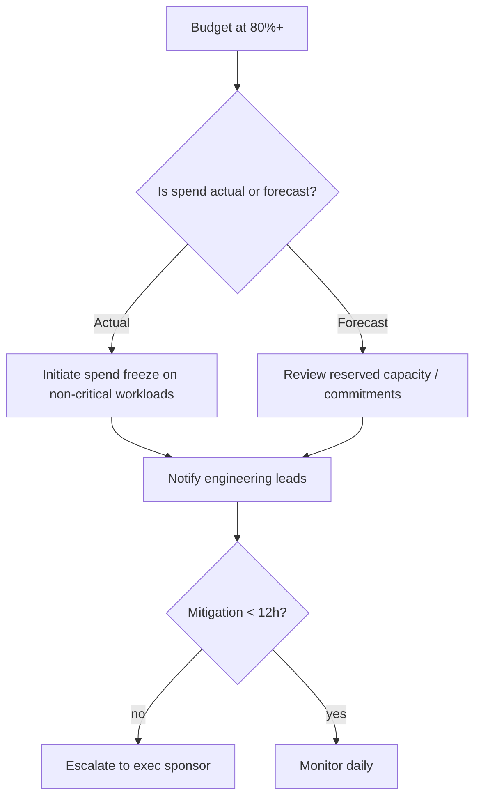

# Cost Guardrail Response Guide

**Primary Pager:** FinOps On-Call (L1)
**Escalation:** Platform Finance (L2) → Executive Sponsor (L3)

## Trigger
- GitHub issue created by `Cost Guardrails` workflow.
- Prometheus alert `CostBudgetAtRisk` fired for >=30m.

## Checklist
1. Review issue body for impacted budget key and owner.
2. Open Grafana panel "Platform Spend vs Budget" for trend confirmation.
3. Validate vendor invoices or forecast anomalies.

## Decision Flow

## Mitigation Options
- Reduce autoscaling max on lower tiers: `kubectl patch hpa tenant-app --type merge -p '{"spec":{"maxReplicas":5}}'`.
- Pause discretionary batch jobs via Airflow: toggle DAGs `cost_savings_*` to `paused`.
- Switch LLM traffic to cheaper provider if latency SLO allows (coordinate with ML team).

## Exit Criteria
- Budget consumption ratio <80% for 48h.
- Forecast trajectory below 95% for remainder of month.
- Issue updated with mitigation summary and closed by owner.

## Post-Action
- Update FinOps tracker with savings realized.
- Schedule review in next Cost Council meeting.
