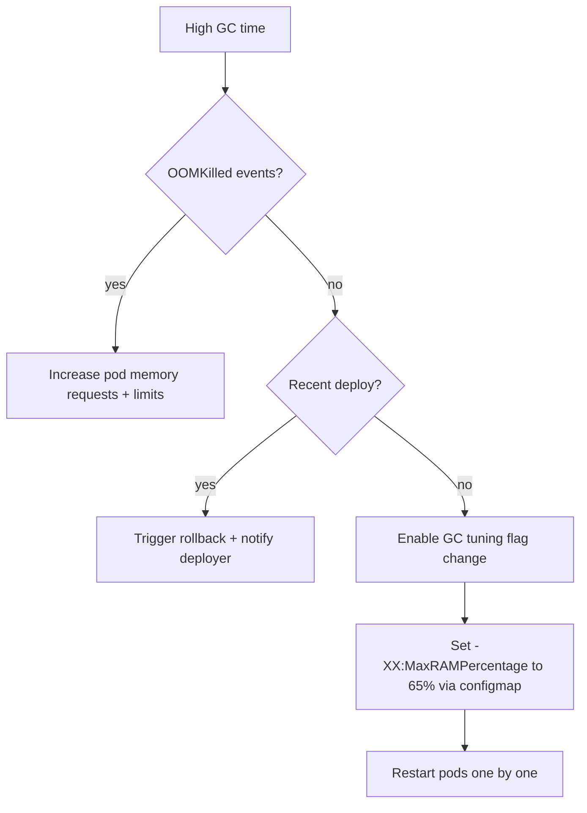

# GC & Memory Pressure Runbook

**Primary Pager:** Runtime SRE (L1)
**Escalation:** JVM Services (L2) → Platform Infrastructure (L3)

## Detection
- Alerts: `GC Collection Rate` (Grafana stat) trending upward, node memory saturation >85%.
- Logs: OTel collector exports `jvm_gc_collection_seconds_sum` and `container_memory_working_set_bytes`.

## Immediate Actions
1. **Check pods**: `kubectl top pods -l app=summit-api --sort-by=memory`.
2. **Dump heap metrics** via `/debug/heap` if available.
3. **Evaluate auto-scaler**: `kubectl describe hpa summit-api` for recent events.

## Decision Tree

## Detailed Steps
- Increase requests: `kubectl patch deployment summit-api -p '{"spec":{"template":{"spec":{"containers":[{"name":"app","resources":{"limits":{"memory":"2Gi"},"requests":{"memory":"1.5Gi"}}}]}}}}'`
- Apply GC flag change: update Helm values `server.jvmExtraArgs` to include `-XX:MaxRAMPercentage=65` and redeploy.
- If memory leak suspected, capture heap dump: `kubectl exec <pod> -- jcmd 1 GC.heap_dump /tmp/leak.hprof` and upload to S3.

## Exit Criteria
- GC collection rate returns to baseline (<0.05 collections/sec).
- `container_memory_working_set_bytes` < 75% of limit for 2 consecutive sampling periods.
- No new OOM events in last hour.

## Post Incident
- File RCA in Notion "Runtime Reliability".
- Coordinate with JVM team for code-level fix if root cause is leak or heavy allocations.
