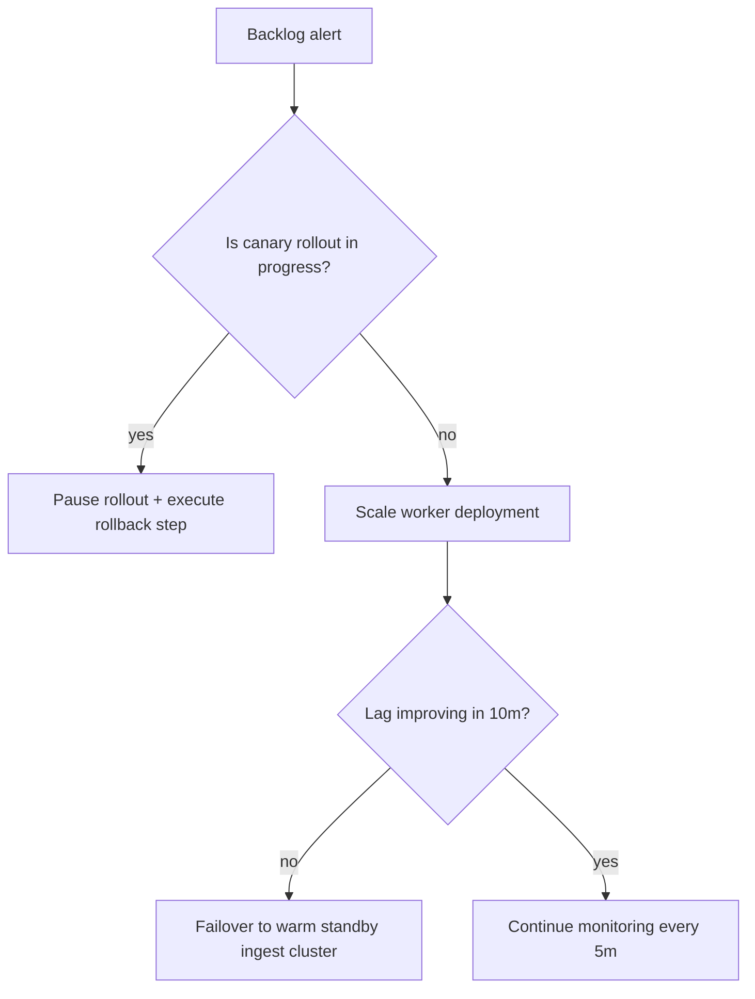

# Ingest Backlog & Throughput Runbook

**Primary Pager:** Data Platform SRE (L1)
**Escalation:** Streaming team (L2) → Data Infrastructure (L3)

## 1. Confirm the Alert
- Triggered alerts: `IngestLagBreaching`, `IngestThroughputDrop`, `IngestAvailabilityFastBurn`.
- Grafana dashboard panels: *Ingest Backlog Lag* and *Ingest Throughput*.
- Check Kafka/Kinesis topic depth dashboards if available (`kafka_consumergroup_lag`).

## 2. Rapid Stabilization

Commands:
- Pause rollout: `argocd app actions run summit-api resume=false`
- Scale workers: `kubectl scale deployment/ingest-workers --replicas=<current*1.5>`
- Warm standby: `terraform apply -target=module.ingest_warm_standby`

## 3. Diagnose
1. **Source availability**: Are upstream connectors healthy? Inspect `http_requests_total{service="connector"}`.
2. **Resource pressure**: Check node CPU/memory; run `kubectl top nodes`.
3. **Dead-letter queue**: Query `ingest_dlq_entries_total` metrics to spot spikes.
4. **Schema mismatch**: Review recent schema registry changes (Confluence audit log).

## 4. Remediation Options
- Reprocess DLQ batches: `scripts/replay-dlq.sh --since 30m`.
- Enable burst mode: `kubectl patch configmap ingest-config -p '{"data":{"BURST_MULTIPLIER":"2"}}'`.
- Request traffic throttling from producers; coordinate via #data-producers.

## 5. Exit Criteria
- `slo:ingest:lag_p95` < 120 for 30 consecutive minutes.
- Error ratio back within 0.5% monthly budget.
- Backlog size trending down across all tenants.

## 6. Post Mortem
- Attach canary-report artifact from CI if rollback occurred.
- Document RCA in Data Platform Confluence (template: `SRE / Ingest Incident`).
- Track follow-up items in Jira project `INGEST`.
