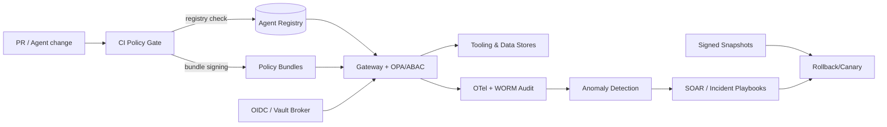

# AI Agent Risk Assessment and Hardening Plan

## Objectives
- Achieve immediate visibility into shadow AI agents across Summit's multi-service IntelGraph platform and monorepo packages.
- Reduce agentic security risks (prompt injection, over-privilege, orphaned identities) through least-privilege controls and runtime guards.
- Align controls with NIST AI RMF Govern→Map→Measure→Manage, EU AI Act high-risk duties, SOC 2 (security, availability, privacy), and GDPR/HIPAA triggers.

## System Architecture (target state)
- **Registry-first topology:** All agents (pipelines, PR bots, copilots, schedulers) must register in an in-repo registry with ownership, allowed tools, data classes, tenants, and expiry. CI blocks deltas that lack registry entries.
- **Policy gateways:** Tool calls, data access, and network egress flow through a gateway that enforces OPA/ABAC bundles, per-tenant encryption contexts, and rate limits; unknown tool names or unregistered agents are denied.
- **Credential broker:** Short-lived credentials issued via OIDC/workload identity with issuance logs bound to registry IDs; secrets brokered through vault with enforced max TTL.
- **Observability spine:** OpenTelemetry traces + WORM audit logs capture identity, tenant, prompt hash, tool name, data class, decision (allow/deny), and latency; anomaly detectors watch query/tool mix and privilege drift.
- **Recovery lattice:** Versioned prompt/policy/dataset snapshots with dual-approval rollback and canary verification; deny-all egress switch and sandbox lanes for suspected compromise.

## Phase 0: Shadow Agent Audit (highest priority)
- **Discovery sweep (24–48h):**
  - Enumerate automated agents, bots, and pipelines across the monorepo (e.g., `packages/`, `ga-graphai/packages/`, `scripts/`, `services/`).
  - Scan GitHub app/bot integrations and PR automation (CodeRabbit/Codex/Jules) for scopes that allow repo writes, artifact upload, or secret access.
  - Inventory AI-facing endpoints and CLI entrypoints (e.g., maestro/graph orchestrators, SDKs, and workflow CLIs) for unsanctioned tool access.
- **Identity + permissions map:**
  - Correlate each agent with its credentials (PATs, cloud keys, API tokens) and data paths (logs, object storage, graph stores).
  - Flag orphaned identities and stale credentials; revoke or rotate immediately.
- **Governance and approval:**
  - Require AI agent registration with an owner, purpose, data classification, and allowed tools. Block unregistered agents from CI deploys.
  - Route new agent requests through an AI Ethics / Governance triage using NIST Govern controls (document risk, data handling, and monitoring hooks).
- **Evidence capture (SOC 2-ready):**
  - Record discovery outputs, approvals, and revocations as audit artifacts (tickets + repo docs). Link to CI evidence (policy checks, lint logs) per change.
  - Attach rego/OPA bundle digests, hash-locked prompt templates, and signed attestations for every change that alters agent permissions.
  - Maintain an escalation ledger: requestor → reviewer → approver with timestamps and rationale; exportable as CSV for audit sampling.

**Audit-ready registry schema (minimum fields)**
- `id`, `owner`, `service`, `purpose`, `tenants`, `data_classes` (PII/PHI/CUI/etc.), `allowed_tools`, `network_allowlist`, `credential_ttl`, `expires_at`, `observability_tags`, `risk_rating`, `last_reviewed_at`.
- Policy gate must deny if `expires_at` < now, `allowed_tools` missing, or `risk_rating` is unset.

## Phase 1: Agentic Security Hardening
- **Prompt/response guards:**
  - Add prompt-injection filters and output validators for copilot-style features and workflow agents; enforce content safety and tool-calling allowlists.
  - Strip secrets and PII from prompts; prefer templated system prompts with explicit tool contracts and guardrails.
- **Prompt integrity controls:**
  - Sign prompt templates (SHA-256 + signer) and store alongside version metadata; deny unsigned or mismatched hashes at runtime.
  - Require citations or data lineage markers for any generated content surfaced to users or merged into PRs.
- **Dynamic credentials + least privilege:**
  - Replace static tokens in CLIs/automation with short-lived credentials (OIDC/JWT, workload identity, GitHub OIDC federation for cloud auth).
  - Enforce per-tenant and per-agent scopes in gateways/authz layers; default-deny outbound tool calls and network egress.
- **Tool and data access controls:**
  - Constrain PR automation to minimal Git/GitHub scopes; require policy checks before auto-merge.
  - Apply row/field-level controls and redaction for graph and document stores; ensure provenance tagging travels with agent outputs.

## Phase 2: Data Poisoning and Supply Chain Defenses
- **YAML + ingestion scanning:**
  - Harden taxonomy/config ingestion (e.g., `docs/_meta/taxonomy.yml` and other YAML feeds) with schema validation, signature checks, and diff-based anomaly detection.
  - Add allowlists for schema fields and reject unexpected keys; block untrusted includes and remote fetches in ingestion pipelines.
- **Supply-chain attestations:**
  - Require provenance metadata on artifacts (source repo, signer, commit, build runner) and verify SLSA-style attestations where available.
- **Model training and datasets:**
  - Require dataset lineage and signed manifests; run statistical and semantic outlier detection before training or RAG indexing.
  - Enforce quarantines for unverified samples; gate promotions with human-in-the-loop approvals and reproducible data snapshots.
- **Confidential computing path:**
  - Evaluate enclave-backed execution (e.g., Nitro, SEV, or Phala-style confidential computing) for model fine-tuning and sensitive inference workloads.

## Phase 3: Identity Hygiene and Privilege Creep Prevention
- **Continuous access review:**
  - Schedule monthly reviews of agent accounts, service principals, and GitHub app permissions; auto-expire unused tokens.
  - Map agents to tenants/workspaces; enforce compartment isolation for graph queries and workflow runs.
- **Runtime controls:**
  - Require just-in-time elevation for high-risk operations (data export, bulk deletes, model updates) with mTLS and signed requests.
  - Terminate or sandbox agents that exceed behavioral baselines (query volume, tool mix, or data classification access).

## Phase 4: Observability and MTTR < 5 Minutes
- **Tracing and auditability:**
  - Instrument agents with OpenTelemetry traces that include tenant, capability, tool call, and data-classification labels.
  - Centralize immutable audit trails for prompts, tool invocations, and data writes; protect with WORM retention and least-privilege readers.
- **Live policy enforcement:**
  - Deploy runtime policy checks (OPA/ABAC) on agent actions; deny on missing provenance, unknown identity, or unapproved tool use.
  - Add rate limits and backpressure per tenant and per agent to prevent cascading failures.
- **Quality + reputation safeguards:**
  - Track hallucination/error rates for copilot outputs and surfaced PRs; require citations and confidence signals before user delivery.
  - Emit SEC-ready incident summaries for material AI failures (service interruption, data leak, or misleading outputs).

**Observability specification**
- **Traces:** service, agent ID, tenant, prompt hash, tool name, decision (allow/deny), latency, error class, `data_class` attribute.
- **Metrics:** deny/permit counts by reason, credential age histogram, prompt hash drift rate, hallucination QA pass rate, OPA decision latency p95, ingestion rejection rate, MTTR/MTTI.
- **Logs:** immutable WORM storage with signer identity, registry snapshot hash, and policy bundle digest per deploy. Redact PII/PHI before export.
- **Alerts:**
  - High: unknown agent/tool invocation, unsigned prompt detected, credential older than TTL, data export without provenance tag.
  - Medium: hallucination QA failure rate > threshold, anomaly z-score > tuned bound, OPA latency > SLO.
  - Low: registry nearing expiry coverage, policy bundle approaching rotation deadline.

## Control Implementation Blueprint (23-line checklist)
1) Registry gate in CI: fail PRs when agents/tools lack registry entries or assigned owners.
2) Mandatory data classification on agent registration; auto-propagate labels into traces and storage ACLs.
3) Prompt template signing: store SHA-256 + signer identity; block unsigned prompts from production use.
4) Tool allowlists enforced via OPA bundles; deny unknown tool names or unscoped network egress.
5) Per-tenant encryption contexts (KMS keys) for secrets, embeddings, and graph exports.
6) Short-lived credentials via OIDC/GitHub Actions + cloud workload identity; forbid PATs older than 24h.
7) Credential broker (vault) issues ephemeral tokens; logs issuance mapped to agent registry IDs.
8) Static secret scanner in CI with auto-remediation PR comments and ticket creation.
9) GitHub app scope drift detection with automated diffs and forced re-authorization on expansion.
10) Signed YAML/JSON ingestion manifests; reject unsigned or mismatched digests.
11) Schema evolution contracts with breaking-change detection and staged rollout (shadow + canary).
12) Data poisoning guardrails: outlier detection + semantic similarity checks; quarantine queue with manual review.
13) RAG/LLM guard filters: jailbreak/prompt-injection detectors + output content policy checks.
14) Least-privilege runtime profiles per agent (CPU/mem/network/tool scopes) enforced by orchestrator/gateway.
15) Behavioral anomaly alerts on query volume, tenant mix, and tool usage spikiness (z-score thresholds tuned weekly).
16) Backpressure and circuit-breakers around downstream dependencies (graph DB, vector store, S3, GitHub APIs).
17) Disaster rollback kits: pre-baked restore points for prompts, datasets, and access policies with validation scripts.
18) Orphaned identity sweeps weekly; disable + delete keys after 72h if unused and unassigned.
19) Evidence locker: append-only store of approvals, attestation hashes, CI logs, and alert resolutions with retention per SOC 2.
20) Red-team playbooks for prompt injection, tool abuse, data exfiltration, and poisoning replayed quarterly.
21) Hallucination QA harness with golden answers + citation validation; enforce quality budget per release.
22) SEC/GDPR incident playbooks with RACI, timelines, and pre-approved notification templates.
23) Executive dashboard: coverage, MTTR, deny/permit ratios, credential age distribution, and registry completeness, refreshed daily.

**24–30: enforcement extensions**
24) AI Ethics Board sign-off recorded for any agent with high-risk data classes or customer-facing autonomy; denial must block deployment.
25) Canary lanes for new prompts/policies with automatic rollback on elevated deny or error rates; guardrails monitored in real time.
26) Synthetic canary prompts for jailbreak detection shipped with every release; failures block promotion.
27) Warrant canary + transparency notice pipeline for user-facing AI interactions (per state chatbot laws); logged and exportable.
28) Agent cost guardrails: enforce budget per tenant/agent and throttle on runaway cost curves; alerts tied to finance approvals.
29) Privacy-preserving logging: structured fields only, zero raw prompt dumps; tokenized identifiers with deterministic salts for joinability.
30) Multi-tenant isolation tests executed in CI to validate namespace separation and prevent cross-tenant graph queries.

## Framework Alignment (how controls map)
- **NIST AI RMF:**
  - *Govern:* Agent registry, approvals, and audit artifacts; policy-as-code for tool access.
  - *Map:* Threat models for prompt injection, data poisoning, and identity abuse; classify agent use cases by data sensitivity and tenant impact.
  - *Measure:* Metrics for exploit attempts, policy denials, hallucination rates, MTTR, and credential age.
  - *Manage:* Playbooks for credential rotation, incident response, and rollback of poisoned datasets or prompts.
- **EU AI Act (high-risk):**
  - Maintain risk assessments, data/label provenance, human oversight steps, and transparency notices for user-facing AI features.
- **SOC 2 / GDPR / HIPAA:**
  - Log access to personal or health data with retention controls; prove encryption in transit/at rest; document data minimization and breach notification paths.

**US chatbot/state-law alignment**
- Label automated interactions and store consent + disclosure logs.
- Retain opt-out preferences; block model tool calls that would override user opt-out intent.
- Provide exportable interaction history for subject access requests with masking of third-party data.

## Next Steps (execution order)
1. Run the shadow agent discovery and credential revocation sweep; block unregistered agents in CI/CD.
2. Ship prompt guards + dynamic credential path for CLI/PR automation; add allowlists for tool calls and outbound network access.
3. Enforce schema-validated YAML ingestion and dataset signing; quarantine suspect inputs before training or indexing.
4. Roll out tracing + audit trails with automated alerts on policy violations; target <5 minute detection-to-mitigation.
5. Backfill NIST AI RMF evidence and SOC 2 control mappings; publish quarterly assurance updates.

**Deliverable definitions**
- Discovery sweep: list of agents + registry diff + revoked credentials log + ticket IDs.
- Guardrails: prompt filter configuration, signed template hashes, and passing synthetic jailbreak tests.
- Supply chain: signed manifests, validation logs, and quarantine metrics with reviewer IDs.
- Observability: OTel pipeline config, alert rules, dashboards (coverage, deny/permit ratio, MTTR), and evidence of drill execution.
- Evidence pack: consolidated ledger of approvals, bundle digests, CI logs, and quarterly assurance report.

## Execution Artifacts and Control Owners
- **Shadow agent registry:** Security (owner) + Platform (support) maintain a living registry in-repo; entries auto-created from discovery scans.
- **Credential lifecycle:** DevSecOps (owner) enforces rotation via CI policy checks; secrets scanner blocks PATs/long-lived keys in PRs.
- **Prompt guardrails:** AI Platform (owner) publishes reviewed prompt templates and tool allowlists; Product signs off for UX impacts.
- **Supply chain controls:** Data Engineering (owner) manages schema allowlists and dataset signing keys; MLOps enforces quarantine gates.
- **Observability stack:** SRE (owner) maintains OTel pipelines, WORM audit storage, and alert policies with <5 minute MTTR targets.

## Validation and Testing (what “done” means)
- **Unit/automation:**
  - CI policy checks reject: missing registry entry, missing owner, missing data class, credential age > TTL, unsigned prompt template, unknown tool.
  - Schema validation for ingestion YAML/JSON with signature verification and unexpected-key rejection.
- **Integration drills:**
  - Simulate prompt injection, rogue tool call, credential theft, and poisoning; verify deny + alert + ticket auto-creation.
  - Cross-tenant access attempts must be blocked with audit log evidence and trace IDs.
- **Performance/SLOs:**
  - OPA decision p95 < 50ms; registry lookup p95 < 25ms; audit log write success > 99.9%.
  - MTTR < 5 minutes measured from alert to containment toggle.
- **Compliance sampling:**
  - Quarterly: sample 10% of agent changes; re-run CI checks; verify artifacts are signed and immutable.
  - Privacy: verify consent and disclosure logs for user-facing chat flows with export samples.

## Automation Backlog (ready-to-build)
- Add CI job to fail builds when agents lack registry entries or when credentials exceed age thresholds.
- Introduce policy-as-code (OPA/ABAC) bundles that gate tool calls by tenant, data class, and agent role.
- Implement signed manifest checks for YAML ingestion paths and block unsigned artifacts by default.
- Deploy drift detection for GitHub app scopes and cloud roles; auto-open tickets for privilege creep.
- Ship an incident playbook that bundles rollback steps for poisoned datasets, prompt sets, or compromised identities.
- Add synthetic jailbreak canaries to CI with curated prompt sets; failure blocks release and opens a P0 ticket.
- Create Grafana/Looker dashboards for registry completeness, deny/permit ratios, credential age, hallucination QA pass rate, and ingestion rejection rate.
- Implement budget and cost anomaly alerts per tenant/agent for cloud spend and model usage.

## Assurance, Evidence, and Proving Readiness
- **Attestation chain:** All policy bundles, prompt templates, and ingestion manifests must carry signatures and SHA digests; store verification logs with actor identity, timestamp, and verifier hash.
- **Control sampling:** Quarterly sampling of 10% of agent changes for SOC 2 evidence; re-run CI checks and verify audit artifacts are immutable and complete.
- **Resilience drills:** Run tabletop and live-fire exercises for prompt injection, rogue tool use, credential theft, and poisoning; record MTTR/MTTI and patch gaps within 7 days.
- **Third-party validation:** Use independent lint/scan runners (separate tenants) to cross-check results and detect tampering or blind spots in first-party pipelines.

**Evidence locker (operational runbook)**
- Store under append-only bucket with bucket policy denying overwrite/delete; enable object locking with legal hold for audit windows.
- Index artifacts by `agent_id`, `bundle_hash`, `prompt_hash`, and `ticket_id` for quick sampling.
- Include reproducibility metadata: tool versions, CI runner image digest, and registry snapshot hash at decision time.

## Runbooks and Recovery Paths
- **Prompt/guardrail rollback:** Keep last-known-good prompt set and guardrail policies versioned; rollback requires dual approval and automated canary verification.
- **Dataset quarantine + cleanse:** Quarantine suspect batches; run checksum comparison, semantic diffing, and reproduction of model outputs before re-admission.
- **Identity compromise:** Immediate token revocation, forced re-auth with OIDC, and log review across graph/vector/storage; rotate keys and regenerate attestations after cleanup.
- **Outbound leak containment:** Toggle deny-all egress for affected agents, validate data exfil paths, and require red-team confirmation before re-enabling tool calls.

**Additional recovery controls**
- **Config freeze:** On incident, freeze registry + policy updates except for emergency patches; require dual approval to unfreeze.
- **Forensic capture:** Snapshot logs, traces, registry state, and bundle hashes at incident start; preserve in evidence locker with chain-of-custody notes.
- **Regression gates:** After recovery, run synthetic prompts, cross-tenant probes, and ingestion validation before resuming normal operations.
