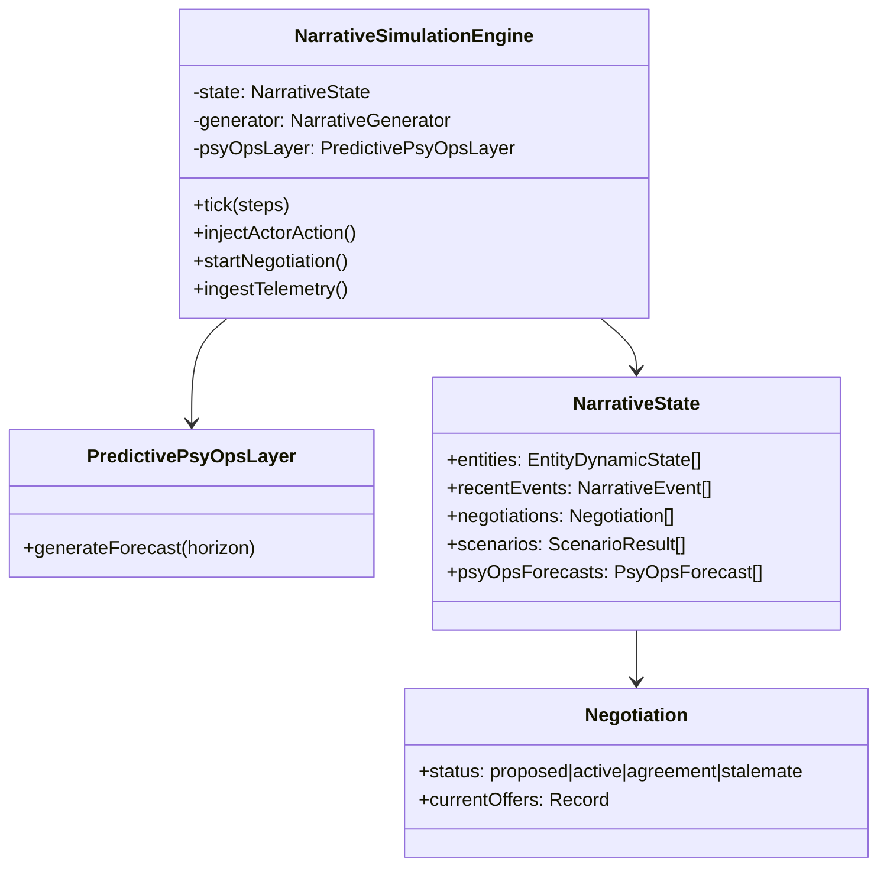

# Real-Time Narrative Simulation Engine (MRSE/MIFE)

## Overview
The Narrative Simulation Engine handles the dynamic evolution of narrative states, tracking entities, events, and story arcs. It integrates MRSE (Multi-Resolution Simulation Engine) and MIFE (Multi-channel Influence Field Estimator) concepts.

## Core Components

### Entities
Simulated actors or groups with attributes like `influence`, `sentiment`, `volatility`, and `negotiationStance`.

### Negotiation Nodes
A dedicated structure for managing agent-to-agent negotiations. Negotiations have a lifecycle:
`proposed` -> `active` -> `agreement` | `stalemate` | `failed`.

### Multi-Agent Influence Propagation
Events propagate through the relationship graph. If Entity A is affected by an event, and has a strong relationship with Entity B, the event "ripples" to Entity B with decayed intensity.

### Scenario Evaluator Hooks
Custom logic can be registered to monitor the state for specific conditions (e.g., "Crisis Threshold Reached"). These hooks trigger system events when conditions are met.

### Predictive PsyOps Layer
A forecasting layer that analyzes the current state to predict future risks, such as entity radicalization or narrative dominance. It runs periodically during the simulation tick loop.

### Telemetry Integration
Real-time telemetry can be ingested into the simulation, converting external metrics into narrative events that impact the simulation state.

## Architecture



## Usage

```typescript
import { NarrativeSimulationManager } from './manager';

const manager = NarrativeSimulationManager.getInstance();
const state = manager.createSimulation({
  name: "Operation Fallback",
  themes: ["Stability", "Unrest"],
  initialEntities: [...]
});

// Run simulation
manager.tick(state.id, 5);
```
