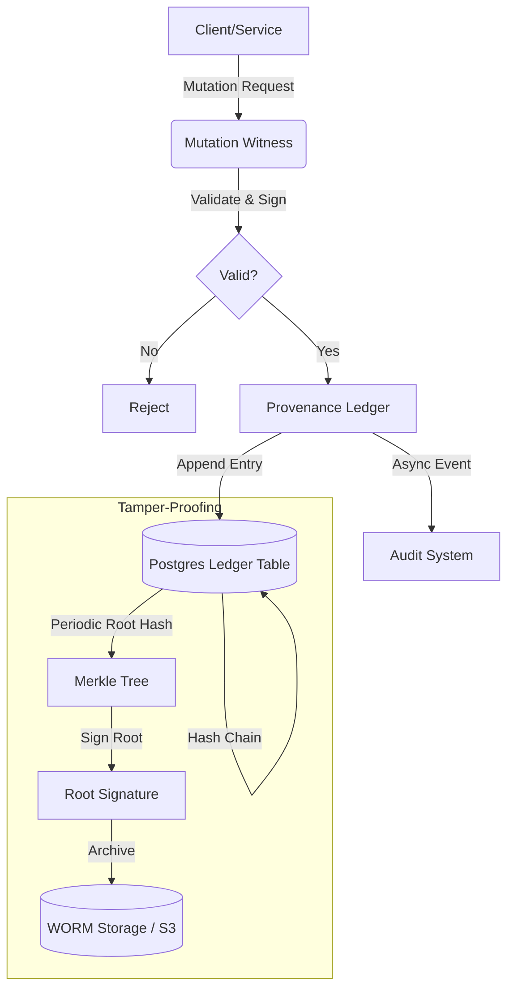

# Provenance Engine V2

The Provenance Engine V2 provides a tamper-evident, cryptographically verifiable ledger for tracking entity mutations across the platform.

## Features

1.  **Full Mutation Lineage**: Tracks discrete `CREATE`, `UPDATE`, `DELETE` operations with JSON Patch diffs.
2.  **Mutation Witnessing**: A "Witness" subsystem validates and signs every mutation before it is committed to the ledger, providing Proof of Correctness.
3.  **Tamper-Proof Log**: Uses a hash-chain (blockchain-like) structure. Roots are periodically anchored to WORM storage (S3 Object Lock).
4.  **Cross-Service Attribution**: Tracks the origin service, trace IDs, and upstream events for every change.
5.  **Audit Integration**: Automatically streams events to the Advanced Audit System.
6.  **Operational Receipts & Recovery Evidence**: Captures signed receipts and chaos/DR recovery evidence as ledger entries.

## Architecture



## Usage

### 1. Recording a Mutation

The `ProvenanceLedgerV2` automatically handles witnessing if you provide a `MutationPayload`.

```typescript
import { provenanceLedger } from './provenance/ledger';

await provenanceLedger.appendEntry({
  tenantId: 'tenant-1',
  actionType: 'UPDATE',
  resourceType: 'Case',
  resourceId: 'case-123',
  actorId: 'user-1',
  actorType: 'user',
  payload: {
    mutationType: 'UPDATE',
    entityId: 'case-123',
    entityType: 'Case',
    previousState: { ... },
    newState: { ... },
    diff: [
      { op: 'replace', path: '/status', value: 'CLOSED', from: 'OPEN' }
    ]
  }
});
```

### 2. Querying Lineage (GraphQL)

```graphql
query {
  entityLineage(id: "case-123") {
    id
    timestamp
    actionType
    actorId
    witness {
      witnessId
      signature
    }
    payload {
      diff {
        op
        path
        value
      }
    }
  }
}
```

### 3. Recording Receipts and Recovery Evidence

```typescript
import { ProvenanceLedgerV2 } from "./provenance/ledger";

const ledger = ProvenanceLedgerV2.getInstance();

await ledger.recordReceiptEvidence({
  receiptId: "prov_123",
  entryId: "prov_123",
  action: "policy:update",
  actorId: "user-1",
  tenantId: "tenant-1",
  resourceId: "policy-42",
  inputHash: "sha256:...",
  signature: "base64-signature",
  signerKeyId: "key-fingerprint",
  issuedAt: new Date().toISOString(),
});

await ledger.recordRecoveryEvidence({
  tenantId: "tenant-1",
  actorId: "sre-1",
  evidence: {
    drillId: "drill-opa-outage-2025-12-31",
    scenario: "OPA outage",
    status: "successful",
    startedAt: new Date().toISOString(),
    rtoTarget: "15m",
    rpoTarget: "5m",
    evidenceArtifacts: ["artifacts/drills/2025-12-31/opa-outage.log"],
  },
});
```

## Data Model

### ProvenanceEntry

- `currentHash`: SHA256(prevHash + payload + signature)
- `witness`: Cryptographic proof that the mutation was valid at time of execution.
- `payload`: Contains the `JsonPatch` diff.

## Configuration

- `WITNESS_PRIVATE_KEY`: Private key for the Mutation Witness service.
- `AUDIT_BUCKET`: S3 bucket for WORM storage.
- `AUDIT_RETENTION_DAYS`: Days to retain WORM logs (default 365).
