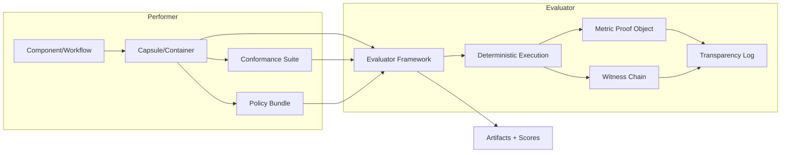

# Evaluator-First Architecture Overview

This overview captures the evaluator-first execution model across all five wedges and
summarizes how artifacts flow from performer to evaluator without manual intervention.
The goal is to make every run reproducible, verifiable, and policy-constrained.

## Core Principles

- **Evaluator-operated execution**: Evaluators can run components independently using
  deterministic tokens and conformance suites.
- **Policy-as-code enforcement**: Rights, scope, and disclosure rules are expressed as
  policy-as-code and evaluated at runtime.
- **Evidence preservation**: Every execution emits proof objects and witness chains
  suitable for third-party verification and audits.

## Architecture Flow

## Artifact Contract

- **Determinism Token**: Seed, dataset snapshot ID, module version set.
- **Metric Proof Object**: Outputs + Merkle commitments + execution metadata.
- **Witness Chain**: Hash-linked inputs, intermediates, outputs.
- **Transparency Log**: Append-only log of digests and run identifiers.

## Governance Hooks

- Policy checks are executed via OPA policies bound to scope tokens and rights tables.
- Decisions requiring compliance review are logged alongside transparency log entries.
