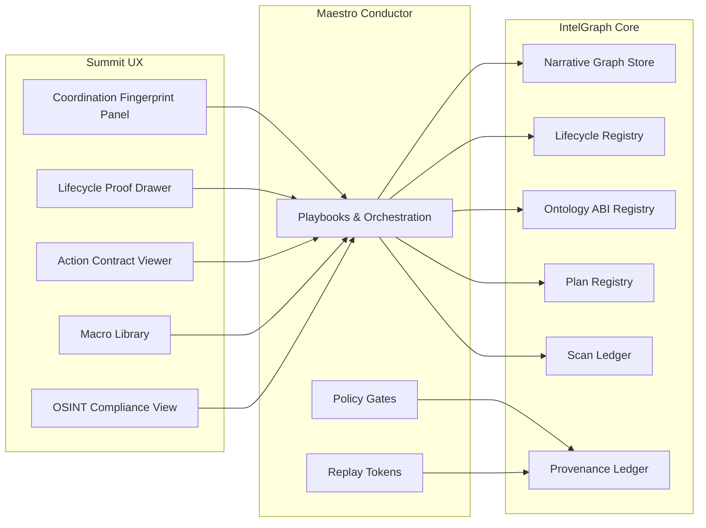

# IP-First Competitive Set (Graphika, Recorded Future, Palantir, Maltego, SpiderFoot)

This spec packages the five "sidestep-to-surpass" methods into patent-ready method/system claim skeletons, engineering-ready flows, and integration hooks for IntelGraph, MC, and Summit. Each section is organized for direct drafting into claims while remaining grounded in implementable architecture.

## Conventions

- **Method claim skeleton:** numbered, abstractable steps with optional sub-steps ready for claim drafting.
- **System claim skeleton:** componentized apparatus mirroring the method steps with interface bindings.
- **Dependent claim levers:** levers for specificity (budgeting, attestation, counterfactuals, caching, proofs, tokenization, privacy).
- **Auditability:** every method includes provenance anchors and replay tokens consistent with IntelGraph provenance.

## 1. Graphika — Adversarial Narrative Fingerprinting + Intervention Simulator (ANFIS)

### Method claim skeleton

1. Build a **NarrativeGraph** with typed nodes (post, account, URL, media hash, topic cluster) and time-stamped edges (authored, reshared, linked, co-posted-near).
2. Derive **coordination fingerprints** per cluster across a window using burstiness, near-duplicate rate, hub concentration, cross-platform reuse, and link-laundering score.
3. Generate an **intervention set** describing removals or dampening (hubs, URLs, edges) subject to budget and policy constraints.
4. **Simulate counterfactual spread** by applying the intervention set, recomputing reach/spread metrics, and contrasting against the baseline.
5. Emit **provenance and replay tokens** that bind fingerprints, interventions, and simulation outputs for audit and re-run.

### System claim skeleton

- **Temporal graph constructor** that materializes the NarrativeGraph window.
- **Fingerprint engine** implementing burstiness, LSH-based near-duplicate detection, hub concentration, cross-platform/media reuse, and URL laundering scores.
- **Intervention planner** enforcing budgets/policies and producing node/edge deltas.
- **Simulation kernel** that applies deltas, recomputes influence/reach, and emits delta metrics.
- **Provenance ledger interface** that stores fingerprints, interventions, and replay tokens.

### Dependent claim levers (examples)

- Budgeted hub removals by percentile; probabilistic edge dampening; cross-platform reuse thresholding; replay tokenization tied to window hash; LSH banding parameters; laundering score weightings; audit trails with immutable commit IDs; capped simulation horizons; red-teaming interventions generated via beam search.

### Interfaces

- `POST /v1/narrative/fingerprint` → `{cluster_id, fingerprint, evidence_refs}`
- `POST /v1/narrative/simulate` → `{interventions[], delta_metrics, audit}`

## 2. Recorded Future — IOC Lifecycle Compiler with Provenance-Weighted Decay (ILC-PWD)

### Method claim skeleton

1. Retrieve evidence for an entity including sightings, sources, conflicts, and links.
2. Aggregate trust, diversity, and freshness into a **provenance-weighted score** with decay and conflict penalties.
3. Transition the entity through lifecycle states (NEW → CORROBORATING → ACTIVE → DEPRIORITIZED → RETIRED) using deterministic policies.
4. Compute a **minimal supporting proof bundle** for the transition with capped cardinality.
5. Persist state, proof hash, and a time-decayed readiness hint for downstream automation.

### System claim skeleton

- **Evidence retriever** with source typing and freshness metadata.
- **Trust-freshness aggregator** with conflict detection and decay curves.
- **Lifecycle state machine** with deterministic transitions and policy hooks.
- **Proof miner** that extracts minimal supporting evidence sets (bounded search).
- **State registry** with proof hashing and provenance commitments.

### Dependent claim levers (examples)

- Adjustable decay half-lives; conflict quorum thresholds; telemetry sightings as accelerants; policy-based minimum evidence diversity; bounded proof search (`k≤12`); attestable proof bundles; state transition cool-down timers; deterministic rollback on conflicting evidence spikes; exportable state timelines with replay tokens.

### Interfaces

- `POST /v1/intel/lifecycle/update` → `{entity_id, state, proof_bundle, audit}`
- `GET /v1/intel/lifecycle/{entity_id}` → `{timeline, transition_proofs}`

## 3. Palantir — Ontology ABI + Enforced Action Contracts (OAEAC)

### Method claim skeleton

1. Compile ontology types and actions into an **ABI** with typed reads/writes and action contracts.
2. For each action, encode **requires** predicates, **ensures** predicates, declared **effects**, and witness emission rules.
3. On execution, validate requires predicates, perform policy checks on effects, apply patches, validate ensures predicates, and emit a **witness** referencing the ABI and decision IDs.
4. Persist witnesses into an **immutable ledger** and return results with verification handles.

### System claim skeleton

- **ABI compiler** producing typed interfaces and contract metadata.
- **Contract executor** that enforces requires/ensures and effect typing.
- **Policy checker** that authorizes effects per governance rules.
- **Witness emitter** that hashes action, delta, decision ID, and ABI ID into a ledger.
- **Verification service** exposing witness validation and replay.

### Dependent claim levers (examples)

- Effect typing enums (READ/WRITE/EXPORT); requires predicate templates; ensures invariants on field-level constraints; policy decider plug-ins; multisig witness endorsement; deterministic hash commitments; parallel contract execution guards; rollback-on-ensure-failure semantics; cross-tenant scoping for ABI IDs; attested build fingerprints.

### Interfaces

- `POST /v1/ontology/abi/compile` → `{abi_id, stubs}`
- `POST /v1/ontology/action/exec` → `{result, witness, audit}`

## 4. Maltego — Interactive Trace Distillation into Optimized Investigation Plans (ITD-OIP)

### Method claim skeleton

1. Capture an analyst **trace** with operations, inputs/outputs, latency, and decisions.
2. Lower the trace into an **IR**, deduplicating equivalent steps and normalizing transforms.
3. Optimize the IR via batching, cache recognition, filter pushdown, and join reordering while validating policies/effects.
4. Persist the optimized **plan** with a hash-derived ID, expected savings, and witness chain.
5. Execute plans deterministically with **witnessed outputs**, rate limiting, and caching.

### System claim skeleton

- **Trace capture** instrumentation.
- **IR normalizer** with dedupe and canonicalization.
- **Optimizer** performing batching, caching, filter pushdown, join reordering, and policy validation.
- **Plan registry** storing IR, hashes, and expected savings.
- **Deterministic executor** emitting witnesses and graph updates.

### Dependent claim levers (examples)

- Savings estimation heuristics; cache validity windows; allowed transform allowlists; batch sizing strategies; effect-typed transforms; witness chains per execution segment; replay tokens; early abort on policy violations; offline cost model calibration; adaptive retry with jitter limits.

### Interfaces

- `POST /v1/investigation/distill` → `{plan_id, ir, expected_savings}`
- `POST /v1/investigation/run` → `{graph_updates, evidence, witnesses}`

## 5. SpiderFoot — Federated OSINT with Privacy Budgets + Legal/ToS Gates (FOPB-LG)

### Method claim skeleton

1. Default to **passive** collection; require explicit authorization token, purpose justification, and rate-limit contract for **active** modules.
2. Allocate **privacy budgets** per subject (lookup count, returned bytes, retention TTL) and enforce during execution.
3. Select modules via allowlist and policy gates, then execute under rate limiting with redaction pipelines.
4. Append each module run to a **Scan Ledger** with commitments to inputs, outputs (redacted), purpose, policy ID, and authorization evidence.
5. Persist updated budgets and return a **capsule** referencing the ledger for ingestion.

### System claim skeleton

- **Authorization & policy gate** for active modules.
- **Privacy budget manager** scoped per tenant/subject with cost accounting.
- **Module orchestrator** with allowlist enforcement and rate limiting.
- **Redaction pipeline** that trims outputs before ledger writes.
- **Scan ledger & capsule builder** producing audit-ready artifacts.

### Dependent claim levers (examples)

- Budget dimensions (lookups, bytes, retention); module class allowlists; purpose-bound authorization tokens; rate-limit contracts; redaction schemas; ledger hashing; capsule encryption; TTL-based purge; tamper-evident append logs; multi-tenant isolation scopes.

### Interfaces

- `POST /v1/osint/federated_scan` → `{capsule_id, capsule, audit}`
- `POST /v1/osint/budget/status` → `{remaining, reset_time}`

## Forward-leaning enhancements

- **Counterfactual attestation**: shareable replay tokens that include Merkle roots of fingerprints/simulations, enabling external auditors to reproduce results across tenants without raw data exposure.
- **Policy-defined budgets**: unify intervention, lifecycle, plan execution, and OSINT privacy budgets into a common policy schema for MC to optimize across services.
- **Effect-typed caching fabric**: cache graph slices, lifecycle aggregates, and plan segments with effect typing to avoid stale reuse when policies change.

## System architecture (cross-cutting)



## Data model sketch (canonical registries)

| Registry              | Primary key                | Core fields                                                       | Provenance anchors                         |
| --------------------- | -------------------------- | ----------------------------------------------------------------- | ------------------------------------------ |
| Narrative fingerprint | `cluster_id + window_hash` | `fingerprint`, `window_bounds`, `feature_vector`, `evidence_refs` | `replay_token`, `commit_hash`              |
| Lifecycle             | `entity_id`                | `state`, `score`, `proof_hash`, `decay_meta`                      | `transition_witness`, `policy_decision_id` |
| Ontology ABI          | `abi_id`                   | `types`, `actions`, `contracts`, `version`                        | `abi_hash`, `attested_build`               |
| Investigation plan    | `plan_id`                  | `ir`, `savings`, `policy_version`                                 | `plan_hash`, `witness_chain`               |
| Scan ledger           | `ledger_id`                | `module`, `target_commit`, `redacted_output_commit`               | `policy_id`, `auth_token_hash`             |

## Policy-as-code (illustrative)

> Canonical rule: regulatory requirements must be expressed as policy-as-code. The snippets below are illustrative and map to the policy engine used by MC.

```rego
package summit.policy.anfis

default allow_intervention = false

allow_intervention {
  input.mode == "simulation"
  input.budget.remaining_hubs >= input.request.hubs_to_remove
  input.policy.allow_hub_removal
  input.request.window_hours <= input.policy.max_window_hours
}
```

```rego
package summit.policy.osint

default allow_active = false

allow_active {
  input.active_token.valid
  input.purpose in input.policy.allowed_purposes
  input.rate_limit.per_minute <= input.policy.max_rpm
}
```

```rego
package summit.policy.abi

default allow_effect = false

allow_effect {
  input.action.effect in {"READ", "WRITE", "EXPORT"}
  input.action.effect in input.policy.allowed_effects
  input.actor.role in input.policy.allowed_roles
}
```

## Algorithmic details (engineering-ready)

- **Burstiness**: use Kleinberg burst model or rolling z-score (mean/variance of interarrival times) with a windowed baseline.
- **Near-duplicate rate**: LSH on normalized text hashes, report ratio of near-duplicate clusters to unique posts.
- **Hub concentration**: compute Gini coefficient or top-k share of degree distribution.
- **Link laundering**: compute ratio of redirect chains crossing domains and abnormal referrer overlap.
- **Lifecycle score**: `score = Σ(w_source * freshness_decay) * diversity_penalty - conflict_rate` with explicit decay half-life per source.

## Test & evidence plan (minimal set)

- **Unit**: fingerprint feature computations; lifecycle transitions; ABI requires/ensures evaluation; IR optimizer transformations; budget accounting.
- **Integration**: MC orchestrations across services; provenance replay; policy gate enforcement.
- **Determinism**: replay tokens reproduce identical outputs; verify witness hashes.
- **Security**: redaction correctness; auth token gating; policy decision logging.
- **Performance**: baseline against window sizes; cache hit ratios; budget enforcement throughput.

## Compliance & safety checklist

1. All regulatory logic expressed as policy-as-code.
2. Decisions requiring compliance review logged with decision IDs.
3. Ambiguity escalated to governance (policy block + audit entry).
4. Default to passive OSINT unless explicit authorization token present.
5. No non-deterministic replay in audited mode (determinism check enforced).

## 23rd-order implication ladder (readiness prompts)

1. Data provenance completeness drives auditability; missing edges reduce legal defensibility.
2. Windowing policy affects both burstiness and intervention stability; align with governance.
3. LSH parameters determine false-positive narrative coordination claims.
4. Hub removal budgets change cross-tenant fairness; enforce budgets per tenant.
5. Lifecycle decay half-life couples to detection latency; calibrate to telemetry.
6. Conflict scoring impacts containment automation; add cool-down to prevent churn.
7. ABI action contracts create ABI versioning pressure; maintain backward-compat stubs.
8. Requires/ensures predicate drift can block execution; add migration tooling.
9. Witness hashes must survive replays; lock hashing algorithm in policy.
10. Trace capture granularity sets optimizer ceiling; instrument at transform-level.
11. IR dedupe can over-collapse semantically distinct transforms; use source IDs.
12. Batch sizing affects rate limits; enforce per-source quotas.
13. Cache validity windows must respect policy updates; tie to policy version.
14. Privacy budgets require subject resolution; resolve identifiers before budgeting.
15. Redaction schema mismatches can leak sensitive data; validate schema strictness.
16. Ledger growth impacts query latency; use rollups with Merkle anchors.
17. Replay tokens must be stable across infra upgrades; version tokens.
18. Deterministic execution requires pinned dependency versions.
19. Multi-tenant isolation relies on scoped policy IDs; avoid shared defaults.
20. Observability span sampling must retain policy decision IDs.
21. Proof bundles need minimality proofs; store proof search metadata.
22. Active OSINT authorization tokens must be revocable; add revocation lists.
23. Counterfactual simulations can be misused; require justification + audit note.
