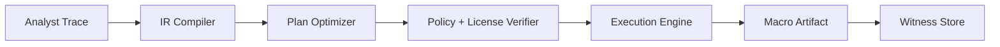

# Interactive Trace Distillation into Optimized Investigation Plans (ITD-OIP)

**Objective:** Convert analyst transform traces into reusable, optimized investigation macros
with batching, caching, policy typing, and witness chains.

## Scope

- Record interactive transform sequences.
- Compile to IR and optimize for cost, latency, and compliance.
- Produce reusable macros with replay tokens and witness chains.

## Architecture (logical)

## Core Flow

1. Record transform trace with inputs/outputs.
2. Lower to execution plan IR.
3. Optimize (deduplicate, batch, reorder, pushdown filters).
4. Verify policy and license constraints.
5. Execute plan and materialize results.
6. Emit macro artifact with replay token and witness chain.

## Inputs

- Transform trace and data source metadata.
- Policy decision tokens and license constraints.
- Budget contracts (rate limits, latency).

## Outputs

- Optimized macro artifact for reuse.
- Execution logs and witness chain.

## Policy & Compliance

- Export effects require explicit authorization.
- License constraints enforced at compile time and runtime.
