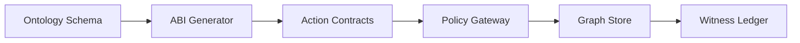

# Ontology ABI + Enforced Action Contracts (OAEAC)

**Objective:** Generate an ABI for ontology objects/actions with enforceable contracts,
policy-checked effects, and witnessed execution.

## Scope

- Provide typed ABI for ontology objects and actions.
- Enforce preconditions/postconditions via contract verifier.
- Produce witness records for each action execution.

## Architecture (logical)

## Core Flow

1. Receive ontology defining object and action types.
2. Generate ABI with typed schemas and client stubs.
3. Bind actions to contracts with pre/post conditions and effect signatures.
4. Authorize effects via policy gateway before execution.
5. Apply state change and verify postconditions.
6. Emit witness record with determinism token and policy decision ID.

## Inputs

- Ontology schema.
- Policy decision tokens.
- Budget contracts (latency, egress, concurrency).

## Outputs

- ABI artifacts (schema + stubs).
- Execution artifacts with witness records and determinism token.

## Policy & Compliance

- All effect signatures (read/write/export) must be authorized.
- Execution artifacts must include policy decision identifiers.
- Changes must be persisted to an append-only delta log.
