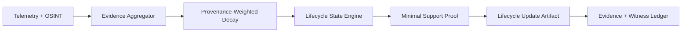

# IOC Lifecycle Compiler with Provenance-Weighted Decay (ILC-PWD)

**Objective:** Replace opaque risk scores with auditable lifecycle transitions grounded in
provenance-weighted evidence decay and minimal support sets.

## Scope

- Ingest evidence for intelligence entities (IOCs, TTPs, infra).
- Compute lifecycle state transitions with explainable proofs.
- Emit replayable artifacts with policy-bound evidence bundles.

## Architecture (logical)

## Core Flow

1. Retrieve evidence from telemetry and OSINT sources.
2. Apply provenance-weighted decay to compute confidence.
3. Determine lifecycle state and detect contradictions.
4. Generate minimal support proof under proof budget constraints.
5. Emit lifecycle update artifact with replay token and evidence bundle.

## Inputs

- Evidence items with source trust scores and timestamps.
- Policy decision tokens and budget contracts.
- Entity identity (indicator or entity key).

## Outputs

- Lifecycle update artifact with state, proof, and determinism token.
- Counterfactual impact analysis for remediation actions.

## Policy & Compliance

- Evidence retrieval requires policy-as-code decision tokens.
- Proofs must reference only verified evidence bundles.
- Contradictions and decays must be logged for auditability.

## Observability

- Metrics: evidence count, decay compute latency, proof size.
- Tracing: per-entity witness chain and decision IDs.
- Logs: contradiction detection and state transition rationale.
